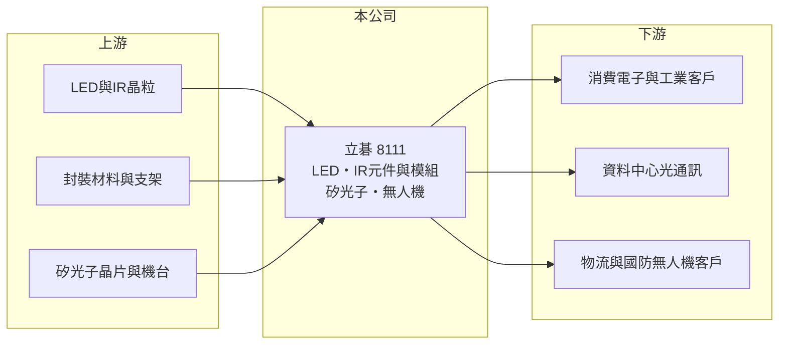

# 8111 立碁

> 上櫃｜[[產業索引-光電業|光電業]]｜上市（櫃）日期 2004/02/09

# 第一章：企業模式與商業藍圖

> [!info] 撰寫說明
> 精簡版，由 Claude 依公開資料整理，架構比照 [[2330台積電]]，資料截至 2026-10-07。來源：工商時報旺得富 2026 年 5 月報導、winvest.tw 營收快訊。公開資料有限，產品別營收比重與營運據點未查到。#待校對

立碁是以 LED 與紅外線元件起家的小型光電公司，正嘗試轉進矽光子與無人機。

- **核心業務：** 立碁本業為光電元件與模組，報導提到紅外線（IR）元件與模組客源持續拓展；產品以[[LED封裝]]類元件為主（推估）。
- **營收結構：** 本次未查到產品別比重；2026 年第一季營收 1.95 億元，月營收約在 7,000 萬元上下。
- **營運據點：** 生產與營運據點本次未查到；無人機業務與捷克、馬來西亞業者合作。
- **長期方向：** 公司已加入由 [[2330台積電]]、[[3711日月光投控]] 主導的[[矽光子]]聯盟，目標 1.6T [[光收發模組]]，規劃 2026 年 9 月推出原型、年底小量量產；另從事[[無人機]]整機組裝，爭取國防商用軍規訂單。

# 第二章：護城河深度與競爭優勢

立碁的本業護城河有限，轉型題材是市場關注焦點。

- **競爭優勢：** 長期經營光電元件，累積光學封裝與 IR 產品經驗，是跨入矽光子的技術基礎（推估）。
- **主要對手：** LED 與 IR 元件有 [[3714富采]]、[[2393億光]] 等國內大廠；矽光子與光收發模組領域則有眾多國內外廠商先行布局。
- **觀察重點：** 矽光子原型與小量量產是否如期、無人機訂單能否轉為穩定營收，以及本業[[毛利率]]能否維持三成。

# 第三章：財務體質與盈利規模

資料日期：2026-10-07，以下數字是撰寫當時的快照；最新月營收、毛利率、累計 EPS 由自動排程寫在本筆記的屬性欄位（月營收、毛利率、累計EPS 等）。#待校對

立碁營收規模小，2026 年第一季毛利率提升但獲利季減。

- **營收規模：** 2026 年第一季營收 1.95 億元，季減 10.19%；6 月營收 7,120 萬元，月增 3.71%、年增 2.34%。
- **獲利：** 2026 年第一季[[毛利率]] 30.78%，稅後淨利 0.19 億元，EPS 0.17 元、季減 47.43%；公司預期全年獲利可望優於去年。
- **財務特色：** 矽光子需要採購新機台（規劃 2026 年下半年），以目前營收規模而言，新事業投入可能壓縮短期獲利（推估）。

# 第四章：總體風險與地緣政治

立碁的風險在於本業成長有限，而新事業仍在起步階段。

- **產業週期：** 報導指出消費電子市況未見改善，LED 與 IR 元件需求仍受終端景氣拖累。
- **營運風險：** 矽光子屬高門檻技術，原型到量產的驗證時程可能延後；無人機業務規模小，訂單不穩定。
- **其他風險：** 無人機涉及國防與出口法規，另有中國 LED 廠的價格競爭與匯率風險。

# 專有名詞解析

## 半導體

- **[[LED封裝]]**：把LED晶粒固定在支架或基板上、打線並封膠，製成可直接焊接使用的發光元件。
- **[[矽光子]]**：在矽晶片上整合光學元件，以光取代電傳輸訊號，可提升資料中心的傳輸頻寬並降低功耗。

## 應用

- **[[無人機]]**：無人駕駛的飛行器，可用於物流、巡檢與國防等用途。

## 金融

- **[[毛利率]]**：營業毛利占營收的比率，反映產品售價扣除直接成本後的獲利空間。

## 產業

- **[[光收發模組]]**：把電訊號轉成光訊號傳送、再把光訊號轉回電訊號的模組，是資料中心光通訊的關鍵零件。

# 核心供應鏈

- 上游：LED與IR晶粒、封裝材料與支架、矽光子相關晶片與設備（推估）
- 下游／客戶：消費電子與工業客戶、資料中心光通訊（規劃中）、捷克與馬來西亞快遞業無人機客戶
- 同業：[[3714富采]]、[[2393億光]]、國內光收發模組廠

## 最新新聞
<!-- news:start -->
<!-- news:end -->

## 相關連結
- [公開資訊觀測站](https://mopsov.twse.com.tw/mops/web/t05st03?step=1&firstin=1&co_id=8111)
- [Goodinfo](https://goodinfo.tw/tw/StockDetail.asp?STOCK_ID=8111)
- [Yahoo 股市](https://tw.stock.yahoo.com/quote/8111)
- [鉅亨網新聞](https://www.cnyes.com/twstock/8111/news)
