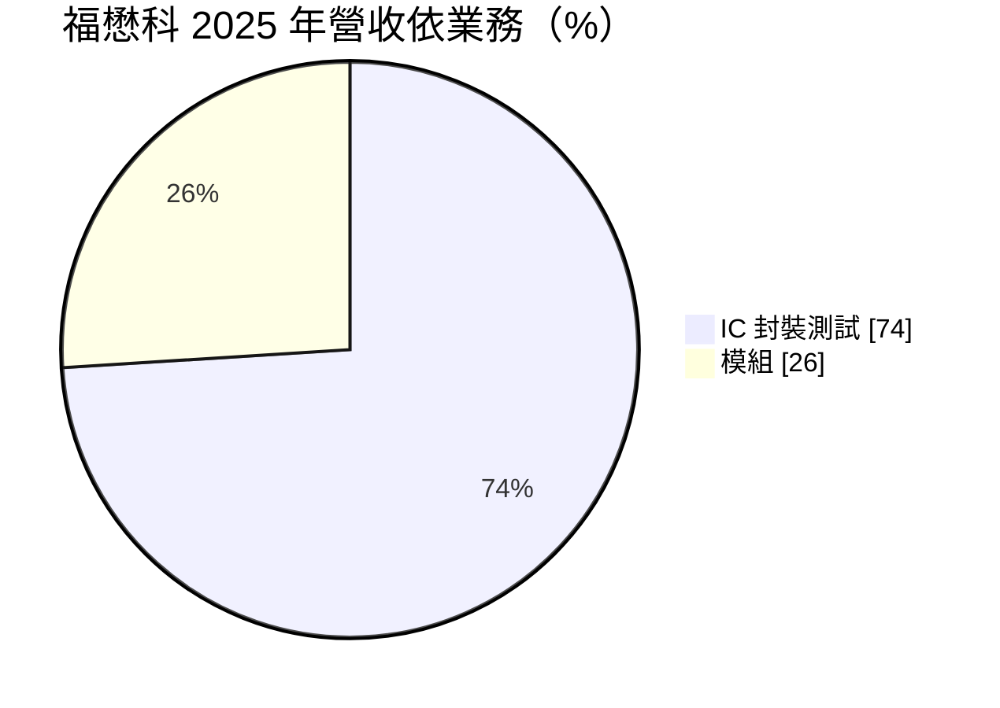
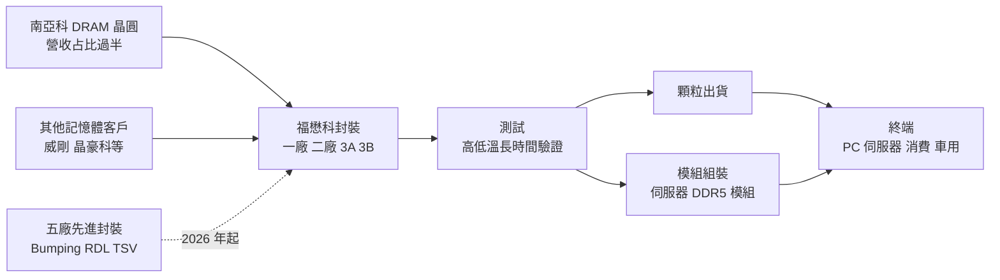
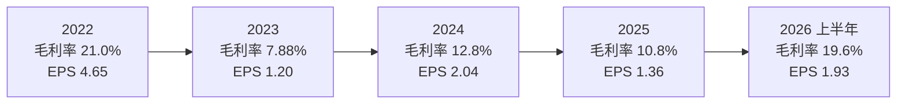
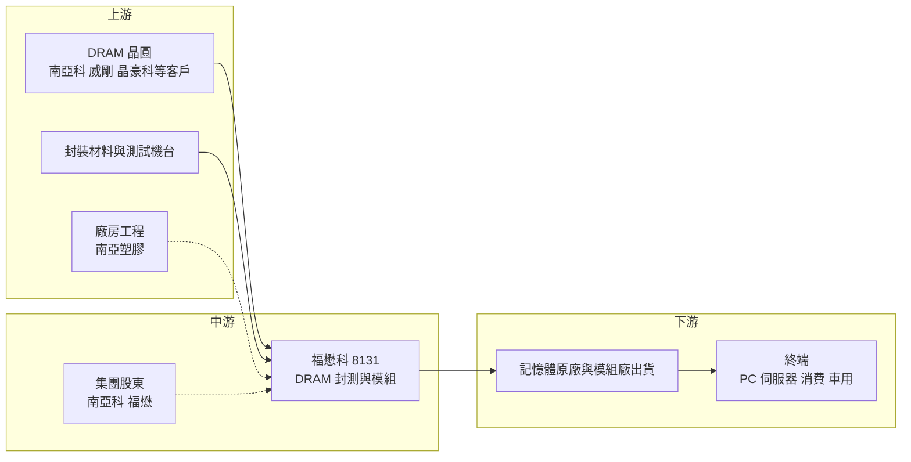

# 8131 福懋科

> 上市｜[[產業索引-半導體業|半導體業]]｜上市（櫃）日期 2007/11/29

# 第一章：企業模式與商業藍圖

> [!info] 撰寫說明
> 本文由 Claude 依公開資料整理，架構比照 [[2330台積電]] 的四章研究，資料截至 2026-10-08。財務數字來源：證交所開放資料（基本資料、綜合損益、資產負債、營益分析、股利、本益比殖利率）、Goodinfo 台灣股市資訊網年度經營績效、MoneyDJ 理財網（康和證券）公司基本資料、工商時報 2026 年 1 月報導、理財周刊、旺得富理財網；產業描述為整理性內容，尚未逐條比對原始文件。#待校對

在評估單一個股的長期投資價值時，首要步驟是拆解企業的底層獲利邏輯。本章針對福懋科技（股票代號：8131，以下簡稱福懋科）的商業模式進行定性分析，說明這家台塑集團旗下的記憶體封測廠，如何與 [[2408南亞科]] 形成上下游一體的分工，以及它如何試圖透過五廠與先進封裝產線，從傳統 DRAM 封測走向更高附加價值的製程。

## 一、核心定位：台塑集團的 DRAM 封測廠

福懋科成立於 1990 年，總部與工廠位於雲林斗六，2007 年在證交所上市，實收資本額約 44.22 億元。依理財周刊報導，福懋科由台塑集團的 [[1434福懋]]（福懋興業）基於產業轉型需求轉投資設立；工商時報 2026 年 1 月報導指出，南亞科持股約 32%，是福懋科的重要股東。

福懋科的本業是記憶體 IC 的封裝與測試，以及[[記憶體模組]]的組裝。它在台塑集團的半導體版圖中扮演「後段製造」的角色：南亞科在晶圓廠生產 [[DRAM]] 晶圓，福懋科負責把晶圓封裝成顆粒並完成測試，部分產品再組裝成記憶體模組。這種集團內的上下游分工，讓福懋科擁有穩定的基本訂單來源。

依工商時報報導，南亞科占福懋科營收比重在 50% 以上，DRAM 相關應用占比超過 95%，產品以 DDR4 為主；理財周刊另提到其他客戶包括 [[3260威剛]]、[[3006晶豪科]] 等記憶體廠商。換句話說，福懋科幾乎是一家「純 DRAM 封測廠」，其營運與 DRAM 景氣高度連動。

## 二、終端應用／產品板塊：封測為主、模組為輔

依 MoneyDJ 理財網的 2025 年營收分類，福懋科營收結構如下：

* **IC [[封裝測試]]（約 74%）：** 把 DRAM 晶圓封裝成顆粒並進行測試。DRAM 測試需要在高低溫環境下長時間驗證，測試時間與機台數量都相當可觀，是封測廠營收的重要組成。
* **模組（約 26%）：** 把封裝完成的 DRAM 顆粒組裝到電路板上，做成可插入電腦與伺服器的記憶體模組。工商時報提到，福懋科跨足高容量伺服器 [[DDR5]] 模組，堆疊層數由兩層提升到四層，代表模組業務正往伺服器高階產品移動。

DRAM 的終端應用涵蓋 PC、伺服器、手機、消費性電子與車用。南亞科的產品以標準型與利基型 DRAM 為主，因此福懋科的需求來源跟著南亞科的產品組合變動。

## 三、資本轉化邏輯：集團內代工、利用率與代工價決定獲利

福懋科的獲利公式可以拆成三個變數：封測量、代工單價與[[產能利用率]]。

封測量取決於南亞科與其他客戶的 DRAM 產出。工商時報 2026 年 1 月報導提到，一廠、二廠、3A 與 3B 廠的利用率都在 90% 以上，訂單能見度延伸到 2026 年上半年。代工單價則是福懋科與客戶協商的結果，報導指出記憶體代工價可望逐季與客戶洽談調漲。利用率高、單價上調時，固定的折舊與人力成本被攤薄，毛利率就會快速回升。

Goodinfo 的年度數據清楚呈現這種槓桿：2022 年營收 104 億元、毛利率 21%；2023 年 DRAM 低谷時營收降到 76.5 億元、毛利率只剩 7.88%；2025 年營運自第二季谷底回升，第三季毛利率回到 13.92%（理財周刊）；2026 上半年毛利率已達 19.6%、營業利益率 15.72%。

## 四、企業長期藍圖：五廠與先進封裝

福懋科的長期策略集中在一個核心計畫：五廠。

* **五廠的規模與定位：** 工商時報報導指出，五廠規模是一廠與二廠總和的兩倍，是 2026 年的核心成長動能。五廠將導入晶圓凸塊（[[Bumping]]）與重布線層（[[RDL]]）產線，具備 [[Turnkey]] 全程代工能力。理財周刊提到，福懋科在 2025 年 12 月宣布斥資約 7.02 億元，委由關係人 [[1303南亞]]（南亞塑膠）規劃新建五廠一期先進封裝產線的無塵室機電工程。
* **資本支出大幅提高：** 2025 年資本支出預估約 9.38 億元，2026 年預估約 20 億元，重點在先進封裝、Bumping、RDL、[[TSV]] 等自有產線設備，生產設備折舊預計在 2026 年下半年量產後開始提列。
* **技術升級：** 公司與客戶開發高傳輸速率 DDR5 產品、擴展 Flash 產品線，並推進 3D TSV 相關產品驗證。這些技術是記憶體邁向高頻寬、高堆疊的必要能力。

從資本配置角度看，五廠是福懋科成立以來規模最大的投資之一，代表經營層判斷記憶體封裝將朝先進封裝發展，並且選擇自建產能而非只做傳統打線封裝。這項投資若成功，福懋科將從「傳統 DRAM 封測代工」升級為「具備先進封裝能力的記憶體後段夥伴」；若需求不如預期，新增的折舊也會在下一個 DRAM 低谷時加重獲利壓力。

# 第二章：護城河深度與競爭優勢

在長期價值投資中，「護城河」指企業抵禦競爭、維持超額利潤的保護機制。本章分析福懋科的護城河構成、主要競爭對手，以及這些優勢在記憶體封測產業中能守住多少。

## 一、福懋科護城河的核心組成要素

福懋科的護城河屬於「集團綁定型」，優勢來自與南亞科的股權與訂單關係，而非獨特技術。

* **1. 集團內穩定的基本訂單：** 南亞科持股約 32%，且占營收比重過半。這種股權加訂單的關係，讓福懋科在 DRAM 低谷時仍能維持一定的營運規模，不會像獨立封測廠那樣面臨客戶流失。對南亞科而言，福懋科也是確保封測產能與品質的可靠夥伴。
* **2. DRAM 封測的專注與經驗：** DRAM 占福懋科業務超過 95%，長期專注單一產品讓它在 DRAM 測試程式、溫度循環與良率控制上累積了深厚經驗。
* **3. 集團資源支援：** 台塑集團在廠房建設、財務與採購上可以提供支援，例如五廠的無塵室機電工程委由南亞塑膠規劃。集團背景也讓福懋科在資金取得與長期投資上相對穩健。
* **4. 低負債的財務體質：** 2026 年第二季底負債比例約 21%，非流動負債只有約 4.68 億元，有能力自籌五廠資本支出，而不需要大量舉債。

## 二、主要競爭對手格局

| 對手 | 定位 | 對福懋科的威脅 |
|---|---|---|
| [[6239力成]] | 全球最大記憶體封測廠之一 | 規模、技術與國際客戶廣度遠大於福懋科 |
| [[8110華東]] | 華新集團記憶體封測，華邦電為主力客戶 | 同屬集團型記憶體封測廠，模式最接近 |
| [[2329華泰]] | 記憶體封測與模組 | 在封測與模組業務重疊 |
| [[8150南茂]] | 記憶體與驅動 IC 封測 | 在記憶體測試與封裝直接競爭 |
| 記憶體原廠自有封測 | 三星、SK 海力士、美光 | 先進記憶體封裝多由原廠內部完成 |

## 三、優勢轉化：哪些市場守得住、哪些守不住

* **守得住：** 南亞科的 DRAM 封測與模組訂單。股權關係與長期合作讓這部分訂單穩定，五廠擴產後也可以優先承接南亞科新產品的封測需求。
* **較難守住：** 集團外客戶與標準封測價格。在集團外市場，福懋科必須與力成等大型封測廠競爭，規模與技術廣度都處於劣勢；標準型 DRAM 封測的價格也容易隨景氣下修。
* **觀察重點：** 第一，五廠先進封裝產線能否在 2026 年下半年如期量產並取得客戶認證。第二，南亞科以外的客戶比重能否提升，降低單一客戶依賴。第三，DDR4 逐步淡出後，DDR5 與伺服器模組的比重能否補上，避免產品世代交替時出現空窗。

# 第三章：財務體質與盈利規模

資料日期：2026-10-08。數字取自證交所開放資料與 Goodinfo 年度經營績效，表格是撰寫當時的快照；最新月營收、毛利率、累計 EPS 由自動排程寫在本筆記的屬性欄位（月營收、毛利率、累計EPS 等）。#待校對

財務報表是檢驗護城河是否真實存在的最終標準。本章用三率、[[ROE]]、現金流與資本報酬，檢視福懋科在 DRAM 景氣循環中的獲利品質。

## 一、獲利能力的基石：三率

| 年度 | 營收（億元） | [[毛利率]] | [[營業利益率]] | EPS（元） | [[ROE]] |
|---|---|---|---|---|---|
| 2019 | 94.6 | 17.5% | 15.6% | 2.85 | 11.1% |
| 2020 | 97.1 | 19.5% | 17.4% | 3.17 | 12.1% |
| 2021 | 99.4 | 21.0% | 18.8% | 3.52 | 12.9% |
| 2022 | 104 | 21.0% | 18.6% | 4.65 | 16.4% |
| 2023 | 76.5 | 7.88% | 4.41% | 1.20 | 4.33% |
| 2024 | 89.3 | 12.8% | 8.6% | 2.04 | 7.93% |
| 2025 | 99.2 | 10.8% | 7.18% | 1.36 | 5.21% |
| 2026 上半年 | 61.02 | 19.6% | 15.72% | 1.93 | 年化約 11.1%（推算） |

註：2019 至 2025 年取自 Goodinfo 年度經營績效；2026 上半年取自證交所營益分析與綜合損益開放資料，ROE 以稅後淨利 8.55 億元乘以 2，除以 2026 年第二季底權益總計 153.98 億元推算。

* **[[毛利率]]隨 DRAM 景氣循環：** 2019 至 2022 年 DRAM 需求穩定，毛利率維持在 17.5% 至 21%；2023 年 DRAM 低谷時降到 7.88%；2024 至 2025 年在 11% 至 13% 之間緩步恢復；2026 上半年回到 19.6%，接近 2021 至 2022 年的高峰。毛利率的擺盪幅度比華東小，代表集團訂單提供了一定的穩定性。
* **[[營業利益率]]與費用結構：** 福懋科的營業費用很低，2026 上半年只有約 2.37 億元，占營收不到 4%。因此毛利率與營業利益率的差距只有 3 至 4 個百分點，毛利率的改善幾乎全數反映到營業利益。
* **2025 年營收高但獲利低：** 2025 年營收 99.2 億元，與 2021 年相當，但 EPS 只有 1.36 元，原因是上半年毛利率仍在谷底，加上匯率影響。這說明福懋科的獲利更取決於代工單價與利用率，而非營收規模。

## 二、[[ROE]]：資本效率

福懋科 2021 至 2025 年平均 ROE 約 9.4%（推算），景氣高峰的 2022 年達 16.4%，低谷的 2023 年只有 4.33%。2026 年第二季底權益總計約 153.98 億元，每股淨值約 34.82 元，其中保留盈餘約 63.96 億元、資本公積約 24.12 億元、其他權益約 21.69 億元。其他權益規模不小，推估包含持有金融資產的未實現評價利益，上半年其他綜合損益約 27.38 億元（標的未查得）。

營收方面，2019 年 94.6 億元到 2025 年 99.2 億元，六年年複合成長率只有約 0.8%（推算），營收規模長期停留在 80 至 100 億元之間。五廠投產是福懋科能否突破這個規模的關鍵。

## 三、資本支出與[[自由現金流]]

* **[[CapEx]] 大幅提高：** 2025 年資本支出預估約 9.38 億元，2026 年約 20 億元（工商時報）。以 2026 上半年營業利益約 9.59 億元推算，2026 年資本支出可能接近或超過全年營業利益，自由現金流在投資高峰期可能轉弱（推估）。
* **折舊壓力：** 五廠設備折舊預計在 2026 年下半年開始提列。新產線初期利用率通常較低，若量產爬坡不如預期，折舊會先壓縮毛利率。
* **股利政策：** 公司章程規定可分配盈餘至少分配 50% 以上，並以現金股利為優先。依證交所股利資料，2025 年度每股現金股利 1.0 元，以 EPS 1.36 元計算，[[配息率]]約 74%（推算）。Goodinfo 顯示歷年平均現金股利約 1.6 元，配息金額隨獲利波動，逐年配息紀錄未查得。

## 四、[[ROIC]] 與 [[WACC]]：價值創造利差

* **ROIC（推算）：** 以 2025 年營收 99.2 億元乘以營業利益率 7.18%，營業利益約 7.12 億元，乘以（1－20% 稅率）得到稅後營業利益約 5.70 億元。投入資本以 2026 年第二季底權益總計 153.98 億元加上非流動負債 4.68 億元（有息負債明細未查得，以非流動負債作為上限近似）計算，約 158.66 億元。2025 年 ROIC 約 5.70 ÷ 158.66 ≈ 3.6%（推算）。若以 2026 上半年營業利益 9.59 億元年化，稅後營業利益約 15.35 億元，ROIC 約 9.7%（推算）。
* **WACC（推算）：** 無風險利率取台灣 10 年期公債約 1.75%，市場風險溢酬取 6%，β 值取 MoneyDJ 理財網頁面顯示的 1.50，股東權益成本約 1.75% + 1.50 × 6% ≈ 10.8%。稅前負債成本假設 2.5%、稅率 20%，以權益約 97% 的資本結構加權，WACC 約 10.5%（推算）。
* **價值創造判斷：** 2025 年 ROIC 約 3.6% 明顯低於 WACC 約 10.5%；即使 2026 上半年年化 ROIC 回升到約 9.7%，仍略低於 WACC。2019 至 2022 年營業利益率在 15% 以上時，ROIC 可能接近或略高於資金成本（推估）。整體而言，福懋科在 DRAM 循環的大多數時間只能接近、而非穩定超越資金成本。β 值 1.50 反映股價波動大，也墊高了資金成本。五廠先進封裝能否把營業利益率長期拉到 15% 以上，是福懋科能否成為長期創造價值企業的關鍵。

# 第四章：總體風險與地緣政治

任何企業都無法脫離宏觀環境獨立存在。本章分析福懋科未來必須面對的地緣政治、產業週期、營運與技術風險。

## 一、地緣政治風險

* **記憶體的國家競爭：** 中國在政策支持下發展本土 DRAM，美國則以出口管制限制中國記憶體技術。這些政策會影響全球 DRAM 的供需與價格，也會影響南亞科等台灣記憶體廠的市場空間，進而影響福懋科的訂單。
* **關稅與終端需求：** 美國關稅政策可能影響 PC、伺服器與消費性電子的終端需求與生產地點，間接改變記憶體的出貨量。
* **台灣生產集中：** 福懋科的產能集中在雲林斗六，與南亞科同樣面臨兩岸風險，國際客戶可能要求分散產能。

## 二、產業週期與市場結構風險

* **DRAM 景氣循環：** DRAM 是全球最典型的景氣循環產業，價格可能在一年內上漲或下跌數成。福懋科 2023 年毛利率降到 7.88%，就是 DRAM 低谷的直接反映。DRAM 封測的需求與價格會跟著循環起伏。
* **[[長鞭效應]]：** DRAM 缺貨時，原廠與模組廠同時加碼投片與封測；需求轉弱時又同步去化庫存，封測廠的利用率波動往往比終端需求更劇烈。
* **產品世代交替：** 福懋科目前以 DDR4 為主，DDR4 逐步停產並轉向 DDR5 的過程中，若客戶的 DDR5 封測選擇其他廠商，或新產品測試需求改變，福懋科可能面臨產能空窗。

## 三、營運環境的隱性風險

* **單一客戶依賴：** 南亞科占營收過半，南亞科的產能規劃、產品策略與財務狀況都會直接影響福懋科。若南亞科在海外設立封測產能或改變委外策略，福懋科的營收會受到明顯衝擊。
* **擴產執行風險：** 五廠是大規模投資，Bumping、RDL 與 TSV 產線的良率爬坡需要時間。若量產延後或客戶認證不順，新增的折舊會先壓縮獲利。
* **關係人交易：** 五廠工程委由關係人南亞塑膠規劃，屬於集團內交易，投資人應留意交易條件是否公允。這類交易在台灣集團企業中常見，本身不代表問題，但需持續關注揭露資訊。
* **匯率：** 匯率波動會影響代工報價與毛利率，2025 年上半年的獲利低迷部分與匯率有關。

## 四、科技演進風險

記憶體技術正走向高頻寬與高堆疊，[[HBM]] 需要 TSV 矽穿孔與多層堆疊，DDR5 與伺服器模組也需要更高速的測試能力。這些先進技術多由三星、SK 海力士與美光等原廠掌握，大型封測廠則以龐大資本支出跟進。福懋科布局 Bumping、RDL 與 TSV，正是為了跟上這股趨勢，但與國際大廠相比，投資規模與技術累積仍有差距。如果南亞科本身在高階記憶體的技術進度落後，福懋科的先進封裝產能也可能缺乏足夠訂單。反之，若南亞科成功推出高階 DRAM 產品，福懋科就能憑藉集團關係取得先進封裝的訂單，提升長期的附加價值。

# 專有名詞解析

## 半導體

- **[[DRAM]]**：動態隨機存取記憶體，電腦與伺服器的主記憶體，斷電後資料會消失，價格循環明顯。
- **[[DDR5]]**：第五代 DDR 記憶體規格，傳輸速度與容量高於 DDR4，是新一代電腦與伺服器的主流。
- **[[封裝測試]]**：晶片製造完成後的切割、封裝與電性測試流程，讓晶片成為可焊接在電路板上的成品。
- **[[Bumping]]**：晶圓凸塊，在晶圓上製作微小的金屬凸點，讓晶片可以用覆晶方式直接與基板連接。
- **[[RDL]]**：重布線層，在晶片表面重新安排線路走向，讓接點可以重新分布，是先進封裝的基礎技術。
- **[[TSV]]**：矽穿孔，在晶片上鑽出垂直導通孔，讓多層晶片直接堆疊連接，是 HBM 的關鍵技術。
- **[[Turnkey]]**：一站式全程代工，從前段到後段由同一家廠商負責，客戶不需要分別找不同供應商。
- **[[HBM]]**：高頻寬記憶體，把多層 DRAM 垂直堆疊並與處理器封裝在一起，用於 AI 加速器。

## 金融

- **[[產能利用率]]**：實際產出占總產能的比例，封測廠的毛利率高度取決於此數字。
- **[[配息率]]**：現金股利占每股盈餘的比例，反映公司把多少獲利回饋給股東。
- **[[自由現金流]]**：營業活動現金流減去資本支出，代表企業可自由用於配息、還債或併購的現金。
- **[[長鞭效應]]**：終端需求的小幅變動，沿供應鏈往上游傳遞時被逐級放大，造成上游庫存與訂單劇烈波動。

## 產業

- **[[記憶體模組]]**：把多顆記憶體顆粒焊在電路板上，做成可直接插入電腦或伺服器的記憶體條。

# 核心供應鏈

## 1. 上游：客戶晶圓、材料與工程
- 委託封測的 DRAM 晶圓：[[2408南亞科]]（占營收過半）、[[3260威剛]]、[[3006晶豪科]]
- 五廠無塵室機電工程：[[1303南亞]]（關係人）
- 封裝材料與測試機台（具體供應商未查得）

## 2. 中游：福懋科本身與集團
- DRAM 封裝測試與模組：福懋科
- 集團股東：[[2408南亞科]]（持股約 32%）、[[1434福懋]]

## 3. 下游：終端市場
- 封測完成的 DRAM 顆粒與模組交回客戶，銷往 PC、伺服器、消費性電子與車用市場

## 4. 同業與競爭者
- 記憶體封測：[[6239力成]]、[[8110華東]]、[[2329華泰]]、[[8150南茂]]

## 最新新聞
<!-- news:start（自動產生，請勿手動編輯此範圍） -->
- 2026-10-06 📰 媒體 16:51｜營收速報 - 福懋科(8131)9月營收12.37億元年增率高達35.49％｜[鉅亨網](https://news.cnyes.com/news/id/6622756)

完整紀錄：[[8131福懋科 新聞]]
<!-- news:end -->

## 相關連結
- [公開資訊觀測站](https://mopsov.twse.com.tw/mops/web/t05st03?step=1&firstin=1&co_id=8131)
- [Goodinfo](https://goodinfo.tw/tw/StockDetail.asp?STOCK_ID=8131)
- [Yahoo 股市](https://tw.stock.yahoo.com/quote/8131)
- [鉅亨網新聞](https://www.cnyes.com/twstock/8131/news)
