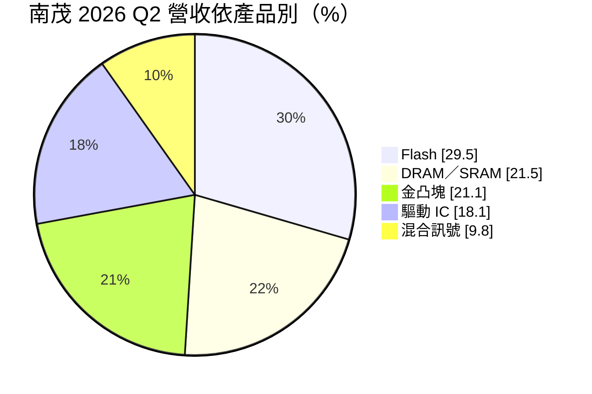
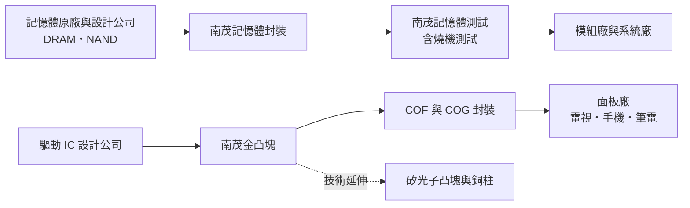
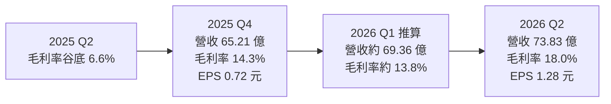
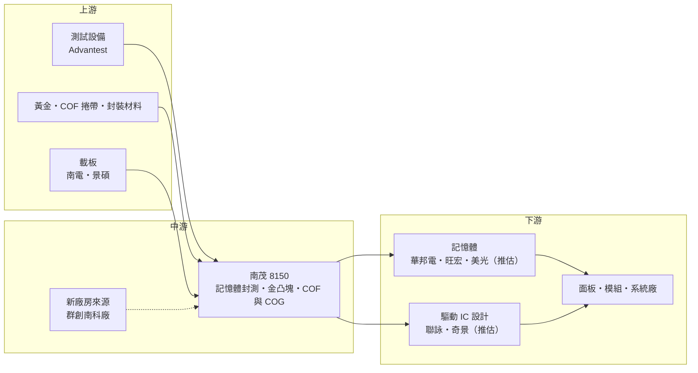

# 8150 南茂

> 上市｜[[產業索引-半導體業|半導體業]]｜上市（櫃）日期 2014/04/11

# 第一章：企業模式與商業藍圖

> [!info] 撰寫說明
> 本文由 Claude 依公開資料整理，架構比照 [[2330台積電]] 的四章研究，資料截至 2026-10-07。財務數字來源：南茂 2025 年第四季與 2026 年第二季法說會報導（優分析）、2026 年第二季財報報導（旺得富／中時新聞網）、理財周刊、Yahoo 股市公司基本資料；產業描述為整理性內容，尚未逐條比對原始文件。#待校對

在評估單一個股的長期投資價值時，首要步驟是拆解企業的底層獲利邏輯。本章針對南茂科技（股票代號：8150，以下簡稱南茂）的商業模式進行定性分析，說明它為何同時經營記憶體與面板驅動 IC 兩條封測產線，以及記憶體超級循環如何改變它的營收結構與擴產策略。

## 一、核心定位：記憶體與面板驅動 IC 雙主軸的封測廠

南茂成立於 1997 年 7 月 28 日，董事長為鄭世杰。依 Yahoo 股市公司資料，南茂從事高集積度、高精密度記憶體的封裝及測試服務，以及顯示器驅動 IC 與[[混合訊號 IC]] 的封裝測試。南茂同時在美國那斯達克掛牌 [[ADR]]（代號 IMOS）。

南茂的特色是「兩條腿走路」：一邊是 [[DRAM]]、[[NAND Flash]] 等記憶體的封裝與測試，另一邊是面板驅動 IC（[[DDI]]）的[[金凸塊]]與 [[COF]]／[[COG]] 封裝。這個定位有兩個商業意義：

* **景氣分散：** 記憶體與面板兩個市場的景氣循環不完全同步，過去讓南茂的營運相對分散，不至於單押一個產業。
* **兩邊都不是最大：** 在記憶體封測與驅動 IC 封測兩個市場，南茂都面臨規模更大的專業對手，景氣反轉時議價力較弱。

## 二、產品板塊：記憶體重新成為主引擎

依理財周刊整理，南茂營收約 50% 至 55% 來自記憶體封測，40% 至 45% 來自面板驅動 IC 封測（含大尺寸、中小尺寸與 OLED 驅動 IC 及金凸塊製程）。依優分析對 2026 年第二季法說的整理，當季產品比重為：

* **記憶體（Flash 加 DRAM／SRAM）：** 合計約 51%，旺得富報導 DRAM 成長動能特別強。
* **金凸塊：** 21.1%，是驅動 IC 封裝的前段製程，也是南茂延伸到[[矽光子]]凸塊的技術基礎。
* **驅動 IC 封裝：** 18.1%，包括 COF、COG 等。
* **混合訊號：** 9.8%。

與 2025 年第四季相比變化明顯：當時記憶體占 49.9%、驅動 IC 與金凸塊合計占 40.2%。記憶體超級循環讓記憶體封測重新成為南茂的主要成長引擎。

## 三、資本轉化邏輯：封裝、測試與凸塊三段產能

* **產能與據點：** 南茂主要產能位於新竹科學園區、新竹縣與台南科學園區。依優分析報導，南茂於 2026 年 3 月斥資 8.8 億元購入群創位於台南科學園區的廠房，建物面積約 3.43 萬平方公尺，作為未來擴產基地。
* **[[產能利用率]]：** 2026 年第二季封裝、測試與凸塊整體產能利用率約 72%（旺得富）。封測業固定成本高，利用率與報價是毛利率的兩大變數。
* **報價：** 理財周刊報導下半年封測報價全面看漲，部分產品漲幅可能超過兩成。

## 四、企業長期藍圖

* **擴大記憶體測試產能：** 優分析報導，[[DDR5]] 測試產能規劃擴充 10% 至 20%。
* **切入手機 AP 與 AI ASIC 測試：** 公司計畫在 2026 年底引進高階測試設備，先啟動手機應用處理器（[[AP]]）的少量生產，再逐步拓展到 AI [[ASIC]] 測試。
* **矽光子與光學凸塊：** 南茂已與重要客戶在矽光子相關製程（凸塊、晶圓處理、銅柱）展開合作，預期光學封裝業務在 2027 年顯著成長，2028 年起成為新的獲利來源（優分析）。
* **提高資本支出：** 2026 年資本支出突破營收的 25%，高於過去 15% 至 20% 的水準，2027 年預期維持在 25% 至 26%。

# 第二章：護城河深度與競爭優勢

在長期價值投資中，「護城河」指企業抵禦競爭、維持超額利潤的保護機制。本章分析南茂的護城河構成、在記憶體與驅動 IC 封測兩個市場的主要對手，以及規模劣勢在景氣反轉時的影響。

## 一、護城河的核心組成要素

南茂的護城河屬於「窄」，由三個要素組成：

* **1. 雙主軸的技術組合：** 同時具備記憶體封測與驅動 IC 金凸塊、COF 技術，可以服務兩類客戶，並把凸塊技術延伸到矽光子等新應用。
* **2. 記憶體客戶關係：** 長期服務台灣與國際記憶體廠的封測需求，記憶體產品驗證週期長，客戶不會輕易更換封測廠。
* **3. 測試產能：** 記憶體測試需要大量專用機台與長時間的[[燒機測試]]，在記憶體需求暴增時，具備現成測試產能本身就是議價籌碼。

## 二、全球主要競爭對手格局

| 對手 | 定位 | 對南茂的威脅 |
|---|---|---|
| [[6239力成]] | 全球最大記憶體封測廠之一，積極發展先進封裝 | 規模與客戶基礎遠大於南茂 |
| [[6147頎邦]] | 驅動 IC 封測龍頭，也在發展矽光子 | 金凸塊與 COF 規模大於南茂 |
| 華東科技 | 台灣記憶體封測同業 | 部分 DRAM、NAND 產品競爭 |
| 頎中科技、匯成股份、長電科技、通富微電 | 中國封測廠，國產化政策支持 | 承接中國驅動 IC 與記憶體訂單 |
| 三星、SK 海力士等原廠 | 以自有封測為主 | 限制外包市場規模 |

## 三、優勢轉化：哪些市場守得住、哪些守不住

* **守得住：** 在記憶體供給吃緊、封測產能不足的時期，南茂現有的記憶體測試產能能直接轉為營收與漲價空間。
* **守不住：** 在記憶體與驅動 IC 兩個市場，南茂都不是規模最大的業者，景氣反轉時價格壓力會先落在規模較小的廠商身上。2025 年第二季[[毛利率]]一度跌到 6.6% 就是例子。
* **觀察重點：** 記憶體超級循環能延續多久、資本支出大增後的產能利用率能否維持，以及手機 AP、AI ASIC 測試與矽光子凸塊這些新業務的實際放量時程。

# 第三章：財務體質與盈利規模

資料日期：2026-10-07。數字取自南茂法說會與財報的媒體整理（優分析、旺得富、理財周刊），表格是撰寫當時的快照；最新月營收、毛利率、累計 EPS 由自動排程寫在本筆記的屬性欄位（月營收、毛利率、累計EPS 等）。#待校對

財務報表是檢驗護城河是否真實存在的最終標準。本章用三率、ROE、現金流與資本報酬，檢視南茂從 2025 年谷底回升的獲利品質，以及資本支出大增對未來的影響。

## 一、獲利能力的基石：三率

| 項目 | 2025 全年 | 2025 Q4 | 2026 Q1 | 2026 Q2 |
|---|---|---|---|---|
| 營收（新台幣） | 239.33 億 | 65.21 億 | 約 69.36 億（推算） | 73.83 億 |
| [[毛利率]] | 10.8% | 14.3% | 約 13.8% | 18.0% |
| [[營業利益率]] | 4.8% | 9.7% | 約 7.5% | 12.8% |
| EPS（元） | 0.70 | 0.72 | 約 0.72 | 1.28 |

* **推算說明：** 2026 年第一季數字由上半年（營收 143.19 億元、EPS 2 元）減去第二季推算，毛利率與營業利益率依第二季「季增 4.2 個百分點」「季增 5.3 個百分點」回推。
* **2025 年：** 營收年增 5.5%，但毛利率年減 2.2 個百分點，稅後淨利 4.95 億元，年減 65.1%，反映上半年記憶體與面板景氣低迷。
* **2026 年第二季：** 稅後淨利 8.92 億元，季增 76.6%、年增 267.3%，EPS 1.28 元創四年新高；6 月營收 25.38 億元創歷史新高。
* **上半年：** 營收年增 27.1%，毛利率 15.9%、營業利益率 10.3%。公司表示下半年營運可望優於上半年（旺得富）。

## 二、[[ROE]]：資本效率

南茂毛利率波動大，從 2025 年第二季谷底 6.6% 回升到 2026 年第二季約 18%，ROE 隨之大幅變化。2025 年 EPS 僅 0.70 元，ROE 偏低；2026 年在記憶體循環帶動下明顯改善，但具體數值本次未查得。封測業資本密集，獲利對產能利用率與報價高度敏感。

## 三、資本支出與自由現金流

* **[[CapEx]]：** 2026 年上半年資本支出 29.15 億元，其中第二季 23.8 億元；全年資本支出比重突破營收的 25%，2027 年預期維持在 25% 至 26%。另有 8.8 億元購入群創南科廠房。
* **[[自由現金流]]：** 資本支出大增將使未來兩到三年折舊上升，若記憶體需求轉弱，自由現金流會受到壓縮。
* **股利：** 依優分析報導，南茂 2025 年度每股配發 1.23 元現金，以[[資本公積]]發放（2025 年 EPS 僅 0.70 元）。未來配息將取決於 2026 年獲利回升幅度與擴產資金需求。

## 四、[[ROIC]] 與 [[WACC]]：價值創造利差

2025 年營業利益率僅 4.8%，在資本密集的封測業中，ROIC 推估低於 WACC，屬於價值未被創造的年份。2026 年第二季營業利益率回升到 12.8%，利差有機會轉正（推估，具體數值未查得）。資本支出提高到營收四分之一以上，代表投入資本將快速擴大，新產能能否在記憶體循環高點之後仍維持足夠的利用率，是 ROIC 能否持續高於資金成本的關鍵。

# 第四章：總體風險與地緣政治

任何企業都無法脫離宏觀環境獨立存在。本章分析南茂未來必須面對的地緣政治、記憶體與面板週期、營運與技術演進風險。

## 一、地緣政治

* **台灣集中：** 主要產能在台灣，面臨與其他台灣半導體廠相同的兩岸風險。
* **中國競爭：** 中國面板與驅動 IC 供應鏈國產化，中國客戶的驅動 IC 封測訂單可能轉向頎中、匯成等本土業者。
* **美國掛牌與法規：** 南茂在美國掛牌 ADR，需遵守美國證券法規；美中科技管制若擴大到記憶體相關產品，可能影響部分客戶。

## 二、產業週期與市場結構

* **記憶體循環：** 記憶體已占營收過半，DRAM、NAND 報價與原廠產能利用率是南茂獲利的最大變數。2025 年上半年的低谷顯示，景氣反轉時毛利率可能跌到個位數。
* **面板景氣：** 驅動 IC 與金凸塊合計約四成營收，面板需求與庫存調整影響明顯，[[長鞭效應]]會放大封測端的訂單波動。

## 三、營運環境的隱性風險

* **擴產與折舊：** 資本支出比重拉高到營收的 25% 以上，加上購入新廠房，若需求不如預期，折舊將壓縮毛利率。
* **新業務執行：** 手機 AP、AI ASIC 測試與矽光子凸塊都屬新領域，需要與客戶長時間驗證，放量時程有不確定性。
* **金價與匯率：** 金凸塊製程使用黃金，金價波動影響成本與營運資金；外銷比重高，新台幣升值會影響以台幣計的營收。

## 四、科技或法規演進

記憶體封裝朝高層數堆疊、[[HBM]] 等方向發展，但 HBM 主流封裝多在原廠內部完成，外包封測廠能分到的空間有限。驅動 IC 封裝隨 OLED、更細間距演進，南茂需要持續投資才能跟上頎邦等對手。

# 專有名詞解析

## 半導體

- **[[DRAM]]**：動態隨機存取記憶體，電腦與手機的主記憶體，斷電後資料消失，價格隨供需大幅波動。
- **[[NAND Flash]]**：斷電後仍能保存資料的快閃記憶體，用於 SSD、手機儲存與記憶卡。
- **[[DDR5]]**：第五代雙倍資料率 DRAM 規格，頻寬與容量高於 DDR4，是新一代伺服器與 PC 的主流記憶體。
- **[[HBM]]**：高頻寬記憶體，把多顆 DRAM 垂直堆疊並與 GPU 封裝在一起，提供 AI 運算所需的大頻寬。
- **[[DDI]]**：顯示驅動 IC，負責控制面板每個像素的電壓，需要高壓製程，聯詠、奇景為主要設計公司。
- **[[金凸塊]]**：在晶片接點上電鍍黃金凸點，讓驅動 IC 能直接接合到面板或軟性基板上。
- **[[COF]]**：薄膜覆晶封裝，把驅動 IC 接合在可彎折的軟性薄膜上，用於大尺寸與窄邊框面板。
- **[[COG]]**：玻璃覆晶封裝，把驅動 IC 直接接合在面板玻璃上，常用於中小尺寸面板。
- **[[混合訊號 IC]]**：同時處理類比與數位訊號的晶片，例如電源管理、觸控與感測晶片。
- **[[燒機測試]]**：在高溫高壓下長時間運作晶片，提前篩出早期失效品，記憶體測試的重要環節。
- **[[矽光子]]**：在矽晶片上製作光學元件，以光取代電傳輸資料，可降低 AI 資料中心的傳輸耗電。

## 應用

- **[[AP]]**：應用處理器，手機與平板的主晶片，整合 CPU、GPU 與數據機等功能。

## 金融

- **[[ADR]]**：美國存託憑證，外國公司在美國股市掛牌交易的憑證，代表其本國股票。
- **[[資本公積]]**：公司發行股票溢價等非營業來源累積的資本，可依法用來發放現金，但不是當年度獲利。
- **[[產能利用率]]**：實際生產量占總產能的比例，封測廠與晶圓廠的毛利率高度取決於此數字。
- **[[長鞭效應]]**：終端需求的小幅變動，沿供應鏈往上游傳遞時被逐級放大，造成上游庫存與訂單劇烈波動。

# 核心供應鏈

## 1. 上游：設備與材料
- 測試設備：愛德萬測試（Advantest）
- 黃金、COF 捲帶基板與封裝材料
- 載板：[[8046南電]]、[[3189景碩]]

## 2. 中游：南茂本身
- 記憶體封裝與測試、驅動 IC 金凸塊與 COF／COG、混合訊號 IC 封測
- 新廠房來源：[[3481群創]]（南科廠房）

## 3. 下游：主要客戶
- 記憶體：[[2344華邦電]]、[[2337旺宏]]、美光（推估）
- 驅動 IC 設計：[[3034聯詠]]、奇景光電（推估）

## 4. 同業
- 記憶體封測：[[6239力成]]、華東科技
- 驅動 IC 封測：[[6147頎邦]]、頎中科技、匯成股份

## 最新新聞
<!-- news:start（自動產生，請勿手動編輯此範圍） -->
- 2026-10-05 📰 媒體 14:30｜南茂(8150) 記憶體封測需求強勁！外資調升目標價，市場下一步看好什麼?｜[鉅亨網](https://news.cnyes.com/news/id/6621686)
- 2026-10-05 📰 媒體 11:30｜南茂(8150) 記憶體封測需求強勁！外資升目標價，市場下一步看好什麼?｜[鉅亨網](https://news.cnyes.com/news/id/6621596)

完整紀錄：[[8150南茂 新聞]]
<!-- news:end -->

## 相關連結
- [公開資訊觀測站](https://mopsov.twse.com.tw/mops/web/t05st03?step=1&firstin=1&co_id=8150)
- [Goodinfo](https://goodinfo.tw/tw/StockDetail.asp?STOCK_ID=8150)
- [Yahoo 股市](https://tw.stock.yahoo.com/quote/8150)
- [鉅亨網新聞](https://www.cnyes.com/twstock/8150/news)
