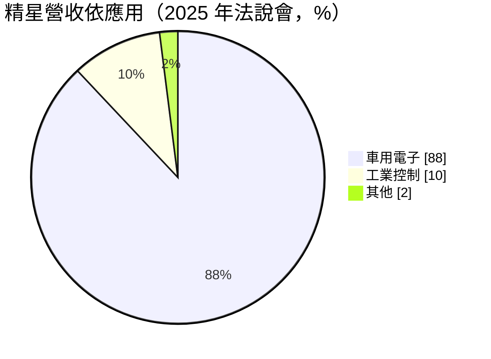
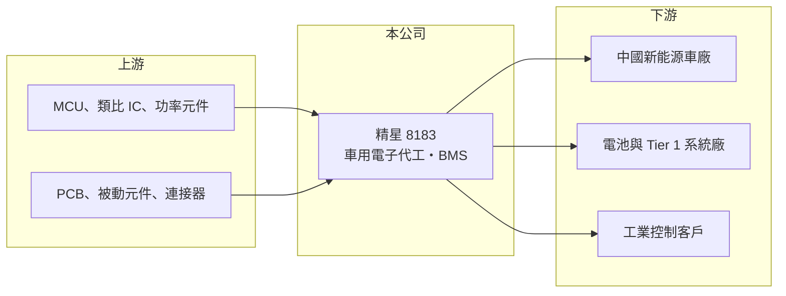

# 8183 精星

> 上櫃｜[[產業索引-其他電子業|其他電子業]]｜上市（櫃）日期 2005/03/30

# 第一章：企業模式與商業藍圖

> [!info] 撰寫說明
> 精簡版，由 Claude 依公開資料整理，架構比照 [[2330台積電]]，資料截至 2026-10-08。來源：富果研究 2025 年 12 月精星法說會整理、nStock 精星公司概況、MoneyDJ 理財網財務比率年表（2021 至 2025 年）。#待校對

精星是以中國新能源車為主要市場的電子代工廠，最大宗產品是電動車的電池管理系統板。

- **核心業務：** 精星成立於 1990 年，2005 年上櫃，是一家[[EMS]]電子代工廠，提供 [[SMT]] 表面黏著、零組件組裝與測試服務。公司早年做資訊電子產品，後來把產能轉向車用電子，成功搭上中國新能源車的成長。
- **營收結構：** 依 2025 年 12 月法說會，車用電子約占營收 88%、工業控制約 10%。車用產品中，[[BMS]] 電池管理系統占比超過 71%，其餘包括車用 MCU 模組、[[ADAS]] 相關模組、天線與功率放大器。營收約 95% 來自中國市場。
- **營運據點：** 生產基地包括台灣湖口廠，以及中國江蘇蘇州、安徽蕪湖與江蘇崑山廠，其中崑山廠在 2025 年 12 月量產。工廠貼近中國車廠與電池廠，是它能拿到在地訂單的重要原因。
- **長期方向：** 公司正從 BMS 延伸到電子剎車（One-box）、域控制器、空氣懸架與油門踏板等車用電子，並切入電動垂直起降飛行器與物流無人機的電池管理、燃料電池控制器，以及機器人相關產品。這些新品若量產，可以降低對單一 BMS 產品的依賴。

# 第二章：護城河深度與競爭優勢

精星的優勢在車規製造的認證與在地服務，但客戶與地區高度集中，議價能力有限。

- **競爭優勢：** 車用電子板需要通過車廠與電池廠的品質認證，導入時間長，一旦進入供應鏈，通常可以隨車型生命週期穩定出貨數年。精星在中國設有多座工廠，能就近配合客戶快速打樣與量產，這是外地代工廠不易取代的地方。
- **主要對手：** 中國本土的車用 EMS 廠數量多、擴產快，報價壓力大；國際大廠如偉創力、捷普也承接車用電子代工。台灣同業包括其他以中國車市為主的電子代工廠。
- **觀察重點：** 2021 至 2022 年毛利率超過兩成，2024 年底起車用客戶降價，2025 年毛利率降到 13.18%，顯示車用代工同樣會受到中國車市價格戰影響。長期要看新產品能否拉回毛利率，以及中國以外客戶的開發進度。

# 第三章：財務體質與盈利規模

資料日期：2026-10-08，表格是撰寫當時的快照；最新月營收、毛利率、累計 EPS 由自動排程寫在本筆記的屬性欄位（月營收、毛利率、累計EPS 等）。#待校對

精星在 2021 至 2023 年隨中國新能源車爆發而大幅成長，之後進入降價期，獲利能力明顯下滑。

| 年度 | 營收（億元） | [[毛利率]] | [[營業利益率]] | EPS（元） | [[ROE]] |
|---|---|---|---|---|---|
| 2021 | 約 45（推算） | 23.44% | 13.68% | 4.16 | 21.74% |
| 2022 | 約 69（推算） | 21.67% | 13.72% | 5.63 | 24.73% |
| 2023 | 約 67（推算） | 19.14% | 10.54% | 4.50 | 17.27% |
| 2024 | 約 74（推算） | 13.91% | 6.51% | 3.26 | 11.48% |
| 2025 | 約 73（推算） | 13.18% | 4.62% | 2.39 | 8.00% |

註：2025 年營收以 MoneyDJ 每股營業額 60.36 元乘以股數約 1.21 億股推算，其他年度依營收成長率回推。

- **長期指標：** 2021 至 2025 年營收年複合成長率約 12.7%（推算），近 5 年平均 ROE 約 16.6%（推算），但趨勢是逐年下滑。近五年平均現金股利約 1.41 元，配息隨獲利調整。
- **[[ROIC]] 與 [[WACC]]：** 2025 年稅後營業利益約 2.7 億元，ROIC 約 4.3%（推算：營業利益率 4.62% × 營收約 73 億元 × 0.8，除以股東權益約 36.9 億元加有息負債以總負債一半推估約 26 億元）。WACC 推估約 5.4%（推算：無風險利率 1.75%、市場風險溢酬 6%、β 取電子代工同業常見值 1.0，股東權益成本 7.75%；稅前負債成本 2.5%、稅率 20%；權益比重約 59%）。2021 至 2023 年 ROIC 明顯高於 WACC，2025 年已略低於資金成本，能否恢復價值創造取決於毛利率能否回升。
- **財務特色：** 代工業需要大量營運資金，負債比率由 2021 年的 44.53% 升到 2025 年的 58.53%。2025 年第一季曾針對單一高風險客戶提列應收帳款與存貨減損，說明客戶信用風險是代工業的重要成本。

# 第四章：總體風險與地緣政治

精星的風險集中在中國車市與客戶信用。

- **產業週期：** 中國新能源車市場競爭激烈，車廠降價會沿供應鏈轉嫁給零組件與代工廠，壓縮毛利。車市成長放緩時，電池與 BMS 訂單也會跟著調整。
- **營運風險：** 營收約 95% 來自中國，且 BMS 占車用產品七成以上，產品與地區都高度集中。中國車廠洗牌時，部分客戶可能倒閉或延遲付款，需要提列呆帳。
- **其他風險：** 美中科技與貿易限制、兩岸關係，以及人民幣匯率都會影響營運；新業務如無人機與飛行器的認證期長達一年半到兩年以上，貢獻營收的時間不確定。

# 專有名詞解析

## 應用

- **[[BMS]]**：電池管理系統，監控電池的電壓、溫度與電量，確保電動車與儲能電池安全運作。
- **[[ADAS]]**：先進駕駛輔助系統，例如車道維持、自動緊急煞車，需要大量感測器與運算模組。

## 金融

- **[[ROIC]]**：投入資本報酬率，稅後營業利益除以股東權益加有息負債，衡量本業運用資本的效率。
- **[[WACC]]**：加權平均資金成本，股東與債權人要求報酬率的加權平均，是 ROIC 要超越的門檻。

## 產業

- **[[EMS]]**：電子製造服務，替品牌或系統廠代工組裝電路板與產品的商業模式。
- **[[SMT]]**：表面黏著技術，把電子零件直接焊在電路板表面的組裝製程，是電子代工的核心產線。

# 核心供應鏈

- 上游：MCU、類比 IC 與功率元件供應商，PCB、[[被動元件]]與連接器廠
- 下游／客戶：中國新能源車廠、電池廠與車用一階系統廠、工業控制客戶（公司未公開客戶名稱）
- 同業：中國車用 EMS 廠、偉創力、捷普

## 最新新聞
<!-- news:start -->
<!-- news:end -->

## 相關連結
- [公開資訊觀測站](https://mopsov.twse.com.tw/mops/web/t05st03?step=1&firstin=1&co_id=8183)
- [Goodinfo](https://goodinfo.tw/tw/StockDetail.asp?STOCK_ID=8183)
- [Yahoo 股市](https://tw.stock.yahoo.com/quote/8183)
- [鉅亨網新聞](https://www.cnyes.com/twstock/8183/news)
