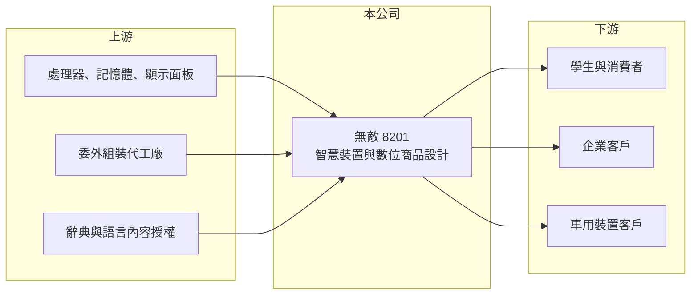

# 8201 無敵

> 上市｜[[產業索引-其他電子業|其他電子業]]｜上市（櫃）日期 2007/10/29

# 第一章：企業模式與商業藍圖

> [!info] 撰寫說明
> 精簡版，由 Claude 依公開資料整理，架構比照 [[2330台積電]]，資料截至 2026-10-08。來源：nStock 無敵公司概況、MoneyDJ 理財網財務比率年表（2021 至 2025 年）、winvest.tw 營收快訊。公開資料有限，產品比重與客戶未查得。#待校對

無敵科技以電子辭典品牌起家，隨著手機取代單機翻譯產品，正轉型為企業服務、車用與智慧裝置的數位商品設計公司。

- **核心業務：** 依公司登記的營業項目，無敵經營企業服務、車用裝置與智慧裝置的數位商品設計、研發與買賣。公司早年以「無敵」品牌的[[電子字典]]聞名，這個品牌在華人學習市場有高知名度，但產品需求已被智慧型手機與網路翻譯大幅取代。
- **營收結構：** 產品別比重本次未查得。營收從 2018 年約每股 24 元營業額，一路降到 2025 年約 7.6 元，代表舊產品線持續萎縮，新業務還沒有補上缺口。
- **營運據點：** 公司 2007 年掛牌，資本額約 6.2 億元，營運與研發據點細節本次未查得。
- **長期方向：** 轉型方向是把多年累積的語言資料、軟體與硬體設計能力，應用到企業客戶與車用裝置。轉型能否成功，關鍵在於能否找到需要「語言內容加硬體」的穩定客戶，而不是一次性的專案。

# 第二章：護城河深度與競爭優勢

無敵的品牌資產仍在，但核心市場萎縮，目前看不到明確的護城河。

- **競爭優勢：** 無敵擁有長期累積的辭典與語言學習內容授權，以及小型專用裝置的軟硬整合經驗。對需要客製化學習機或專用終端的企業客戶，這些經驗可以縮短開發時間。
- **主要對手：** 電子辭典與學習機市場面對中國的學習機品牌、日本卡西歐等辭典機，以及更根本的對手：智慧型手機與免費翻譯軟體。車用與智慧裝置方面，對手是大量的中小型 [[ODM]] 與設計公司。
- **觀察重點：** 毛利率由 2021 年的 12.42% 回升到 2025 年的 24.52%，代表產品組合在改善；長期要看營收能否止跌回升，讓毛利足以覆蓋研發與管理費用。

# 第三章：財務體質與盈利規模

資料日期：2026-10-08，表格是撰寫當時的快照；最新月營收、毛利率、累計 EPS 由自動排程寫在本筆記的屬性欄位（月營收、毛利率、累計EPS 等）。#待校對

無敵的營收連續多年下滑，本業持續虧損；2021 年的獲利來自業外。

| 年度 | 營收（億元） | [[毛利率]] | [[營業利益率]] | EPS（元） | [[ROE]] |
|---|---|---|---|---|---|
| 2021 | 約 7.9（推算） | 12.42% | -14.94% | 1.75 | 17.75% |
| 2022 | 約 6.0（推算） | 14.65% | -17.75% | -1.39 | -13.76% |
| 2023 | 約 5.2（推算） | 15.28% | -16.83% | -1.14 | -12.80% |
| 2024 | 約 4.7（推算） | 19.06% | -16.86% | -0.88 | -11.05% |
| 2025 | 約 4.7（推算） | 24.52% | -7.26% | -0.35 | -4.73% |

註：2025 年營收以 MoneyDJ 每股營業額 7.57 元乘以股數約 0.62 億股推算，其他年度依營收成長率回推。

- **長期指標：** 2021 至 2025 年營收年複合成長率約 -12%（推算），近 5 年平均 ROE 約 -4.9%（推算）。2021 年營業利益率 -14.94%，稅後淨利率卻是 13.77%，代表當年有大額[[業外收益]]（來源未查得）。近五年沒有配發股利。
- **[[ROIC]] 與 [[WACC]]：** 2025 年稅後營業利益約 -0.27 億元，ROIC 約 -5%（推算：分母為股東權益約 4.6 億元加有息負債以總負債一半推估約 1.2 億元）。WACC 推估約 6.6%（推算：無風險利率 1.75%、市場風險溢酬 6%、β 取小型電子同業常見值 1.0，股東權益成本 7.75%；稅前負債成本 2.5%、稅率 20%；權益比重約 80%）。ROIC 長期為負，代表本業尚未創造價值，股東權益靠過去的累積支撐。
- **財務特色：** 負債比率約 26% 至 33%，財務槓桿不高；但每股淨值由 2021 年的 10.76 元降到 2025 年的 7.39 元，虧損逐年侵蝕淨值。

# 第四章：總體風險與地緣政治

無敵最大的風險是轉型速度趕不上舊業務萎縮的速度。

- **產業週期：** 消費性電子裝置需求跟著景氣與換機週期起伏，專用裝置還面臨被手機功能取代的長期趨勢，這不是景氣循環，而是結構性衰退。
- **營運風險：** 營收規模只有數億元，研發與管理費用難以壓縮，若新業務遲遲無法放量，虧損會繼續消耗淨值。轉型新市場也需要重新建立客戶信任。
- **其他風險：** 硬體多委外生產，零組件價格與供應會影響成本；語言內容授權與資料使用法規也可能影響產品設計。

# 專有名詞解析

## 應用

- **[[電子字典]]**：內建多國語言辭典的手持式電子裝置，2000 年代盛行，後被智慧型手機與網路翻譯取代。

## 金融

- **[[業外收益]]**：本業以外的收入，例如處分資產、投資收益或匯兌利益，通常不具持續性。
- **[[ROIC]]**：投入資本報酬率，稅後營業利益除以股東權益加有息負債，衡量本業運用資本的效率。
- **[[WACC]]**：加權平均資金成本，股東與債權人要求報酬率的加權平均，是 ROIC 要超越的門檻。

## 產業

- **[[ODM]]**：原廠委託設計製造，由代工廠負責設計與生產，產品掛客戶品牌銷售。

# 核心供應鏈

- 上游：處理器、記憶體與顯示面板供應商，委外組裝代工廠，辭典與語言內容授權方
- 下游／客戶：學生與一般消費者、企業客戶、車用裝置客戶（客戶名稱未查得）
- 同業：卡西歐等辭典機品牌、中國學習機品牌、中小型智慧裝置設計公司

## 最新新聞
<!-- news:start -->
<!-- news:end -->

## 相關連結
- [公開資訊觀測站](https://mopsov.twse.com.tw/mops/web/t05st03?step=1&firstin=1&co_id=8201)
- [Goodinfo](https://goodinfo.tw/tw/StockDetail.asp?STOCK_ID=8201)
- [Yahoo 股市](https://tw.stock.yahoo.com/quote/8201)
- [鉅亨網新聞](https://www.cnyes.com/twstock/8201/news)
