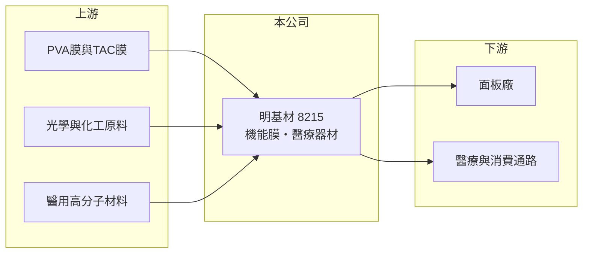

# 8215 明基材

> 上市｜[[產業索引-光電業|光電業]]｜上市（櫃）日期 2010/11/12

# 第一章：企業模式與商業藍圖

> [!info] 撰寫說明
> 精簡版，由 Claude 依公開資料整理，架構比照 [[2330台積電]]，資料截至 2026-10-07。來源：nstock.tw 明基材公司概況、winvest.tw 營收快訊。公開資料有限，產品別營收比重與主要客戶未查到。#待校對

明基材是桃園龜山的機能膜與醫療器材公司，營收規模大，但 2026 年第二季本業虧損。

- **核心業務：** 明基材成立於 1998 年，主要製造與銷售[[機能膜]]產品及醫療器材；機能膜以面板用[[偏光板]]為主，醫療器材包括隱形眼鏡與傷口護理等產品（推估）。
- **營收結構：** 本次未查到機能膜與醫療的比重；2025 年全年營收 178.46 億元，機能膜應占多數（推估）。
- **營運據點：** 總部位於桃園市龜山區，海外生產據點本次未查到。
- **長期方向：** 以醫療器材作為第二成長曲線，降低對面板景氣的依賴（推估）。

# 第二章：護城河深度與競爭優勢

明基材在偏光板領域屬於台灣主要供應商之一，但面臨日本與中國廠商的激烈競爭。

- **競爭優勢：** 長期供應面板廠，與 [[2409友達]] 等客戶關係緊密，加上醫療器材的[[醫材法規]]認證門檻，提供一定保護（推估）。
- **主要對手：** 偏光板有日東電工、住友化學與中國杉杉等日、中廠商；醫療器材則有眾多國內外品牌，具體對手本次未查到。
- **觀察重點：** [[毛利率]]能否回到兩成以上、營業利益能否轉正，以及醫療業務的成長幅度。

# 第三章：財務體質與盈利規模

資料日期：2026-10-07，以下數字是撰寫當時的快照；最新月營收、毛利率、累計 EPS 由自動排程寫在本筆記的屬性欄位（月營收、毛利率、累計EPS 等）。#待校對

明基材 2026 年營收成長，但獲利轉為虧損。

- **營收規模：** 2026 年 1 至 9 月累計營收 143.81 億元，年增 6.38%；9 月營收 16.27 億元、年增 8.41%；8 月 15.98 億元、年增 4.88%。2025 年全年營收 178.46 億元。
- **獲利：** 2026 年第二季 EPS -0.32 元，[[毛利率]] 14.97%，[[營業利益率]] -2.12%，淨利率 -1.68%。
- **財務特色：** 資本額約 32.07 億元、市值約 90.59 億元；近五年平均現金股利 1.12 元，2025 年配發 0.3 元，配息隨獲利下降而減少。

# 第四章：總體風險與地緣政治

明基材的風險在於面板材料的價格壓力與獲利轉弱。

- **產業週期：** 偏光板需求與面板稼動率連動，面板廠減產或砍價時會直接衝擊營收與毛利。
- **營運風險：** 營收成長但本業虧損，代表價格或成本壓力大；若毛利率無法改善，虧損可能延續。
- **其他風險：** 中國偏光板產能擴張帶來的價格競爭、化工原料價格、匯率，以及醫療器材的法規風險。

# 專有名詞解析

## 應用

- **[[偏光板]]**：貼在液晶面板兩側、只讓特定方向光線通過的光學膜，是液晶顯示器的必要材料。

## 金融

- **[[毛利率]]**：營業毛利占營收的比率，反映產品售價扣除直接成本後的獲利空間。

## 產業

- **[[機能膜]]**：具備偏光、增亮、保護或阻隔等特定功能的薄膜材料。
- **[[醫材法規]]**：醫療器材上市前需取得各國主管機關的許可與品質系統認證，形成進入門檻。

# 核心供應鏈

- 上游：PVA膜、TAC膜等光學膜材與化工原料供應商（推估）
- 下游／客戶：面板廠如 [[2409友達]]、[[3481群創]]、[[6116彩晶]]（推估），醫療與消費通路
- 同業：日東電工、住友化學、杉杉等偏光板廠

## 最新新聞
<!-- news:start -->
<!-- news:end -->

## 相關連結
- [公開資訊觀測站](https://mopsov.twse.com.tw/mops/web/t05st03?step=1&firstin=1&co_id=8215)
- [Goodinfo](https://goodinfo.tw/tw/StockDetail.asp?STOCK_ID=8215)
- [Yahoo 股市](https://tw.stock.yahoo.com/quote/8215)
- [鉅亨網新聞](https://www.cnyes.com/twstock/8215/news)
