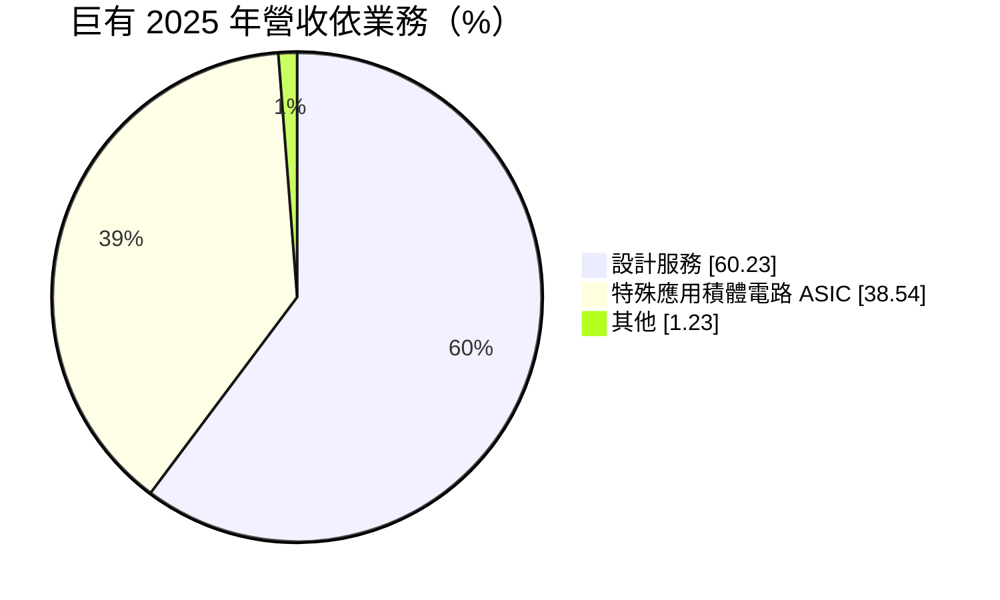
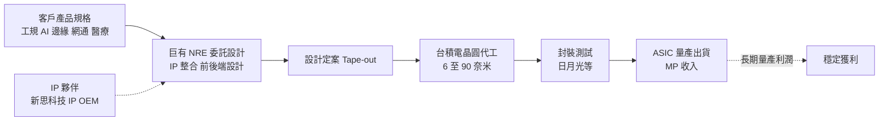
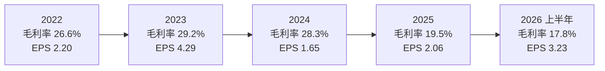
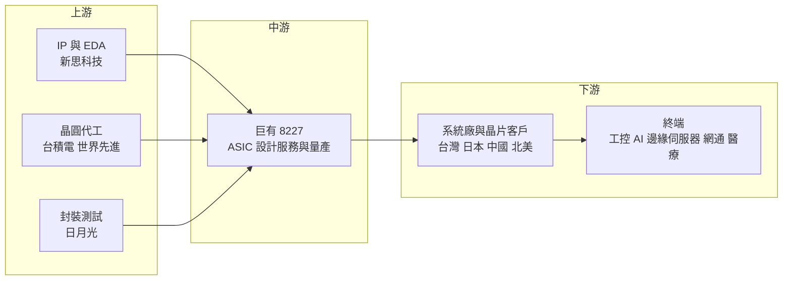

# 8227 巨有科技

> 上櫃｜[[產業索引-半導體業|半導體業]]｜上市（櫃）日期 2022/12/20

# 第一章：企業模式與商業藍圖

> [!info] 撰寫說明
> 本文由 Claude 依公開資料整理，架構比照 [[2330台積電]] 的四章研究，資料截至 2026-10-08。財務數字來源：櫃買中心開放資料（基本資料、綜合損益、資產負債、本益比殖利率）、Goodinfo 台灣股市資訊網年度經營績效、MoneyDJ 理財網（康和證券）公司基本資料、富果研究 2025 年 12 月與 2026 年 3 月巨有法說會整理；產業描述為整理性內容，尚未逐條比對原始文件。#待校對

在評估單一個股的長期投資價值時，首要步驟是拆解企業的底層獲利邏輯。本章針對巨有科技（股票代號：8227，以下簡稱巨有）的商業模式進行定性分析，說明這家自稱台灣第一家 [[ASIC]] 設計服務公司，如何以台積電設計中心聯盟成員的身分，從成熟製程的工業晶片設計，轉向 6 奈米、4 奈米等先進製程的委託設計。

## 一、核心定位：台積電生態系中的中小型設計服務公司

巨有成立於 1991 年，總部位於台北內湖，2022 年 12 月在櫃買中心掛牌，實收資本額約 3.95 億元，董事長兼總經理為賴志賢。依富果研究整理的法說會資料，巨有自稱是台灣第一家 ASIC 設計服務公司，與 [[2330台積電]] 合作超過 30 年，是台積電設計中心聯盟（[[DCA]]）在台灣的三家成員之一。

所謂[[設計服務]]，是替沒有完整晶片設計團隊的客戶，把產品規格變成可以量產的晶片。客戶可能是系統廠、工業設備商、新創公司，或是想開發專用晶片的大型科技公司。設計服務公司提供的服務涵蓋 [[IP]] 授權、前後端電路設計、與晶圓代工廠溝通、安排封裝測試，一路到量產出貨，也就是一站式的 [[Turnkey]] 服務。

巨有的收入分成兩類。第一類是委託設計的工程收入（[[NRE]]），客戶付費請巨有完成晶片設計直到設計定案（[[Tape-out]]）；第二類是量產收入（MP），晶片設計完成後，巨有替客戶向台積電下單、安排封測並出貨，賺取量產的服務利潤。富果法說會整理指出，2025 年 NRE 占比達 60%，首次超越量產收入。

## 二、終端應用／產品板塊

依 MoneyDJ 理財網的 2025 年營收分類，巨有營收結構如下：

* **設計服務（約 60%）：** 即 NRE 委託設計收入。富果法說會整理提到，2025 年設計定案專案超過 100 件，2025 年 12 月法說會則說 2025 年 Tape-out 專案超過 150 件，兩者口徑可能不同，但都高於過去每年約 80 至 90 件的水準。先進製程 NRE 的單案金額從數百萬元提高到數千萬元甚至近億元。
* **ASIC 量產（約 39%）：** 客戶晶片量產後，由巨有負責晶圓與封測採購並出貨。量產收入的毛利率較高、持續期間長，是設計服務公司長期獲利的關鍵。

依應用別，富果 2025 年 12 月法說會整理指出，工規產品約占營收 30%，是主要營收來源；AI 邊緣伺服器相關的 6 奈米專案（如 [[Retimer]]、[[PCIe]] 介面晶片）約占 20% 至 30%；其他利基市場包括網通、醫療與機器人。依製程別，2025 年第四季奈米製程（6 至 90 奈米）營收占 82%，微米製程占 18%；當季新接 NRE 案中約 95% 來自奈米製程。

客戶地區方面，巨有過去以台灣（約六成）與日本（約三成）為主；近年中國營收占比由個位數提高到 20% 至 30%，主要來自非實體清單的客戶，大中華區合計約 70% 至 80%。公司也表示長期重點之一是美國等歐美高階市場，2026 年 3 月法說會提到一家北美大型客戶的 4 奈米 NRE 專案。

## 三、資本轉化邏輯：以 NRE 換取未來的量產

設計服務公司的商業模式可以比喻成「先投資、後回收」。NRE 階段，巨有投入工程師人力、[[EDA]] 工具與 IP 授權費替客戶設計晶片，NRE 毛利率約只有 10% 至 15%（富果 2025 年 12 月法說會整理）。真正的回收在後面的量產階段：晶片一旦量產，客戶通常會在整個產品生命週期都透過原設計服務公司下單，巨有可以持續賺取量產服務利潤。

這也解釋了巨有近年的毛利率變化。2025 年 NRE 占比提高到六成以上，全年毛利率降到 19.5%，低於 2023 年的 29.2%。經營層的說法是，以積極報價取得先進製程設計案，累積技術實績與客戶，等這些專案進入量產後，再回收較高的量產利潤。管理層也認為，先進製程 NRE 投入成本高，客戶完成設計後多半留在原公司量產，轉換為量產訂單的機率高於成熟製程專案。

巨有的資產負債表也反映這種模式。2025 年底[[合約負債]]約 4.66 億元、預付款項約 4.24 億元（富果 2026 年 3 月法說會整理），代表客戶預先支付設計費，巨有也預先向代工廠與封測廠支付款項以確保產能。公司表示，透過長期合作與預付款策略，協助客戶取得晶圓與封測產能。

## 四、企業長期藍圖：先進製程、IP 合作與海外市場

* **往先進製程推進：** 2025 年 2 月完成首顆 6 奈米 ASIC 專案 Tape-out，目前具備 6、5、4 奈米的能力，目標朝 3 奈米發展。公司預期 12 奈米以下的案件在 2026 年會有倍數成長。先進製程案件金額大、技術門檻高，是巨有從「成熟製程小案」升級為「先進製程大案」的核心策略。
* **強化 IP 能力：** 2024 年加入新思科技（[[SNPS新思科技]]）的 IP OEM 計畫，提供較具成本效益的 PCIe、DDR、SerDes 等高速介面 IP。高速介面是 AI 與伺服器晶片的關鍵，掌握這些 IP 讓巨有能承接更複雜的設計案。
* **擴大資本與市場：** 2024 年 9 月完成約 3.3 億元現金增資，用於擴充 EDA 授權、IP 組合與先進製程能力；公司也已獲投審會核准在上海設立服務性子公司，並把歐美高階市場列為長期重點。
* **NRE 轉 MP 的時程：** 公司預計 2026 年下半年可能開始貢獻先進製程量產營收，但時程仍有不確定性。這是判斷巨有策略成敗的最重要指標。

# 第二章：護城河深度與競爭優勢

在長期價值投資中，「護城河」指企業抵禦競爭、維持超額利潤的保護機制。本章分析巨有的護城河構成、主要競爭對手，以及這些優勢在設計服務產業中能守住多少。

## 一、巨有護城河的核心組成要素

巨有的護城河屬於「生態系資格型」，主要來自與台積電和 IP 夥伴的長期關係，以及設計案帶來的客戶轉換成本。

* **1. 台積電 DCA 成員資格：** 台積電設計中心聯盟成員可以較早取得製程設計資料與技術支援，也更容易協助客戶取得台積電產能。台灣只有三家 DCA 成員，這項資格本身就是一道門檻，讓巨有在承接需要台積電製程的設計案時具有可信度。
* **2. 設計案的轉換成本：** 晶片設計完成後，光罩、驗證資料與量產流程都綁定原設計服務公司，客戶若要換公司量產，需要重新驗證並承擔風險。這使得 NRE 一旦完成，量產訂單留在巨有的機率很高。
* **3. 工規與長尾客戶的經驗：** 巨有過去以成熟製程的工業與日本客戶為主，這類客戶產品生命週期長，量產可以持續多年，提供穩定的基本收入。
* **4. IP 合作降低成本：** 透過新思科技 IP OEM 計畫，巨有可以用較低成本提供高速介面 IP，讓中小型客戶也負擔得起先進製程設計。

## 二、全球主要競爭對手格局

| 對手 | 定位 | 對巨有的威脅 |
|---|---|---|
| [[3443創意]] | 台積電轉投資的設計服務龍頭，專攻先進製程與 AI ASIC | 在先進製程大案的技術、規模與台積電關係都領先 |
| [[3661世芯-KY]] | 先進製程 AI 與 HPC ASIC | 在 AI 高算力晶片設計服務領先 |
| [[3035智原]] | 聯電轉投資的設計服務公司 | 在成熟製程與中階 ASIC 直接競爭 |
| [[AVGO博通]]、[[MRVL邁威爾]] | 美系大型 ASIC 設計公司 | 大型雲端客戶的客製化晶片首選 |
| 中國本土設計服務公司 | 服務中國客戶 | 在中國市場以在地化與價格競爭 |

公開法說會資料未點名競爭對手，上表為依產業結構整理。

## 三、優勢轉化：哪些市場守得住、哪些守不住

* **守得住：** 工規、網通、醫療等利基市場的中小型 ASIC 專案。這些客戶需要完整的 Turnkey 服務，又不足以吸引大型設計服務公司重視，巨有的規模與服務彈性剛好適合。
* **較難守住：** AI 高算力核心晶片與大型雲端客戶的先進製程大案。這類案件由創意、世芯與美系大廠主導，對設計團隊規模、先進封裝整合與資金實力要求極高。巨有目前的 AI 相關專案主要是 Retimer、PCIe 等周邊介面晶片，而非高算力核心晶片。
* **觀察重點：** 第一，先進製程 NRE 能否在 2026 年下半年後順利轉為量產，讓量產收入比重回升、毛利率回到 25% 以上。第二，北美客戶 4 奈米專案的進展，代表巨有能否打入歐美高階市場。第三，中國客戶比重提高後，美國出口管制對中國客戶的影響。

# 第三章：財務體質與盈利規模

資料日期：2026-10-08。數字取自櫃買中心開放資料、Goodinfo 年度經營績效與公司法說會整理，表格是撰寫當時的快照；最新月營收、毛利率、累計 EPS 由自動排程寫在本筆記的屬性欄位（月營收、毛利率、累計EPS 等）。#待校對

財務報表是檢驗護城河是否真實存在的最終標準。本章用三率、[[ROE]]、現金流與資本報酬，檢視巨有在 NRE 與量產轉換過程中的獲利品質。

## 一、獲利能力的基石：三率

| 年度 | 營收（億元） | [[毛利率]] | [[營業利益率]] | EPS（元） | [[ROE]] |
|---|---|---|---|---|---|
| 2019 | 3.76 | 33.9% | 5.56% | 0.88 | 10.5% |
| 2020 | 3.76 | 22.5% | -8.96% | -0.80 | -9.5% |
| 2021 | 5.60 | 31.0% | 11.9% | 1.75 | 19.7% |
| 2022 | 9.34 | 26.6% | 12.4% | 2.20 | 14.4% |
| 2023 | 11.0 | 29.2% | 17.5% | 4.29 | 21.4% |
| 2024 | 6.82 | 28.3% | 6.06% | 1.65 | 6.53% |
| 2025 | 13.49 | 19.5% | 7.25% | 2.06 | 7.2% |
| 2026 上半年 | 9.83 | 17.8% | 7.3% | 3.23 | 年化約 21.3%（推算） |

註：2019 至 2024 年取自 Goodinfo 年度經營績效；2025 年營收與毛利率取自富果 2026 年 3 月法說會整理，營業利益率、EPS 與 ROE 取自 Goodinfo；2026 上半年取自櫃買中心綜合損益開放資料（營收 9.83 億元、營業毛利 1.74 億元、營業利益 0.71 億元），三率由本文計算。2026 上半年 ROE 以稅後淨利 1.28 億元乘以 2，除以 2026 年第二季底權益 12.00 億元推算，因含業外收益約 0.74 億元，高估本業報酬。

* **[[毛利率]]反映 NRE 與 MP 的組合：** 2019 至 2024 年毛利率大致在 22% 至 34% 之間，2025 年降到 19.5%，2026 上半年再降到 17.8%。主因是 NRE 比重大幅提高，而 NRE 毛利率只有約 10% 至 15%。這是策略性的毛利率下滑，未來能否回升取決於量產轉換。
* **[[營業利益率]]波動大：** 設計服務公司的主要成本是工程師人力，營收高低直接影響營業利益率。2020 年營收停滯時營業利益率為負 8.96%，2023 年量產旺盛時達 17.5%，2024 年營收下滑約四成，營業利益率又降到 6.06%。
* **業外收益：** 2026 上半年營業外收支約 0.74 億元，與營業利益 0.71 億元相當，是 EPS 大幅提高的重要原因。業外收益來源未查得明細，推估與利息收入及匯兌相關，不宜視為本業獲利。

## 二、[[ROE]]：資本效率

巨有 2021 至 2025 年平均 ROE 約 13.8%（推算），但年度間波動很大，從 6.5% 到 21.4% 不等。2024 年 9 月現金增資約 3.3 億元後，股東權益擴大，2024 與 2025 年 ROE 降到 7% 左右。2026 年第二季底權益約 12.00 億元，每股淨值約 30.34 元，其中資本公積約 5.75 億元。

營收方面，2019 年 3.76 億元成長到 2025 年 13.49 億元，六年年複合成長率約 23.7%（推算），營收規模在六年間成長超過三倍。不過成長主要來自 NRE 案件數量與單案金額的提高，量產收入能否同步成長仍待驗證。

## 三、資本支出與[[自由現金流]]

* **[[CapEx]] 低但研發投入高：** 設計服務公司不需要工廠，非流動資產只有約 1.93 億元。主要投資是 EDA 授權、IP 與工程人力，多數以費用形式認列，而非資本支出。
* **營運資金：** 合約負債（客戶預付款）與預付款項（預付代工廠與封測廠）都在 4 億元以上，營運資金的變動會讓營業現金流在不同年度大幅波動。2025 年底現金及短期金融投資合計約 10 億元（富果 2026 年 3 月法說會整理），財務流動性充足。
* **股利政策：** 依櫃買中心本益比殖利率資料，最近一年度現金股利為每股 1.7 元，以 2025 年 EPS 2.06 元計算，[[配息率]]約 83%（推算）。Goodinfo 顯示歷年平均現金股利約 0.57 元，近年配息金額隨獲利提高。

## 四、[[ROIC]] 與 [[WACC]]：價值創造利差

* **ROIC（推算）：** 以 2025 年營收 13.49 億元乘以營業利益率 7.25%，營業利益約 0.98 億元，乘以（1－20% 稅率）得到稅後營業利益約 0.78 億元。投入資本以 2026 年第二季底權益 12.00 億元加上非流動負債 0.12 億元（有息負債明細未查得，以非流動負債作為上限近似）計算，約 12.12 億元。2025 年 ROIC 約 0.78 ÷ 12.12 ≈ 6.5%（推算）。若以 2026 上半年營業利益 0.71 億元年化，稅後營業利益約 1.14 億元，ROIC 約 9.4%（推算）。由於權益中有大量現金與短期投資，若扣除這些非營運資產，實際營運資本的報酬率會更高。
* **WACC（推算）：** 無風險利率取台灣 10 年期公債約 1.75%，市場風險溢酬取 6%，β 值取 MoneyDJ 理財網頁面顯示的 0.99，股東權益成本約 1.75% + 0.99 × 6% ≈ 7.7%。公司幾乎沒有有息負債，WACC 約 7.6%（推算）。
* **價值創造判斷：** 2025 年 ROIC 約 6.5% 略低於 WACC 約 7.6%，2026 上半年年化 ROIC 約 9.4%，才略高於 WACC。2021 至 2023 年 ROE 在 14% 以上時，ROIC 應高於 WACC（推估）。巨有目前處於「以低毛利 NRE 換取未來量產」的投資期，帳面上的價值創造幅度有限；若先進製程專案順利轉入量產、毛利率回升，ROIC 才有機會明顯高於 WACC。

# 第四章：總體風險與地緣政治

任何企業都無法脫離宏觀環境獨立存在。本章分析巨有未來必須面對的地緣政治、產業週期、營運與技術風險。

## 一、地緣政治風險

* **中國客戶比重提高：** 富果法說會整理指出，巨有中國營收占比已提高到 20% 至 30%，主要來自非實體清單客戶。美國持續擴大對中國的半導體出口管制，若客戶被列入管制名單，或台積電先進製程對中國客戶的限制擴大，巨有的中國業務可能受到衝擊。
* **台積電產能的取得：** 巨有的設計案幾乎都在台積電生產，台積電產能分配、海外設廠與價格政策都會影響巨有的服務能力。
* **台灣集中風險：** 設計團隊、主要代工廠與封測廠都在台灣，面臨與台灣半導體產業相同的兩岸風險。

## 二、產業週期與市場結構風險

* **客戶研發預算的循環：** NRE 收入取決於客戶是否願意投入新晶片開發，景氣低迷時客戶會縮減研發預算，新案數量就會減少。2020 年與 2024 年的營收停滯就反映了這種波動。
* **量產依賴客戶產品成功：** 量產收入取決於客戶的終端產品銷售。若客戶產品失敗，巨有投入的 NRE 就無法轉為量產利潤。
* **大型對手的擠壓：** AI 帶動的先進製程 ASIC 需求，主要被創意、世芯與美系大廠拿走，巨有規模較小，在搶奪大型案件時處於劣勢。

## 三、營運環境的隱性風險

* **低毛利 NRE 的風險：** 公司以積極報價爭取先進製程 NRE，若量產轉換率不如預期，就等於長期承接低毛利工作，侵蝕獲利能力。
* **人才競爭：** 先進製程設計需要大量資深工程師，台灣 IC 設計業的人才競爭激烈，人力成本上升會壓縮營業利益率。
* **預付款與營運資金：** 巨有替客戶預付代工與封測款項，若客戶取消訂單或延遲付款，可能形成呆帳或存貨風險。
* **業外收益的波動：** 2026 上半年業外收益與營業利益相當，若利率或匯率改變，EPS 可能明顯波動。

## 四、科技演進風險

先進製程設計的技術門檻持續提高，從 6 奈米、4 奈米走向 3 奈米與更先進的節點，同時還需要整合 [[先進封裝]]、[[Chiplet]] 與高速介面。每一代製程的 EDA 授權、IP 與光罩成本都大幅上升，設計服務公司必須持續投資才能跟上。巨有加入新思科技 IP OEM 計畫、完成 6 奈米 Tape-out，是追趕技術的重要步驟，但與創意、世芯相比，在先進封裝整合與 AI 高算力晶片的經驗仍有差距。另一方面，若 AI 邊緣運算、工業自動化與機器人帶動大量中小型客製化晶片需求，這正是巨有擅長的市場，技術演進也可能為它帶來新的成長機會。

# 專有名詞解析

## 半導體

- **[[ASIC]]**：特殊應用積體電路，為特定用途量身設計的晶片，效能與功耗比通用晶片更好。
- **[[設計服務]]**：替客戶把產品規格變成可量產晶片的服務，涵蓋 IP、電路設計、代工與封測安排。
- **[[NRE]]**：一次性工程費用，客戶支付給設計服務公司的晶片設計與開發費用，不含量產。
- **[[Tape-out]]**：設計定案，晶片設計完成並把資料交給晶圓廠製作光罩，是量產前的重要里程碑。
- **[[Turnkey]]**：一站式全程服務，從晶片設計、晶圓代工到封裝測試由同一家公司負責。
- **[[DCA]]**：台積電設計中心聯盟，台積電認證的設計服務合作夥伴，可協助客戶使用台積電製程。
- **[[IP]]**：矽智財，可重複授權使用的晶片電路設計模組，例如高速介面或處理器核心。
- **[[Retimer]]**：訊號重整晶片，在高速傳輸過程中恢復訊號品質，常用於 AI 伺服器的 PCIe 連線。
- **[[PCIe]]**：高速周邊元件互連標準，連接處理器與顯示卡、固態硬碟等裝置的高速介面。
- **[[先進封裝]]**：把多顆晶片以高密度方式整合在一起的封裝技術，例如 CoWoS、SoIC。
- **[[Chiplet]]**：小晶片，把大型晶片拆成多顆功能晶片再以先進封裝整合，可提升良率與設計彈性。
- **[[EDA]]**：電子設計自動化軟體，晶片設計師用來設計、模擬與驗證電路的工具。

## 金融

- **[[配息率]]**：現金股利占每股盈餘的比例，反映公司把多少獲利回饋給股東。
- **[[合約負債]]**：客戶預先支付但公司尚未完成服務的款項，設計服務公司常見，代表在手訂單的一部分。

# 核心供應鏈

## 1. 上游：IP、晶圓代工與封測
- IP 與 EDA：[[SNPS新思科技]]（IP OEM 計畫）
- 晶圓代工：[[2330台積電]]（DCA 成員）、[[5347世界先進]]
- 封裝測試：[[3711日月光投控]]

## 2. 中游：巨有本身
- ASIC 委託設計（NRE）與量產服務（MP），製程涵蓋 4 奈米到微米級

## 3. 下游：客戶與終端
- 台灣、日本、中國與北美的系統廠與晶片客戶（客戶名稱未公開）
- 應用：工業控制、AI 邊緣伺服器周邊晶片、網通、醫療、機器人

## 4. 同業與競爭者
- 設計服務：[[3443創意]]、[[3661世芯-KY]]、[[3035智原]]
- 美系 ASIC：[[AVGO博通]]、[[MRVL邁威爾]]

延伸閱讀：[[台積電供應鏈]]

## 最新新聞
<!-- news:start -->
<!-- news:end -->

## 相關連結
- [公開資訊觀測站](https://mopsov.twse.com.tw/mops/web/t05st03?step=1&firstin=1&co_id=8227)
- [Goodinfo](https://goodinfo.tw/tw/StockDetail.asp?STOCK_ID=8227)
- [Yahoo 股市](https://tw.stock.yahoo.com/quote/8227)
- [鉅亨網新聞](https://www.cnyes.com/twstock/8227/news)
