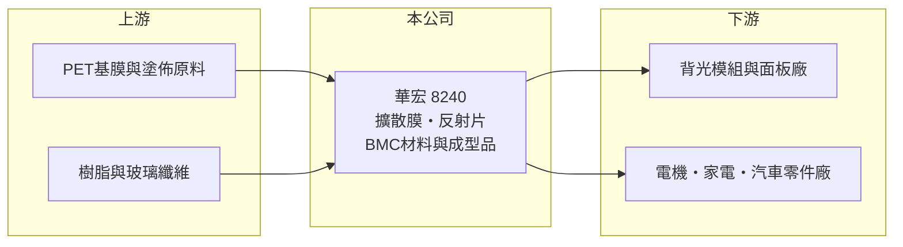

# 8240 華宏

> 上櫃｜[[產業索引-光電業|光電業]]｜上市（櫃）日期 2005/06/23

# 第一章：企業模式與商業藍圖

> [!info] 撰寫說明
> 精簡版，由 Claude 依公開資料整理，架構比照 [[2330台積電]]，資料截至 2026-10-07。來源：nstock.tw 華宏公司概況、winvest.tw 營收快訊。公開資料有限，產品別營收比重、客戶與營運據點未查到。#待校對

華宏是成立超過五十年的材料公司，產品橫跨液晶顯示材料與 BMC 材料及成型品。

- **核心業務：** 華宏成立於 1973 年，2005 年上櫃，主要製造與買賣 LCD 材料（[[擴散膜]]、反射片等[[光學膜]]），以及[[BMC材料]]與其成型品。
- **營收結構：** 本次未查到兩大產品線的比重；2025 年全年營收 71.36 億元，以其毛利率偏低來看，可能含有較多貿易或代工性質的營收（推估）。
- **營運據點：** 生產與營運據點本次未查到，本文不推測。
- **長期方向：** 在顯示材料需求放緩下，BMC 材料在電機、汽車與家電零件的應用可能是分散風險的方向（推估）。

# 第二章：護城河深度與競爭優勢

華宏的競爭力在於長期經營的材料配方與兩條產品線的分散效果。

- **競爭優勢：** 擴散膜與反射片供應背光模組，BMC 材料則用於電機與電器零件，兩條產品線景氣循環不完全相同（推估）。
- **主要對手：** 背光光學膜有日、韓與中國膜材廠，BMC 材料則有國內外複合材料廠，具體對手本次未查到。
- **觀察重點：** 營收年減能否止住、[[毛利率]]能否回升，以及業外收益對獲利的貢獻是否穩定。

# 第三章：財務體質與盈利規模

資料日期：2026-10-07，以下數字是撰寫當時的快照；最新月營收、毛利率、累計 EPS 由自動排程寫在本筆記的屬性欄位（月營收、毛利率、累計EPS 等）。#待校對

華宏 2026 年營收年減約一成，本業獲利率偏低，獲利部分仰賴業外。

- **營收規模：** 2026 年 6 月營收 5.23 億元、年減 7.7%；8 月 5.28 億元、年減 12.59%；1 至 8 月累計 43.51 億元，年減 10.18%。2025 年全年營收 71.36 億元。
- **獲利：** 2025 年全年 EPS 2.18 元；2026 年第二季 EPS 0.78 元，[[毛利率]] 13.61%，[[營業利益率]] 1.34%，淨利率 4.68%，淨利率高於營益率代表業外收益占比不低。
- **財務特色：** 資本額約 10 億元、市值約 52 億元；2025 年現金股利 1.3 元，殖利率約 2.44%。

# 第四章：總體風險與地緣政治

華宏的風險在於顯示材料需求放緩與本業獲利偏薄。

- **產業週期：** 光學膜需求隨面板與背光模組出貨起伏，BMC 材料則受家電、電機與汽車景氣影響。
- **營運風險：** 營益率僅約 1%，營收若持續衰退，本業可能轉虧；獲利依賴業外收益也增加不確定性。
- **其他風險：** 塑膠與化工原料價格、匯率波動，以及中國膜材廠的價格競爭。

# 專有名詞解析

## 金融

- **[[營業利益率]]**：營業利益占營收的比率，反映扣除營業費用後本業的獲利能力。

## 產業

- **[[光學膜]]**：貼附在面板或光學元件上，用來增亮、擴散、反射或保護的功能性薄膜。
- **[[擴散膜]]**：背光模組中把光線均勻散開的薄膜，讓面板亮度分布平均。
- **[[BMC材料]]**：團狀模壓複合材料（Bulk Molding Compound），由樹脂、玻璃纖維與填料混合，耐熱絕緣，用於電機、電器與車燈零件。

# 核心供應鏈

- 上游：PET基膜與塗佈原料、樹脂與玻璃纖維供應商（推估）
- 下游／客戶：背光模組與面板廠、電機、家電與汽車零件廠（推估）
- 同業：國內外光學膜材廠與複合材料廠，名稱未查到

## 最新新聞
<!-- news:start（自動產生，請勿手動編輯此範圍） -->
- 2026-10-06 🏛️ 重訊 17:52｜更正本公司115年09月營收公告數｜[觀測站](https://mops.twse.com.tw/mops/#/web/t05st01)

完整紀錄：[[8240華宏 新聞]]
<!-- news:end -->

## 相關連結
- [公開資訊觀測站](https://mopsov.twse.com.tw/mops/web/t05st03?step=1&firstin=1&co_id=8240)
- [Goodinfo](https://goodinfo.tw/tw/StockDetail.asp?STOCK_ID=8240)
- [Yahoo 股市](https://tw.stock.yahoo.com/quote/8240)
- [鉅亨網新聞](https://www.cnyes.com/twstock/8240/news)
