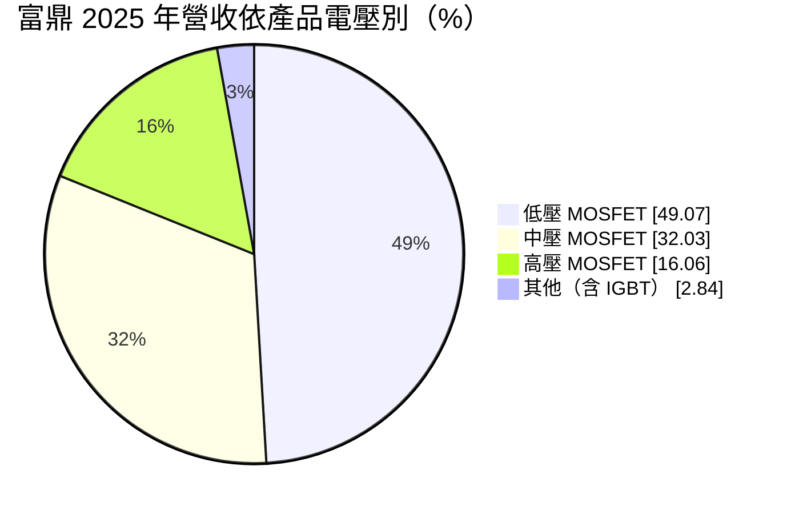
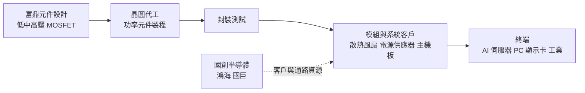
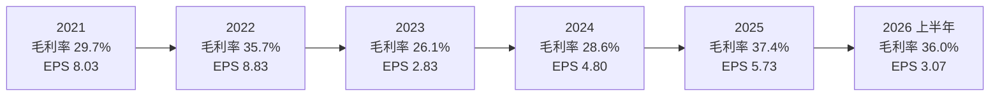
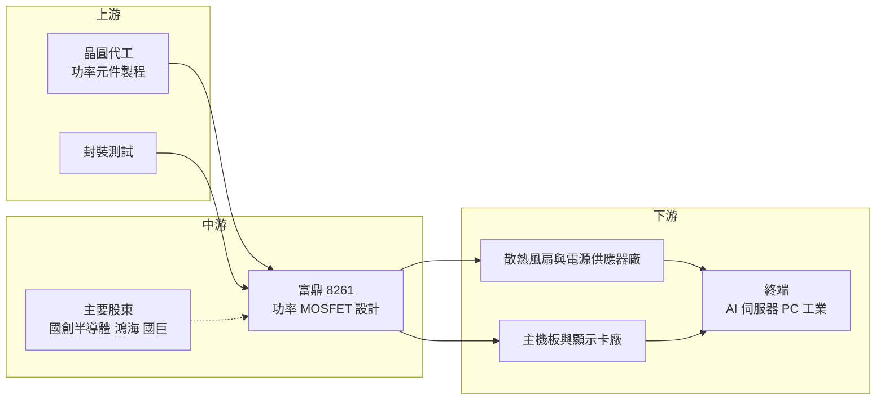

# 8261 富鼎

> 上市｜[[產業索引-半導體業|半導體業]]｜上市（櫃）日期 2009/12/11

# 第一章：企業模式與商業藍圖

> [!info] 撰寫說明
> 本文由 Claude 依公開資料整理，架構比照 [[2330台積電]] 的四章研究，資料截至 2026-10-08。財務數字來源：證交所開放資料（基本資料、綜合損益、資產負債、營益分析、股利、本益比殖利率）、Goodinfo 台灣股市資訊網年度經營績效、MoneyDJ 理財網（康和證券）公司基本資料、富果研究 2025 年 10 月富鼎法說會整理、Taipei Times 2022 年 5 月報導、理財周刊 2026 年 7 月報導；產業描述為整理性內容，尚未逐條比對原始文件。#待校對

在評估單一個股的長期投資價值時，首要步驟是拆解企業的底層獲利邏輯。本章針對富鼎先進電子（股票代號：8261，以下簡稱富鼎）的商業模式進行定性分析，說明這家專注功率 [[MOSFET]] 的 IC 設計公司，如何從主機板與[[電源供應器]]起家，在加入鴻海與國巨合資的國創半導體體系後，轉向 AI 伺服器散熱與電源等高成長應用。

## 一、核心定位：營收高度集中於功率 MOSFET 的設計公司

富鼎成立於 1998 年，總部位於新竹縣竹北市，2009 年在證交所上市，實收資本額約 11.89 億元。依證交所基本資料，現任董事長為 [[2327國巨]] 董事長陳泰銘；MoneyDJ 資料顯示總經理為張嘉帥。

富鼎的產品是功率 MOSFET，這是一種用來控制電流開關的半導體元件。幾乎所有需要電源轉換的電子產品，例如電腦主機板、顯示卡、電源供應器、伺服器、[[散熱風扇]]、電動工具，都需要用 MOSFET 來調節電壓與電流。功率 MOSFET 的技術重點在於降低導通時的電阻與開關時的損耗，讓電源轉換更有效率、發熱更少。

富鼎屬於 [[Fabless]] 模式，自己負責元件設計，晶圓製造與封裝委外。理財周刊 2026 年 7 月報導形容富鼎是 MOSFET「純度最高」的公司，也就是營收幾乎全部來自 MOSFET，這讓它成為觀察台灣功率半導體景氣的代表性公司之一。

2022 年 5 月是富鼎股權結構的轉折點。依 Taipei Times 報導，[[2317鴻海]] 與國巨合資的國創半導體（XSemi，鴻海持股 51%、國巨 49%）以每股 82.58 元取得富鼎 3,500 萬股，約占 30% 股權，總金額約 28.9 億元。國創半導體的目標是擴大類比與功率半導體的產品線，富鼎的 MOSFET 可以和國創的電源管理 IC 與碳化矽（[[SiC]]）元件互補，並借助鴻海與國巨的客戶資源，拓展電動車、數位醫療與機器人等應用。

## 二、終端應用／產品板塊

依 MoneyDJ 理財網的 2025 年營收分類，富鼎依電壓別的營收結構如下：

* **低壓 MOSFET（約 49%）：** 主要用於電腦主機板、顯示卡與筆電的電源轉換，是富鼎的傳統主力。富果法說會整理提到，低壓產品在電腦運算應用中因中國電競 PC 需求疲弱而下滑。
* **中壓 MOSFET（約 32%）：** 用於散熱風扇馬達驅動、電源供應器與工業設備。中壓產品是近年成長最快的部分，與 AI 伺服器散熱需求高度相關。
* **高壓 MOSFET（約 16%）：** 用於電源供應器的初級側等高電壓應用。富果法說會整理指出，高壓產品因歐美 [[IDM]] 大廠的強力競爭而比重下滑。
* **其他（約 3%）：** 主要是 [[IGBT]]，用於相機閃光燈等利基市場。

依應用別，富果整理的 2025 年第三季法說會資料顯示：風扇散熱（DC FAN）占 36%，由 2023 年的 5% 大幅攀升，是近期最主要的成長動能，第三季營收約 3.1 億元、年增約 287%；電源供應器（SPS）占 35%；電腦運算（Computing）占 18%；其餘為其他應用。[[AI伺服器]]的功耗遠高於傳統伺服器，需要更多、更強的散熱風扇，每顆風扇馬達都需要 MOSFET 驅動，這是富鼎應用結構快速轉變的背景。

## 三、資本轉化邏輯：輕資產設計、毛利率由產品組合決定

富鼎的獲利邏輯有三個重點。第一，作為設計公司，它的資本支出很低，主要成本是晶圓代工與封裝費用。2026 年第二季底非流動資產只有約 12.77 億元，占總資產不到兩成，屬於典型的輕資產模式。

第二，毛利率主要由產品組合決定。功率 MOSFET 中，標準型低壓產品競爭激烈、價格透明；用在 AI 伺服器散熱與高階電源的中高壓產品，規格要求高、驗證期長，毛利率較好。Goodinfo 數據顯示，2023 年毛利率 26.1%，2025 年提高到 37.4%，主要就是風扇散熱等高毛利產品比重大幅提高的結果。

第三，景氣循環會透過庫存與價格放大獲利波動。2021 至 2022 年全球晶片缺貨時，MOSFET 報價上漲，富鼎 EPS 達 8.03 元與 8.83 元；2023 年庫存調整時 EPS 降到 2.83 元。功率元件屬於需求廣泛但同質性高的產品，價格對供需變化很敏感。

## 四、企業長期藍圖：AI 伺服器、電源與第三類半導體

* **擴大 AI 伺服器應用：** 理財周刊 2026 年 7 月報導指出，富鼎積極切入 AI 伺服器中高壓 MOSFET、電源供應器與散熱風扇電源應用。AI 伺服器對電源效率與散熱的要求不斷提高，是富鼎從 PC 周邊轉向高成長市場的主軸。
* **奪回電源供應器市占：** 富果法說會整理提到，2026 年主要動能為電源供應器，公司已備妥新產品，目標重新奪回市占；次要動能是台灣與中國 PC 與周邊市場的新產品。
* **高壓新品與 SiC MOSFET：** 理財周刊提到，高壓新品與 SiC MOSFET 是富鼎未來的成長方向。SiC 元件耐高壓、耐高溫，適合電動車、充電樁與伺服器電源，與國創半導體的 SiC 布局可以互補。
* **集團資源整合：** 國創半導體是富鼎的主要股東之一，理財周刊指出這有助於晶圓、封裝、通路與集團客戶資源的整合。鴻海是全球最大的伺服器組裝廠之一，國巨則擁有完整的被動元件通路，兩者都可以成為富鼎拓展客戶的管道。

# 第二章：護城河深度與競爭優勢

在長期價值投資中，「護城河」指企業抵禦競爭、維持超額利潤的保護機制。本章分析富鼎的護城河構成、全球主要競爭對手，以及這些優勢在功率半導體價格競爭中能守住多少。

## 一、富鼎護城河的核心組成要素

富鼎的護城河屬於「窄而正在加寬」的類型。傳統 PC 用低壓 MOSFET 的門檻不高，但近年切入的 AI 散熱與伺服器電源，以及集團資源，正在提高它的競爭地位。

* **1. 應用導向的產品開發：** 富鼎的強項是針對特定應用快速推出合適規格的 MOSFET。風扇散熱應用從 2023 年占 5% 提高到 2025 年第三季的 36%，顯示公司能抓住 AI 伺服器散熱的新需求，並在客戶的新產品設計階段就被採用。
* **2. 設計導入帶來的黏著度：** MOSFET 一旦被設計進客戶的電源或散熱模組並通過驗證，在該產品生命週期內很少更換。伺服器相關產品驗證嚴格、生命週期較長，這種黏著度比消費性產品更強。
* **3. 集團資源：** 國創半導體背後的鴻海與國巨，提供了客戶、通路與供應鏈整合的資源。對一家中型 MOSFET 設計公司而言，大型集團的背書可以提升在大客戶中的能見度。
* **4. 輕資產與財務穩健：** 富鼎幾乎沒有有息負債，2026 年第二季底流動資產約 58.10 億元，遠大於負債總計約 13.80 億元。在景氣低谷時，財務穩健的公司比較能承受價格戰。

## 二、全球主要競爭對手格局

| 對手 | 定位 | 對富鼎的威脅 |
|---|---|---|
| 英飛凌（Infineon）、安森美（onsemi） | 歐美功率半導體 IDM 大廠 | 高壓與車用市場的領導者，與客戶簽訂長期合約 |
| [[6435大中]] | 台灣 MOSFET 設計公司 | 在 PC、電源與伺服器 MOSFET 直接競爭 |
| [[3317尼克森]] | 台灣 MOSFET 設計公司 | 在中低壓 MOSFET 市場競爭 |
| [[5299杰力]] | 台灣低壓 MOSFET 設計公司 | 在主機板與筆電低壓產品競爭 |
| [[2481強茂]]、[[5425台半]] | 台灣功率分離式元件 IDM | 在功率元件全面競爭，擁有自有產能 |
| 中國 MOSFET 廠商 | 在地化與價格競爭 | 壓低中低壓 MOSFET 價格 |

理財周刊 2026 年 7 月報導將大中、強茂、尼克森、台半、杰力列為與富鼎同類的 MOSFET 相關公司。

## 三、優勢轉化：哪些市場守得住、哪些守不住

* **守得住：** AI 伺服器散熱風扇與伺服器電源用的中壓 MOSFET。這些產品規格要求高、驗證期長，富鼎已在 2024 至 2025 年取得明顯的市場地位，客戶不會輕易更換。
* **較難守住：** 高壓 MOSFET 與一般 PC 用低壓 MOSFET。富果法說會整理指出，高壓產品面臨歐美 IDM 大廠的強力競爭，部分客戶與國際大廠簽訂長期供貨協議（[[LTA]]），影響對富鼎的拉貨；IDM 大廠資源轉向車用與工業後，中低壓 MOSFET 市場在 2025 年價格競爭激烈。
* **觀察重點：** 第一，風扇散熱應用的高成長能否延續，或在 AI 伺服器出貨放緩時回落。第二，電源供應器的新產品能否如公司目標奪回市占。第三，SiC MOSFET 等新產品能否在 2027 年後形成實際營收。第四，國創半導體的集團資源能否轉化為具體的新客戶訂單。

# 第三章：財務體質與盈利規模

資料日期：2026-10-08。數字取自證交所開放資料、Goodinfo 年度經營績效與公司法說會整理，表格是撰寫當時的快照；最新月營收、毛利率、累計 EPS 由自動排程寫在本筆記的屬性欄位（月營收、毛利率、累計EPS 等）。#待校對

財務報表是檢驗護城河是否真實存在的最終標準。本章用三率、[[ROE]]、現金流與資本報酬，檢視富鼎在功率半導體景氣循環中的獲利品質。

## 一、獲利能力的基石：三率

| 年度 | 營收（億元） | [[毛利率]] | [[營業利益率]] | EPS（元） | [[ROE]] |
|---|---|---|---|---|---|
| 2019 | 22.2 | 15.4% | 3.11% | 0.68 | 2.92% |
| 2020 | 31.3 | 16.4% | 7.68% | 2.44 | 13.0% |
| 2021 | 42.0 | 29.7% | 19.7% | 8.03 | 34.2% |
| 2022 | 39.1 | 35.7% | 23.0% | 8.83 | 23.3% |
| 2023 | 28.5 | 26.1% | 10.8% | 2.83 | 6.11% |
| 2024 | 29.2 | 28.6% | 16.2% | 4.80 | 10.4% |
| 2025 | 31.0 | 37.4% | 25.3% | 5.73 | 11.8% |
| 2026 上半年 | 16.58 | 36.04% | 23.89% | 3.07 | 年化約 12.8%（推算） |

註：2019 至 2025 年取自 Goodinfo 年度經營績效；2026 上半年取自證交所營益分析與綜合損益開放資料，ROE 以歸屬母公司淨利 3.65 億元乘以 2，除以 2026 年第二季底歸屬母公司權益 57.06 億元推算。

* **[[毛利率]]結構性提升：** 2019 至 2020 年毛利率只有 15% 至 16%，2021 至 2022 年缺貨潮推升到 30% 以上，2023 年回落到 26.1%。值得注意的是，2025 年在沒有全面缺貨的情況下，毛利率反而達到 37.4% 的新高，2026 上半年維持在 36%。這代表毛利率的提升主要來自產品組合轉向風扇散熱等高毛利應用，而不只是景氣因素。
* **[[營業利益率]]與營運槓桿：** 富鼎 2026 上半年營業費用約 2.02 億元，占營收約 12%。毛利率從 26% 提高到 37% 時，營業利益率從 10.8% 擴大到 25.3%，增幅遠大於毛利率，展現設計公司的[[營運槓桿]]。
* **營收成長溫和：** 2019 年 22.2 億元到 2025 年 31.0 億元，六年年複合成長率約 5.7%（推算）。營收仍未回到 2021 年 42.0 億元的高峰，但獲利品質已明顯改善。

## 二、[[ROE]]：資本效率

富鼎 2021 至 2025 年平均 ROE 約 17.2%（推算），其中 2021 年缺貨潮時高達 34.2%。2022 年後 ROE 下滑，除了景氣回落，另一個重要原因是國創半導體入股後股東權益大幅增加：2026 年第二季底歸屬母公司權益約 57.06 億元，其中資本公積約 30.15 億元，占權益一半以上，推估與 2022 年國創半導體以每股 82.58 元取得股權有關。權益擴大後，即使 2025 年獲利接近 2022 年水準，ROE 也只有 11.8%。

## 三、資本支出與[[自由現金流]]

* **[[CapEx]] 低：** 作為 Fabless 公司，富鼎的資本支出主要是研發設備與辦公空間，具體金額未查得。非流動負債只有約 268 萬元，幾乎沒有長期借款。
* **現金充裕：** 2026 年第二季底流動資產約 58.10 億元，占總資產超過八成，推估多數為現金、應收帳款與存貨。在輕資產模式下，富鼎在獲利年度應能產生正的自由現金流（推估，未查得歷年現金流量表）。
* **股利政策：** 依證交所股利資料，2025 年度每股現金股利 5.0 元，以 EPS 5.73 元計算，[[配息率]]約 87%（推算），現金股利總額約 5.94 億元。公司章程規定現金股利不得低於股利總額的 10%，實際上近年以高比例現金股利回饋股東。

## 四、[[ROIC]] 與 [[WACC]]：價值創造利差

* **ROIC（推算）：** 以 2025 年營收 31.0 億元乘以營業利益率 25.3%，營業利益約 7.84 億元，乘以（1－20% 稅率）得到稅後營業利益約 6.27 億元。富鼎幾乎沒有有息負債，投入資本以 2026 年第二季底權益總計約 57.07 億元加上非流動負債約 0.03 億元計算，約 57.10 億元。2025 年 ROIC 約 6.27 ÷ 57.10 ≈ 11.0%（推算）。以 2026 上半年營業利益 3.96 億元年化，稅後營業利益約 6.34 億元，ROIC 約 11.1%（推算）。由於權益中有大量現金，若只計算實際投入營運的資本，報酬率會更高。
* **WACC（推算）：** 無風險利率取台灣 10 年期公債約 1.75%，市場風險溢酬取 6%，β 值取 MoneyDJ 理財網頁面顯示的 1.09，股東權益成本約 1.75% + 1.09 × 6% ≈ 8.3%。公司幾乎沒有有息負債，WACC 約等於股東權益成本，約 8.3%（推算）。
* **價值創造判斷：** 2025 年與 2026 上半年 ROIC 都在 11% 左右，高於 WACC 約 8.3%，利差約 2.7 個百分點；2021 至 2022 年缺貨潮時利差更大，2019 年與 2023 年則可能低於 WACC（推估）。富鼎近年已進入穩定創造價值的狀態，而且毛利率的提升來自產品組合而非一次性的缺貨，品質較好。不過大量現金與國創入股帶來的權益擴張，稀釋了帳面報酬率；若能把資金用於有效的新產品或併購，或維持高配息，才能讓股東實際享有這份價值。

# 第四章：總體風險與地緣政治

任何企業都無法脫離宏觀環境獨立存在。本章分析富鼎未來必須面對的地緣政治、產業週期、營運與技術風險。

## 一、地緣政治風險

* **中國市場與在地化競爭：** 富鼎的電腦運算與部分電源客戶在中國，富果法說會整理提到中國電競 PC 需求疲弱影響低壓產品。中國政策鼓勵功率半導體國產化，中國 MOSFET 廠商在政策支持下擴產，可能長期壓低中低壓產品價格，並取代富鼎在中國客戶的份額。
* **美國關稅與供應鏈移轉：** AI 伺服器與電源供應鏈正從中國移往台灣、東南亞與墨西哥，富鼎需要跟隨客戶調整供貨與技術支援據點。鴻海的全球布局可能是富鼎的助力。
* **台灣生產集中：** 富鼎的晶圓代工與封裝夥伴多在台灣，面臨與其他台灣半導體公司相同的兩岸風險。

## 二、產業週期與市場結構風險

* **功率半導體景氣循環：** MOSFET 需求廣泛、產品同質性高，價格對供需非常敏感。2021 至 2022 年缺貨時 EPS 超過 8 元，2023 年庫存調整時降到 2.83 元，富鼎的獲利波動與產業循環高度相關。
* **IDM 大廠的策略變化：** 歐美 IDM 大廠的產能配置會影響市場供需。富果法說會整理指出，IDM 大廠把資源轉向車用與工業後，中低壓市場價格競爭激烈；IDM 與客戶簽訂的長期合約，也會排擠富鼎在高壓市場的機會。
* **AI 伺服器需求的集中風險：** 風扇散熱應用快速成長，代表富鼎的成長越來越依賴 AI 伺服器的資本支出。若雲端業者放緩 AI 投資，或散熱方式轉向液冷而減少風扇用量，這部分成長可能回落。

## 三、營運環境的隱性風險

* **晶圓代工產能：** 理財周刊指出富鼎仍受晶圓代工與封裝產能制約。功率元件多使用 8 吋成熟製程，若代工廠產能緊縮或漲價，富鼎的成本與交期都會受影響。
* **客戶集中：** 風扇散熱與電源供應器合計占應用比重超過七成，若主要散熱模組或電源廠商轉單，營收可能明顯波動。客戶名稱未公開，難以評估集中程度。
* **股權結構與關係人交易：** 國創半導體持有約三成股權，董事長由國巨董事長兼任。集團資源整合有利於業務，但投資人也應留意集團內交易的條件與揭露。

## 四、科技演進風險

功率半導體的材料正在演進，碳化矽（[[SiC]]）與氮化鎵（[[GaN]]）等第三類半導體，在高壓、高頻與高效率應用上逐步取代傳統矽基 MOSFET，特別是電動車、充電樁、資料中心電源與快充。富鼎目前以矽基 MOSFET 為主，SiC MOSFET 仍屬未來布局。若高壓電源快速轉向 SiC 與 GaN，富鼎的高壓產品可能面臨被替代的壓力；反之，若能借助國創半導體的 SiC 技術與鴻海的電動車布局，富鼎有機會從矽基 MOSFET 設計公司升級為完整的功率半導體解決方案供應商。另外，AI 伺服器電源架構正往更高電壓（如 48V 甚至 800V 直流供電）發展，對中高壓 MOSFET 的規格要求提高，這既是挑戰，也是富鼎延續成長的機會。

# 專有名詞解析

## 半導體

- **[[MOSFET]]**：金氧半場效電晶體，用電壓控制電流開關的元件，功率 MOSFET 廣泛用於電源轉換與馬達驅動。
- **[[IGBT]]**：絕緣閘雙極電晶體，結合 MOSFET 與雙極電晶體優點的功率元件，適合高電壓大電流應用。
- **[[SiC]]**：碳化矽，耐高壓、耐高溫的第三類半導體材料，用於電動車、充電樁與高效率電源。
- **[[GaN]]**：氮化鎵，耐高電壓與高頻的化合物半導體，用於快充、資料中心電源與射頻元件。
- **[[Fabless]]**：只做晶片設計、不擁有晶圓廠的 IC 設計公司，製造委外給晶圓代工廠。
- **[[IDM]]**：整合元件製造廠，從晶片設計、製造到封測都自己完成的半導體公司。

## 應用

- **[[AI伺服器]]**：搭載 GPU 等 AI 加速器的伺服器，功耗與散熱需求遠高於傳統伺服器。

## 金融

- **[[LTA]]**：長期供貨協議，買賣雙方約定未來數年的供貨數量與價格，可確保產能但降低採購彈性。
- **[[營運槓桿]]**：固定成本占比高的公司，營收小幅變動會造成營業利益大幅變動的現象。
- **[[配息率]]**：現金股利占每股盈餘的比例，反映公司把多少獲利回饋給股東。
- **[[自由現金流]]**：營業活動現金流減去資本支出，代表企業可自由用於配息、還債或併購的現金。

## 產業

- **[[電源供應器]]**：把市電轉換成電子設備所需直流電的裝置，伺服器電源的效率與功率密度要求很高。
- **[[散熱風扇]]**：為伺服器與電腦散熱的風扇，AI 伺服器功耗高，需要更多、更強的風扇與驅動元件。

# 核心供應鏈

## 1. 上游：晶圓代工與封測
- 功率元件晶圓代工與封裝測試（富鼎實際代工與封測夥伴未查得）

## 2. 中游：富鼎本身與股東
- 低、中、高壓功率 MOSFET 與 IGBT 設計：富鼎
- 主要股東：國創半導體（[[2317鴻海]] 51%、[[2327國巨]] 49% 合資），2022 年取得約 30% 股權

## 3. 下游：客戶與終端
- 散熱風扇、電源供應器、主機板與顯示卡廠商（客戶名稱未公開）
- 終端應用：AI 伺服器、PC 與電競、工業設備

## 4. 同業與競爭者
- 台灣 MOSFET 與功率元件：[[6435大中]]、[[3317尼克森]]、[[5299杰力]]、[[2481強茂]]、[[5425台半]]
- 國際 IDM：英飛凌（Infineon）、安森美（onsemi）

## 最新新聞
<!-- news:start -->
<!-- news:end -->

## 相關連結
- [公開資訊觀測站](https://mopsov.twse.com.tw/mops/web/t05st03?step=1&firstin=1&co_id=8261)
- [Goodinfo](https://goodinfo.tw/tw/StockDetail.asp?STOCK_ID=8261)
- [Yahoo 股市](https://tw.stock.yahoo.com/quote/8261)
- [鉅亨網新聞](https://www.cnyes.com/twstock/8261/news)
