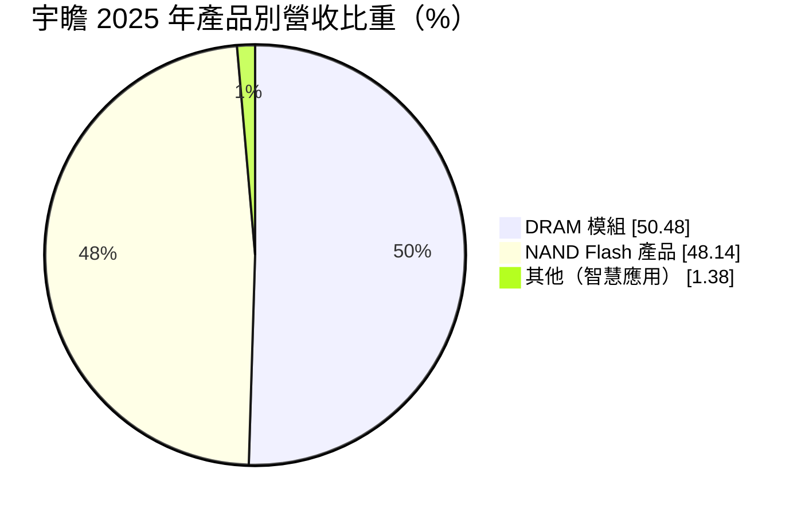
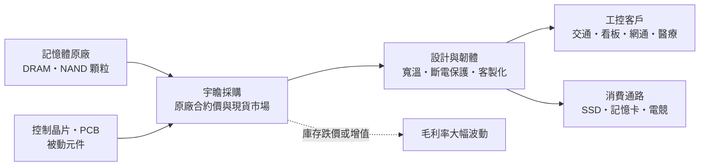
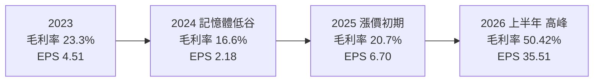
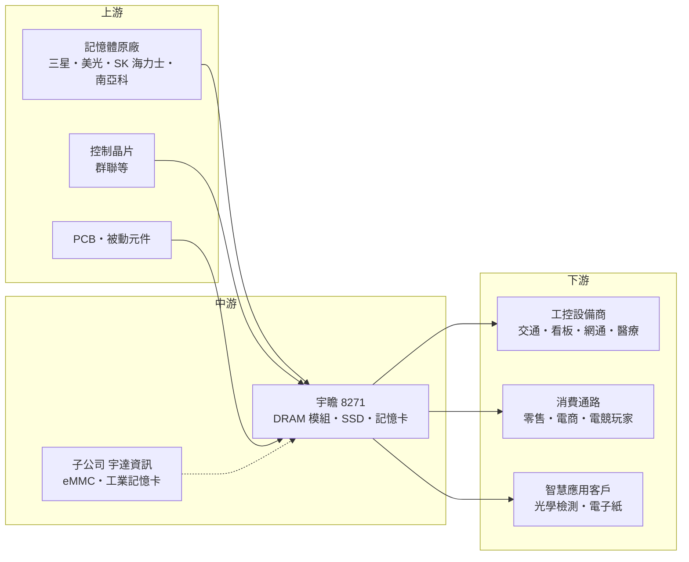

# 8271 宇瞻

> 上市｜[[產業索引-半導體業|半導體業]]｜上市（櫃）日期 2010/12/29

# 第一章：企業模式與商業藍圖

> [!info] 撰寫說明
> 本文由 Claude 依公開資料整理，架構比照 [[2330台積電]] 的四章研究，資料截至 2026-10-08。財務數字來源：Goodinfo 年度經營績效頁、富果研究 2026 年 2 月與 8 月法說會整理、證交所開放資料（2026 年第二季綜合損益、資產負債與股利）；產業描述為整理性內容，尚未逐條比對原始文件。#待校對

在評估單一個股的長期投資價值時，首要步驟是拆解企業的底層獲利邏輯。本章針對宇瞻科技（股票代號：8271，以下簡稱宇瞻）的商業模式進行定性分析，說明一家不生產記憶體晶片的模組廠，如何透過工業控制市場建立比一般模組廠更穩定的獲利基礎，以及為什麼它的獲利仍然深受記憶體價格循環左右。

## 一、核心定位：以工控為主的記憶體模組與儲存方案商

宇瞻成立於 1997 年，2010 年在證交所上市，英文名稱 Apacer。依富果研究整理的法說會內容，宇瞻與記憶體原廠的合作已有約 28 年，並把宏碁與聯華列為長期策略夥伴。公司本身不製造記憶體晶片，而是向 [[DRAM]] 與 [[NAND Flash]] 原廠採購顆粒，再搭配控制晶片、印刷電路板與自家韌體，組裝成記憶體模組、固態硬碟（[[SSD]]）、記憶卡等產品出售。

在記憶體產業的分工裡，這種角色稱為[[記憶體模組廠]]。模組廠的附加價值不在晶片本身，而在三件事：第一是針對特定應用調校產品，例如寬溫、抗震、斷電保護；第二是長期供貨與品質管理，讓客戶不必頻繁重新驗證；第三是庫存與採購能力，在顆粒價格波動時替客戶吸收部分風險。宇瞻把資源集中在第一和第二點，形成「工控做深、通路做廣」的經營方針。

## 二、終端應用與產品板塊：工控七成、消費三成

依 2025 年第四季法說會資料，宇瞻的業務分成三塊：垂直應用（工控）約 70%，消費應用（通路）約 29%，智慧應用約 1%。若依產品別，2025 年 DRAM 模組占 50.48%、NAND Flash 產品占 48.14%、其他（主要為智慧應用）占 1.38%。

* **垂直應用（工控）：** 這是宇瞻的核心業務，客戶來自交通運輸、數位看板、網通設備、醫療、工廠自動化與政府標案等領域。這類客戶採購量不大，但要求產品在高低溫、震動、長時間運轉下保持穩定，並且同一規格要能供貨多年。客戶一旦完成驗證，通常不會因為小幅價差就更換供應商，因此毛利率與訂單穩定度都高於消費性產品。
* **消費應用（通路）：** 包括 SSD、記憶卡、隨身碟與電競記憶體，透過零售與電商通路銷售，近年重點是拓展歐美通路與品牌能見度。消費性產品的價格透明、競爭激烈，獲利主要取決於顆粒成本與售價的時間差。
* **智慧應用：** 包括光譜式光學檢測儀器、AI 結合 [[AOI]] 的檢測系統、AR/VR 眼鏡的 ODM 代工，以及工業物聯網、用電監控等方案，另與虹彩光電合作開發膽固醇電子紙，用於公車站牌與廣告看板。公司期望這塊在五年左右成為可觀的營收來源，但目前比重仍只有約 1%。

## 三、資本轉化邏輯：輕資產組裝，庫存才是真正的資本

宇瞻的廠房與機台投資不大，真正占用資本的是存貨與應收帳款。記憶體顆粒是大宗商品，價格可以在一兩年內上漲數倍或腰斬，模組廠手上的存貨會跟著增值或跌價。這帶來兩個長期特徵：

* **景氣上行時的庫存利益：** 2025 年起 AI 伺服器排擠原廠產能，一般型 DRAM 與 NAND 供給吃緊，顆粒價格快速上漲。宇瞻 2025 年底存貨由前一年底的 13.27 億元增加到 48.14 億元，2026 年上半年證交所資料顯示營收 167.18 億元、[[毛利率]] 50.42%、[[營業利益率]] 34.73%、EPS 35.51 元，遠高於公司過去任何一年。這是低價庫存遇上高價出貨的結果，屬於循環高峰，不能視為常態。
* **景氣上行時的資金壓力：** 同一段期間，宇瞻 2025 年營業活動現金流出 20.54 億元，總負債比率從 26% 升到 45%，並發行可轉換公司債補充營運資金。法說會提到，過去一顆約 6 元的顆粒，現貨價格可能達 52 至 60 元，原廠配貨比例下降，迫使宇瞻向較昂貴的現貨市場採購。模組廠在漲價期必須用更多現金備貨，這是它與晶片原廠最大的不同。

公司表示不以投機為目的操作庫存，工控產品庫存約維持 4 至 5 個月、消費性約 2 個月以內。工控的庫存天數較長，是因為客戶要求長期供貨，宇瞻必須先備好特定規格的顆粒。

## 四、企業長期藍圖：邊緣 AI 儲存與智慧應用

宇瞻把長期定位寫成「儲存成就 AI 未來」，方向是協助工控客戶導入[[邊緣運算]]與邊緣 AI。具體做法包括推出具備快照備份、資料保護與散熱設計的工控 SSD 平台，開發 SSD 結合 NPU 的「AI in System」方案，並與 AI 晶片業者 DEEPX 合作邊緣 AI 應用。子公司宇達資訊主導 eMMC 與工業用記憶卡業務，公司曾提出 IPO 規劃，但目前仍在調整體質，尚無時程。

這個藍圖的邏輯是：工廠、交通、零售等場域的終端設備開始在本地執行 AI 推論，需要更大容量、更耐用、更安全的儲存，工控模組廠可以從賣零件轉為賣解決方案。不過，智慧應用與 AI 方案目前占營收很低，宇瞻的獲利在可見的未來仍主要由記憶體價格循環與工控需求決定。

# 第二章：護城河深度與競爭優勢

在長期價值投資中，「護城河」指企業抵禦競爭、維持超額利潤的保護機制。本章分析宇瞻在記憶體模組這個門檻不高的產業中，靠什麼守住客戶，以及哪些部分其實守不住。

## 一、宇瞻護城河的核心組成要素

記憶體模組產業的進入門檻不高，台灣就有十多家上市櫃模組廠，因此宇瞻的護城河屬於「窄護城河」，主要集中在工控領域，由三個要素組成。

* **1. 工控客戶的驗證與轉換成本：** 工控設備的生命週期常達 5 至 10 年，客戶在設計階段就把特定型號的模組寫進料號，完成溫度、震動與長時間運轉測試後才量產。若要更換供應商，需要重新驗證，時間與人力成本遠高於模組本身的價差，因此宇瞻工控業務的客戶黏著度明顯高於消費性業務。
* **2. 長期供貨與客製化能力：** 工控客戶最怕的是零件停產。宇瞻與原廠合作近三十年，加上 202 件國內外專利與超過 100 位研發、技術支援與現場應用工程人員（2026 年法說會數字），可以針對客戶需求調整韌體與硬體，並對規格做長期供貨承諾。這種服務需要經驗累積，新進者短期難以複製。
* **3. 採購關係與庫存管理：** 在顆粒缺貨時，能否拿到原廠配貨決定了模組廠的出貨能力。宇瞻與原廠以及控制晶片夥伴（例如群聯）的長期關係，是它在缺貨期仍能出貨的基礎。但這項優勢會隨原廠策略改變而變化，2025 至 2026 年原廠就因 AI 需求排擠而降低對模組廠的配貨比例。

## 二、全球主要競爭對手格局

| 對手 | 定位 | 對宇瞻的威脅 |
|---|---|---|
| [[5289宜鼎]] | 台灣工控儲存與記憶體龍頭，積極布局邊緣 AI | 在工控 SSD 與 DRAM 模組直接競爭，規模較大 |
| [[3260威剛]] | 消費性與工控模組大廠，庫存操作積極 | 在通路市場與宇瞻爭奪貨架與價格 |
| [[2451創見]] | 工控與消費性記憶體、記錄器產品 | 工控客戶重疊，財務保守、現金多 |
| [[4967十銓]] | 電競與消費性記憶體品牌 | 在電競記憶體與 SSD 通路競爭 |
| [[8299群聯]] | NAND 控制晶片與模組方案 | 既是合作夥伴，也提供完整儲存方案給客戶 |
| 原廠自有模組（[[005930三星電子]]、美光、SK 海力士） | 直接銷售模組與 SSD | 景氣好時原廠優先供應大客戶，壓縮模組廠貨源 |

## 三、優勢轉化：哪些市場守得住、哪些守不住

* **守得住：** 驗證週期長的工控客戶，以及需要長期供貨、客製化韌體的利基應用。這類訂單看重穩定與服務，即使在景氣下行期，宇瞻的工控業務通常仍能維持毛利，2024 年記憶體低谷時全年仍有獲利（EPS 2.18 元）就是證據。
* **守不住：** 消費性 SSD、記憶卡的價格，以及顆粒成本的漲跌。消費性產品高度同質化，毛利率由市場供需決定；而顆粒成本占產品成本的絕大部分，宇瞻無法控制。歷年毛利率在 12.9%（2017 年）到 50%（2026 年上半年）之間大幅擺動，說明它的獲利主要仍由記憶體循環決定。
* **觀察重點：** 第一，工控比重能否維持在七成以上；第二，循環高峰過後，存貨能否平穩去化而不出現大額跌價損失；第三，智慧應用與邊緣 AI 方案能否在五年內成為有意義的營收，讓公司降低對顆粒價差的依賴。

# 第三章：財務體質與盈利規模

資料日期：2026-10-08。數字取自 Goodinfo 年度經營績效、富果研究法說會整理與證交所開放資料，表格是撰寫當時的快照；最新月營收、毛利率、累計 EPS 由自動排程寫在本筆記的屬性欄位（月營收、毛利率、累計EPS 等）。#待校對

財務報表是檢驗護城河是否真實存在的最終標準。本章用多年度的三率、ROE 與資本報酬，檢視宇瞻在記憶體循環中的獲利品質。

## 一、獲利能力的基石：三率

| 年度 | 營收（新台幣） | [[毛利率]] | [[營業利益率]] | EPS（元） | [[ROE]] |
|---|---|---|---|---|---|
| 2019 | 74.9 億 | 18.7% | 6.46% | 3.73 | 13.7% |
| 2020 | 71.5 億 | 15.7% | 4.83% | 2.88 | 10.3% |
| 2021 | 86.8 億 | 16.7% | 6.60% | 4.81 | 16.5% |
| 2022 | 88.0 億 | 19.2% | 7.89% | 5.23 | 15.6% |
| 2023 | 76.3 億 | 23.3% | 9.31% | 4.51 | 13.8% |
| 2024 | 78.4 億 | 16.6% | 3.92% | 2.18 | 6.43% |
| 2025 | 111 億 | 20.7% | 9.21% | 6.70 | 18.0% |
| 2026 上半年 | 167.18 億 | 50.42% | 34.73% | 35.51 | 不適用（半年） |

這張表呈現了記憶體模組廠的典型面貌。2017 至 2025 年，宇瞻的毛利率大多落在 13% 至 23% 之間，營業利益率在 4% 至 9% 之間，屬於低毛利、高周轉的通路型生意。2026 年上半年毛利率突然跳到 50%，是因為顆粒價格在短時間內大漲，手上較低成本的庫存以高價售出，屬於一次性的庫存利益放大，而不是商業模式的永久改變。

把 2026 年上半年排除，2021 至 2025 年五年平均 ROE 約 14.1%（推算），表示宇瞻在一般年度仍能創造兩位數的股東報酬，這在模組廠中屬於中上水準，主要歸功於工控業務的穩定毛利。2020 至 2025 年營收年複合成長率約 9.2%（推算），但其中大部分來自 2025 年的漲價，數量成長並不明顯。

## 二、[[ROE]]：資本效率

宇瞻的 ROE 波動與記憶體循環同步：2024 年低谷降到 6.43%，2025 年回升到 18%，2026 年上半年單半年稅後淨利已達 45.76 億元（歸屬母公司），約相當於 2025 年底股東權益的八成（推估），年化 ROE 可能遠高於歷史區間（推估）。依證交所資料，2026 年第二季底歸屬母公司權益為 95.12 億元，每股淨值 73.39 元，負債總計 122.55 億元，負債比約 56%，比過去明顯升高，原因是為了備貨而增加的應付帳款與借款。

## 三、資本支出、自由現金流與股利

* **資本支出：** 宇瞻屬於輕資產模式，主要資本支出是測試設備與辦公研發空間，公司未揭露具體金額（未查得）。
* **[[自由現金流]]：** 模組廠的自由現金流與存貨變化方向相反。景氣上行時大量備貨，營業現金流轉負，2025 年就流出 20.54 億元；景氣下行時去化庫存，現金反而流入。因此宇瞻的自由現金流並非每年為正，需以多年度合計觀察。
* **股利：** 2025 年度配發現金股利 4.5 元（證交所股利資料），配發率約 67%，公司表示維持 60% 至 70% 的配發水準。Goodinfo 統計歷年平均現金股利約 2.11 元。配發率穩定，但金額隨獲利大幅變動。

## 四、[[ROIC]] 與 [[WACC]]：價值創造利差

**ROIC 推算：** 2025 年營業利益 10.24 億元，以 20% 稅率計算稅後營業利益約 8.19 億元。2025 年平均股東權益以淨利 8.79 億元除以 ROE 18% 回推約 48.8 億元；有息負債未查得，含可轉換公司債與銀行借款假設約 15 億元（推估），投入資本約 63.8 億元，ROIC 約 12.8%（推算）。2024 年低谷時，營業利益約 3.07 億元，稅後約 2.46 億元，投入資本約 50 億元（推估），ROIC 約 5%（推算）。2026 年上半年營業利益 58.07 億元，若年化並以第二季底權益 96.9 億元加上假設的有息負債計算，ROIC 會暫時跳到 70% 以上（推算），但這是循環高峰的特例。

**WACC 推算：** 假設台灣 10 年期公債殖利率 1.75%、市場風險溢酬 6%、β 取記憶體模組同業常見值 1.1（假設），股東權益成本約 8.4%。負債成本假設 2.5%，稅後 2.0%，以權益 85%、負債 15% 的資本結構計算，WACC 約 7.4%（推算）。

**結論：** 宇瞻在一般年度的 ROIC 約 10% 至 13%，略高於約 7% 至 8% 的資金成本，代表工控業務確實能長期創造一些經濟價值；在記憶體低谷年度，ROIC 會降到資金成本以下；而在 2026 年這種顆粒大漲的高峰，ROIC 會短暫遠高於 WACC。對長期投資人而言，判斷宇瞻的價值應看完整循環的平均報酬，而不是高峰年度的 EPS。

# 第四章：總體風險與地緣政治

任何企業都無法脫離宏觀環境獨立存在。本章分析宇瞻長期必須面對的地緣政治、產業週期、營運與技術風險。

## 一、地緣政治風險

宇瞻的顆粒主要來自韓國、美國與日本的記憶體原廠，以及中國新興的記憶體廠商。美中科技管制若擴大到記憶體，會改變全球顆粒的供給與價格，例如中國記憶體廠的產品是否能用於出口到歐美的設備，就可能成為工控客戶的採購限制。另一方面，宇瞻的消費性業務正在拓展歐美通路，美國關稅政策會直接影響這部分的價格競爭力。

## 二、產業週期與市場結構

記憶體是全球最典型的景氣循環產業之一。原廠擴產與需求變化不同步，價格常出現兩到三年的上漲期與一到兩年的下跌期。模組廠在這個循環中處於被動位置：漲價期能賺庫存利益，跌價期則要承受存貨跌價。2025 至 2026 年的漲價是 AI 伺服器排擠一般型記憶體產能所致，法說會預期 DRAM 供不應求可能延續到 2027 年；一旦原廠新產能開出、價格反轉，宇瞻高價買進的存貨可能出現跌價損失，這是未來幾年最需要注意的風險。

## 三、營運環境的隱性風險

* **存貨與資金風險：** 2025 年底存貨約 48 億元、存貨週轉天數升到 127 天，負債比率升高。若價格反轉速度快於去化速度，跌價損失會集中認列。
* **原廠配貨與現貨依賴：** 原廠把產能優先給 AI 與大型客戶時，模組廠必須轉向現貨市場，成本更高、品質追溯更困難。
* **零組件交期：** 法說會提到 PCB 交期拉長到約五個月、被動元件缺貨，工控客戶對交期敏感，交期延誤會影響客戶信任。

## 四、科技演進風險

記憶體規格持續演進，從 DDR4 轉向 DDR5、從 SATA 轉向 PCIe NVMe，工控客戶的轉換速度比消費市場慢，這讓宇瞻能延長舊規格產品的生命週期，但也要求它同時維護多代產品的供貨。長期來看，邊緣 AI 需要更高頻寬與容量的儲存，若宇瞻在新介面、新散熱與資料安全技術上落後，工控客戶可能轉向規模更大的同業。此外，原廠停產舊世代顆粒（例如 DDR4）時，模組廠必須提前備貨或協助客戶轉換設計，這既是服務機會，也是庫存風險。

# 專有名詞解析

## 半導體

- **[[DRAM]]**：動態隨機存取記憶體，電腦與伺服器的主記憶體，斷電後資料會消失，價格隨供需大幅波動。
- **[[NAND Flash]]**：非揮發性快閃記憶體，斷電後仍保存資料，是 SSD、記憶卡與手機儲存的核心元件。

## 應用

- **[[工控]]**：工業控制應用，指工廠自動化、交通、醫療、網通等設備，要求產品耐溫、耐震並長期供貨。
- **[[邊緣運算]]**：在終端設備或現場就近處理資料，而不把所有資料傳回雲端，可降低延遲與頻寬需求。
- **[[AOI]]**：自動光學檢測，用攝影機與影像演算法檢查產品外觀瑕疵，常用於電子與面板製造。

## 金融

- **[[存貨跌價損失]]**：存貨的市價低於帳上成本時，依會計原則必須認列的損失，記憶體模組廠在價格下跌期常見。
- **[[自由現金流]]**：營業活動現金流減去資本支出，代表企業可自由用於配息、還債或併購的現金。
- **[[ROIC]]**：投入資本報酬率，稅後營業利益除以股東權益加有息負債，衡量本業運用資本的效率。
- **[[WACC]]**：加權平均資金成本，股東與債權人要求報酬的加權平均，ROIC 高於它才代表創造價值。

## 產業

- **[[SSD]]**：固態硬碟，以 NAND Flash 為儲存媒介、搭配控制晶片與韌體，速度與耐震性優於傳統硬碟。
- **[[記憶體模組廠]]**：向原廠採購記憶體顆粒，加上電路板、控制晶片與韌體組成模組或 SSD 出售的廠商，不自行製造晶片。

# 核心供應鏈

## 1. 上游：記憶體顆粒與零組件
- DRAM 與 NAND 原廠：[[005930三星電子]]、美光、SK 海力士、[[2408南亞科]]（實際採購比例未查得）
- 控制晶片與 eMMC 合作夥伴：[[8299群聯]]
- PCB 與被動元件：供應商名單未查得

## 2. 中游：宇瞻與同業
- 長期策略夥伴：[[2353宏碁]]、聯華
- 子公司：宇達資訊（eMMC 與工業記憶卡）
- 同業：[[5289宜鼎]]、[[3260威剛]]、[[2451創見]]、[[4967十銓]]

## 3. 下游：應用市場
- 工控設備：交通運輸、數位看板、網通、醫療、工廠自動化與政府標案客戶
- 消費通路：歐美與亞洲零售、電商通路
- 邊緣 AI 合作：DEEPX

## 最新新聞
<!-- news:start（自動產生，請勿手動編輯此範圍） -->
- 2026-10-06 📰 媒體 18:50｜營收速報 - 宇瞻(8271)9月營收30.01億元年增率高達157.71％｜[鉅亨網](https://news.cnyes.com/news/id/6622890)

完整紀錄：[[8271宇瞻 新聞]]
<!-- news:end -->

## 相關連結
- [公開資訊觀測站](https://mopsov.twse.com.tw/mops/web/t05st03?step=1&firstin=1&co_id=8271)
- [Goodinfo](https://goodinfo.tw/tw/StockDetail.asp?STOCK_ID=8271)
- [Yahoo 股市](https://tw.stock.yahoo.com/quote/8271)
- [鉅亨網新聞](https://www.cnyes.com/twstock/8271/news)
