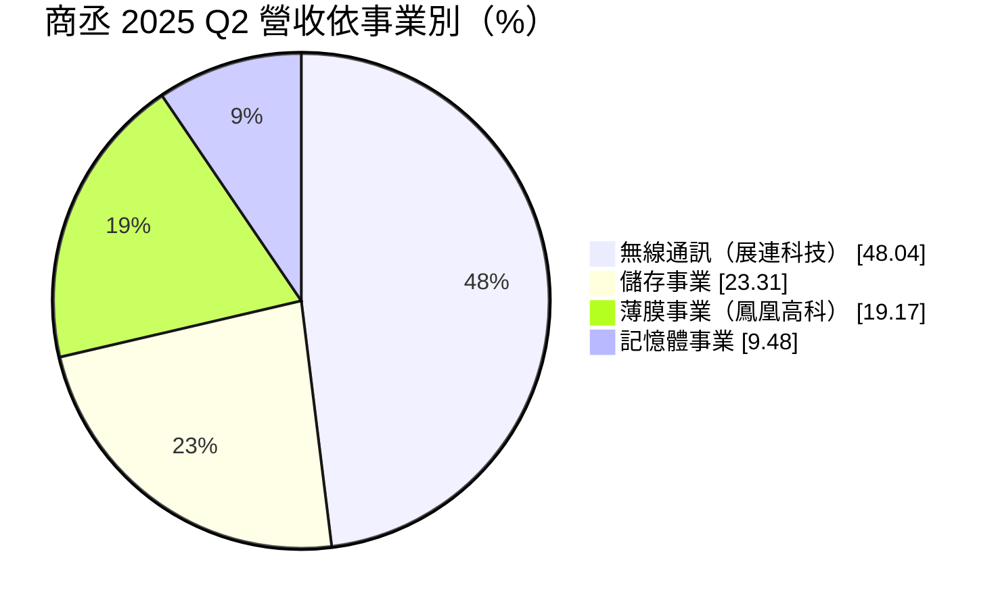
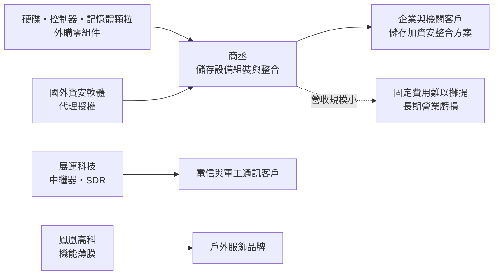
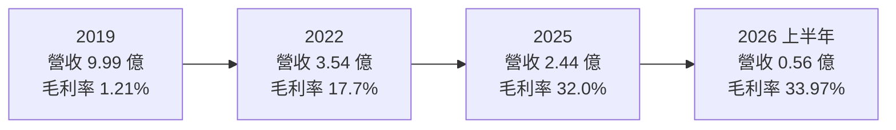
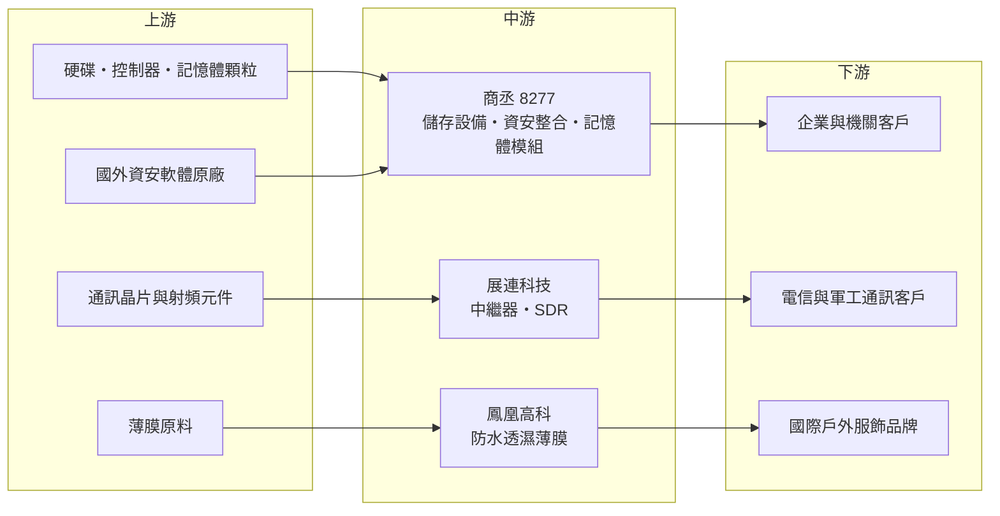

# 8277 商丞

> 上櫃｜[[產業索引-半導體業|半導體業]]｜上市（櫃）日期 2004/12/27

# 第一章：企業模式與商業藍圖

> [!info] 撰寫說明
> 本文由 Claude 依公開資料整理，架構比照 [[2330台積電]] 的四章研究，資料截至 2026-10-08。財務數字來源：Goodinfo 年度經營績效頁、富果研究 2025 年法說會整理、旺得富 2026 年 3 月減資報導、Yahoo 股市公司基本資料、櫃買中心開放資料（2026 年第二季綜合損益與資產負債、基本資料）；產業描述為整理性內容，尚未逐條比對原始文件。#待校對

在評估單一個股的長期投資價值時，首要步驟是拆解企業的底層獲利邏輯。本章針對商丞科技（股票代號：8277，以下簡稱商丞）進行定性分析。商丞是一家規模很小、長期虧損的公司，研究它的價值不在於找出成長股，而在於理解一家小型硬體廠如何在大廠擠壓下嘗試轉型，以及轉型成功需要哪些條件。

## 一、核心定位：從儲存硬體走向多元利基事業的小型科技公司

商丞成立於 1994 年，2004 年在櫃買中心上櫃，英文名稱 Unifosa，董事長林進財兼任總經理。依 Yahoo 股市公司資料，登記的營業項目包括資料儲存及處理設備製造、電子零組件製造、事務機器製造與國際貿易。公司早期以記憶體模組與儲存設備為主，近年營收規模持續縮小：Goodinfo 資料顯示，2019 年營收約 9.99 億元，到 2025 年只剩 2.44 億元。

依旺得富 2026 年 3 月的報導，2025 年是商丞連續第 12 年虧損，但也是 12 年來虧損最少的一年。為了彌補累積虧損，董事會在 2026 年 3 月通過減資約 56.89%，實收資本額由約 9.16 億元降為 3.95 億元；櫃買中心 2026 年 10 月的基本資料已顯示實收資本額為 3.95 億元，代表減資已完成。[[減資彌補虧損]]不會改變公司的資產與營運，只是把帳上累積虧損與股本互相抵銷，讓財務結構回到可以重新配息或籌資的狀態。

## 二、終端應用與產品板塊：四個小事業並行

依富果研究整理的 2025 年第二季法說會資料，商丞的營收來自四個事業：

* **儲存事業：** 磁碟陣列（[[RAID]]）、網路儲存（[[NAS]]）與硬碟擴充櫃（[[JBOD]]），並結合代理的國外資安軟體，提供資料存取稽核、權限管理與行為分析，協助企業防止資料外洩。這是商丞的傳統本業，但低毛利的硬體銷售比重正在下降。
* **無線通訊事業：** 由子公司展連科技經營，產品是數位[[中繼器]]與[[軟體無線電]]（SDR），用於改善 5G 訊號覆蓋，並開始布局軍工通訊與 6G 智慧中繼器。
* **薄膜事業：** 由子公司鳳凰高科經營，產品是防水透濕的機能薄膜，品牌 Feathers WBT 主打無氟、低碳排，已被多家國際戶外品牌採用（公司未點名）。
* **記憶體事業：** 個人電腦、筆電與伺服器用的 DRAM 模組，比重最小，但在記憶體漲價期營收成長較快。

需要注意的是，法說會資料中各事業比重與營收金額之間無法完全對應，且單季比重受個別專案影響很大，上圖只能視為當時的結構示意。

## 三、資本轉化邏輯：小量多樣的專案型銷售

商丞的營運模式是把外購零組件整合成設備或方案，再搭配軟體與服務銷售。這類生意的問題在於規模：2025 年營收約 2.43 億元、毛利約 0.77 億元，但研發、業務與管理費用合計超過毛利，營業虧損約 0.70 億元。即使毛利率從 2016 年的負值改善到 2025 年的 32%，費用仍壓過毛利。對小公司而言，提高毛利率是第一步，但真正的轉折點是營收規模能否擴大到足以攤提固定費用。

## 四、企業長期藍圖：資安、通訊與環保材料

公司在法說會與減資公告中提出的方向有三個：第一，整合儲存與資安軟體，把一次性的硬體銷售轉為附加價值較高的整合方案；第二，透過展連科技切入 5G 與 6G 中繼器、軍工通訊；第三，透過鳳凰高科發展無氟環保薄膜，搭上戶外品牌減少含氟化學品的趨勢。這三個方向都有產業趨勢支持，但都還在早期階段，且各自面對規模更大的競爭者。減資完成後，公司帳上的累積虧損大致清除，下一步要看能否在 2026 年之後真正轉為獲利。

# 第二章：護城河深度與競爭優勢

在長期價值投資中，「護城河」指企業抵禦競爭、維持超額利潤的保護機制。本章誠實評估商丞的競爭位置：一家長期虧損的公司，嚴格來說還沒有建立護城河，本章討論的是它有哪些可能發展成優勢的要素。

## 一、商丞可能的優勢要素

* **1. 利基市場的整合能力：** 商丞的儲存設備規模不大，但可以針對企業與機關客戶的特定需求，把儲存硬體與資安軟體組合成方案。這種整合服務重視客戶關係與在地支援，大型國際品牌未必願意承接小案，留給小公司生存空間。
* **2. 子公司的技術與專利：** 展連科技在中繼器上持續取得專利，鳳凰高科的無氟薄膜有環保訴求。若技術能通過大型客戶驗證，例如電信商或國際戶外品牌，就可能形成轉換成本。
* **3. 財務結構乾淨：** 依櫃買中心資料，2026 年第二季底負債總計僅約 0.31 億元，負債比約 7%，流動比率高。低負債讓公司在虧損期仍能維持營運，不至於因債務壓力被迫出售事業。

這三點目前都還不足以構成護城河。真正的檢驗是：這些優勢能否轉成持續的營業利益。截至 2025 年，答案仍是否定的。

## 二、主要競爭對手格局

| 領域 | 主要對手 | 對商丞的威脅 |
|---|---|---|
| NAS 與儲存設備 | 群暉（Synology）、威聯通（QNAP）、[[3057喬鼎]] | 品牌知名度與規模遠大於商丞，軟體生態完整 |
| 企業資安軟體 | 國內外資安業者與系統整合商 | 資安方案競爭者眾多，商丞以代理為主，自主技術有限 |
| 5G 中繼器與通訊 | 國際電信設備商與國內網通廠 | 電信設備需要大規模驗證，小廠爭取標案不易 |
| 機能薄膜 | Gore-Tex 等國際品牌與台灣紡織材料廠 | 品牌與通路優勢明顯，新材料需長時間建立信任 |
| 記憶體模組 | [[3260威剛]]、[[8271宇瞻]]、[[2451創見]] | 規模與採購能力遠勝商丞 |

## 三、優勢轉化：哪些守得住、哪些守不住

* **守得住：** 已建立關係的機關與企業客戶的儲存加資安整合案，這類客戶重視售後服務與資料安全，價格敏感度相對低。
* **守不住：** 一般儲存硬體與記憶體模組的價格競爭。商丞沒有規模優勢，在硬體標準化的市場中難以和大廠比成本。
* **觀察重點：** 第一，減資後能否在一至兩年內轉為營業獲利；第二，薄膜與通訊子公司能否取得具名的大型客戶並放量；第三，公司會不會為了新事業再次增資，稀釋股東權益。

# 第三章：財務體質與盈利規模

資料日期：2026-10-08。數字取自 Goodinfo 年度經營績效、旺得富報導與櫃買中心開放資料，表格是撰寫當時的快照；最新月營收、毛利率、累計 EPS 由自動排程寫在本筆記的屬性欄位（月營收、毛利率、累計EPS 等）。#待校對

財務報表是檢驗護城河是否真實存在的最終標準。對商丞而言，財務數字的意義是衡量轉型進度：毛利率是否持續改善、虧損是否持續縮小。

## 一、獲利能力的基石：三率

| 年度 | 營收（新台幣） | [[毛利率]] | [[營業利益率]] | EPS（元） | [[ROE]] |
|---|---|---|---|---|---|
| 2019 | 9.99 億 | 1.21% | -8.9% | -1.04 | -11.8% |
| 2020 | 4.39 億 | 11.7% | -15.3% | -0.69 | -10.2% |
| 2021 | 3.29 億 | 18.6% | -21.0% | -0.78 | -12.7% |
| 2022 | 3.54 億 | 17.7% | -20.2% | -0.61 | -11.0% |
| 2023 | 2.67 億 | 16.5% | -32.4% | -0.74 | -15.9% |
| 2024 | 2.94 億 | 24.5% | -22.1% | -0.72 | -15.8% |
| 2025 | 2.44 億 | 32.0% | -28.9% | -0.37 | -11.4% |
| 2026 上半年 | 0.56 億 | 33.97% | -28.76% | -0.18 | 不適用（半年） |

表格呈現的是一個「毛利率改善、規模萎縮」的過程。2019 年營收接近 10 億元，但毛利率只有約 1%，幾乎是無利可圖的貿易型營收；之後公司放棄低毛利業務，毛利率逐年提高到 2025 年的 32%，代價是營收縮小到 2.4 億元左右。營業利益率在這段期間始終為負，代表費用結構沒有跟著營收下降而同步縮減。2019 至 2025 年營收年複合成長率約 -21%，2020 至 2025 年約 -11%（推算）。2026 上半年 EPS 依櫃買中心資料為 -0.18 元，計算基礎為減資前的股數。

## 二、[[ROE]]：資本效率

2021 至 2025 年五年平均 ROE 約 -13.4%（推算），每股淨值由 2016 年的 10.79 元一路下降到 2025 年的 4.93 元（減資前）。連續虧損侵蝕股東權益，是公司在 2026 年辦理減資的直接原因。依櫃買中心資料，2026 年第二季底股東權益約 4.35 億元，以減資後 3,950 萬股計算，每股淨值約 11 元（推算）。

## 三、資本支出、自由現金流與股利

* **資本支出：** 金額未查得。公司為小型組裝與研發型企業，資本支出規模應不大（推估）。
* **[[自由現金流]]：** 逐年數字未查得。在長期營業虧損下，自由現金流難以長期為正，公司主要依靠帳上資金與非流動資產支撐營運（推估）。
* **股利：** Goodinfo 統計歷年平均現金股利約 0.25 元，但近年連續虧損，未發放股利。減資彌補虧損後，未來要先轉為獲利並累積盈餘，才有配息可能。

## 四、[[ROIC]] 與 [[WACC]]：價值創造利差

**ROIC 推算：** 2025 年營業虧損約 0.70 億元（營收 2.44 億元 × 營業利益率 -28.9%），虧損不計稅。股東權益以每股淨值 4.93 元乘以減資前約 9,163 萬股，約 4.52 億元；依櫃買中心資料負債總計僅約 0.31 億元，有息負債假設接近零（推估），投入資本約 4.5 億元，ROIC 約 -15.6%（推算）。

**WACC 推算：** 假設台灣 10 年期公債殖利率 1.75%、市場風險溢酬 6%、β 取小型電腦周邊股常見值 1.0（假設），股東權益成本約 7.75%。公司幾乎沒有有息負債，WACC 約等於股東權益成本，約 7.7%（推算）。考量小型股與長期虧損的額外風險，實際要求報酬可能更高。

**結論：** 商丞的 ROIC 長期遠低於資金成本，過去十年持續毀損經濟價值，減資只是會計上的整理，並沒有改變這個事實。對研究者而言，商丞是觀察「小型硬體公司轉型」的案例：只有當薄膜、通訊或資安整合業務的營收規模擴大到足以支撐費用，ROIC 才可能轉正。

# 第四章：總體風險與地緣政治

任何企業都無法脫離宏觀環境獨立存在。本章分析商丞長期必須面對的地緣政治、產業週期、營運與技術風險。

## 一、地緣政治風險

商丞的硬體零組件，例如硬碟、記憶體顆粒與網通晶片，大多來自國外供應商，美中科技管制與關稅會影響採購成本與交期。另一方面，展連科技布局軍工通訊，若兩岸或國際局勢使國防與關鍵通訊需求增加，可能帶來機會，但軍工標案也伴隨嚴格的資安與供應鏈審查，小公司需要投入額外成本才能符合要求。

## 二、產業週期與市場結構

儲存設備與記憶體模組的需求隨企業資訊支出與記憶體價格循環波動。商丞的規模小，無法像大廠那樣以庫存操作賺取循環利潤，反而容易在漲價期買不到貨、跌價期承受存貨損失。儲存市場的結構也在改變，企業資料大量移往雲端，地端 NAS 與磁碟陣列的需求成長有限，這是商丞傳統本業的長期壓力。

## 三、營運環境的隱性風險

* **規模不足：** 2026 年上半年營收僅約 0.56 億元，固定費用壓力大，單一大案的有無就會大幅改變損益。
* **多角化分散資源：** 同時經營儲存、資安、通訊、薄膜與記憶體五個領域，每個領域的研發與業務資源都有限，可能無法在任何一個領域建立足夠的競爭力。
* **再度籌資的可能：** 若新事業需要資金擴張，而本業仍虧損，公司可能需要現金增資，對既有股東造成稀釋。

## 四、科技或法規演進

資安法規趨嚴，例如政府機關與關鍵基礎設施的資安要求提高，對資安整合方案是正面因素。環保法規方面，歐美陸續限制含氟化學品（[[PFAS]]）在紡織品中的使用，這是鳳凰高科無氟薄膜的長期機會。通訊技術從 5G 走向 6G，中繼器與 SDR 的規格會持續改變，展連科技必須跟上標準演進。這些趨勢都對商丞的新事業有利，但能否轉化為營收，取決於公司的執行力與資源。

# 專有名詞解析

## 金融

- **[[減資彌補虧損]]**：以減少股本的方式抵銷帳上累積虧損，股東持股數減少但持股比例不變，公司資產不因此流出。
- **[[自由現金流]]**：營業活動現金流減去資本支出，代表企業可自由用於配息、還債或併購的現金。
- **[[ROIC]]**：投入資本報酬率，稅後營業利益除以股東權益加有息負債，衡量本業運用資本的效率。
- **[[WACC]]**：加權平均資金成本，股東與債權人要求報酬的加權平均，ROIC 高於它才代表創造價值。

## 產業

- **[[RAID]]**：磁碟陣列，把多顆硬碟組合起來，以提高讀寫速度或在單顆硬碟故障時保護資料。
- **[[NAS]]**：網路附加儲存，可直接連上區域網路、讓多台電腦共用的檔案儲存設備。
- **[[JBOD]]**：硬碟擴充櫃，把多顆硬碟放在同一機箱中擴充容量，本身不做磁碟陣列運算。
- **[[軟體無線電]]**：以軟體定義訊號處理方式的無線電設備，同一套硬體可透過更新軟體支援不同頻段與通訊標準。
- **[[中繼器]]**：接收並放大無線訊號後再發射的設備，用於改善室內或偏遠地區的行動通訊覆蓋。
- **[[PFAS]]**：全氟與多氟烷基物質，常用於防水防污處理，因難以分解且可能影響健康，歐美逐步限制使用。

# 核心供應鏈

## 1. 上游：零組件與軟體
- 硬碟、儲存控制器與記憶體顆粒：供應商名單未查得
- 資安軟體：代理國外原廠（品牌未查得）
- 通訊晶片與薄膜原料：供應商名單未查得

## 2. 中游：商丞與子公司
- 子公司：展連科技（無線通訊）、鳳凰高科（機能薄膜）
- 儲存設備同業：[[3057喬鼎]]、群暉、威聯通
- 記憶體模組同業：[[3260威剛]]、[[8271宇瞻]]、[[2451創見]]

## 3. 下游：客戶
- 企業與政府機關的儲存與資安需求
- 電信業者與軍工通訊專案
- 國際戶外品牌（公司未揭露名稱）

## 最新新聞
<!-- news:start -->
<!-- news:end -->

## 相關連結
- [公開資訊觀測站](https://mopsov.twse.com.tw/mops/web/t05st03?step=1&firstin=1&co_id=8277)
- [Goodinfo](https://goodinfo.tw/tw/StockDetail.asp?STOCK_ID=8277)
- [Yahoo 股市](https://tw.stock.yahoo.com/quote/8277)
- [鉅亨網新聞](https://www.cnyes.com/twstock/8277/news)
