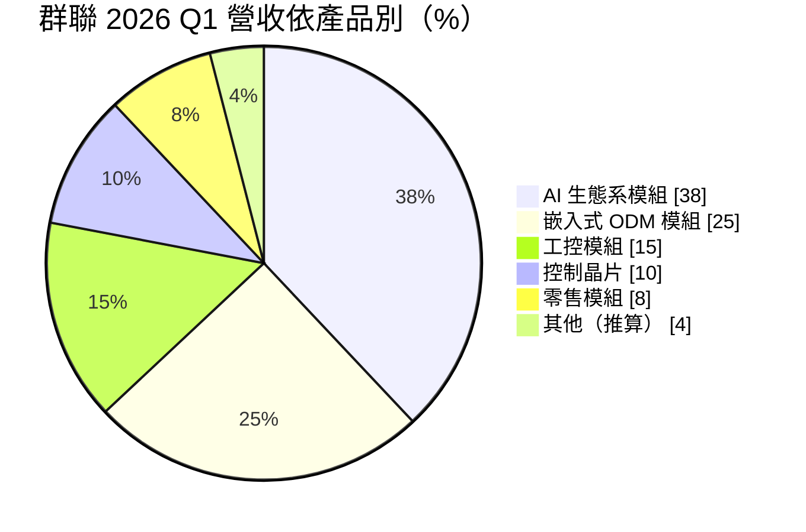
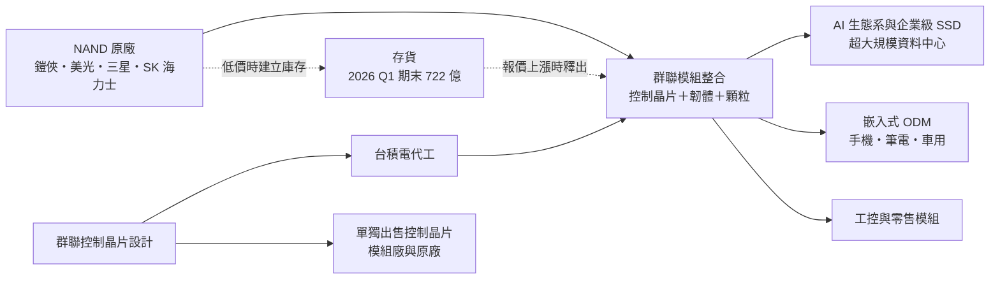
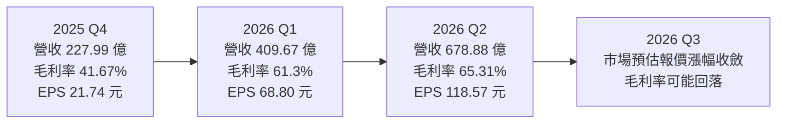
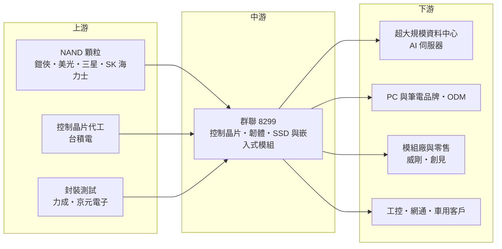

# 8299 群聯

> 上櫃｜[[產業索引-半導體業|半導體業]]｜上市（櫃）日期 2004/12/06

# 第一章：企業模式與商業藍圖

> [!info] 撰寫說明
> 本文由 Claude 依公開資料整理，架構比照 [[2330台積電]] 的四章研究，資料截至 2026-10-07。財務數字來源：群聯 2025 年第四季法說會簡報、2026 年第一季法說會整理（富果研究）、2026 年第二季財報新聞（優分析、今周刊）、群聯 2018 年企業社會責任報告公司簡介；產業描述為整理性內容，尚未逐條比對原始文件。#待校對

在評估單一個股的長期投資價值時，首要步驟是拆解企業的底層獲利邏輯。本章針對群聯電子（股票代號：8299，以下簡稱群聯）的商業模式進行定性分析，說明控制晶片在快閃記憶體產品中的角色、群聯如何從晶片設計延伸到模組整合，以及「Phison 3.0」轉型為 AI 儲存方案供應商的意義。

## 一、核心定位：從控制晶片設計公司走向 AI 儲存方案供應商

群聯成立於 2000 年 11 月 8 日，總部位於苗栗竹南，由潘健成等交大校友創立，最早以全球第一批單晶片 USB 隨身碟控制晶片起家。公司本業是設計 [[NAND Flash]] 的[[控制晶片]]，並延伸為把控制晶片、[[韌體]]與 NAND 顆粒整合成模組的「儲存解決方案」業者。

控制晶片的角色是管理 NAND 的讀寫、錯誤更正、[[平均抹寫]]與壞塊管理。NAND 顆粒本身會隨製程演進而變得更不穩定，控制晶片與韌體的能力直接決定一顆 [[SSD]] 的效能、壽命與可靠度。

群聯屬於 [[Fabless]] 模式，晶片委由晶圓代工廠生產，自己不擁有晶圓廠。早年東芝在 2002 年入股，依群聯 2018 年企業社會責任報告，當時東芝持股約 10.06%，公司也形容東芝是創業初期「唯一願意投資的法人股東」。東芝記憶體部門後來獨立為鎧俠（Kioxia），這層長期關係讓群聯在 NAND 顆粒取得上有相對穩定的來源。這個定位有兩個商業意義：

* **一半是 IC 設計、一半是記憶體模組：** 控制晶片的毛利由技術決定，模組的毛利則深受 NAND 顆粒價格影響，因此群聯的獲利同時具有設計公司與記憶體景氣循環股的特性。
* **轉型重心移向 AI 與企業級：** 「Phison 3.0」的目標是從 NAND 儲存廠轉型為 AI 儲存解決方案供應商，重心從消費性隨身碟、記憶卡，轉向企業級 SSD、嵌入式儲存、工控與 AI 相關模組。

## 二、產品板塊：AI 生態系躍升為最大來源

2026 年第一季公司改用新的分類，營收結構如下（其他項由 100% 減去各項推算）：

公司在法說中表示前十大客戶裡有六家屬於 AI 生態系客戶，並預期 AI 相關占比會超過五成。依今周刊對第二季法說的整理，企業級 SSD（[[eSSD]]）營收占比已達 30% 以上。對照 2025 年第四季法說會簡報，當時超過 70% 營收來自非消費型產品，結構為嵌入式 ODM 模組 26%、控制晶片 25%、消費／零售 19%、工業模組 13%、企業級模組 10%、遊戲模組 5%、其他 2%。

主要產品線包括：

* **[[PCIe]] SSD 控制晶片：** 涵蓋 PCIe Gen4、Gen5，2026 年第一季法說表示首顆 PCIe Gen6 晶片已完成，預計在 2026 年 8 月的 FMS 展示樣品。
* **Pascari 企業級 SSD：** 自有品牌的資料中心儲存產品，公司在第一季法說表示已對兩家[[超大規模資料中心]]客戶出貨達 PB（Petabyte）等級。
* **aiDAPTIV+：** 以 SSD 擴充 GPU 記憶體的邊緣 AI 軟硬體平台，讓 PC 或工作站在地端運行與微調大型語言模型；公司宣稱可降低 70% 以上的 Token 使用成本。
* **嵌入式與工控儲存：** [[UFS]]、eMMC、BGA SSD 與工規 SSD，提供給手機、筆電、車用與工控客戶。

## 三、資本轉化邏輯：晶片設計加顆粒整合

依公司簡介，群聯總部在苗栗竹南，在日本、中國、馬來西亞設有分公司，並在東京、聖荷西、深圳、合肥、檳城設有技術支援中心。研發人力集中在台灣，模組生產除了自有產線外，也搭配外部封測與 SMT 代工。

這個模式最值得注意的是庫存策略：群聯習慣在 NAND 價格低檔時建立庫存，2026 年第一季期末存貨達 722 億元，季增近兩倍。當報價上漲時，低價庫存帶來超額毛利；反過來，報價下跌時則會面臨[[存貨跌價損失]]。

## 四、企業長期藍圖

* **企業級 SSD 與 AI 儲存：** 擴大資料中心市占，透過客製化韌體與彈性合作模式，爭取原廠以外的超大規模資料中心訂單。
* **邊緣 AI：** 以 aiDAPTIV+ 切入 AI PC 與地端推論、微調市場。
* **加大研發：** 2026 年第一季研發費用 86.71 億元，公司預估 2026 年全年研發支出將達 200 至 230 億元以上，用於先進製程控制晶片、AI 儲存與人才延攬。
* **庫存策略：** 低價建庫存是 2026 年獲利暴增的主要來源之一，也是未來需要觀察的風險。

# 第二章：護城河深度與競爭優勢

在長期價值投資中，「護城河」指企業抵禦競爭、維持超額利潤的保護機制。本章分析群聯的護城河構成、面對獨立控制晶片同業與 NAND 原廠的競爭位置，以及高毛利能否在低價庫存用完後延續。

## 一、護城河的核心組成要素

群聯的護城河屬於「中等、但會隨週期擺盪」的類型，由四個要素組成：

* **1. 控制晶片與韌體的長期累積：** NAND 每一代製程、每一家原廠的顆粒特性都不同，控制晶片必須搭配韌體調校才能把效能與壽命做出來。群聯有二十多年、橫跨多家原廠顆粒的調校經驗，這是新進者難以短期複製的部分。
* **2. 與 NAND 原廠的關係：** 與鎧俠（前東芝記憶體）長期合作，讓群聯在供給吃緊時仍有一定的顆粒取得能力。對模組業務而言，「拿得到貨」本身就是競爭力。
* **3. 客製化與快速反應：** 公司在法說中強調高度客製化能力、快速反應、彈性合作模式與穩定供應鏈。對沒有自有控制晶片團隊的品牌、ODM 或雲端客戶，群聯能提供從晶片到模組的一站式方案。
* **4. 產品線廣度：** 從零售記憶卡、嵌入式 UFS、工控到企業級 SSD 都有布局，能把研發成本分攤到大量出貨上。

## 二、全球主要競爭對手格局

| 對手 | 定位 | 對群聯的威脅 |
|---|---|---|
| 慧榮（Silicon Motion） | 全球最大獨立 NAND 控制晶片廠 | 手機嵌入式與消費性 SSD 直接競爭，也進入企業級 |
| [[MRVL邁威爾]] | 企業級 SSD 控制晶片老牌供應商 | 在資料中心控制晶片具客戶基礎 |
| [[005930三星電子]]、SK 海力士（含 Solidigm）、美光 | NAND 原廠，多用自家控制晶片 | 企業級 SSD 最強勢，決定群聯可得市場空間 |
| [[3260威剛]]、[[2451創見]] | 模組廠 | 零售與工控模組競爭，但也是控制晶片客戶 |
| 中國控制晶片廠 | 國產化政策支持 | 中低階消費性產品價格壓力 |

## 三、優勢轉化：哪些市場守得住、哪些守不住

* **守得住：** 需要客製化、量不一定大但要求彈性的工控、嵌入式與二線雲端客戶；需要「控制晶片加顆粒」一次採購的品牌與 ODM。
* **守不住：** 一線超大規模資料中心的主流企業級 SSD，原廠自有控制晶片與垂直整合仍占優勢；群聯在模組業務上的顆粒成本也受原廠報價左右，原廠若轉為自己賣模組，群聯的議價空間會縮小。
* **觀察重點：** 2026 年上半年[[毛利率]]衝上六成以上，很大一部分來自 NAND 價格大漲與低價庫存的雙重紅利。今周刊引述的市場預估指出第三季報價漲幅可能收斂、毛利率可能回落。真正的考驗是 eSSD 與 AI 產品的占比能否在低價庫存用完後撐住毛利率，讓群聯擺脫「隨 NAND 報價大起大落」的景氣循環股定位。

# 第三章：財務體質與盈利規模

資料日期：2026-10-07。數字取自群聯法說會簡報、財報新聞稿與財經媒體整理（富果研究、優分析、今周刊），表格是撰寫當時的快照；最新月營收、毛利率、累計 EPS 由自動排程寫在本筆記的屬性欄位（月營收、毛利率、累計EPS 等）。#待校對

財務報表是檢驗護城河是否真實存在的最終標準。本章用三率、ROE、現金流與資本報酬，檢視群聯在 NAND 報價大漲期間的獲利品質，並區分技術帶來的毛利與庫存帶來的毛利。

## 一、獲利能力的基石：三率

| 項目 | 2025 全年 | 2025 Q4 | 2026 Q1 | 2026 Q2 |
|---|---|---|---|---|
| 營收（新台幣） | 726.64 億 | 227.99 億 | 409.67 億 | 678.88 億 |
| [[毛利率]] | 34.2% | 41.67% | 61.3% | 65.31% |
| [[營業利益率]] | 11.4% | 14.6% | 36.2% | 38.84% |
| 稅後淨利 | 87.41 億 | 46.29 億 | 151.75 億 | 262.17 億 |
| EPS（元） | 41.98 | 21.74 | 68.80 | 118.57 |

* **2026 年上半年：** 營收 1,088.55 億元，年增 243.08%；毛利率 63.8%、營業利益率 37.86%；稅後淨利 413.91 億元，EPS 187.43 元，半年已超過 2025 全年獲利的四倍以上。
* **獲利來源：** 依優分析報導，第二季獲利主要受惠 NAND 價格持續飆漲；今周刊整理指出第二季平均售價大漲約五成，加上先前低價建立的庫存，形成雙重紅利。
* **月營收：** 2026 年 8 月營收 282.76 億元，年增 376.52%（winvest 營收快訊）。
* **[[營業利益率]]：** 研發費用大幅增加，但營收成長更快，營業利益率由 2025 年的 11.4% 升到 2026 年第二季的 38.84%。景氣反轉時，費用剛性會反過來放大獲利下滑。

## 二、[[ROE]]：資本效率

群聯屬於 Fabless 與模組業者，不需要蓋晶圓廠，固定資產相對輕，資本主要壓在存貨與應收帳款上。因此其股東權益報酬率高度取決於 NAND 價格與存貨評價：景氣好時存貨增值會讓 ROE 大幅拉高，景氣反轉時則可能出現存貨跌價損失。2026 年第一季法說揭露存貨跌價損失對 EPS 約有 -2.37 元影響，即使在多頭期間也存在評價調整。具體 ROE 數值本次未查得，推估 2026 年在獲利暴增下會遠高於過去幾年水準。

## 三、資本支出與自由現金流

* **[[CapEx]] 與研發：** 群聯的主要投入是研發而非廠房，2026 年預計研發支出 200 至 230 億元以上，遠高於過去水準。
* **[[自由現金流]]：** 2026 年第一季期末存貨 722 億元，代表大量營運資金押在 NAND 顆粒上。營業現金流會隨存貨增減大幅波動，在建庫存期間可能明顯低於帳面獲利。
* **股利：** 2026 年第一季法說提到目標盈餘發放率約 55%。依優分析報導，公司針對 2026 年上半年盈餘擬配發每股 60 元現金股利，配發率約 32%，預計發放總額 132.7 億元。群聯近年採半年配息，實際配發率會隨營運資金需求調整。

## 四、[[ROIC]] 與 [[WACC]]：價值創造利差

群聯的投入資本以存貨與營運資金為主。2026 年上半年營業利益率接近四成，ROIC 推估遠高於 WACC（具體數值未查得）；但這部分利差有相當比例來自報價上漲的存貨利益，屬於週期性而非結構性。判斷群聯長期價值創造能力，應觀察 NAND 報價持平或下跌時，eSSD 與 AI 產品能否讓 ROIC 仍維持在資金成本之上。

# 第四章：總體風險與地緣政治

任何企業都無法脫離宏觀環境獨立存在。本章分析群聯未來必須面對的地緣政治、NAND 價格循環、營運與技術演進風險。

## 一、地緣政治

* **NAND 供應集中：** 群聯本身不生產 NAND，顆粒主要來自日本、韓國、美國原廠在日本、韓國、中國等地的晶圓廠。任何一地的地緣衝突、出口管制或天災，都可能影響顆粒取得與價格。
* **中國市場：** 群聯在深圳、合肥設有技術支援據點，中國客戶與中國 NAND 廠（如長江存儲）同時是市場與競爭者。美中科技管制若擴大到儲存產品，可能影響部分訂單。
* **美國關稅：** 模組產品若出口美國，可能受到半導體與電子產品關稅政策影響。

## 二、產業週期與市場結構

* **NAND 價格循環：** 這是群聯最大的風險。2026 年上半年的高毛利來自報價大漲與低價庫存，一旦原廠擴產、需求降溫，報價回落時群聯會同時面臨售價下跌與存貨跌價，獲利可能快速縮小。過去 NAND 下行週期中，群聯就曾出現毛利率與獲利大幅下滑。
* **AI 需求的持續性：** 公司認為 AI 帶來的儲存需求是結構性的，且 NAND 新產能短時間難以補上。若資料中心資本支出放緩，企業級 SSD 需求也會隨之調整，加上通路與客戶庫存的[[長鞭效應]]，訂單修正幅度可能大於終端需求變化。
* **市場預期過高：** 今周刊報導指出，市場已出現獲利見頂疑慮，借券賣出餘額攀升。股價對 NAND 報價變化極為敏感。

## 三、營運環境的隱性風險

* **存貨風險：** 722 億元的存貨在價格反轉時會是沉重負擔。
* **原廠策略變化：** NAND 原廠若收緊顆粒供應給第三方模組廠，或改為自建控制晶片與模組業務，群聯的空間會被壓縮。
* **客戶集中：** AI 生態系客戶占比快速提高，前十大客戶的訂單變化對營收影響加大。
* **研發費用上升：** 研發支出大幅增加，景氣反轉時費用剛性會放大獲利下滑幅度。

## 四、科技或法規演進

PCIe 介面每兩到三年升級一代，控制晶片需要使用更先進的晶圓製程，開發成本與流片費用持續墊高。群聯若在 PCIe Gen6、企業級 SSD 或新興的 AI 儲存架構上落後於原廠或慧榮，就可能失去高毛利產品的入場券。aiDAPTIV+ 等邊緣 AI 方案仍屬新市場，商業化規模尚待驗證。

# 專有名詞解析

## 半導體

- **[[NAND Flash]]**：斷電後仍能保存資料的快閃記憶體，用於 SSD、手機儲存與記憶卡。
- **[[控制晶片]]**：管理快閃記憶體讀寫、錯誤更正與壽命的晶片，決定 SSD 的效能與可靠度。
- **[[韌體]]**：燒錄在控制晶片中的底層程式，負責調校不同 NAND 顆粒的讀寫參數。
- **[[平均抹寫]]**：把寫入動作平均分散到所有記憶體區塊，避免部分區塊過早損壞的技術。
- **[[SSD]]**：固態硬碟，以快閃記憶體取代傳統硬碟的儲存裝置，速度快、耗電低。
- **[[eSSD]]**：企業級固態硬碟，用於伺服器與資料中心，對耐用度、效能與穩定性要求高於消費型產品。
- **[[PCIe]]**：高速周邊連接介面標準，SSD 與 GPU 都透過它與處理器傳輸資料，每一代頻寬約倍增。
- **[[UFS]]**：通用快閃記憶體儲存規格，手機與平板的主流內建儲存介面，速度高於 eMMC。
- **[[Fabless]]**：只做晶片設計、把製造委外給晶圓代工廠的 IC 設計公司模式。

## 應用

- **[[超大規模資料中心]]**：由雲端業者營運、擁有數十萬台伺服器的大型資料中心，是企業級 SSD 的最大買家。

## 金融

- **[[存貨跌價損失]]**：存貨市價低於帳面成本時須認列的損失，記憶體價格下跌時常大幅侵蝕獲利。
- **[[長鞭效應]]**：終端需求的小幅變動，沿供應鏈往上游傳遞時被逐級放大，造成上游庫存與訂單劇烈波動。

# 核心供應鏈

## 1. 上游：NAND 顆粒與晶圓代工
- NAND 快閃記憶體：鎧俠（Kioxia）、美光、[[005930三星電子]]、SK 海力士
- 控制晶片晶圓代工：[[2330台積電]]
- 封裝測試：[[6239力成]]、[[2449京元電子]]

## 2. 中游：群聯本身
- 控制晶片設計、韌體開發與 SSD／嵌入式模組整合（Pascari 企業級 SSD、aiDAPTIV+ 邊緣 AI 平台）

## 3. 下游：客戶
- 超大規模資料中心與 AI 伺服器：雲端服務業者（公司未揭露名稱）
- PC 與筆電品牌、ODM：嵌入式 SSD 與 BGA SSD
- 模組廠與零售通路：[[3260威剛]]、[[2451創見]]
- 工控、網通與車用客戶

## 4. 同業
- NAND 控制晶片：慧榮（Silicon Motion）、[[MRVL邁威爾]]
- 原廠自研控制晶片：[[005930三星電子]]、SK 海力士、美光

延伸閱讀：[[台積電供應鏈]]

## 最新新聞
<!-- news:start（自動產生，請勿手動編輯此範圍） -->
- 2026-10-08 📰 媒體 17:24｜營收速報 - 群聯(8299)9月營收306.39億元年增率高達370.26％｜[鉅亨網](https://news.cnyes.com/news/id/6625048)

完整紀錄：[[8299群聯 新聞]]
<!-- news:end -->

## 相關連結
- [公開資訊觀測站](https://mopsov.twse.com.tw/mops/web/t05st03?step=1&firstin=1&co_id=8299)
- [Goodinfo](https://goodinfo.tw/tw/StockDetail.asp?STOCK_ID=8299)
- [Yahoo 股市](https://tw.stock.yahoo.com/quote/8299)
- [鉅亨網新聞](https://www.cnyes.com/twstock/8299/news)
