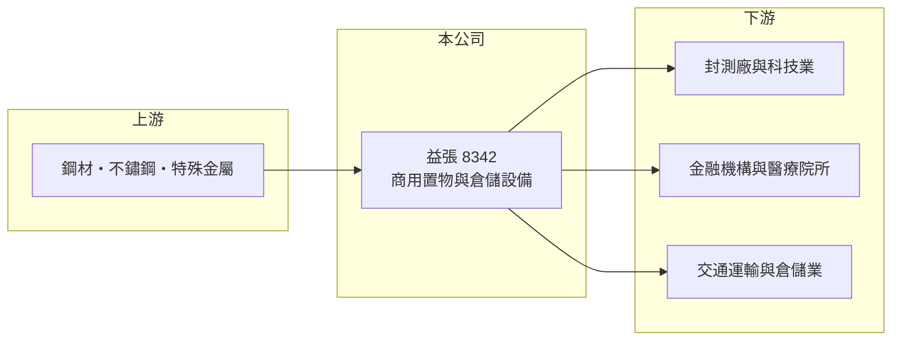

# 8342 益張

> 上櫃｜[[產業索引-其他業|其他業]]｜上市（櫃）日期 2017/11/23

# 第一章：企業模式與商業藍圖

> [!info] 撰寫說明
> 精簡版，由 Claude 依公開資料整理，架構比照 [[2330台積電]]，資料截至 2026-10-07。來源：優分析 2026 年上半年財報報導、旺得富時報新聞、winvest 營收快訊。#待校對

益張是全球商用置物設備製造商，產品以金屬層架與移動式倉儲系統為主。

- **核心業務：** 生產商用置物設備，包括金屬層架與自有品牌「OGEE 移動式倉儲」系列，另有特殊金屬材質產品。
- **營收結構：** 客戶涵蓋[[封裝測試]]大廠、金融機構、醫療院所與交通運輸等產業；北美是主要成長市場，各產品營收比重未查得。
- **營運據點：** 總部在台灣，產品外銷北美等地區（推估）。
- **長期方向：** 持續優化產品結構，提高特殊金屬材質與自有品牌[[移動式倉儲]]產品比重。

# 第二章：護城河深度與競爭優勢

益張的競爭力來自利基型產品與多元產業客戶。

- **競爭優勢：** 特殊金屬材質置物設備可應用於潔淨室與醫療等要求較高的環境，客戶認證後轉換成本較高（推估）。
- **主要對手：** 美國與中國的商用層架及倉儲設備製造商（推估）。
- **觀察重點：** 北美出貨動能、OGEE 自有品牌的推廣成效，以及鋼材成本變化。

# 第三章：財務體質與盈利規模

資料日期：2026-10-07，以下數字是撰寫當時的快照；最新月營收、毛利率、累計 EPS 由自動排程寫在本筆記的屬性欄位（月營收、毛利率、累計EPS 等）。#待校對

益張 2026 年上半年獲利創同期新高。

- **營收規模：** 2026 年上半年營收 8.19 億元，年增 5.4%；第二季營收 4.43 億元；6 月營收 1.55 億元，年增 4.76%。
- **獲利：** 上半年稅後純益 1.32 億元，年增 67.44%，EPS 3.94 元；第二季 EPS 2.49 元。上半年[[毛利率]] 27.59%，第二季 28.96%。2025 年全年 EPS 5.97 元（優分析報導，待校對）。
- **財務特色：** 配息穩定，前一年度配發 5 元現金股利；公司表示在原物料成本低點備貨，有助毛利率。

# 第四章：總體風險與地緣政治

益張的風險主要來自出口市場與原料價格。

- **產業週期：** 商用置物設備需求與企業資本支出及倉儲投資相關，景氣下滑時訂單可能遞延。
- **營運風險：** 北美比重提高後，對單一市場需求的依賴加深。
- **其他風險：** 鋼材等[[原物料]]價格波動影響成本；外銷以美元計價，有匯率風險；美國關稅政策也可能影響出貨。

# 專有名詞解析

## 半導體

- **[[封裝測試]]**：晶片製造後段的封裝與測試製程，益張的特殊置物設備有應用於此類工廠。

## 金融

- **[[毛利率]]**：毛利除以營收，反映產品或服務本身的獲利能力。

## 產業

- **[[移動式倉儲]]**：裝設在軌道上、可移動的密集式儲物架，可節省倉庫或檔案室空間。
- **[[原物料]]**：生產所需的基礎材料，例如鋼材、銅、塑膠粒，價格波動會直接影響製造業成本。

# 核心供應鏈

- 上游：鋼材、不鏽鋼與特殊金屬材料供應商
- 下游／客戶：封裝測試大廠、金融機構、醫療院所、交通運輸業，北美經銷通路
- 同業：歐美與中國商用層架製造商（推估）

## 最新新聞
<!-- news:start（自動產生，請勿手動編輯此範圍） -->
- 2026-10-08 🏛️ 重訊 15:01｜說明本公司承作交易目的衍生性金融商品情形｜[觀測站](https://mops.twse.com.tw/mops/#/web/t05st01)

完整紀錄：[[8342益張 新聞]]
<!-- news:end -->

## 相關連結
- [公開資訊觀測站](https://mopsov.twse.com.tw/mops/web/t05st03?step=1&firstin=1&co_id=8342)
- [Goodinfo](https://goodinfo.tw/tw/StockDetail.asp?STOCK_ID=8342)
- [Yahoo 股市](https://tw.stock.yahoo.com/quote/8342)
- [鉅亨網新聞](https://www.cnyes.com/twstock/8342/news)
