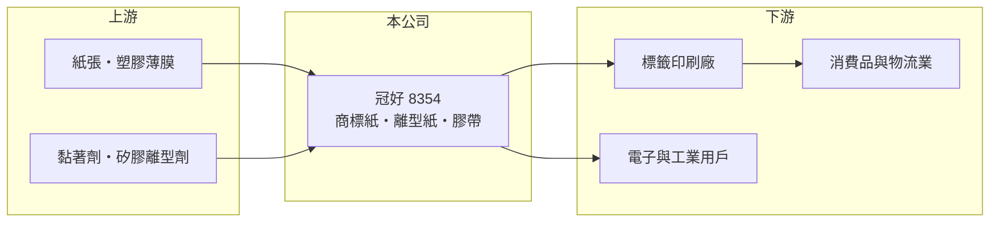

# 8354 冠好

> 上櫃｜[[產業索引-其他業|其他業]]｜上市（櫃）日期 2004/04/15

# 第一章：企業模式與商業藍圖

> [!info] 撰寫說明
> 精簡版，由 Claude 依公開資料整理，架構比照 [[2330台積電]]，資料截至 2026-10-07。來源：nstock 公司概況頁、MoneyLink 個股新聞、winvest 營收快訊。公開資料有限。#待校對

冠好是生產商標紙、離型紙與膠帶的材料加工廠，屬於標籤與黏著材料供應鏈。

- **核心業務：** 製造與加工商標紙、[[離型紙]]、膠帶等產品，供應標籤印刷與黏著應用。
- **營收結構：** 以商標紙（[[自黏標籤]]材料）、離型紙與膠帶為主，各產品營收比重未查得。
- **營運據點：** 以台灣為主要營運地，其他據點公開資料有限。
- **長期方向：** 公開資料未見明確擴產或轉型計畫，推估以既有標籤材料客戶為主。

# 第二章：護城河深度與競爭優勢

冠好屬於規模較小的材料加工廠，競爭力主要在客製化與交期。

- **競爭優勢：** 可依客戶需求調整塗佈與裁切規格，服務在地標籤印刷廠（推估）。
- **主要對手：** 國際標籤材料大廠艾利丹尼森、[[4306炎洲]]等膠帶與黏著材料廠（推估）。
- **觀察重點：** 毛利率能否穩定在兩成以上，以及業外收益對獲利的影響。

# 第三章：財務體質與盈利規模

資料日期：2026-10-07，以下數字是撰寫當時的快照；最新月營收、毛利率、累計 EPS 由自動排程寫在本筆記的屬性欄位（月營收、毛利率、累計EPS 等）。#待校對

冠好營收規模小，2026 年上半年獲利主要來自業外。

- **營收規模：** 2025 年全年營收 6.44 億元；2026 年 1 至 8 月累計 4.44 億元，年增 4.21%；8 月營收 4,715 萬元，年減 7.03%。
- **獲利：** 2025 年全年 EPS 0.14 元；2026 年第一季 EPS 0.30 元、[[毛利率]] 17.01%；第二季 EPS 1.09 元、毛利率 22.08%，上半年累計 1.39 元。
- **財務特色：** 第二季[[營業利益率]]僅 1.43%，淨利率卻達 50.78%，顯示獲利主要來自業外收益，來源未查得。

# 第四章：總體風險與地緣政治

冠好的風險在於本業獲利薄、規模小。

- **產業週期：** 標籤與膠帶需求跟隨消費品、物流與電子產業景氣。
- **營運風險：** 本業營業利益率低，業外收益難以每年重複，獲利波動大。
- **其他風險：** 紙漿、塑膠薄膜與黏著劑等原料價格波動影響成本。

# 專有名詞解析

## 金融

- **[[毛利率]]**：毛利除以營收，反映產品或服務本身的獲利能力。
- **[[營業利益率]]**：營業利益除以營收，反映本業扣除營業費用後的獲利能力。

## 產業

- **[[離型紙]]**：表面塗有矽膠等離型劑的紙，用來保護黏著面，使用時可輕易撕除。
- **[[自黏標籤]]**：背面附有黏膠、貼在離型紙上的標籤材料，撕下即可貼附，廣泛用於商品與物流。

# 核心供應鏈

- 上游：紙張、塑膠薄膜、黏著劑與離型劑供應商（推估）
- 下游／客戶：標籤印刷廠、消費品與物流業、電子與工業用戶（推估）
- 同業：艾利丹尼森、[[4306炎洲]]（推估）

## 最新新聞
<!-- news:start（自動產生，請勿手動編輯此範圍） -->
- 2026-10-08 🏛️ 重訊 14:26｜公告本公司召開法人說明會相關資訊｜[觀測站](https://mops.twse.com.tw/mops/#/web/t05st01)

完整紀錄：[[8354冠好 新聞]]
<!-- news:end -->

## 相關連結
- [公開資訊觀測站](https://mopsov.twse.com.tw/mops/web/t05st03?step=1&firstin=1&co_id=8354)
- [Goodinfo](https://goodinfo.tw/tw/StockDetail.asp?STOCK_ID=8354)
- [Yahoo 股市](https://tw.stock.yahoo.com/quote/8354)
- [鉅亨網新聞](https://www.cnyes.com/twstock/8354/news)
