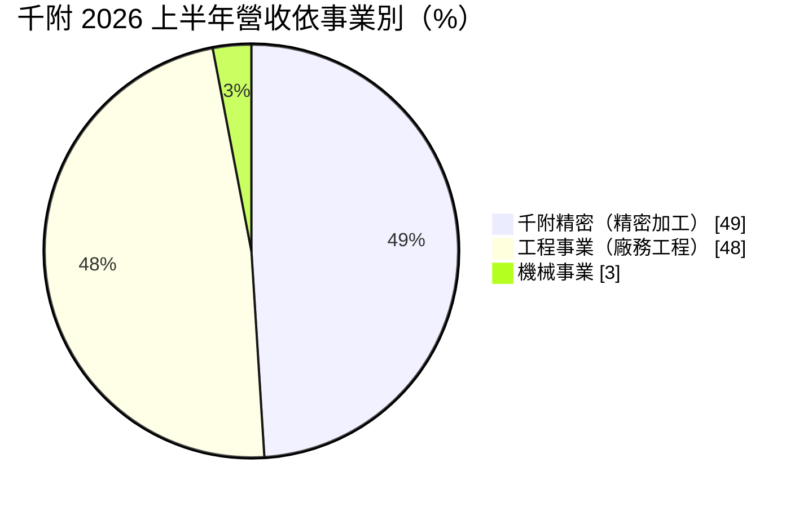
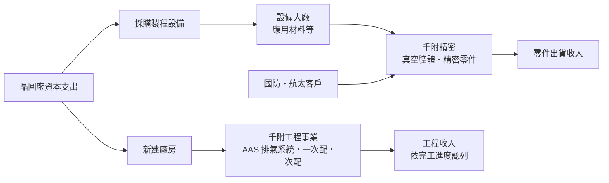
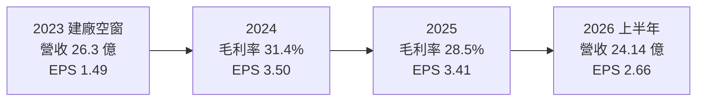
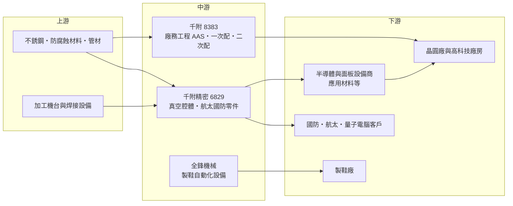

# 8383 千附

> 上櫃｜[[產業索引-半導體業|半導體業]]｜上市（櫃）日期 2004/09/10

# 第一章：企業模式與商業藍圖

> [!info] 撰寫說明
> 本文由 Claude 依公開資料整理，架構比照 [[2330台積電]] 的四章研究，資料截至 2026-10-08。財務數字來源：Goodinfo 年度經營績效頁、富果研究 2026 年 8 月法說會整理、聯合新聞網 2026 年 7 月報導、HiStock 2019 年分析文章、櫃買中心開放資料（2026 年第二季綜合損益與資產負債、基本資料、本益比殖利率）；產業描述為整理性內容，尚未逐條比對原始文件。#待校對

在評估單一個股的長期投資價值時，首要步驟是拆解企業的底層獲利邏輯。本章針對千附實業（股票代號：8383，以下簡稱千附）的商業模式進行定性分析，說明一家從製鞋機械起家的公司，如何轉型為半導體廠房排氣工程與精密[[真空腔體]]的供應商，以及這兩個事業如何隨著晶圓廠的建廠週期起伏。

## 一、核心定位：半導體建廠與設備零組件的雙引擎

千附成立於 1982 年，2004 年在櫃買中心上櫃，集團員工超過 1,000 人，營運據點遍布台灣北、中、南，並依客戶需求在中國、越南與印尼設點。公司目前由兩大引擎組成：母公司的廠務工程事業，以及上市子公司[[6829千附精密]]的精密加工事業，另有一個比重很小的機械事業。

千附的獲利來源可以用一句話概括：晶圓廠蓋新廠時，千附負責廠房的製程排氣系統；晶圓廠買新設備時，千附精密負責製造設備內的真空腔體與關鍵零件。兩者都和半導體的[[CapEx]]高度連動。公司在 2022 年出售水資源事業，讓資源更集中在半導體相關業務。

## 二、終端應用與事業板塊

依富果研究整理的 2026 年 8 月法說會資料，2026 年上半年的營收結構如下：

* **工程事業（廠務工程）：** 核心是半導體廠的製程排氣系統（[[AAS]]），包括新建廠工程、[[一次配]]與[[二次配]]工程，並以自有工廠生產防腐蝕排氣風管。晶圓製程會產生酸性、鹼性、有機與有毒氣體，必須經由專用風管收集到處理設備，排氣系統的可靠度直接影響工安與良率。公司策略是從附加價值較低的二次配，逐步轉向新建廠的 AAS 與一次配專案。
* **千附精密：** 專注國防、航太、光電與半導體的精密零組件，代表產品是半導體與面板設備用的真空腔體（[[PVD]]／[[CVD]] 腔體）與特殊焊接。2019 年的分析文章提到真空不銹鋼腔體的出貨對象包括 [[AMAT應用材料]]。2026 年 3 月，千附精密交付第一座量子電腦用超低溫真空腔體，公司表示是國內唯一有量子電腦硬體實際出貨紀錄的供應商。
* **機械事業：** 前身為全鋒實業，品牌「全鋒 Chenfeng」，生產前幫機、壓底機等製鞋自動化設備，比重僅約 3%，公司表示正轉向自動化設備研發，目前沒有結束這項事業的計畫。

## 三、資本轉化邏輯：跟著客戶的建廠與設備週期走

千附的兩個事業雖然都服務半導體，但收入特性不同。工程事業屬於專案型生意，依工程進度認列收入，客戶通常會先支付預收款，2026 年第二季末客戶預收款約 2.6 億元，處於歷史高檔，代表手上的在建工程量充足；但專案毛利率受材料成本、工期與人力影響，波動較大。千附精密則屬於製造型生意，需要投入廠房與加工機台，2017 年起建立的中科二期廠就是以高毛利的光電腔體與航太零件為主，規劃產能約 10 億元（HiStock 2019 年估計）。

這種組合的好處是互補：建廠高峰時工程收入大增，設備採購高峰時精密零件出貨增加，兩者高峰不一定同時出現。2026 年上半年，台灣晶圓廠大舉建置先進製程與先進封裝產能，兩個事業同時受惠，營收年增 54.9%，6 月單月營收創 6.6 億元的高點（聯合新聞網報導）。

## 四、企業長期藍圖：深耕台灣、延伸到航太國防與量子

千附的長期策略有三個方向。第一，維持「廠務工程」與「千附精密」雙引擎，公司預期未來三到五年半導體相關需求仍強，工程訂單能見度達 12 個月以上。第二，在海外策略上以鞏固台灣市場為優先，透過當地合作夥伴拓展海外，避免戰線過長，這和部分同業積極跟隨客戶赴美、赴日建廠的做法不同。第三，千附精密透過航太與國防認證延伸業務，例如通過美國國防供應鏈的 DFARS [[CMMC]] 2.0 資安要求，並獲國際航太客戶頒發 2025 年最佳供應商獎；量子電腦超低溫腔體則是精密真空技術的延伸應用。這些新領域規模仍小，但認證門檻高，一旦站穩，客戶關係通常可以維持很久。

# 第二章：護城河深度與競爭優勢

在長期價值投資中，「護城河」指企業抵禦競爭、維持超額利潤的保護機制。本章分析千附在廠務工程與精密零件兩個領域的競爭位置。

## 一、千附護城河的核心組成要素

* **1. 客戶認證與駐廠服務：** 半導體廠務工程必須通過晶圓廠的供應商認證，千附在多座晶圓廠設有駐廠服務團隊，並取得多家國內高科技公司的合格供應商資格。晶圓廠在擴建時傾向沿用熟悉的承包商，因為廠務系統一旦出錯就可能造成停機或工安事故，這讓既有供應商享有優勢。
* **2. 垂直整合的風管製造：** 千附以自有工廠生產防腐蝕排氣風管，從材料、製造到施工一條龍，比只做施工的承包商更能控制品質與交期。
* **3. 精密焊接與真空技術：** 真空腔體需要高精度加工、特殊焊接與嚴格的潔淨度控制，並要通過設備大廠的認證。千附精密累積的半導體、航太與國防認證，是新進者短期內難以取得的。

整體來說，千附屬於「窄護城河」。它的優勢來自認證與經驗，但廠務工程市場有多家實力相當的同業，專案報價競爭仍然激烈。

## 二、主要競爭對手格局

| 對手 | 定位 | 對千附的威脅 |
|---|---|---|
| [[2404漢唐]] | 台灣最大[[無塵室]]與廠務統包商 | 承接整廠統包，可向下整合排氣系統 |
| [[6139亞翔]] | 無塵室與機電統包，海外布局廣 | 在新建廠統包案競爭 |
| [[6196帆宣]] | 廠務與設備代理、二次配 | 在二次配與設備相關工程競爭 |
| [[3413京鼎]] | 半導體設備模組與零組件 | 與千附精密在設備零件競爭 |
| 國際設備零件供應商 | 為應用材料等大廠供應腔體 | 設備商可分散採購，議價力強 |

## 三、優勢轉化：哪些守得住、哪些守不住

* **守得住：** 已認證的晶圓廠排氣系統工程，以及需要航太、國防認證的精密零件。這些業務重視可靠度與長期關係，客戶不輕易更換供應商。
* **守不住：** 專案的毛利率。廠務工程以投標決定價格，營建材料、人力成本與工期延誤都會壓縮毛利，2018 至 2023 年千附的毛利率就從三成降到兩成上下。另外，千附選擇不大舉赴海外，代表客戶海外建廠的商機主要由其他同業取得。
* **觀察重點：** 第一，新建廠 AAS 與一次配的比重能否持續提高；第二，千附精密在航太、國防與量子等非半導體領域的營收能否成長，降低對單一產業的依賴；第三，晶圓廠資本支出高峰過後，工程訂單能否維持。

# 第三章：財務體質與盈利規模

資料日期：2026-10-08。數字取自 Goodinfo 年度經營績效、富果研究法說會整理與櫃買中心開放資料，表格是撰寫當時的快照；最新月營收、毛利率、累計 EPS 由自動排程寫在本筆記的屬性欄位（月營收、毛利率、累計EPS 等）。#待校對

財務報表是檢驗護城河是否真實存在的最終標準。本章用多年度的三率、ROE 與資本報酬，檢視千附在半導體建廠週期中的獲利品質。

## 一、獲利能力的基石：三率

| 年度 | 營收（新台幣） | [[毛利率]] | [[營業利益率]] | EPS（元） | [[ROE]] |
|---|---|---|---|---|---|
| 2019 | 36.4 億 | 20.5% | 8.93% | 2.51 | 8.72% |
| 2020 | 31.2 億 | 23.8% | 11.5% | 2.74 | 9.48% |
| 2021 | 35.0 億 | 23.9% | 11.1% | 2.67 | 9.36% |
| 2022 | 40.2 億 | 21.5% | 9.02% | 2.62 | 10.4% |
| 2023 | 26.3 億 | 23.9% | 9.96% | 1.49 | 5.87% |
| 2024 | 29.7 億 | 31.4% | 18.0% | 3.50 | 12.2% |
| 2025 | 33.6 億 | 28.5% | 16.0% | 3.41 | 10.5% |
| 2026 上半年 | 24.14 億 | 24.03% | 14.97% | 2.66 | 不適用（半年） |

千附的營收長期在 26 億到 40 億元之間擺動，起伏跟著客戶建廠節奏走：2022 年建廠高峰營收 40.2 億元，2023 年落到 26.3 億元，2026 年上半年單半年就達 24.1 億元。毛利率則在 2024 年明顯提升到三成以上，原因是產品組合轉向較高附加價值的工程與精密零件。更早的 2016 至 2017 年，毛利率曾達 30% 以上、EPS 超過 4 元，2018 年後一度降到兩成，顯示千附的獲利能力會隨專案組合大幅變動。

2026 年上半年毛利率 24.0% 低於 2024 至 2025 年，但營業利益與淨利大幅成長，主因是營收規模擴大攤提費用。2021 至 2025 年五年平均 ROE 約 9.7%（推算），2020 至 2025 年營收年複合成長率只有約 1.5%（推算），說明千附在 2026 年之前是一家成長平緩、報酬中等的公司，2026 年的成長能否延續，取決於晶圓廠建廠潮的長度。

## 二、[[ROE]]：資本效率

依櫃買中心資料，2026 年第二季底總資產 72.09 億元、權益總計 45.17 億元（其中歸屬母公司 38.10 億元、非控制權益 7.07 億元），負債比約 37%。非控制權益較大，是因為千附精密獨立上市，有外部股東。千附的 ROE 長期約 9% 至 12%，屬於中等水準，原因是工程業務需要較多營運資金，而精密加工需要廠房與機台投資，兩者都會拉高資本需求。

## 三、資本支出、自由現金流與股利

* **資本支出：** 公司未揭露年度金額（未查得）。主要投資在千附精密的加工廠房與機台，例如 2017 年起建置的中科二期廠，HiStock 估計成本約 6 億元。
* **[[自由現金流]]：** 逐年數字未查得。工程業務的現金流受預收款與工程款收付時點影響，建廠高峰時預收款增加有利現金流，完工結算期則可能出現應收款上升（推估）。
* **股利：** 依櫃買中心資料，最近一年度現金股利 2.5 元，以 2025 年 EPS 3.41 元計算，配發率約 73%（推算）。Goodinfo 統計歷年平均現金股利約 1.58 元，公司表示近年穩定配息。

## 四、[[ROIC]] 與 [[WACC]]：價值創造利差

**ROIC 推算：** 2025 年營業利益約 5.38 億元（營收 33.6 億元 × 營業利益率 16.0%），以 20% 稅率計算稅後營業利益約 4.30 億元。權益總計以 2026 年第二季底的 45.17 億元近似；有息負債未查得，參考非流動負債約 7.7 億元，假設有息負債約 8 億元（推估），投入資本約 53 億元，ROIC 約 8.1%（推算）。以 2023 年的低谷計算，營業利益約 2.62 億元，稅後約 2.10 億元，ROIC 約 4% 至 5%（推算）。

**WACC 推算：** 假設台灣 10 年期公債殖利率 1.75%、市場風險溢酬 6%、β 取工程與設備零件同業常見值 1.0（假設），股東權益成本約 7.75%。負債成本假設 2.5%，稅後 2.0%，以權益 85%、負債 15% 計算，WACC 約 6.9%（推算）。

**結論：** 千附在一般年度的 ROIC 約 8%，只比約 7% 的資金成本高一點點；在建廠低谷年度則低於資金成本。這代表千附過去是一家「勉強創造價值」的公司。2026 年建廠潮帶動規模擴大，如果高毛利的新建廠 AAS 與航太零件比重能持續提高，ROIC 有機會穩定拉開與 WACC 的差距，這是長期最值得追蹤的指標。

# 第四章：總體風險與地緣政治

任何企業都無法脫離宏觀環境獨立存在。本章分析千附長期必須面對的地緣政治、產業週期、營運與技術風險。

## 一、地緣政治風險

千附的主要客戶是台灣的晶圓廠，業務高度集中在台灣。這有兩面：台灣晶圓廠為了供應鏈安全在台持續投資先進製程，對千附有利；但客戶同時在美國、日本、德國建廠，千附選擇不直接跟隨，海外建廠的商機主要落入其他同業手中。若未來台灣新建廠的比重下降，千附的成長空間會受限。另一方面，千附精密的國防與航太業務需要符合美國國防供應鏈規範，國際局勢緊張時需求可能增加，但也伴隨出口管制與資安稽核要求。

## 二、產業週期與市場結構

廠務工程是半導體資本支出的下游，波動比晶圓代工本身更大。晶圓廠在擴產高峰時同時啟動多座新廠，工程需求暴增；一旦進入消化產能期，新建案大幅減少，工程公司營收可能在一兩年內下滑三到四成，2023 年千附營收從 40.2 億元降到 26.3 億元就是例子。設備零件也有類似週期，並受設備大廠庫存調整影響，屬於典型的[[長鞭效應]]。

## 三、營運環境的隱性風險

* **專案成本超支：** 工程合約多為固定總價，若材料價格上漲、工期延誤或缺工，成本超支會直接侵蝕毛利。
* **人力與工安：** 廠務工程仰賴大量技術工人與現場管理人員，台灣營建與機電工程長期缺工；施工現場的工安事故也可能影響客戶認證。
* **客戶集中：** 主要客戶為台灣半導體龍頭，單一客戶的資本支出計畫變動，會明顯影響千附的訂單。

## 四、科技或法規演進

先進製程與先進封裝使用更多特殊氣體與化學品，排氣系統的規格要求持續提高，這是千附提升附加價值的機會，但也要求公司持續投資在材料與工法上。環保法規方面，半導體廠的廢氣排放標準趨嚴，排氣與處理系統需要升級，對廠務工程是正面需求。量子電腦、航太與國防是千附精密的新領域，技術門檻高但市場規模與成長時程仍不確定，短期內難以取代半導體成為主要收入來源。

# 專有名詞解析

## 半導體

- **[[PVD]]**：物理氣相沉積，在真空中以濺鍍等物理方式把金屬薄膜沉積到晶圓上的製程。
- **[[CVD]]**：化學氣相沉積，讓氣體在晶圓表面發生化學反應、生成薄膜的製程，設備需要真空腔體。

## 金融

- **[[CapEx]]**：資本支出，企業購置廠房、設備等長期資產的支出，晶圓廠的資本支出是廠務工程需求的源頭。
- **[[長鞭效應]]**：終端需求的小幅變動，沿供應鏈往上游傳遞時被逐級放大，造成上游訂單劇烈波動。
- **[[ROIC]]**：投入資本報酬率，稅後營業利益除以股東權益加有息負債，衡量本業運用資本的效率。
- **[[WACC]]**：加權平均資金成本，股東與債權人要求報酬的加權平均，ROIC 高於它才代表創造價值。

## 產業

- **[[AAS]]**：製程排氣系統，收集晶圓製程產生的酸鹼、有機與有毒氣體並送往處理設備的管路與設備系統。
- **[[一次配]]**：晶圓廠廠務系統的主幹管線工程，把氣體、化學品、水電與排氣從廠務端拉到各區域。
- **[[二次配]]**：從廠務主幹管線連接到個別製程機台的管線工程，通常在機台進廠後施作。
- **[[真空腔體]]**：半導體與面板設備中維持真空環境的金屬腔室，需要高精度加工、特殊焊接與嚴格潔淨度。
- **[[無塵室]]**：控制空氣中微粒、溫濕度與氣流的生產空間，晶圓廠必須在高等級無塵室內生產。
- **[[CMMC]]**：美國國防部的網路安全成熟度認證，國防供應鏈廠商須通過才能承接相關合約。

# 核心供應鏈

## 1. 上游：材料與設備
- 不銹鋼、防腐蝕風管材料與管材：供應商名單未查得
- 精密加工機台與焊接設備：供應商名單未查得

## 2. 中游：千附與子公司
- 子公司：[[6829千附精密]]（精密加工）、全鋒機械事業
- 廠務工程同業：[[2404漢唐]]、[[6139亞翔]]、[[6196帆宣]]
- 設備零件同業：[[3413京鼎]]

## 3. 下游：客戶
- 晶圓廠：台灣半導體龍頭客戶（推估包含 [[2330台積電]]，公司未具名）
- 設備大廠：[[AMAT應用材料]]（依 2019 年分析文章）
- 國防、航太與量子電腦客戶（公司未具名）

延伸閱讀：[[台積電供應鏈]]

## 最新新聞
<!-- news:start（自動產生，請勿手動編輯此範圍） -->
- 2026-10-09 📰 媒體 00:01｜工程完工認列挹注大 千附前3季營收38.9億元創歷史高年增近63%｜[鉅亨網](https://news.cnyes.com/news/id/6625913)
- 2026-10-08 📰 媒體 19:52｜營收速報 - 千附(8383)9月營收4.69億元年增率高達83.65％｜[鉅亨網](https://news.cnyes.com/news/id/6625910)

完整紀錄：[[8383千附 新聞]]
<!-- news:end -->

## 相關連結
- [公開資訊觀測站](https://mopsov.twse.com.tw/mops/web/t05st03?step=1&firstin=1&co_id=8383)
- [Goodinfo](https://goodinfo.tw/tw/StockDetail.asp?STOCK_ID=8383)
- [Yahoo 股市](https://tw.stock.yahoo.com/quote/8383)
- [鉅亨網新聞](https://www.cnyes.com/twstock/8383/news)
