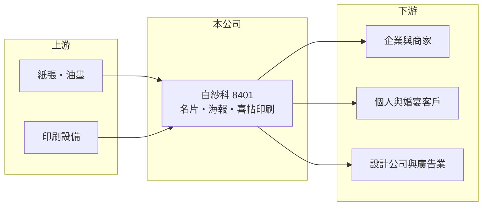

# 8401 白紗科

> 上櫃｜[[產業索引-其他業|其他業]]｜上市（櫃）日期 2010/03/29

# 第一章：企業模式與商業藍圖

> [!info] 撰寫說明
> 精簡版，由 Claude 依公開資料整理，架構比照 [[2330台積電]]，資料截至 2026-10-07。來源：nstock 公司概況頁、winvest 營收快訊。#待校對

白紗科是以名片、海報與喜帖等印刷為主的印刷服務公司，前身為白紗紙品印刷，成立於 2000 年。

- **核心業務：** 承接名片、海報、喜帖等[[商業印刷]]訂單，以少量多樣的印件為主。
- **營收結構：** 以各類印刷品製造為主，產品別營收比重未查得。
- **營運據點：** 以台灣為主要營運地，其他據點細節公開資料有限。
- **長期方向：** 推估持續透過[[網路印刷]]接單與自動化產線，提高小量訂單的處理效率。

# 第二章：護城河深度與競爭優勢

白紗科的競爭力在於大量小額訂單的接單與生產效率。

- **競爭優勢：** 營收規模達 15 億元，在名片與喜帖等小量印件市場具規模經濟，能以標準化流程壓低單件成本（推估）。
- **主要對手：** 地方印刷廠與其他網路印刷平台（推估）。
- **觀察重點：** 月營收是否維持小幅成長，以及紙價與人力成本對毛利率的影響。

# 第三章：財務體質與盈利規模

資料日期：2026-10-07，以下數字是撰寫當時的快照；最新月營收、毛利率、累計 EPS 由自動排程寫在本筆記的屬性欄位（月營收、毛利率、累計EPS 等）。#待校對

白紗科營收穩定，獲利率在印刷業中屬於中上。

- **營收規模：** 2025 年全年營收 15.44 億元；2026 年 1 至 7 月累計 9 億元，年增 4.61%；8 月營收 1.31 億元，年減 1.89%。
- **獲利：** 2026 年第一季 EPS 0.46 元，[[毛利率]] 30.14%，[[營業利益率]] 11.22%，淨利率 8.82%。
- **財務特色：** 近五年平均現金股利 1.45 元；前一年度配發現金股利 1.5 元、股票股利 0.7 元，配息穩定。

# 第四章：總體風險與地緣政治

白紗科的風險在於印刷需求的長期結構變化。

- **產業週期：** 名片、海報等需求與企業活動及婚宴市場相關，景氣差時訂單減少。
- **營運風險：** 數位化使實體名片、喜帖需求長期萎縮，需要靠市占提升抵銷（推估）。
- **其他風險：** 紙張與油墨等原料價格，以及基本工資調升帶動的人力成本。

# 專有名詞解析

## 金融

- **[[毛利率]]**：毛利除以營收，反映產品或服務本身的獲利能力。
- **[[營業利益率]]**：營業利益除以營收，反映本業扣除營業費用後的獲利能力。

## 產業

- **[[商業印刷]]**：為企業或個人印製名片、型錄、海報、喜帖等印刷品的服務。
- **[[網路印刷]]**：客戶在網站上傳檔案、選規格下單，印刷廠以標準化流程合版印製的經營模式。

# 核心供應鏈

- 上游：紙張、油墨與印刷設備供應商
- 下游／客戶：企業與商家、個人與婚宴客戶、設計與廣告業（推估）
- 同業：地方印刷廠與網路印刷平台（推估）

## 最新新聞
<!-- news:start -->
<!-- news:end -->

## 相關連結
- [公開資訊觀測站](https://mopsov.twse.com.tw/mops/web/t05st03?step=1&firstin=1&co_id=8401)
- [Goodinfo](https://goodinfo.tw/tw/StockDetail.asp?STOCK_ID=8401)
- [Yahoo 股市](https://tw.stock.yahoo.com/quote/8401)
- [鉅亨網新聞](https://www.cnyes.com/twstock/8401/news)
