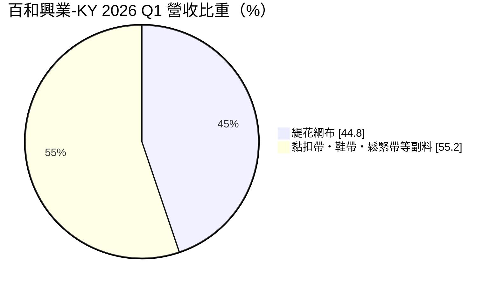
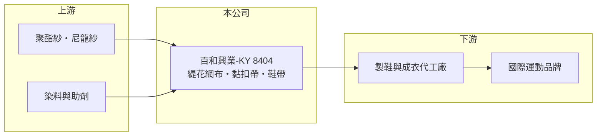

# 8404 百和興業-KY

> 上市｜[[產業索引-其他業|其他業]]｜上市（櫃）日期 2011/05/18

# 第一章：企業模式與商業藍圖

> [!info] 撰寫說明
> 精簡版，由 Claude 依公開資料整理，架構比照 [[2330台積電]]，資料截至 2026-10-07。來源：富果研究 2026 年 7 月法說會摘要。#待校對

百和興業-KY 是國際運動品牌的鞋材與副料供應商，主力產品是[[緹花網布]]。

- **核心業務：** 生產緹花網布，以及[[黏扣帶]]、織鞋帶、鬆緊帶等副料，織法涵蓋直編、橫編與圓編，應用於鞋類與成衣。
- **營收結構：** 2026 年第一季緹花網布占營收 44.8%，其餘為黏扣帶、鞋帶、鬆緊帶等副料；終端以鞋類與成衣為主。
- **營運據點：** 生產基地在中國大陸與越南，印尼廠籌建中。
- **長期方向：** 跟隨品牌客戶與鞋廠的產能移轉，擴大東南亞布局，並以多元織法爭取新款鞋面訂單。

# 第二章：護城河深度與競爭優勢

百和的護城河來自長期品牌認證與多產品一站式供應。

- **競爭優勢：** 客戶包括 Adidas、PUMA、NIKE、Asics、HOKA、On、Under Armour 等國際運動品牌，鞋材需通過品牌認證，進入門檻高；網布與副料可一次供應。
- **主要對手：** 台灣與中國的紡織鞋材廠，例如[[1460宏遠]]等機能布料廠（推估）。
- **觀察重點：** 品牌客戶庫存與下單態度、印尼廠進度，以及新興品牌 HOKA、On 的訂單成長。

# 第三章：財務體質與盈利規模

資料日期：2026-10-07，以下數字是撰寫當時的快照；最新月營收、毛利率、累計 EPS 由自動排程寫在本筆記的屬性欄位（月營收、毛利率、累計EPS 等）。#待校對

百和毛利率維持三成以上。

- **營收規模：** 2026 年上半年營收 38.05 億元。
- **獲利：** 2026 年上半年[[毛利率]] 32.9%，[[營業利益率]] 9.8%；富果摘要列 EPS 0.10 元，但期間與數字待校對。
- **財務特色：** 毛利率在鞋材供應鏈中屬於較高水準；擴建印尼廠需要持續資本支出。

# 第四章：總體風險與地緣政治

百和的風險與運動品牌景氣高度連動。

- **產業週期：** 品牌客戶下單謹慎，訂單能見度約一個月，公司對 2027 年市場態度較保守。
- **營運風險：** 客戶集中在少數國際運動品牌，品牌去庫存時訂單會明顯下滑，存在[[長鞭效應]]。
- **其他風險：** 國際情勢不確定性、原物料成本上漲，以及美國對東南亞的關稅政策與匯率波動。

# 專有名詞解析

## 金融

- **[[毛利率]]**：毛利除以營收，反映產品或服務本身的獲利能力。
- **[[營業利益率]]**：營業利益除以營收，反映本業扣除營業費用後的獲利能力。
- **[[長鞭效應]]**：終端需求的小幅變動，沿供應鏈往上游傳遞時被逐級放大，造成上游庫存與訂單劇烈波動。

## 產業

- **[[緹花網布]]**：以提花織法織出立體紋路與透氣孔的布料，常用於運動鞋鞋面。
- **[[黏扣帶]]**：俗稱魔鬼氈，由勾面與毛面組成、可反覆黏合撕開的扣件。

# 核心供應鏈

- 上游：聚酯紗、尼龍紗、染料與助劑供應商（推估）
- 下游／客戶：製鞋與成衣代工廠，終端品牌為 Adidas、PUMA、NIKE、Asics、HOKA、On、Under Armour
- 同業：[[1460宏遠]]等紡織鞋材廠（推估）

## 最新新聞
<!-- news:start -->
<!-- news:end -->

## 相關連結
- [公開資訊觀測站](https://mopsov.twse.com.tw/mops/web/t05st03?step=1&firstin=1&co_id=8404)
- [Goodinfo](https://goodinfo.tw/tw/StockDetail.asp?STOCK_ID=8404)
- [Yahoo 股市](https://tw.stock.yahoo.com/quote/8404)
- [鉅亨網新聞](https://www.cnyes.com/twstock/8404/news)
