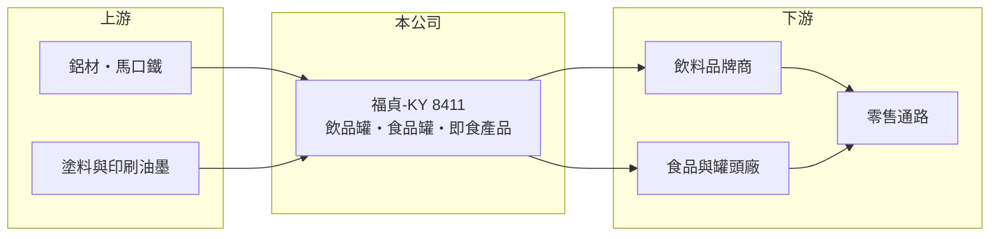

# 8411 福貞-KY

> 上市｜[[產業索引-其他業|其他業]]｜上市（櫃）日期 2011/11/01

# 第一章：企業模式與商業藍圖

> [!info] 撰寫說明
> 精簡版，由 Claude 依公開資料整理，架構比照 [[2330台積電]]，資料截至 2026-10-07。來源：工商時報 2026 年 7 月報導、winvest 營收快訊。#待校對

福貞-KY 是中國大陸的金屬包材製造商，生產飲料與食品用的罐頭容器，並延伸到即食產品。

- **核心業務：** 生產[[二片式鋁罐]]等金屬包材，供應飲品罐與食品罐，另發展即食產品包材。
- **營收結構：** 以飲品罐與食品罐為主，即食產品自 2026 年第二季開始出貨；各產品營收比重未查得。
- **營運據點：** 生產基地在中國大陸，包括福建廠。
- **長期方向：** 提升產能利用率、優化產品組合，拓展即食產品等高附加價值產品線。

# 第二章：護城河深度與競爭優勢

金屬罐屬於規模與在地化的產業，福貞的競爭力在於靠近飲料與食品客戶的產能布局。

- **競爭優勢：** 罐體運輸成本高，在客戶工廠附近設廠能降低物流成本，並與客戶建立長期供貨關係（推估）。
- **主要對手：** 中國大陸的金屬包裝大廠，例如奧瑞金、寶鋼包裝（推估）。
- **觀察重點：** 即食產品的出貨規模，以及飲料旺季與冬季食品罐旺季的拉貨力道。

# 第三章：財務體質與盈利規模

資料日期：2026-10-07，以下數字是撰寫當時的快照；最新月營收、毛利率、累計 EPS 由自動排程寫在本筆記的屬性欄位（月營收、毛利率、累計EPS 等）。#待校對

福貞 2026 年營收成長明顯，但配息金額不高。

- **營收規模：** 2026 年上半年營收創同期新高；4 月至 7 月營收分別為 7.60 億、7.91 億、9.11 億與 9.82 億元，7 月年增 28.17%。
- **獲利：** 本次來源未查得 EPS 與[[毛利率]]。
- **財務特色：** 2026 年配發現金股利每股 0.1 元，除息日為 7 月 22 日，除息參考價 12.6 元。

# 第四章：總體風險與地緣政治

福貞的風險在於中國消費與原料價格。

- **產業週期：** 第三季靠夏季飲品、第四季靠熱飲與火鍋食品罐，季節性明顯；中國消費景氣影響整體需求。
- **營運風險：** 金屬罐產業價格競爭激烈，產能利用率不足時毛利率承壓。
- **其他風險：** 鋁材與馬口鐵等[[原物料]]價格波動；營運在中國，人民幣匯率與兩岸政策也有影響。

# 專有名詞解析

## 金融

- **[[毛利率]]**：毛利除以營收，反映產品或服務本身的獲利能力。

## 產業

- **[[二片式鋁罐]]**：罐身與罐底一體沖壓成形、再加上罐蓋的鋁罐，常用於碳酸飲料與啤酒。
- **[[原物料]]**：生產所需的基礎材料，例如鋼材、銅、塑膠粒，價格波動會直接影響製造業成本。

# 核心供應鏈

- 上游：鋁材、馬口鐵、塗料與印刷油墨供應商（推估）
- 下游／客戶：中國大陸飲料品牌商、食品與罐頭廠
- 同業：奧瑞金、寶鋼包裝等中國金屬包裝廠（推估）

## 最新新聞
<!-- news:start -->
<!-- news:end -->

## 相關連結
- [公開資訊觀測站](https://mopsov.twse.com.tw/mops/web/t05st03?step=1&firstin=1&co_id=8411)
- [Goodinfo](https://goodinfo.tw/tw/StockDetail.asp?STOCK_ID=8411)
- [Yahoo 股市](https://tw.stock.yahoo.com/quote/8411)
- [鉅亨網新聞](https://www.cnyes.com/twstock/8411/news)
