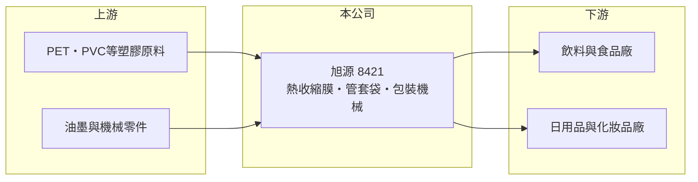

# 8421 旭源

> 上櫃｜[[產業索引-其他業|其他業]]｜上市（櫃）日期 2012/11/23

# 第一章：企業模式與商業藍圖

> [!info] 撰寫說明
> 精簡版，由 Claude 依公開資料整理，架構比照 [[2330台積電]]，資料截至 2026-10-07。來源：nstock 公司概況頁、winvest 營收快訊。公開資料有限。#待校對

旭源是生產熱收縮膜與管套袋等塑膠包裝材料的公司，另有機械設備與模具業務。

- **核心業務：** 製造[[熱收縮膜]]、管套袋等塑膠包裝材料，並生產包裝機械設備與模具，兼營化學製品批發與產品設計。
- **營收結構：** 以塑膠包材為主，搭配包裝機械與模具，各業務營收比重未查得。
- **營運據點：** 以台灣為主要營運地，其他據點公開資料有限。
- **長期方向：** 推估以包材加設備的組合服務飲料與日用品客戶，提高客戶黏著度。

# 第二章：護城河深度與競爭優勢

旭源的優勢在於同時提供包材與包裝設備。

- **競爭優勢：** 包材搭配[[收縮套標]]機械一起供應，客戶導入設備後較常沿用同一家材料（推估）。
- **主要對手：** 台灣與中國的收縮膜與標籤包材廠（推估）。
- **觀察重點：** 2026 年營收成長能否延續，以及營業利益率與淨利率之間的落差。

# 第三章：財務體質與盈利規模

資料日期：2026-10-07，以下數字是撰寫當時的快照；最新月營收、毛利率、累計 EPS 由自動排程寫在本筆記的屬性欄位（月營收、毛利率、累計EPS 等）。#待校對

旭源 2026 年營收雙位數成長，但淨利率偏低。

- **營收規模：** 2025 年全年營收 11.73 億元；2026 年 1 至 8 月累計 9.08 億元，年增 16.99%；6 月營收 1.33 億元，年增 46.59%；8 月營收 1.21 億元，年增 25.5%。
- **獲利：** 2026 年第二季 EPS 0.26 元，[[毛利率]] 21.84%，[[營業利益率]] 7.17%，淨利率 2.99%。
- **財務特色：** 淨利率明顯低於營業利益率，推估有業外損失或較高的利息與稅負；近五年平均現金股利 0.2 元。

# 第四章：總體風險與地緣政治

旭源的風險在於原料價格與下游消費需求。

- **產業週期：** 收縮膜需求跟隨飲料與日用品消費，夏季飲料旺季影響較大（推估）。
- **營運風險：** 包材產品同質性高，價格競爭可能壓縮毛利率。
- **其他風險：** PET、PVC 等塑膠原料價格隨油價波動；限塑與環保法規可能影響塑膠包材需求。

# 專有名詞解析

## 金融

- **[[毛利率]]**：毛利除以營收，反映產品或服務本身的獲利能力。
- **[[營業利益率]]**：營業利益除以營收，反映本業扣除營業費用後的獲利能力。

## 產業

- **[[熱收縮膜]]**：加熱後會收縮、緊貼容器外形的塑膠薄膜，常用於瓶身標籤與集合包裝。
- **[[收縮套標]]**：把印好圖案的熱收縮膜套在瓶身，再加熱收縮成貼合標籤的包裝方式。

# 核心供應鏈

- 上游：PET、PVC 等塑膠原料，油墨與機械零件供應商（推估）
- 下游／客戶：飲料、食品、日用品與化妝品製造商（推估）
- 同業：台灣與中國收縮膜與標籤包材廠（推估）

## 最新新聞
<!-- news:start（自動產生，請勿手動編輯此範圍） -->
- 2026-10-06 🏛️ 重訊 13:57｜公告本公司受邀參加台中銀證券於115年10月07日舉辦之法人說明會相關資訊｜[觀測站](https://mops.twse.com.tw/mops/#/web/t05st01)

完整紀錄：[[8421旭源 新聞]]
<!-- news:end -->

## 相關連結
- [公開資訊觀測站](https://mopsov.twse.com.tw/mops/web/t05st03?step=1&firstin=1&co_id=8421)
- [Goodinfo](https://goodinfo.tw/tw/StockDetail.asp?STOCK_ID=8421)
- [Yahoo 股市](https://tw.stock.yahoo.com/quote/8421)
- [鉅亨網新聞](https://www.cnyes.com/twstock/8421/news)
