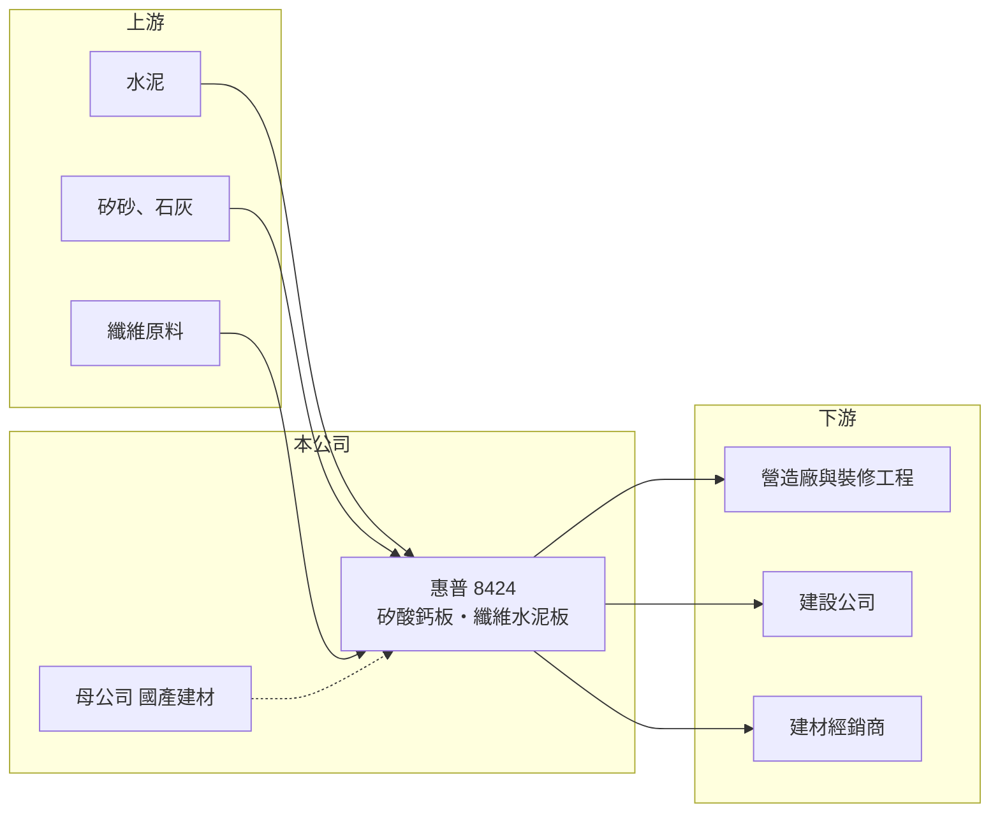

# 8424 惠普

> 上櫃｜[[產業索引-建材營造業|建材營造業]]｜上市（櫃）日期 2012/12/18

# 第一章：企業模式與商業藍圖

> [!info] 撰寫說明
> 精簡版，由 Claude 依公開資料整理，架構比照 [[2330台積電]]，資料截至 2026-10-08。來源：櫃買中心開放資料（基本資料、資產負債、綜合損益、本益比殖利率、每月營收）、Goodinfo 年度經營績效、富邦 e 點通（MoneyDJ）公司基本資料。工廠位置、品牌與客戶結構未查得。#待校對

本章說明惠普（8424）如何以矽酸鈣板與纖維水泥板兩項建築板材，建立穩定獲利的利基建材事業。

- **核心業務：** 惠普成立於 1981 年，2012 年上櫃，實收資本額約 3.6 億元，董事長由 [[2504國產]]（國產建材實業）的法人代表擔任，屬於國產建材集團的一員。公司生產[[矽酸鈣板]]與[[纖維水泥板]]，兩者都是用於隔間牆、天花板與外牆的防火建築板材。
- **營收結構：** 依 MoneyDJ 2025 年營收比重，矽酸鈣板占 64.5%、纖維水泥板占 35.3%，其他不到 1%，產品高度集中在建築板材。這類板材在建案施工的中後段使用，因此出貨會跟著建案完工與交屋潮走。
- **商業模式：** 板材的原料是水泥、矽砂、石灰與纖維，經抄造與高溫高壓養護成型，屬於資本與技術門檻中等、但需要穩定品質認證的製造業。惠普歷年營業利益率維持在 18% 至 22%，遠高於一般建材，顯示產品規格與通路關係帶來一定定價能力。
- **長期方向：** 台灣建築法規對防火、耐震與綠建材的要求逐步提高，乾式隔間取代傳統磚牆的趨勢有利於板材需求。惠普背後有國產建材在預拌混凝土與營建通路上的資源，長期可以把板材銷售綁在集團的建案客戶網絡中。

# 第二章：護城河深度與競爭優勢

本章分析惠普在建築板材市場的護城河與競爭者。

- **競爭優勢：** 第一是防火認證與品質，建築板材必須取得防火時效等認證才能用在建案，新進者需要時間累積檢驗與工程實績。第二是集團通路，國產建材在營建業有長期客戶關係，有助於板材打進建商與營造廠的採購清單。第三是穩定的獲利紀錄，2020 至 2025 年毛利率維持在 27% 至 35%。
- **主要對手：** 國內有其他矽酸鈣板與纖維水泥板製造商，另有日本與中國的進口板材，石膏板、輕質混凝土板等替代建材也在隔間市場競爭。進口板材價格較低，對惠普的定價形成長期壓力（實際市占率未查得）。
- **觀察重點：** 第一是毛利率能否維持在 30% 以上，2025 年為 34.7%，創近六年新高。第二是國內建案完工量的變化，因為板材需求落後於新屋開工約一至兩年。第三是母公司國產建材的集團策略是否改變惠普的定位。

# 第三章：財務體質與盈利規模

資料日期：2026-10-08，表格是撰寫當時的快照；最新月營收、毛利率、累計 EPS 由自動排程寫在本筆記的屬性欄位（月營收、毛利率、累計EPS 等）。#待校對

本章用六年數字檢視惠普穩定的獲利能力與配息習慣。

| 年度 | 營收（新台幣） | [[毛利率]] | [[營業利益率]] | EPS（元） | [[ROE]] |
|---|---|---|---|---|---|
| 2020 | 8.24 億 | 31.0% | 21.3% | 4.06 | 13.8% |
| 2021 | 8.91 億 | 31.3% | 22.2% | 4.61 | 15.5% |
| 2022 | 10.3 億 | 30.3% | 21.8% | 5.20 | 17.1% |
| 2023 | 9.52 億 | 27.5% | 19.0% | 4.24 | 13.9% |
| 2024 | 10.3 億 | 29.4% | 18.6% | 4.61 | 15.0% |
| 2025 | 10.8 億 | 34.7% | 22.4% | 5.80 | 18.3% |

- **營收規模：** 營收從 2020 年的 8.24 億元成長到 2025 年的 10.8 億元，年複合成長率約 5.6%（推算），成長溫和但穩定。依櫃買中心資料，2026 年上半年營收約 5.47 億元、EPS 3.24 元。
- **獲利：** 六年來 EPS 都在 4 至 6 元之間，近五年（2021 至 2025）平均 ROE 約 16.0%（推算）。營業利益率穩定在 2 成上下，說明成本結構與產品價格長期維持平衡，沒有明顯的景氣大虧年度。
- **財務特色：** 2026 年第二季歸屬母公司權益約 11.1 億元，每股淨值 30.69 元，總負債僅約 2.5 億元，MoneyDJ 所列負債比例約 18%，幾乎沒有財務槓桿。依櫃買中心資料，最近年度現金股利為每股 5 元，以 2025 年 EPS 5.80 元計算[[配息率]]約 86%（推算），Goodinfo 統計 2010 年以來平均現金股利約 3.05 元，屬於高配息的穩定股。
- **[[ROIC]] 與 [[WACC]]：** 2025 年營業利益約 2.42 億元（10.8 億 × 22.4%），以稅率 20% 計稅後約 1.94 億元；投入資本以股東權益約 11.1 億元計（有息負債未查得，依低負債比例假設極少），ROIC 約 17.5%（推算，權益中含現金，實際營運資本報酬應更高）。WACC 以 CAPM 推估：無風險利率 1.75%、市場風險溢酬 6%，MoneyDJ 的 β 為 0.02 不具代表性，改用建材業常見值 0.8，股東權益成本約 6.55%；幾乎無負債，WACC 約 6.5%（推算）。ROIC 長期高出 WACC 約 10 個百分點，代表惠普是持續創造價值的小型利基公司。

# 第四章：總體風險與地緣政治

本章整理惠普長期必須面對的風險。

- **產業週期：** 建築板材需求跟著新建案完工量走，房市受[[信用管制]]或利率上升影響而降溫時，一至兩年後板材出貨就會減少。惠普營收九成以上來自國內營建市場，缺乏外銷或其他產業的緩衝。
- **營運風險：** 產品只有兩大類，若替代建材或新工法普及，需求可能被侵蝕。母公司持股集中，集團內交易與資源分配的決策會直接影響惠普的獲利與股利政策。
- **其他風險：** 水泥、矽砂與纖維原料價格上漲會壓縮毛利；板材生產需要高溫高壓養護，能源成本與碳費政策會提高製造成本；進口板材的價格競爭則限制漲價空間。

# 專有名詞解析

## 金融

- **[[信用管制]]**：央行限制房貸成數、寬限期與土建融條件的政策，用來抑制房市過熱。
- **[[配息率]]**：現金股利占每股盈餘的比例，反映公司把多少獲利發還股東。
- **[[ROIC]]**：投入資本報酬率，稅後營業利益除以投入資本，衡量本業運用資金創造報酬的能力。
- **[[WACC]]**：加權平均資金成本，股東與債權人要求報酬率的加權平均，ROIC 高於 WACC 才代表創造價值。

## 產業

- **[[矽酸鈣板]]**：以矽質、鈣質原料與纖維經高溫高壓製成的建築板材，防火、防潮，用於隔間與天花板。
- **[[纖維水泥板]]**：以水泥與纖維製成的建築板材，強度高、耐候，常用於外牆與乾式隔間。

# 核心供應鏈

- 上游：水泥（例如 [[1101台泥]]、[[1102亞泥]]，產業參考，實際供應商未查得）、矽砂、石灰與纖維原料。
- 下游／客戶：營造廠、室內裝修工程、建設公司與建材經銷商；母公司 [[2504國產]] 的營建客戶網絡是重要通路。
- 同業：國內其他矽酸鈣板與纖維水泥板廠，以及日本、中國進口板材；替代品包括石膏板與輕質隔間板。

## 最新新聞
<!-- news:start -->
<!-- news:end -->

## 相關連結
- [公開資訊觀測站](https://mopsov.twse.com.tw/mops/web/t05st03?step=1&firstin=1&co_id=8424)
- [Goodinfo](https://goodinfo.tw/tw/StockDetail.asp?STOCK_ID=8424)
- [Yahoo 股市](https://tw.stock.yahoo.com/quote/8424)
- [鉅亨網新聞](https://www.cnyes.com/twstock/8424/news)
