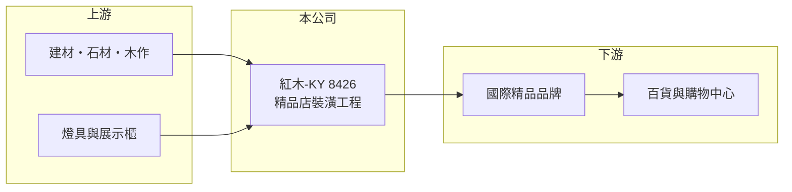

# 8426 紅木-KY

> 上櫃｜[[產業索引-其他業|其他業]]｜上市（櫃）日期 2011/12/13

# 第一章：企業模式與商業藍圖

> [!info] 撰寫說明
> 精簡版，由 Claude 依公開資料整理，架構比照 [[2330台積電]]，資料截至 2026-10-07。來源：nstock 公司概況頁、winvest 營收快訊。公開資料有限。#待校對

紅木-KY 是以控股公司架構上市的裝潢工程公司，專做全球高級精品名牌店的店面裝修。

- **核心業務：** 承攬國際[[精品品牌]]門市的室內裝潢與店面工程，屬於商業空間[[統包工程]]。
- **營收結構：** 營收來自精品店裝潢專案，依完工進度認列；客戶別與地區別比重未查得。
- **營運據點：** 控股公司註冊於海外，營運據點細節公開資料有限，推估以大中華與亞洲市場為主。
- **長期方向：** 推估持續跟隨精品品牌的展店與改裝計畫爭取專案。

# 第二章：護城河深度與競爭優勢

紅木的競爭力來自精品品牌的長期合作與施工品質認證。

- **競爭優勢：** 精品品牌對施工品質、材料與工期要求嚴格，合格承包商名單不易進入（推估）。
- **主要對手：** 其他國際商業空間裝修與店鋪工程公司（推估）。
- **觀察重點：** 精品品牌在亞洲的展店與改裝步調，以及 2026 年虧損何時收斂。

# 第三章：財務體質與盈利規模

資料日期：2026-10-07，以下數字是撰寫當時的快照；最新月營收、毛利率、累計 EPS 由自動排程寫在本筆記的屬性欄位（月營收、毛利率、累計EPS 等）。#待校對

紅木 2026 年營收下滑並轉為虧損。

- **營收規模：** 2025 年全年營收 27.07 億元；2026 年 1 至 8 月累計 15.61 億元，年減 4.72%；8 月營收 1.98 億元，年減 29.28%。
- **獲利：** 2025 年全年 EPS 1.85 元；2026 年第二季 EPS -0.68 元，上半年累計 -1.10 元。第二季[[毛利率]] 18.63%，[[營業利益率]] -6.12%。
- **財務特色：** 資本額 5.02 億元，市值約 10.5 億元；工程業務的應收帳款與合約資產比重通常較高（推估）。

# 第四章：總體風險與地緣政治

紅木的風險集中在精品產業景氣與專案執行。

- **產業週期：** 精品品牌在需求轉弱時會延後展店與改裝，直接減少裝潢專案。
- **營運風險：** 專案制營收波動大，成本超支或工期延誤會直接造成虧損；客戶集中於少數精品集團。
- **其他風險：** 中國大陸消費景氣影響精品展店；跨國營運有匯率風險。

# 專有名詞解析

## 金融

- **[[毛利率]]**：毛利除以營收，反映產品或服務本身的獲利能力。
- **[[營業利益率]]**：營業利益除以營收，反映本業扣除營業費用後的獲利能力。

## 產業

- **[[精品品牌]]**：以高單價服飾、皮件、珠寶與鐘錶為主的奢侈品牌，門市裝潢規格要求高。
- **[[統包工程]]**：由單一廠商負責設計、採購到施工的整體工程承攬模式。

# 核心供應鏈

- 上游：建材、石材、木作、燈具與展示櫃供應商（推估）
- 下游／客戶：國際精品品牌門市，設點於百貨與購物中心
- 同業：國際商業空間裝修公司（推估）

## 最新新聞
<!-- news:start -->
<!-- news:end -->

## 相關連結
- [公開資訊觀測站](https://mopsov.twse.com.tw/mops/web/t05st03?step=1&firstin=1&co_id=8426)
- [Goodinfo](https://goodinfo.tw/tw/StockDetail.asp?STOCK_ID=8426)
- [Yahoo 股市](https://tw.stock.yahoo.com/quote/8426)
- [鉅亨網新聞](https://www.cnyes.com/twstock/8426/news)
