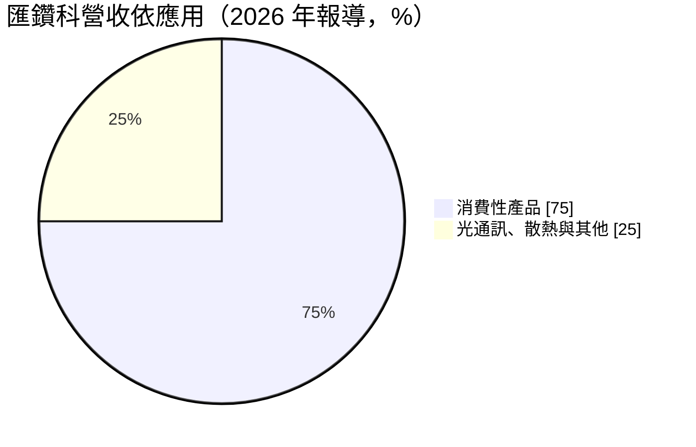
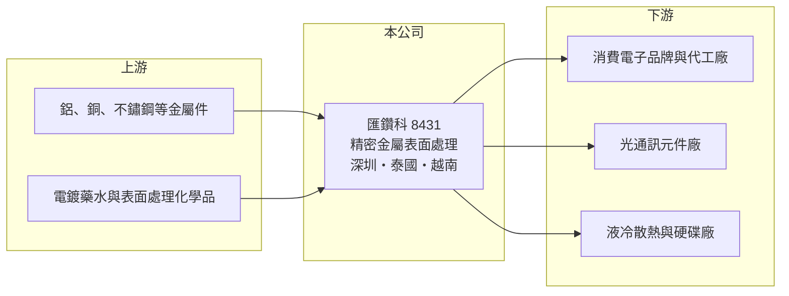

# 8431 匯鑽科

> 上櫃｜[[產業索引-其他電子業|其他電子業]]｜上市（櫃）日期 2015/03/30

# 第一章：企業模式與商業藍圖

> [!info] 撰寫說明
> 精簡版，由 Claude 依公開資料整理，架構比照 [[2330台積電]]，資料截至 2026-10-08。來源：聯合新聞網 2026 年匯鑽科轉型報導、nStock 匯鑽科公司概況、MoneyDJ 理財網財務比率年表（2021 至 2025 年）。#待校對

匯鑽科是以中國深圳為基地的精密金屬表面處理廠，正從消費電子機構件轉向 AI 資料中心的光通訊、液冷散熱與硬碟金屬件。

- **核心業務：** 匯鑽科長期替國際大廠做精密金屬件的[[表面處理]]，例如陽極、電鍍與塗裝等工藝，讓金屬零件具備耐腐蝕、導電或外觀需求。表面處理是金屬件出貨前的最後關鍵工序，良率與一致性直接影響客戶的成品品質。
- **營收結構：** 依 2026 年報導，消費性產品約占營收 75%，公司目標把比重快速降到 20%。新業務包括[[光收發模組]]的金屬套件表面處理，客戶涵蓋 [[AVGO博通]]、Lumentum 等光通訊元件大廠。
- **營運據點：** 深圳既有產能占營收七成以上；泰國新廠與越南新廠在 2026 年下半年陸續到位，泰國業務已占營收兩成多。往東南亞擴廠，是為了配合客戶分散中國以外產地的需求。
- **長期方向：** 公司聚焦三個 AI 相關領域：[[液冷散熱]]系統的金屬組件（並自主生產水冷散熱零件）、[[CPO]] 共同封裝光學模組，以及資料中心用的高容量近線硬碟金屬件。若轉型成功，營收將從消費電子的週期性需求，轉向資料中心的資本支出循環。

# 第二章：護城河深度與競爭優勢

匯鑽科的優勢在精密金屬表面處理的工藝經驗與國際客戶認證，但這項優勢要靠新產能放量才能轉成獲利。

- **競爭優勢：** 精密金屬件的表面處理需要控制膜厚、色差與潔淨度，光通訊與硬碟零件對微粒與釋氣的要求更嚴格。匯鑽科多年服務國際一線客戶，熟悉各種複雜金屬材料的處理工藝，通過認證後客戶不會輕易更換供應商。
- **主要對手：** 中國華南地區有大量金屬表面處理廠，價格競爭激烈；在光通訊與散熱金屬件方面，對手還包括台灣的散熱模組廠與精密機構件廠。
- **觀察重點：** 長期要看泰國與越南廠能否順利取得 AI 相關客戶的量產訂單，讓非消費性產品比重真正超過一半。新廠投產初期折舊與人事成本高，產能利用率爬升的速度決定虧損期的長短。

# 第三章：財務體質與盈利規模

資料日期：2026-10-08，表格是撰寫當時的快照；最新月營收、毛利率、累計 EPS 由自動排程寫在本筆記的屬性欄位（月營收、毛利率、累計EPS 等）。#待校對

匯鑽科在 2021 年獲利達到高點，之後隨消費電子需求轉弱而下滑，2025 年在轉型與新廠投入期出現大額虧損。

| 年度 | 營收（億元） | [[毛利率]] | [[營業利益率]] | EPS（元） | [[ROE]] |
|---|---|---|---|---|---|
| 2021 | 約 13.4（推算） | 36.51% | 21.79% | 4.24 | 23.12% |
| 2022 | 約 11.2（推算） | 23.35% | 7.79% | 0.59 | 4.25% |
| 2023 | 約 9.1（推算） | 22.74% | 3.83% | 0.59 | 1.72% |
| 2024 | 約 10.2（推算） | 26.95% | 8.01% | 1.26 | 5.38% |
| 2025 | 10.46 | 12.79% | -10.72% | -3.88 | -18.33% |

註：2025 年營收取自 nStock；其他年度依 MoneyDJ 營收成長率回推。

- **長期指標：** 2021 至 2025 年營收年複合成長率約 -6%（推算），近 5 年平均 ROE 約 3.2%（推算），波動很大。近五年平均現金股利約 0.5 元，2024 年另配發股票股利 1.02 元。
- **[[ROIC]] 與 [[WACC]]：** 2025 年稅後營業利益約 -0.9 億元，ROIC 約 -7.5%（推算：分母為股東權益約 7.6 億元加有息負債以總負債一半推估約 4.4 億元）。WACC 推估約 6.0%（推算：無風險利率 1.75%、市場風險溢酬 6%、β 取轉型中小型電子股常見值 1.1，股東權益成本 8.35%；稅前負債成本 2.5%、稅率 20%；權益比重約 64%）。2021 年 ROIC 遠高於 WACC，2022 至 2024 年接近或低於資金成本，2025 年明顯低於，代表轉型期正在消耗價值，要等新廠放量才有機會扭轉。
- **財務特色：** 負債比率由 2024 年的 31.10% 升到 2025 年的 53.25%，每股淨值由 22.77 元降到 16.32 元，反映擴廠資金需求與虧損同時發生。

# 第四章：總體風險與地緣政治

匯鑽科的風險集中在轉型執行與新廠投資回收。

- **產業週期：** 消費電子機構件需求隨手機、筆電等產品的換機週期起伏；AI 資料中心需求雖然強，但跟著雲端業者的資本支出循環變動，一旦資本支出放緩，光通訊與散熱零件訂單也會調整。
- **營運風險：** 泰國、越南新廠同時投產，管理跨國工廠的難度高，良率與產能利用率若爬升太慢，虧損會延長。客戶集中在少數國際大廠，單一客戶轉單影響很大。
- **其他風險：** 表面處理涉及化學藥水與廢水，環保法規趨嚴會提高成本；美中關係與關稅政策是公司往東南亞分散產能的主要原因，也帶來持續的不確定性。

# 專有名詞解析

## 金融

- **[[ROIC]]**：投入資本報酬率，稅後營業利益除以股東權益加有息負債，衡量本業運用資本的效率。
- **[[WACC]]**：加權平均資金成本，股東與債權人要求報酬率的加權平均，是 ROIC 要超越的門檻。

## 產業

- **[[表面處理]]**：在金屬或塑膠表面以陽極、電鍍、塗裝等方式改變外觀與耐腐蝕、導電等性質的製程。
- **[[光收發模組]]**：把電訊號轉成光訊號、再轉回電訊號的模組，是資料中心與電信網路的關鍵零件。
- **[[液冷散熱]]**：以液體帶走晶片熱量的散熱方式，散熱效率高於風扇氣冷，適合高功耗 AI 伺服器。
- **[[CPO]]**：共同封裝光學，把光學引擎和交換器晶片封裝在一起，縮短電訊號傳輸距離以降低功耗。

# 核心供應鏈

- 上游：鋁、銅、不鏽鋼等金屬零件加工廠，電鍍藥水與表面處理化學品供應商
- 下游／客戶：消費電子品牌與代工廠、[[AVGO博通]]與 Lumentum 等光通訊元件廠、液冷散熱與資料中心硬碟廠
- 同業：中國華南的金屬表面處理廠、台灣精密機構件與散熱零組件廠

## 最新新聞
<!-- news:start -->
<!-- news:end -->

## 相關連結
- [公開資訊觀測站](https://mopsov.twse.com.tw/mops/web/t05st03?step=1&firstin=1&co_id=8431)
- [Goodinfo](https://goodinfo.tw/tw/StockDetail.asp?STOCK_ID=8431)
- [Yahoo 股市](https://tw.stock.yahoo.com/quote/8431)
- [鉅亨網新聞](https://www.cnyes.com/twstock/8431/news)
