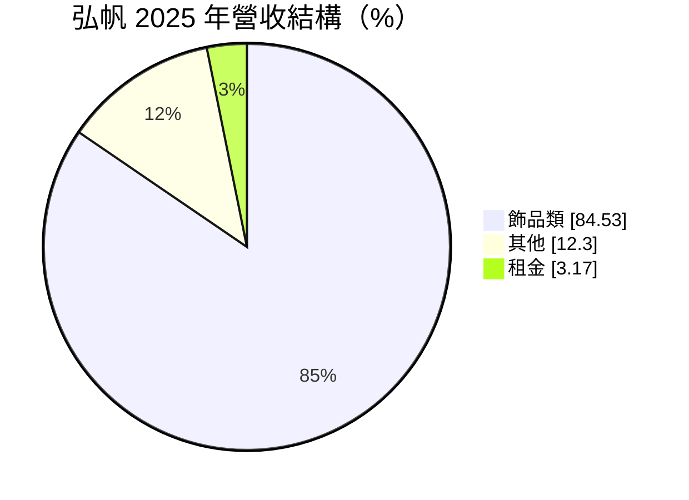
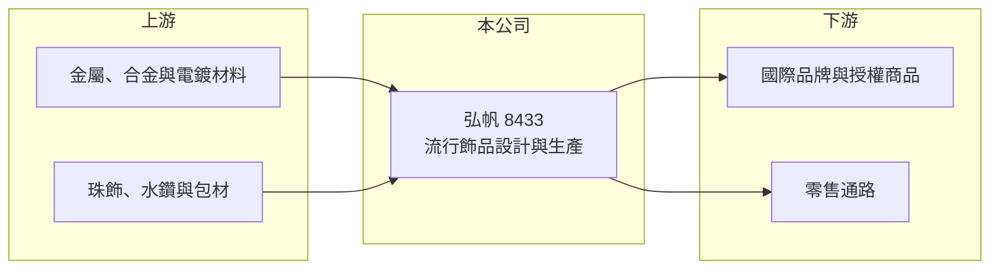

# 8433 弘帆

> 上櫃｜[[產業索引-居家生活|居家生活]]｜上市（櫃）日期 2012/12/19

# 第一章：企業模式與商業藍圖

> [!info] 撰寫說明
> 精簡版，由 Claude 依公開資料整理，架構比照 [[2330台積電]]，資料截至 2026-10-08。來源：MoneyDJ 理財網財務比率年表（2021 至 2025 年）與個股基本資料（2025 年營收比重）、櫃買中心公開資料彙整的 2026 年第二季財報與股利資料、科技新報 2016 年報導標題。公開資料有限，客戶與生產據點細節未逐條查證。#待校對

弘帆是以飾品為主力的上櫃公司，2025 年飾品類占營收約 85%，長期替國際品牌與零售通路供應流行飾品，並有少量租金收入。

- **核心業務：** 弘帆 1985 年成立，2012 年上櫃，主要從事流行飾品的設計開發與生產供應，產品以客戶品牌銷售，屬於飾品的 [[ODM]]／[[OEM]] 業者。2016 年媒體曾以迪士尼相關商品報導弘帆，顯示公司長期經營的是國際品牌與[[授權商品]]的飾品訂單（客戶細節本次未查得）。
- **營收結構：** 依 MoneyDJ 資料，2025 年飾品類占 84.53%，其他占 12.30%，租金占 3.17%。飾品是主要獲利來源，租金收入規模小但穩定，可以在景氣差時提供一點底部支撐。

- **營運據點：** 總部位於台北市內湖區；生產據點本次未查得，依飾品產業慣例推估以中國或東南亞工廠為主。董事長由法人股東普世開發的代表人擔任。
- **長期方向：** 流行飾品需求跟著國際品牌與零售通路的商品企劃走，弘帆的長期成長取決於能否持續拿到品牌客戶的新系列訂單，並把生產布局調整到符合客戶對產地與合規的要求。

# 第二章：護城河深度與競爭優勢

弘帆的優勢在於長期品牌客戶關係與快速打樣量產的能力，但飾品代工進入門檻不高，護城河屬於中等偏窄。

- **競爭優勢：** 2022 至 2024 年營業利益率達 13% 至 16%、ROE 超過 20%，對代工業來說相當高，代表公司在設計開發、品質與交期上獲得客戶認可，能接到附加價值較高的品牌與授權商品訂單。授權商品對品管與合規要求嚴格，供應商一旦通過認證就不容易被替換。
- **主要對手：** 主要競爭者是中國廣東、浙江一帶的大量飾品工廠，以及東南亞的代工廠。這些對手在一般流行飾品上價格更低，弘帆必須靠設計與品質維持差異。
- **觀察重點：** 2025 年 EPS 由 9.84 元降到 3.17 元，ROE 降到 6.9%，顯示獲利高度受單一年度訂單影響。長期要看營業利益率能否回到 13% 以上，以及客戶與產品系列是否更分散。

# 第三章：財務體質與盈利規模

資料日期：2026-10-08，表格是撰寫當時的快照；最新月營收、毛利率、累計 EPS 由自動排程寫在本筆記的屬性欄位（月營收、毛利率、累計EPS 等）。#待校對

弘帆 2022 至 2024 年獲利處於高峰，2025 年明顯回落，但營收規模大致維持在 35 億元上下。

| 年度 | 營收（億元） | [[毛利率]] | [[營業利益率]] | EPS（元） | [[ROE]] |
|---|---|---|---|---|---|
| 2021 | 約 28.2（推算） | 21.58% | 10.31% | 4.00 | 14.26% |
| 2022 | 約 31.4（推算） | 24.91% | 13.18% | 9.67 | 29.34% |
| 2023 | 約 34.7（推算） | 27.81% | 15.93% | 9.35 | 23.67% |
| 2024 | 約 36.1（推算） | 26.68% | 13.65% | 9.84 | 21.90% |
| 2025 | 約 34.8（推算） | 23.30% | 10.15% | 3.17 | 6.92% |

註：2025 年營收以每股營業額 63.92 元乘以約 5,451 萬股推算，其他年度依 MoneyDJ 營收成長率回推。2025 年營業利益率 10.15% 與 EPS 3.17 元落差較大，推估有業外損失或一次性費用，原因未查得。

- **長期指標：** 2021 至 2025 年營收年複合成長率約 5.4%（推算），近 5 年平均 ROE 約 19.2%（推算）。最新一年度現金股利 4.2 元，高於 2025 年 EPS，顯示公司願意動用累積盈餘維持配息。自由現金流資料本次未查得。
- **[[ROIC]] 與 [[WACC]]：** 2025 年稅後營業利益約 2.8 億元（營收約 34.8 億元 × 營業利益率 10.15% × 0.8），投入資本約 35.0 億元（2026 年第二季股東權益約 23.7 億元，加上以總負債約 22.6 億元的一半推估的有息負債約 11.3 億元），ROIC 約 8.1%（推算）；2023 年高峰時約 12.6%（推算）。WACC 約 5.5%（推算：無風險利率 1.75%、市場風險溢酬 6%、β 取消費品代工同業常見值 0.9，股東權益成本 7.15%；稅前負債成本 2.5%、稅率 20%；權益比重約 68%）。即使在 2025 年的低點，ROIC 仍高於 WACC，代表弘帆的本業長期有替股東創造價值。
- **財務特色：** 負債比率長期維持在 50% 至 54%，以飾品代工來說偏高，推估與營運資金與不動產有關。2026 年上半年 EPS 2.79 元，其中有部分來自業外收入，獲利已較 2025 年回升。

# 第四章：總體風險與地緣政治

弘帆的風險集中在客戶訂單的波動、流行趨勢與生產地的貿易政策。

- **產業週期：** 流行飾品屬於可選消費，品牌與零售通路會依庫存與銷售狀況調整下單，景氣轉弱時訂單會被放大縮減。授權商品還受電影、角色等題材熱度影響，年度之間差異大。
- **營運風險：** 客戶若集中在少數國際品牌，任何一家改變採購策略或轉單，都會明顯影響營收與獲利，2025 年獲利大幅下滑就是例子。金屬、電鍍材料與人工成本上升也會壓縮毛利。
- **其他風險：** 美國對中國製品的關稅會迫使客戶要求轉移產地；國際品牌對重金屬含量、勞動條件等合規要求日益嚴格，增加稽核與生產成本；營收以美元計價為主，匯率波動會影響獲利。

# 專有名詞解析

## 金融

- **[[ROIC]]**：投入資本報酬率，稅後營業利益除以股東權益加有息負債，衡量本業運用資本的效率。
- **[[WACC]]**：加權平均資金成本，股東與債權人要求報酬率的加權平均，是 ROIC 要超越的門檻。

## 產業

- **[[ODM]]**：原廠委託設計製造，代工廠負責產品設計與生產，產品掛品牌客戶的名稱銷售。
- **[[OEM]]**：原廠委託製造，代工廠依品牌客戶的設計與規格生產，產品掛品牌商的商標。
- **[[授權商品]]**：品牌或角色版權方授權廠商使用其圖案與名稱生產的商品，需通過版權方的品質與合規審核。

# 核心供應鏈

- 上游：金屬與合金、電鍍材料、珠飾與包材供應商（供應商名稱未查得）。
- 下游／客戶：國際品牌、授權商品業者與零售通路（客戶名稱與比重未查得）。
- 同業：中國廣東、浙江與東南亞的流行飾品代工廠。

## 最新新聞
<!-- news:start -->
<!-- news:end -->

## 相關連結
- [公開資訊觀測站](https://mopsov.twse.com.tw/mops/web/t05st03?step=1&firstin=1&co_id=8433)
- [Goodinfo](https://goodinfo.tw/tw/StockDetail.asp?STOCK_ID=8433)
- [Yahoo 股市](https://tw.stock.yahoo.com/quote/8433)
- [鉅亨網新聞](https://www.cnyes.com/twstock/8433/news)
