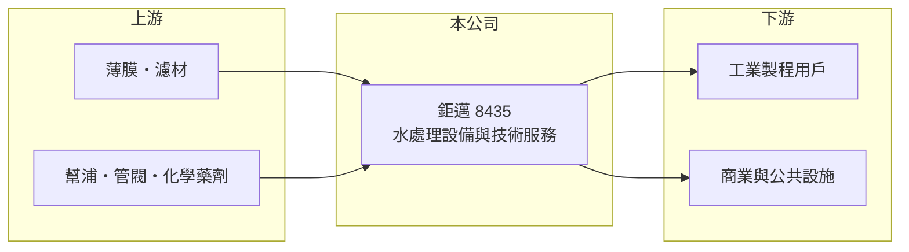

# 8435 鉅邁

> 上櫃｜[[產業索引-其他業|其他業]]｜上市（櫃）日期 2012/12/28

# 第一章：企業模式與商業藍圖

> [!info] 撰寫說明
> 精簡版，由 Claude 依公開資料整理，架構比照 [[2330台積電]]，資料截至 2026-10-07。來源：poorstock 基本資料頁、winvest 營收快訊。公開資料有限。#待校對

鉅邁是專業水處理公司，提供水處理應用與技術服務，總部位於新北市汐止。

- **核心業務：** 提供[[水處理]]系統、相關耗材與技術服務，協助客戶處理製程用水與廢水（推估）。
- **營收結構：** 以水處理設備與技術服務為主，細項營收比重未查得。
- **營運據點：** 總部在新北市汐止，股本約 3.52 億元。
- **長期方向：** 推估受惠於產業用水回收與環保法規趨嚴，擴大[[水資源回收]]與維運服務。

# 第二章：護城河深度與競爭優勢

鉅邁的競爭力在於水處理技術與長期維運關係。

- **競爭優勢：** 水處理系統需長期維護與耗材更換，建置後可帶來持續性服務收入（推估）。
- **主要對手：** [[8473山林水]]等台灣水處理與環保工程公司（推估）。
- **觀察重點：** 月營收年增趨勢能否延續，以及季度 EPS 的穩定度。

# 第三章：財務體質與盈利規模

資料日期：2026-10-07，以下數字是撰寫當時的快照；最新月營收、毛利率、累計 EPS 由自動排程寫在本筆記的屬性欄位（月營收、毛利率、累計EPS 等）。#待校對

鉅邁營收規模小，但獲利能力不錯。

- **營收規模：** 2026 年第一季營收約 1.56 億元，上半年累計約 3.26 億元（推算）；7 月營收 6,317 萬元，年增 31.37%；8 月 5,561 萬元，年增 8.29%。
- **獲利：** 2026 年第一季 EPS 0.83 元，資料頁列上半年 EPS 2.88 元（是否為累計待校對）；2025 年單季 EPS 介於 1.33 元至 3.91 元。
- **財務特色：** 股本約 3.52 億元，規模小，單一專案認列就會造成季度獲利明顯波動；[[毛利率]]未查得。

# 第四章：總體風險與地緣政治

鉅邁的風險在於規模小與專案集中。

- **產業週期：** 水處理設備需求跟隨客戶擴廠與資本支出，製造業投資放緩時訂單可能減少。
- **營運風險：** 專案認列時點不均，季度獲利波動大；客戶集中度未公開。
- **其他風險：** 環保法規變動會影響需求方向；設備與化學品採購有原料與匯率風險。

# 專有名詞解析

## 金融

- **[[毛利率]]**：毛利除以營收，反映產品或服務本身的獲利能力。

## 產業

- **[[水處理]]**：透過過濾、薄膜、化學與生物方法淨化用水或廢水的技術與工程。
- **[[水資源回收]]**：將廢水處理後再利用於製程或其他用途，以降低用水量與排放。

# 核心供應鏈

- 上游：薄膜、濾材、幫浦、管閥與化學藥劑供應商（推估）
- 下游／客戶：工業製程用水與廢水處理客戶、商業與公共設施（推估）
- 同業：[[8473山林水]]等水處理與環保工程公司（推估）

## 最新新聞
<!-- news:start -->
<!-- news:end -->

## 相關連結
- [公開資訊觀測站](https://mopsov.twse.com.tw/mops/web/t05st03?step=1&firstin=1&co_id=8435)
- [Goodinfo](https://goodinfo.tw/tw/StockDetail.asp?STOCK_ID=8435)
- [Yahoo 股市](https://tw.stock.yahoo.com/quote/8435)
- [鉅亨網新聞](https://www.cnyes.com/twstock/8435/news)
