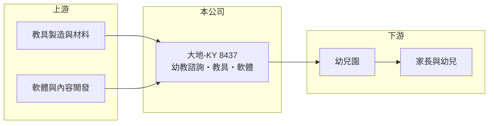

# 8437 大地-KY

> 上櫃｜[[產業索引-其他業|其他業]]｜上市（櫃）日期 2015/05/06

# 第一章：企業模式與商業藍圖

> [!info] 撰寫說明
> 精簡版，由 Claude 依公開資料整理，架構比照 [[2330台積電]]，資料截至 2026-10-07。來源：nstock 公司概況頁、winvest 營收快訊。公開資料有限。#待校對

大地-KY 是以中國大陸市場為主的幼教服務公司，提供教育諮詢、教具與軟體。

- **核心業務：** 提供教育諮詢與企業管理諮詢服務，研發與銷售[[學前教育]]教具與自產電腦軟體，以及幼教相關服務。
- **營收結構：** 營收來自幼教諮詢服務、教具與軟體銷售，各項比重未查得。
- **營運據點：** 以 KY 控股公司架構上市，營運以中國大陸為主（推估）。
- **長期方向：** 推估朝數位教材與幼教加盟服務發展，以因應幼兒人數下降。

# 第二章：護城河深度與競爭優勢

大地的競爭力在於幼教課程內容與教具的整合。

- **競爭優勢：** 自有教具與軟體搭配諮詢服務，可提供幼兒園整套課程方案（推估）。
- **主要對手：** 中國大陸其他幼教課程、教具與連鎖幼教品牌（推估）。
- **觀察重點：** 營收能否止跌，以及營業虧損何時收斂。

# 第三章：財務體質與盈利規模

資料日期：2026-10-07，以下數字是撰寫當時的快照；最新月營收、毛利率、累計 EPS 由自動排程寫在本筆記的屬性欄位（月營收、毛利率、累計EPS 等）。#待校對

大地毛利率高，但規模縮小後營業虧損擴大。

- **營收規模：** 2025 年全年營收 2.15 億元；2026 年 1 至 8 月累計 1.32 億元，年減 4.51%；8 月營收約 0.16 億元，年增 40.64%。
- **獲利：** 2026 年第二季 EPS -0.39 元，[[毛利率]] 41.53%，[[營業利益率]] -70.99%，淨利率 -41.55%。
- **財務特色：** 資本額 4.70 億元，市值約 5.17 億元；營業費用相對營收偏高，是虧損主因（推估）。

# 第四章：總體風險與地緣政治

大地的風險主要來自中國幼教市場的結構性萎縮。

- **產業週期：** 中國大陸出生人數持續下降，幼兒園數量減少，壓縮幼教服務需求。
- **營運風險：** 營業虧損幅度大，若營收無法回升，持續虧損將侵蝕淨值。
- **其他風險：** 中國教育政策變動可能影響業務；人民幣匯率與兩岸關係也有影響。

# 專有名詞解析

## 金融

- **[[毛利率]]**：毛利除以營收，反映產品或服務本身的獲利能力。
- **[[營業利益率]]**：營業利益除以營收，反映本業扣除營業費用後的獲利能力。

## 產業

- **[[學前教育]]**：針對 0 至 6 歲幼兒的教育，包括幼兒園課程、教具與親子教育服務。

# 核心供應鏈

- 上游：教具製造商與材料、軟體與教材內容開發（推估）
- 下游／客戶：幼兒園與幼教機構，終端為家長與幼兒
- 同業：中國大陸幼教課程與教具業者（推估）

## 最新新聞
<!-- news:start -->
<!-- news:end -->

## 相關連結
- [公開資訊觀測站](https://mopsov.twse.com.tw/mops/web/t05st03?step=1&firstin=1&co_id=8437)
- [Goodinfo](https://goodinfo.tw/tw/StockDetail.asp?STOCK_ID=8437)
- [Yahoo 股市](https://tw.stock.yahoo.com/quote/8437)
- [鉅亨網新聞](https://www.cnyes.com/twstock/8437/news)
