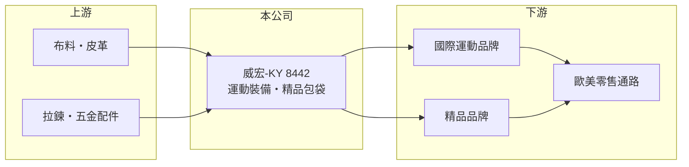

# 8442 威宏-KY

> 上市｜[[產業索引-其他業|其他業]]｜上市（櫃）日期 2016/11/08

# 第一章：企業模式與商業藍圖

> [!info] 撰寫說明
> 精簡版，由 Claude 依公開資料整理，架構比照 [[2330台積電]]，資料截至 2026-10-07。來源：優分析 2026 年 9 月營收報導、winvest 營收快訊。#待校對

威宏-KY 是運動裝備與精品包袋的代工廠，生產基地集中在柬埔寨。

- **核心業務：** 為國際品牌[[代工]]專業運動裝備與精品包袋，分為運動事業與精品事業兩大部門。
- **營收結構：** 營收來自運動裝備與精品包袋，兩者比重本次未查得；銷售以歐美市場為主。
- **營運據點：** 精品事業在柬埔寨宏盛廠，運動事業在柬埔寨威保廠區。
- **長期方向：** 優化管理與生產效率，積極開發新客戶，掌握歐美節慶旺季需求。

# 第二章：護城河深度與競爭優勢

威宏的競爭力在於東南亞產能與多品類製包能力。

- **競爭優勢：** 柬埔寨產地具關稅與人力成本優勢，屬[[非紅供應鏈]]；運動與精品兩條產品線分散單一產業風險。
- **主要對手：** 台灣與東南亞的包袋及運動用品代工廠（推估）。
- **觀察重點：** 毛利率能否回到前一年水準，以及新客戶的出貨貢獻。

# 第三章：財務體質與盈利規模

資料日期：2026-10-07，以下數字是撰寫當時的快照；最新月營收、毛利率、累計 EPS 由自動排程寫在本筆記的屬性欄位（月營收、毛利率、累計EPS 等）。#待校對

威宏 2026 年營收成長，第二季獲利明顯回升。

- **營收規模：** 2026 年上半年營收 43.31 億元，第二季 23.47 億元；1 至 8 月累計 60 億元，年增 12.91%；8 月營收 8.15 億元，年增 36.95%。
- **獲利：** 2026 年第二季 EPS 1.35 元，上半年 1.38 元。第二季[[毛利率]] 17.79%，季增 2.18 個百分點；上半年毛利率 16.79%，年減 3.43 個百分點。
- **財務特色：** 代工業毛利率不高，獲利對產能利用率與工資成本敏感（推估）。

# 第四章：總體風險與地緣政治

威宏的風險在於品牌訂單與東南亞生產環境。

- **產業週期：** 運動用品與精品需求跟隨歐美消費景氣，品牌去庫存時訂單下滑，存在[[長鞭效應]]。
- **營運風險：** 生產集中於柬埔寨，當地工資調升、勞動議題或政治變動都會影響營運。
- **其他風險：** 美國對東南亞的關稅政策、美元匯率，以及布料等原料價格。

# 專有名詞解析

## 金融

- **[[毛利率]]**：毛利除以營收，反映產品或服務本身的獲利能力。
- **[[長鞭效應]]**：終端需求的小幅變動，沿供應鏈往上游傳遞時被逐級放大，造成上游庫存與訂單劇烈波動。

## 產業

- **[[代工]]**：依品牌客戶的設計與規格生產產品，不自有品牌。
- **[[非紅供應鏈]]**：生產據點設在中國以外的供應鏈，用來分散地緣政治與關稅風險。

# 核心供應鏈

- 上游：布料、皮革、拉鍊與五金配件供應商（推估）
- 下游／客戶：國際運動品牌與精品品牌，銷往歐美市場
- 同業：台灣與東南亞包袋及運動用品代工廠（推估）

## 最新新聞
<!-- news:start -->
<!-- news:end -->

## 相關連結
- [公開資訊觀測站](https://mopsov.twse.com.tw/mops/web/t05st03?step=1&firstin=1&co_id=8442)
- [Goodinfo](https://goodinfo.tw/tw/StockDetail.asp?STOCK_ID=8442)
- [Yahoo 股市](https://tw.stock.yahoo.com/quote/8442)
- [鉅亨網新聞](https://www.cnyes.com/twstock/8442/news)
