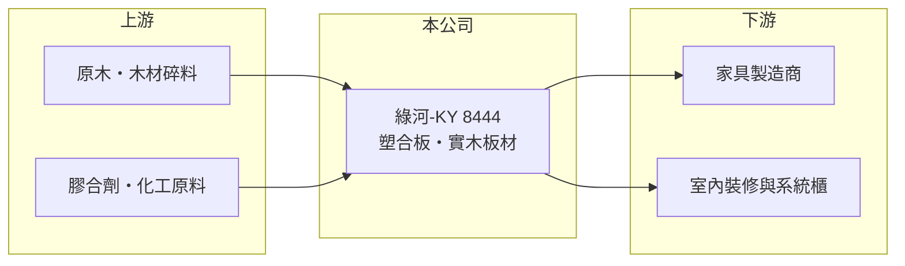

# 8444 綠河-KY

> 上櫃｜[[產業索引-其他業|其他業]]｜上市（櫃）日期 2015/10/27

# 第一章：企業模式與商業藍圖

> [!info] 撰寫說明
> 精簡版，由 Claude 依公開資料整理，架構比照 [[2330台積電]]，資料截至 2026-10-07。來源：winvest 營收快訊（2026 年 6 月、8 月）。公開資料有限。#待校對

綠河-KY 是生產塑合板與實木板材的海外來台掛牌公司，近兩年因售價偏低而持續虧損。

- **核心業務：** 專業製造與銷售[[塑合板]]及實木板材，產品用於家具與室內裝修。
- **營收結構：** 公開資料未揭露產品比重，以塑合板為主（推估）。
- **營運據點：** 屬 [[KY股]]，生產基地位於中國大陸（推估，待校對）。
- **長期方向：** 公司表示因去年平均售價偏低，改採選擇性接單以避免損失擴大，短期以止血為優先，而非衝量。

# 第二章：護城河深度與競爭優勢

綠河-KY 所處的人造板市場競爭激烈，目前看不到明顯的護城河。

- **競爭優勢：** 選擇性接單後[[平均售價]]有所提升，顯示仍有部分議價空間；但規模與品牌優勢有限。
- **主要對手：** 中國大陸眾多人造板廠商，產能分散、價格競爭激烈（推估）。
- **觀察重點：** 選擇性接單能否讓毛利轉正，以及營收大幅衰退後的[[產能利用率]]。

# 第三章：財務體質與盈利規模

資料日期：2026-10-07，以下數字是撰寫當時的快照；最新月營收、毛利率、累計 EPS 由自動排程寫在本筆記的屬性欄位（月營收、毛利率、累計EPS 等）。#待校對

綠河-KY 營收大幅萎縮，且連續虧損。

- **營收規模：** 2026 年 8 月營收 1.09 億元，年減 58.5%；1 至 8 月累計 10.13 億元，年減 58.96%。
- **獲利：** 2025 年 EPS -10.06 元；2026 年第二季 EPS -2.34 元，上半年累計 -5.64 元。
- **財務特色：** 資本額 12.51 億元，市值約 5.64 億元，市值已低於資本額，反映市場對持續虧損的疑慮。

# 第四章：總體風險與地緣政治

綠河-KY 的風險集中在需求疲弱與持續虧損對財務體質的侵蝕。

- **產業週期：** 板材需求與房地產、家具景氣連動，中國房市調整拖累需求與售價。
- **營運風險：** 連續大額虧損會侵蝕淨值，需留意現金水位與持續經營能力。
- **其他風險：** 原木與膠合劑等原物料價格波動、人民幣匯率，以及 KY 公司資訊揭露較少的治理風險。

# 專有名詞解析

## 金融

- **[[KY股]]**：在海外註冊、來台上市櫃的公司，代號名稱後加註 KY。
- **[[平均售價]]**：營收除以銷售量，反映產品定價能力與市場報價。
- **[[產能利用率]]**：實際產量占可生產產能的比例，偏低時固定成本分攤會拉低毛利。

## 產業

- **[[塑合板]]**：以木材碎片加膠熱壓製成的人造板，常用於系統家具與櫥櫃。

# 核心供應鏈

- 上游：原木、木材碎料與膠合劑供應商（推估）
- 下游／客戶：家具製造商、系統櫃與室內裝修業者（推估）
- 同業：中國大陸人造板廠商（推估）

## 最新新聞
<!-- news:start -->
<!-- news:end -->

## 相關連結
- [公開資訊觀測站](https://mopsov.twse.com.tw/mops/web/t05st03?step=1&firstin=1&co_id=8444)
- [Goodinfo](https://goodinfo.tw/tw/StockDetail.asp?STOCK_ID=8444)
- [Yahoo 股市](https://tw.stock.yahoo.com/quote/8444)
- [鉅亨網新聞](https://www.cnyes.com/twstock/8444/news)
