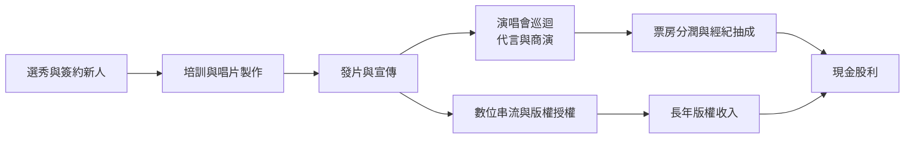
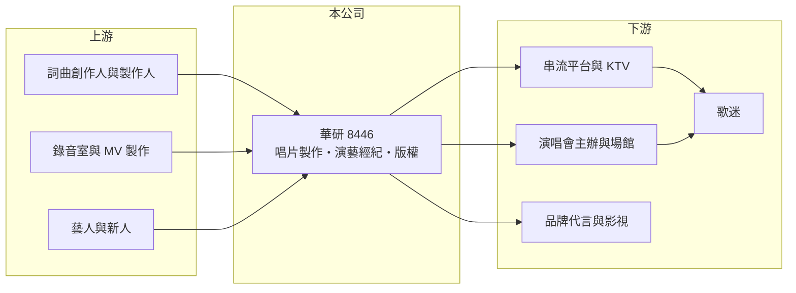

# 8446 華研

> 上櫃｜[[產業索引-文化創意業|文化創意業]]｜上市（櫃）日期 2013/12/19

# 第一章：企業模式與商業藍圖

> [!info] 撰寫說明
> 精簡版，由 Claude 依公開資料整理，架構比照 [[2330台積電]] 的四章研究，資料截至 2026-10-08。來源：Goodinfo 年度經營績效頁、櫃買中心開放資料（2026 年第二季綜合損益與資產負債、基本資料、每月營收、本益比殖利率）、財經媒體標題；藝人名單與營收結構為整理性內容，公司未公開完整的業務別比重，尚未逐條比對年報。#待校對

華研國際音樂（股票代號：8446，以下簡稱華研）是台灣少數上櫃的華語唱片與藝人經紀公司。本章說明它如何把「歌手」這種無形資產，轉換成唱片、數位版權、演唱會與代言等多條收入來源。

## 一、核心定位：唱片公司加經紀公司的整合模式

華研成立於 1999 年，2013 年 12 月上櫃，董事長為呂燕清。公司最廣為人知的作品是 S.H.E 與田馥甄等歌手，華研從選角、培訓、製作唱片到安排巡迴演出，全程參與藝人的職涯。這種「唱片加[[演藝經紀]]」一條龍的模式，讓公司不只賺唱片銷售，也能分享藝人在演唱會、代言與戲劇上的收入。

華研屬於輕資產公司：最重要的資產是歌曲版權與藝人合約，而不是廠房設備。依櫃買中心資料，2026 年第二季底總資產約 29.4 億元，其中流動資產約 16.0 億元，股本約 5.29 億元，資本支出需求很低，因此獲利多數可以轉為現金發放給股東。

## 二、收入來源：四條相互帶動的業務

公司未在本次查得的資料中揭露業務別比重（未查得），以下依業務性質說明：

* **演唱會與演藝經紀：** 受惠於[[演唱會經濟]]，藝人巡迴演唱會的票房分潤、商演與代言抽成。這是近年最大的收入波動來源，2026 年 8 月公司即在月營收公告中說明營收成長「主要係本月演藝經紀收入較去年同期增加」。
* **數位音樂與版權授權：** [[音樂版權]]在串流平台、KTV、影視配樂、廣告的使用費。版權收入一旦建立就能長年收取，是華研最穩定、毛利最高的部分。
* **實體唱片與周邊：** 實體唱片市場長期萎縮，但對歌迷而言仍是收藏品，常與演唱會周邊商品搭配銷售。
* **影視與其他：** 藝人參與戲劇、綜藝的經紀收入。

## 三、資本轉化邏輯：從新人到長尾版權

唱片公司的經濟特性是「少數暢銷作品養活整家公司」。培養一位新人需要多年投入，成功率不高；但只要藝人走紅，往後十多年的演唱會、代言與歌曲版權都會持續貢獻。華研的財務表現因此高度依賴旗下主力藝人是否在當年發片或巡演，營收在 2019 年約 15 億元、2021 年降到約 8.37 億元，又在 2024 年回到約 13.8 億元，起伏主要來自演唱會檔期與疫情。

## 四、企業長期藍圖：延長藝人與版權的生命週期

華研的長期課題是在主力藝人逐漸成熟之後，能否持續培養下一代歌手，並把累積的歌曲資產在串流與海外市場變現。華語流行音樂的市場範圍涵蓋台灣、中國大陸、香港、新加坡與馬來西亞等地，演唱會巡迴可以跨區複製；而數位串流讓舊歌持續被播放，提升版權庫的價值。公司在這兩件事上的執行力，決定十年後的營收規模。

# 第二章：護城河深度與競爭優勢

在長期價值投資中，「護城河」指企業抵禦競爭、維持超額利潤的保護機制。本章分析華研的版權庫與藝人經紀能力，在串流時代和國際唱片公司競爭下能守住多少。

## 一、華研護城河的核心組成要素

* **1. 歌曲版權庫：** 多年累積的華語流行歌曲是可以重複授權的資產，每次被串流、翻唱或用於廣告都會產生收入。版權無法被競爭者複製，而且越老的經典歌曲往往越穩定，這是華研高毛利的根源。
* **2. 藝人培養與經紀一體化：** 華研同時負責藝人的唱片與經紀，能統籌發片、巡演與代言的時程，比單純的唱片公司更能分享藝人走紅後的收入。這種長期合作關係也讓藝人粉絲的忠誠度轉化為公司的營收。
* **3. 演唱會的品牌號召力：** 主力藝人的演唱會可以在大型場館多場售罄，票房與周邊商品的利潤很高。演唱會是現在音樂產業中少數無法被盜版或串流替代的收入。

這條護城河屬於「窄護城河」：它建立在少數藝人身上，一旦藝人合約到期、轉換經紀或淡出，收入會明顯下滑。

## 二、主要競爭對手格局

| 對手 | 定位 | 對華研的威脅 |
|---|---|---|
| 環球、索尼、華納音樂 | 國際三大唱片公司，擁有全球版權庫與串流議價力 | 在一線歌手簽約與海外發行上競爭 |
| 相信音樂 | 台灣大型音樂與經紀公司，代表五月天 | 爭奪演唱會檔期、場館與觀眾 |
| 滾石唱片等本土唱片公司 | 擁有大量經典華語版權 | 在版權授權與經典歌手市場競爭 |
| [[6596寬宏藝術]]、[[6101寬魚國際]] | 演唱會主辦 | 屬上下游合作，也在演出票房分配上議價 |

## 三、優勢轉化：哪些守得住、哪些守不住

* **守得住：** 已經建立的版權收入與主力藝人的演唱會票房。演唱會需求在疫後明顯回升，2024 年華研 EPS 達 11.44 元，是近七年高點。
* **守不住：** 實體唱片銷售與新人成功率。串流平台讓音樂取得更容易，但單次播放的分潤很低，新人要靠串流獲利並不容易。
* **觀察重點：** 第一，主力藝人的合約年限與巡演頻率；第二，新世代藝人的培養成果；第三，版權收入在營收中的比重能否提升，以降低對演唱會檔期的依賴。

# 第三章：財務體質與盈利規模

資料日期：2026-10-08，表格是撰寫當時的快照；最新月營收、毛利率、累計 EPS 由自動排程寫在本筆記的屬性欄位（月營收、毛利率、累計EPS 等）。#待校對

財務報表是檢驗護城河是否真實存在的最終標準。華研的數字呈現典型輕資產內容公司的樣貌：高毛利、高 ROE、高配息，但年度之間隨演唱會檔期起伏。

## 一、多年度經營績效

| 年度 | 營收（新台幣） | [[毛利率]] | [[營業利益率]] | EPS（元） | [[ROE]] |
|---|---|---|---|---|---|
| 2019 | 15.0 億 | 64.2% | 40.2% | 10.22 | 40.6% |
| 2020 | 11.6 億 | 79.6% | 52.5% | 9.55 | 36.8% |
| 2021 | 8.37 億 | 78.5% | 45.9% | 6.56 | 23.3% |
| 2022 | 8.97 億 | 71.2% | 46.6% | 5.94 | 19.5% |
| 2023 | 12.0 億 | 60.7% | 38.9% | 8.23 | 25.1% |
| 2024 | 13.8 億 | 62.7% | 43.1% | 11.44 | 30.8% |
| 2025 | 10.8 億 | 67.0% | 42.1% | 10.30 | 25.1% |
| 2026 上半年 | 6.17 億 | 60.4% | 39.3% | 3.85 | 不適用（半年） |

資料來源：2019 至 2025 年為 Goodinfo 年度經營績效，2026 上半年為櫃買中心開放資料。

* **毛利率與業務組合：** 毛利率在 60% 至 80% 之間，演唱會比重高的年度（2019、2023）毛利率較低，因為演出製作成本高；疫情期間演唱會停辦，版權收入占比上升，毛利率反而升到近 80%。
* **營業利益率：** 長期維持 39% 至 53%，代表費用控制良好，人事與宣傳費用沒有隨營收膨脹。
* **長期指標：** 2021 至 2025 年平均 ROE 約 24.8%（推算）；2020 至 2025 年營收年複合成長率約 -1.4%（推算），營收規模大致持平，但獲利率維持高檔。

## 二、股利與現金流

華研幾乎沒有資本支出需求，盈餘多以現金股利發放。依櫃買中心本益比殖利率資料，最近一次現金股利為每股 8.0 元，相對 2025 年 EPS 10.30 元的配發率約 78%（推算）。Goodinfo 統計 2013 至 2025 年平均現金股利約 4.97 元（一般平均）。由於營運不需大量設備投資，[[自由現金流]]長期應為正（推估，現金流量表未查得）。

## 三、[[ROIC]] 與 [[WACC]]

**ROIC 推算：** 2025 年營收 10.8 億元、營業利益率 42.1%，營業利益約 4.55 億元，以 20% 稅率計稅後約 3.64 億元。依櫃買中心資料，2026 年第二季底權益總計約 20.11 億元；負債約 9.28 億元，多為流動負債，有息負債推估極低，以 0 計。投入資本約 20.1 億元，ROIC 約 18%（推算）；2021 至 2025 年平均營業利益約 4.64 億元，平均 ROIC 約 18.4%（推算）。若扣除帳上現金，實際營運資本的報酬率更高。

**WACC 推算：** 假設台灣 10 年期公債殖利率 1.75%、市場風險溢酬 6%、β 取文創同業常見值 1.0（假設），股東權益成本約 7.75%。公司幾乎沒有借款，WACC 約等於權益成本，約 7.75%（推算）。

**結論：** 華研的 ROIC 長期約為 WACC 的兩倍以上，代表它的輕資產模式持續創造價值。風險不在資本效率，而在營收的來源過度集中於少數藝人。

# 第四章：總體風險與地緣政治

任何企業都無法脫離宏觀環境獨立存在。本章分析華研長期必須面對的產業結構、營運與法規風險。

## 一、產業週期與結構

* **串流化：** 全球音樂收入已從實體唱片轉向串流平台。串流讓版權長年產生收入，但單次播放的分潤很低，平台的議價力也比唱片公司強，長期可能壓縮版權收入的成長。
* **演唱會循環：** 演唱會收入取決於藝人發片與巡演週期，通常一個巡演週期跨越兩到三年，營收因此呈現高低交替。2021 年疫情停演就讓營收降到約 8.37 億元。

## 二、營運風險

* **藝人集中：** 營收高度依賴少數主力藝人，藝人合約到期、健康、形象或轉換經紀，都可能使營收大幅下滑。
* **新人培養：** 華語流行音樂市場競爭激烈，社群平台讓獨立音樂人也能直接觸及聽眾，新人成名的路徑更分散，唱片公司的培養優勢可能減弱。
* **場館供給：** 台灣大型室內場館有限，檔期競爭激烈，場館供給與租金會影響演唱會的場次與利潤。

## 三、其他風險

* **兩岸與海外市場：** 華語藝人的中國大陸演出與發行受兩岸關係與當地審查影響，政治事件可能使行程取消。
* **著作權與 AI：** 生成式 AI 可能被用來模仿歌手聲音或產生大量音樂，著作權法規如何調整，將影響版權資產的長期價值。

# 專有名詞解析

## 金融

- **[[自由現金流]]**：營業活動現金流減去資本支出，代表企業可自由用於配息、還債或併購的現金。
- **[[ROIC]]**：投入資本報酬率，稅後營業利益除以股東權益與有息負債的合計，衡量本業對所有資金提供者的報酬。
- **[[WACC]]**：加權平均資金成本，依股東權益與負債的比重加權計算的資金成本，ROIC 高於它才代表創造價值。

## 產業

- **[[演藝經紀]]**：代理藝人洽談演出、代言與活動的業務，經紀公司依藝人收入抽取一定比例。
- **[[演唱會經濟]]**：大型演唱會帶動門票、交通、住宿與周邊消費，也帶動舞台設備與技術服務需求。
- **[[音樂版權]]**：歌曲詞曲與錄音的著作權，被串流、翻唱、公開播放或用於影視廣告時可收取使用費。

# 核心供應鏈

## 1. 上游：創作與製作
- 詞曲創作人、音樂製作人、錄音室與影像製作公司

## 2. 本公司
- 華研：唱片製作、演藝經紀、歌曲版權管理

## 3. 下游：通路與客戶
- 數位串流平台、KTV 與公開播送
- 演唱會主辦與相關公司：[[6596寬宏藝術]]、[[6101寬魚國際]]、[[6625必應]]
- 品牌代言、電視與影視製作

## 4. 同業
- 相信音樂、滾石唱片、國際三大唱片公司

## 最新新聞
<!-- news:start -->
<!-- news:end -->

## 相關連結
- [公開資訊觀測站](https://mopsov.twse.com.tw/mops/web/t05st03?step=1&firstin=1&co_id=8446)
- [Goodinfo](https://goodinfo.tw/tw/StockDetail.asp?STOCK_ID=8446)
- [Yahoo 股市](https://tw.stock.yahoo.com/quote/8446)
- [鉅亨網新聞](https://www.cnyes.com/twstock/8446/news)
