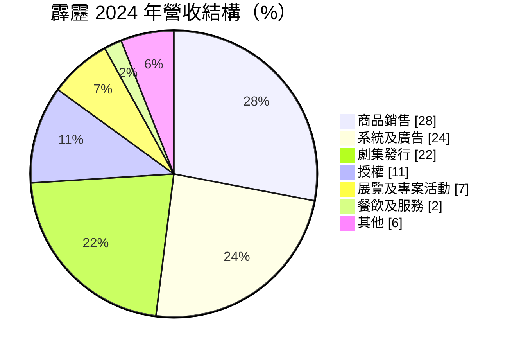
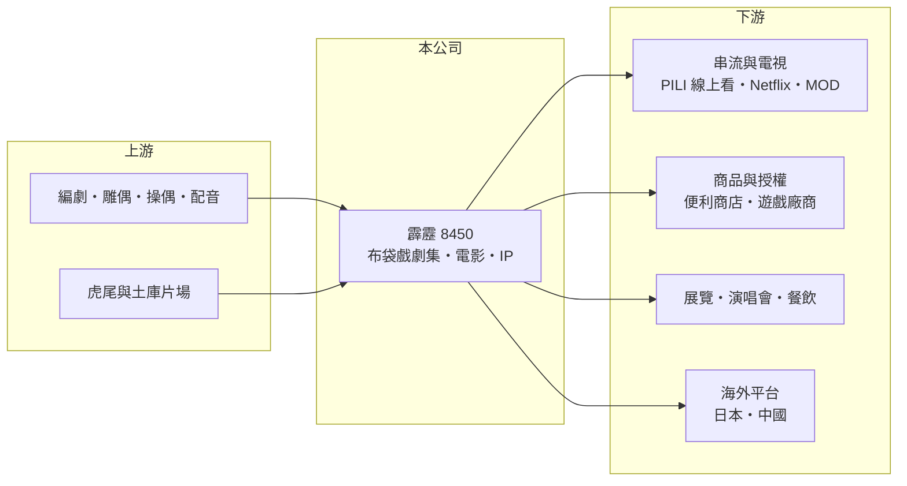

# 8450 霹靂

> 上櫃｜[[產業索引-文化創意業|文化創意業]]｜上市（櫃）日期 2014/10/07

# 第一章：企業模式與商業藍圖

> [!info] 撰寫說明
> 精簡版，由 Claude 依公開資料整理，架構比照 [[2330台積電]] 的四章研究，資料截至 2026-10-08。來源：櫃買中心開放資料（基本資料、2026 年上半年資產負債與損益、本益比）、Goodinfo 年度經營績效、霹靂 2024 年永續報告書第二章〈企業概論〉。#待校對

霹靂國際多媒體（股票代號：8450，以下簡稱霹靂）是台灣布袋戲的代表品牌，傳承自黃海岱「五洲園」與黃俊雄一脈，由黃文章（黃強華）、黃文擇兄弟經營，1996 年成立、2014 年上櫃。霹靂的商業模式是把布袋戲角色與故事當作[[IP]]，從影集發行延伸到商品、[[授權]]、展演與串流，是台灣少數擁有長壽原創 IP 的內容公司。

- **核心業務：** 霹靂自製布袋戲劇集與電影，並以角色 IP 發展周邊商品、授權、系統與廣告、展覽活動與餐飲服務。代表作品包括「霹靂」系列正劇與和日本合作的《東離劍遊紀》，2000 年推出首部布袋戲電影《聖石傳說》。
- **營收結構：** 依 2024 年永續報告書，2024 年營收 2.62 億元，商品銷售 28%、系統及廣告 24%、劇集發行 22%、授權 11%、展覽及專案活動 7%、餐飲及服務 2%、其他 6%。

- **營運據點：** 總公司在新北市汐止，劇集製片廠在雲林虎尾、電影製片廠在雲林土庫，可一條龍完成戲偶、拍攝與後製。發行通路包括自有的 PILI 線上看（2020 年 4 月上線）、霹靂衛星電視台、中華電信 MOD 與 Hami、LINE TV、friDay、巴哈姆特動畫瘋、Netflix（2019 年上架），海外有日本東京 MX 與中國優酷、bilibili 等平台。
- **長期方向：** 2025 年營運計畫包括持續發行正劇與《東離劍遊紀》系列、推進中國大陸上架、代理韓國 IP、發展虛擬偶像與 VR 遊戲，並把 AI 應用於生產與展演。核心挑戰是如何讓有數十年歷史的 IP 吸引新世代觀眾。

# 第二章：護城河深度與競爭優勢

霹靂的護城河是無法複製的 IP 資產與製作技藝，但這條護城河並沒有轉化為穩定的獲利。

- **競爭優勢：** 第一是 IP 的累積。霹靂系列連續播出數十年，擁有大量角色與死忠戲迷，這是新進者無法在短時間內建立的。第二是布袋戲製作的工藝與人才，雕偶、操偶、配音（由黃文擇一人配音的傳統）與特效都需要長期培養。第三是會員與自有[[串流平台]]，能直接接觸核心戲迷。
- **主要對手：** 霹靂的競爭不是其他布袋戲團，而是所有爭奪觀眾時間的娛樂內容，包括日本動漫、韓劇、遊戲與短影音。在授權市場上，也要與國際知名 IP 競爭零售通路的版面。
- **守得住與守不住：** 守得住的是核心戲迷的消費，商品銷售在 2023 至 2024 年維持約 7,500 萬元；守不住的是整體觀眾規模，營收從 2016 年的 7 億元降到 2025 年的 2.38 億元。
- **觀察重點：** 授權收入比重能否持續提高（2024 年由 7% 升到 11%）、海外平台的拓展，以及新世代 IP 與虛擬偶像能否帶來新觀眾。

# 第三章：財務體質與盈利規模

資料日期：2026-10-08，表格是撰寫當時的快照；最新月營收、毛利率、累計 EPS 由自動排程寫在本筆記的屬性欄位（月營收、毛利率、累計EPS 等）。#待校對

霹靂的財報反映一家內容公司在觀眾流失下的長期虧損。

| 年度 | 營收（新台幣） | [[毛利率]] | [[營業利益率]] | EPS（元） | [[ROE]] |
|---|---|---|---|---|---|
| 2021 | 4.28 億 | 4.35% | -55.0% | -4.60 | -19.0% |
| 2022 | 4.00 億 | 16.8% | -48.7% | -2.37 | -11.4% |
| 2023 | 3.20 億 | 4.40% | -70.7% | -3.71 | -21.1% |
| 2024 | 2.62 億 | 31.7% | -46.3% | -1.55 | -10.8% |
| 2025 | 2.38 億 | -11.7% | -103% | -5.34 | -49.7% |

- **營收規模：** 2020 至 2025 年營收年複合成長率約 -12.5%（推算）。2019 年起連續七年營業虧損，2016 年曾有 3.66 元 EPS。2026 年上半年營收 1.82 億元、營業損失 0.24 億元、EPS -0.18 元，營收較 2025 年同期明顯回升（原因未查得）。
- **獲利：** 2021 至 2025 年平均 ROE 約 -22.4%（推算）。內容公司的成本以製作費與人事費為主，營收下滑時虧損會快速擴大，2025 年營業利益率達 -103%。
- **財務特色：** 2026 年上半年總資產約 9.4 億元、歸屬母公司權益約 4.08 億元、總負債約 5.32 億元，每股淨值 7.95 元，已低於 10 元面額；實收資本額約 5.13 億元。長期虧損下沒有配發股利（Goodinfo 長期一般平均現金股利 0.95 元，主要來自早年）。

**[[ROIC]] 與 [[WACC]]：** 以 2025 年計，營業損失約 2.45 億元（2.38 億 × -103%），虧損不計稅。權益總計約 4.12 億元，假設總負債中約 3 億元為有息負債（推估），投入資本約 7.1 億元，ROIC 約 -35%（推算）。WACC 以 CAPM 推估：無風險利率 1.75%、市場風險溢酬 6%、β 取娛樂內容同業常見值 0.9，股東權益成本約 7.2%；負債成本假設 3%、稅後 2.4%，權益占資本約 58%，WACC 約 5.2%（推算）。ROIC 長期遠低於 WACC，霹靂的 IP 雖有文化價值，但目前的商業模式正在持續消耗股東資本。

# 第四章：總體風險與地緣政治

霹靂的風險集中在觀眾老化、財務體質與經營傳承。

- **產業週期：** 內容產業沒有傳統的景氣循環，但受作品成敗影響大，單一作品或電影的票房與點閱可能讓營收大幅波動。
- **營運風險：** 連續虧損使淨值降到面額以下，未來可能需要減資或增資，稀釋或影響股東權益。布袋戲製作仰賴少數關鍵人才，核心配音與創作者的傳承是長期風險。
- **其他風險：** 串流平台的分潤條件與內容採購策略變動，會影響劇集發行收入；中國市場的上架受兩岸政策與審查影響。IP 授權也面臨盜版與仿冒問題。

# 專有名詞解析

## 應用

- **[[串流平台]]**：透過網路即時播放影音內容的服務，例如 Netflix、LINE TV，是影集發行的主要通路。

## 金融

- **[[ROIC]]**：投入資本報酬率，稅後營業利益除以股東權益加有息負債，衡量本業運用資本的效率。
- **[[WACC]]**：加權平均資金成本，股東與債權人要求報酬的加權平均，ROIC 高於它才代表創造價值。

## 產業

- **[[IP]]**：智慧財產，在內容產業泛指角色、故事與品牌，可延伸授權到商品、遊戲與展演。
- **[[授權]]**：把 IP 的使用權交給其他廠商，收取權利金，屬於高毛利、低資本的收入。

# 核心供應鏈

- 上游：自有編劇、雕偶、操偶與配音團隊，雲林虎尾與土庫製片廠。
- 下游／客戶：PILI 線上看、中華電信 MOD 與 Hami（[[2412中華電]]）、LINE TV、friDay、巴哈姆特動畫瘋、Netflix；7-ELEVEN（[[2912統一超]]）與全家（[[5903全家]]）等授權商品通路；日本東京 MX、中國優酷與 bilibili。
- 同業：台灣文化內容公司如 [[8446華研]]（產業參考）；廣義競爭者為日本動漫、韓劇與遊戲等娛樂內容。

## 最新新聞
<!-- news:start -->
<!-- news:end -->

## 相關連結
- [公開資訊觀測站](https://mopsov.twse.com.tw/mops/web/t05st03?step=1&firstin=1&co_id=8450)
- [Goodinfo](https://goodinfo.tw/tw/StockDetail.asp?STOCK_ID=8450)
- [Yahoo 股市](https://tw.stock.yahoo.com/quote/8450)
- [鉅亨網新聞](https://www.cnyes.com/twstock/8450/news)
