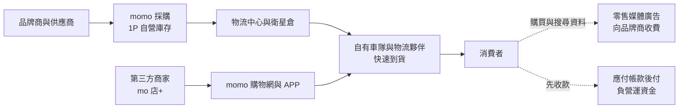
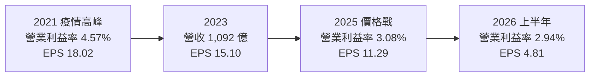
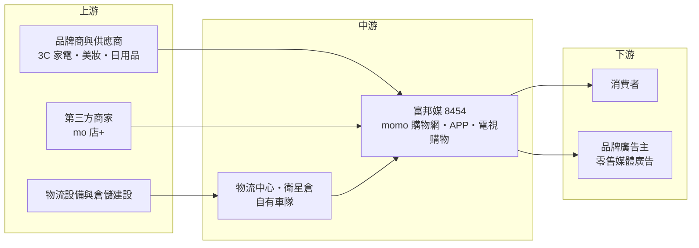

# 8454 富邦媒

> 上市｜[[產業索引-數位雲端|數位雲端]]｜上市（櫃）日期 2014/12/19

# 第一章：企業模式與商業藍圖

> [!info] 撰寫說明
> 本文由 Claude 依公開資料整理，架構比照 [[2330台積電]] 的四章研究，資料截至 2026-10-08。財務數字來源：Goodinfo 年度經營績效頁、旺得富 2026 年 3 月法說會報導、工商時報 2026 年 8 月報導、優分析中央物流中心報導、證交所開放資料（2026 年第二季綜合損益與資產負債、股利、基本資料）；產業描述為整理性內容，尚未逐條比對原始文件。#待校對

在評估單一個股的長期投資價值時，首要步驟是拆解企業的底層獲利邏輯。本章針對富邦媒體科技（股票代號：8454，以下簡稱富邦媒，品牌為 momo）的商業模式進行定性分析，說明一家從電視購物起家的公司，如何成為台灣最大的綜合電商之一，以及它在低毛利的零售生意中如何創造高股東報酬。

## 一、核心定位：自營為主、物流自建的台灣綜合電商

富邦媒成立於 2004 年，2014 年在證交所上市，董事長為蔡明忠，屬富邦集團與台灣大哥大體系。公司以 momo 購物網、momo 購物 APP 與 momo 電視購物頻道經營零售業務，商品涵蓋 3C 家電、美妝保養、日用品、食品、服飾與旅遊等。

富邦媒的核心模式是[[1P 自營]]：公司向品牌商與供應商採購商品、自己持有庫存、自己訂價出貨，營收以商品售價全額認列。這和以抽成為主的[[3P 平台]]（例如蝦皮）不同：1P 模式的營收規模大、毛利率低（富邦媒長期約 9% 至 12%），但能掌握商品品質、價格與配送速度。近年富邦媒也發展「mo 店+」平台，讓第三方商家上架，截至 2026 年 6 月底精選商家數突破 1 萬家、上架商品 370 萬項（工商時報報導），形成 1P 加 3P 的雙軌模式。

## 二、事業板塊

公司未揭露商品類別與通路別營收比重（未查得），以下依公開報導整理主要事業：

* **電商自營（1P）：** 核心業務，強項在 3C 家電、美妝、日用品等標準品，靠大量採購取得價格優勢，再以快速到貨建立消費者習慣。
* **平台業務（3P，mo 店+）：** 補足長尾商品，收入來自抽成與服務費，營收認列金額較小但毛利率高。部分商家由 1P 轉向 3P，會讓帳面營收下降，但不一定代表交易額減少。
* **零售媒體廣告：** 依工商時報報導，[[零售媒體聯播網]]（RMN）的廣告收入維持雙位數成長。電商平台擁有消費者的搜尋與購買資料，可以向品牌商出售精準廣告，這是商品交易以外的高毛利收入。
* **電視購物：** 富邦媒的起家事業，近年隨收視習慣改變而下滑，是 2025 年營收出現近年首度負成長的原因之一。

## 三、資本轉化邏輯：採購規模、物流網路與負營運資金

富邦媒的資本運用有三個特點：

* **物流是最大的投資：** 電商的競爭最終是配送速度與成本。富邦媒持續建置物流中心與[[衛星倉]]，中部物流中心總投資約 76 億元、總樓地板面積 3.9 萬坪（優分析報導），依 2026 年 3 月法說會，中區物流中心與湖口物流中心分別預計 2027 年與 2029 年啟用。自有車隊目前承擔逾四成配送量，公司預期 2026 年提升到五成以上。
* **[[負營運資金]]：** 消費者付款後，富邦媒通常在數十天後才支付供應商貨款，這段時間差讓公司手上隨時有一筆供應商提供的無息資金。依證交所資料，2026 年第二季底流動負債 184.6 億元高於流動資產 126.8 億元，正是這種模式的表現。這讓富邦媒可以用很少的股東資本支撐上千億元營收，是高 ROE 的主要來源。
* **低毛利、高周轉：** 營業利益率長期只有 3% 至 4.6%，但資產周轉很快，因此 ROE 可以達到 30% 以上。

## 四、企業長期藍圖：GMV 成長、雙引擎與物流自主

依 2026 年 3 月法說會，富邦媒的長期目標是追求[[GMV]]（商品交易總額）成長與市占率，而非單純的帳面營收。策略包括：深化與品牌原廠的 1P 合作、以 3P 補足長尾商品、擴大零售媒體廣告、導入 AI 於搜尋、推薦、物流排程與客服，以及持續自建物流。公司引用的數據是台灣[[電商滲透率]]約 14%，全球約 25%，認為台灣電商仍有成長空間，且市場尚無明確贏家。這個藍圖的核心邏輯是：用物流與商品力留住消費者，再用平台與廣告提高每位消費者的變現能力。

# 第二章：護城河深度與競爭優勢

在長期價值投資中，「護城河」指企業抵禦競爭、維持超額利潤的保護機制。本章分析富邦媒在台灣電商市場的護城河，以及它面對跨國平台價格戰時能守住多少。

## 一、富邦媒護城河的核心組成要素

* **1. 物流網路與配送速度：** 多座物流中心、衛星倉與自有車隊，讓 momo 能在大部分地區提供快速到貨。物流網路需要數年與數十億元的投資，新進者短期難以複製，也是消費者在急需商品時優先選擇 momo 的原因。
* **2. 採購規模與品牌關係：** 作為台灣最大的 1P 電商之一，富邦媒與 3C、美妝等品牌原廠的關係深厚，能取得較好的進貨條件與獨家檔期。規模越大，議價力越強，形成正向循環。
* **3. 集團資源：** 富邦集團的金融與電信資源，例如信用卡支付與會員互通，提供導流與支付便利。
* **4. 消費者信任：** 1P 模式由公司直接出貨、處理退換貨，消費者較不擔心買到假貨或遇到商家失聯，這在高單價 3C 家電上尤其重要。

這些優勢讓富邦媒屬於「窄護城河」：它能長期維持獲利，但零售業的價格透明，對手只要願意虧損搶市，富邦媒就必須跟進讓利。

## 二、主要競爭對手格局

| 對手 | 定位 | 對富邦媒的威脅 |
|---|---|---|
| 蝦皮（Shopee） | 3P 平台為主，用戶滲透率最高 | 以低價與免運搶占中低價商品與年輕用戶 |
| 酷澎（Coupang） | 韓國電商，自營加快速到貨 | 直接複製 1P 加自建物流模式，以價格戰搶市 |
| 淘寶、拼多多等跨境電商 | 中國低價商品 | 以極低價格搶占日用品與服飾 |
| [[8044網家]]（PChome） | 台灣老牌 1P 電商 | 傳統對手，近年市占下滑 |
| [[2912統一超]] 與實體零售 | 門市取貨與即時需求 | 在即時與生鮮需求上競爭 |

優分析引用的資料顯示，富邦媒的 B2C 市占率由 2024 年第二季的 24.5% 降到 2025 年第二季的 22.7%，主要被 Shopee、Coupang 與跨境平台以低價搶走。

## 三、優勢轉化：哪些市場守得住、哪些守不住

* **守得住：** 高單價、重視正品與售後的 3C 家電與品牌美妝，以及需要快速到貨的日用品。這些品類消費者重視信任與速度，momo 的 1P 加物流優勢最明顯。
* **守不住：** 低價日用品與長尾商品的價格。跨境平台與 3P 平台在這些品類有更多選擇與更低價格，富邦媒若跟進價格戰，毛利率會被壓縮，2025 年毛利率降到 9.13%、營業利益率降到 3.08% 就是證據。
* **觀察重點：** 第一，GMV 與活躍用戶能否持續成長（2025 年年度活躍用戶年增約 3%）；第二，3P 平台與零售媒體廣告能否提高整體利潤率；第三，2027 年起新物流中心啟用後，配送成本能否下降。

# 第三章：財務體質與盈利規模

資料日期：2026-10-08。數字取自 Goodinfo 年度經營績效、法說會報導與證交所開放資料，表格是撰寫當時的快照；最新月營收、毛利率、累計 EPS 由自動排程寫在本筆記的屬性欄位（月營收、毛利率、累計EPS 等）。#待校對

財務報表是檢驗護城河是否真實存在的最終標準。本章用十年來的三率、ROE 與資本報酬，檢視富邦媒在電商競爭中的獲利品質。

## 一、獲利能力的基石：三率

| 年度 | 營收（新台幣） | [[毛利率]] | [[營業利益率]] | EPS（元） | [[ROE]] |
|---|---|---|---|---|---|
| 2016 | 281 億 | 11.8% | 4.52% | 8.45 | 20.4% |
| 2019 | 518 億 | 9.81% | 3.19% | 9.95 | 22.6% |
| 2020 | 672 億 | 9.40% | 3.30% | 13.87 | 29.5% |
| 2021 | 884 億 | 10.10% | 4.57% | 18.02 | 41.5% |
| 2022 | 1,034 億 | 9.93% | 4.14% | 15.72 | 36.6% |
| 2023 | 1,092 億 | 9.65% | 4.01% | 15.10 | 36.1% |
| 2024 | 1,126 億 | 9.34% | 3.82% | 13.69 | 34.1% |
| 2025 | 1,087 億 | 9.13% | 3.08% | 11.29 | 30.2% |
| 2026 上半年 | 536.86 億 | 9.14% | 2.94% | 4.81 | 不適用（半年） |

富邦媒的十年數字分成兩段。2016 至 2021 年是高速成長期，營收由 281 億元成長到 884 億元，疫情帶動網購習慣普及，2021 年營業利益率達 4.57%、EPS 18.02 元的高峰。2022 年後營收成長放緩，2025 年更出現近年首度負成長（年減約 3.5%，推算），營業利益率逐年下滑到 3% 左右，原因是跨國平台價格戰、電視購物衰退，以及物流投資帶來的折舊與費用。2026 年上半年營收年增 2.4%，但稅後淨利年減 15.8%（工商時報報導），獲利壓力仍在。

2020 至 2025 年營收年複合成長率約 10.1%（推算），2021 至 2025 年五年平均 ROE 約 35.7%（推算）。ROE 雖然逐年下降，但仍遠高於一般零售業，反映負營運資金與高配息帶來的資本效率。

## 二、[[ROE]]：資本效率

富邦媒的 ROE 由 2021 年的 41.5% 降到 2025 年的 30.2%，主要是獲利下滑。依證交所資料，2026 年第二季底總資產 287.3 億元、負債 203.4 億元、歸屬母公司權益 83.0 億元，負債比約 71%。這個負債比主要是應付帳款與租賃負債，而非銀行借款，屬於電商與零售業的經營性負債。股東權益規模小、營收規模大，是 ROE 高的根本原因。

## 三、資本支出、自由現金流與股利

* **資本支出：** 年度總額未查得。優分析指出近三年資本支出大增，主要用於物流中心、自動化設備與資訊系統；中部物流中心總投資約 76 億元。
* **[[自由現金流]]：** 逐年數字未查得。負營運資金讓營業現金流通常高於淨利，但物流中心建設期間資本支出偏高，自由現金流可能較過去縮小（推估）。
* **股利：** 2025 年度配發現金股利 10 元（證交所股利資料），以 EPS 11.29 元計算[[配發率]]約 89%，幾乎把當年可分配盈餘全數發放。Goodinfo 統計歷年加權平均現金股利約 11.06 元。高配發率代表公司把擴張資金主要放在營運資金與折舊回收，而非保留盈餘。

## 四、[[ROIC]] 與 [[WACC]]：價值創造利差

**ROIC 推算：** 2025 年營業利益約 33.5 億元（營收 1,087 億元 × 營業利益率 3.08%），以 20% 稅率計算稅後營業利益約 26.8 億元。2025 年底股東權益以每股淨值 36.63 元乘以約 2.65 億股，約 97.1 億元；有息負債未查得，假設約 20 億元（推估，不含租賃負債），投入資本約 117 億元，ROIC 約 22.9%（推算）。若以營業利益率較高的 2021 年估算，ROIC 應更高（推估，因當年股本基礎不同，未精確計算）。

**WACC 推算：** 假設台灣 10 年期公債殖利率 1.75%、市場風險溢酬 6%、β 取電商零售股常見值 0.8（假設），股東權益成本約 6.55%。負債成本假設 2.5%，稅後 2.0%，以權益 85%、負債 15% 計算，WACC 約 5.9%（推算）。

**結論：** 富邦媒的 ROIC 約 20% 以上，遠高於約 6% 的資金成本，代表它的 1P 加物流模式長期創造經濟價值。但要注意趨勢：營業利益率由 4.6% 降到 3%，ROIC 也隨之下滑；若價格戰持續、新物流中心折舊增加，而 GMV 成長不足以攤提，利差會繼續收斂。富邦媒的長期價值取決於物流投資能否轉化為更低的單位配送成本與更高的市占率。

# 第四章：總體風險與地緣政治

任何企業都無法脫離宏觀環境獨立存在。本章分析富邦媒長期必須面對的競爭結構、產業週期、營運與法規風險。

## 一、地緣政治與跨境競爭

富邦媒的營收全部來自台灣，地緣政治的直接影響有限，主要風險來自跨境競爭：淘寶、拼多多旗下平台等中國電商以極低價格直送台灣，韓國酷澎則以資本優勢在台灣擴張。這些對手背後有全球規模，願意長期虧損搶市，富邦媒必須在價格、速度與品質之間取捨。跨境電商的商品安全、稅負與資安爭議，可能促使政府加強管理，這對本土電商是潛在的正面因素，但政策方向仍不確定。

## 二、產業週期與市場結構

電商屬於民生零售，與整體消費景氣連動，但波動比耐久財小。真正的結構性挑戰是：台灣電商已經走過高速成長期，市場由少數平台瓜分，未來成長主要來自搶奪對手市占與提高每位用戶的消費頻率。電視購物則隨收視人口老化持續萎縮。在這種結構下，規模與效率決定誰能存活，價格戰可能持續多年。

## 三、營運環境的隱性風險

* **物流投資與折舊：** 中區與湖口物流中心在 2027 與 2029 年啟用，折舊與營運費用將大幅增加，若訂單量成長不如預期，會壓縮利潤率。
* **資安與個資：** 電商握有大量消費者個資與支付資料，公司將資安列為科技投資的最高優先事項；一旦發生資料外洩，會傷害消費者信任並面臨裁罰。
* **人力成本：** 物流倉儲與配送人力需求大，最低工資調升直接推高成本，自動化設備是因應方式。
* **1P 轉 3P 的營收認列：** 商家由 1P 轉向 3P 會讓帳面營收下降，投資人需同時觀察 GMV，避免誤判成長。

## 四、科技或法規演進

AI 正在改變電商的搜尋、推薦、客服與物流排程，富邦媒已導入 AI 客服與推薦系統；若 AI 讓消費者改用對話式購物助理比價，平台的流量入口地位可能被削弱。零售媒體廣告受個資法規影響，若隱私規範趨嚴，精準廣告的效果與收入可能受限。此外，電商相關的消費者保護、平台責任與跨境稅制法規持續演進，會影響所有平台的營運成本。

# 專有名詞解析

## 金融

- **[[負營運資金]]**：企業先向客戶收款、後付供應商貨款，使流動負債大於流動資產，等於由供應商提供營運資金。
- **[[配發率]]**：現金股利占每股盈餘的比例，代表公司把多少獲利以現金還給股東。
- **[[自由現金流]]**：營業活動現金流減去資本支出，代表企業可自由用於配息、還債或併購的現金。
- **[[ROIC]]**：投入資本報酬率，稅後營業利益除以股東權益加有息負債，衡量本業運用資本的效率。
- **[[WACC]]**：加權平均資金成本，股東與債權人要求報酬的加權平均，ROIC 高於它才代表創造價值。

## 產業

- **[[1P 自營]]**：電商自行採購並持有庫存、以自己的名義銷售，營收以商品售價全額認列，毛利率較低但能掌控品質。
- **[[3P 平台]]**：電商提供平台讓第三方商家上架銷售，平台收取抽成或服務費，營收金額小但毛利率高。
- **[[GMV]]**：商品交易總額，平台上所有成交訂單的金額加總，用來衡量電商的實際交易規模。
- **[[零售媒體聯播網]]**：零售商利用自身平台與消費者資料，向品牌商出售站內外廣告的業務，英文簡稱 RMN。
- **[[衛星倉]]**：設在都會區附近的小型倉庫，存放熱銷商品以縮短配送時間。
- **[[電商滲透率]]**：網路零售額占整體零售額的比例，用來衡量電商市場的成熟度與成長空間。

# 核心供應鏈

## 1. 上游：商品與商家
- 3C 家電品牌：例如 [[AAPL蘋果]] 等國際品牌（實際採購比重未查得）
- 美妝、日用品與食品品牌商（名單未查得）
- 第三方商家：mo 店+ 精選商家逾 1 萬家

## 2. 中游：富邦媒與集團
- 集團關係：[[3045台灣大]]、[[2881富邦金]]
- 同業：[[8044網家]]、蝦皮、酷澎

## 3. 下游：消費者與廣告主
- 台灣網購消費者
- 品牌廣告主（零售媒體聯播網）

## 最新新聞
<!-- news:start（自動產生，請勿手動編輯此範圍） -->
- 2026-10-05 📰 媒體 15:26｜〈消費趨勢〉富邦媒打響電商旺季前哨戰 強打「分次配」新服務｜[鉅亨網](https://news.cnyes.com/news/id/6621704)

完整紀錄：[[8454富邦媒 新聞]]
<!-- news:end -->

## 相關連結
- [公開資訊觀測站](https://mopsov.twse.com.tw/mops/web/t05st03?step=1&firstin=1&co_id=8454)
- [Goodinfo](https://goodinfo.tw/tw/StockDetail.asp?STOCK_ID=8454)
- [Yahoo 股市](https://tw.stock.yahoo.com/quote/8454)
- [鉅亨網新聞](https://www.cnyes.com/twstock/8454/news)
