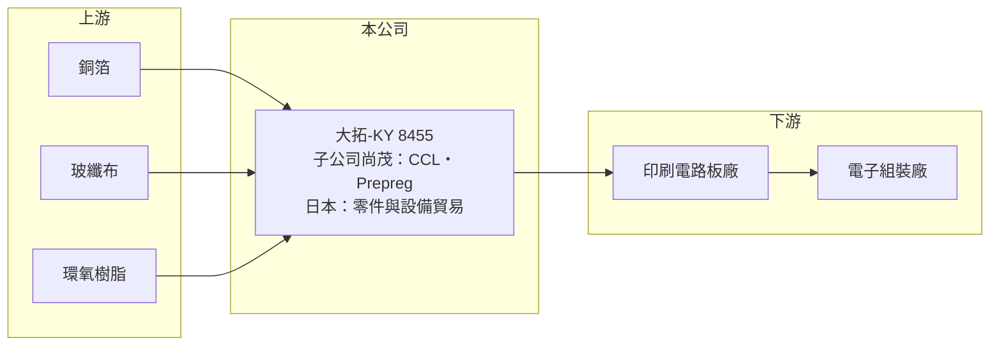

# 8455 大拓-KY

> 上櫃｜[[產業索引-其他電子業|其他電子業]]｜上市（櫃）日期 2016/01/08

# 第一章：企業模式與商業藍圖

> [!info] 撰寫說明
> 精簡版，由 Claude 依公開資料整理，架構比照 [[2330台積電]]，資料截至 2026-10-08。來源：nStock 大拓-KY 公司概況、MoneyDJ 理財網財務比率年表（2021 至 2025 年）、winvest.tw 營收快訊。公開資料有限，產品比重、客戶與據點細節未查得。#待校對

大拓-KY 是在日本愛知縣設立的控股型公司，本身做電子零件與機械設備的加工銷售，主要營運則來自持股約 68% 的銅箔基板廠尚茂電子。

- **核心業務：** 大拓提供電子零件與機械設備的加工及銷售，並持有子公司尚茂電子 68.15% 股權。尚茂製造[[CCL]]銅箔基板與[[Prepreg]]黏合膠片，這兩樣是印刷電路板的基礎材料，電路板廠用它們壓合出多層板。
- **營收結構：** 產品別比重本次未查得。以業務性質推估，銅箔基板與膠片是營收主體，日本端的零件與設備貿易規模較小（推估）。
- **營運據點：** 公司在日本愛知縣設立，以 [[KY股]] 身分在台灣掛牌，子公司尚茂的生產據點本次未查得。
- **長期方向：** 銅箔基板產業正往高頻高速、低介電與耐熱等高階規格發展，以配合 AI 伺服器與網通設備需求。大拓能否把產品組合往這些高階規格移動，是它擺脫低毛利的關鍵。

# 第二章：護城河深度與競爭優勢

銅箔基板是規模經濟明顯的產業，大拓相對規模很小，競爭條件不利。

- **競爭優勢：** 小型基板廠的優勢通常在於服務中小型電路板客戶、接少量多樣的訂單，以及配合特殊規格快速調整配方。大拓結合日本端的通路與台灣子公司的生產，可能在特定利基規格上有服務彈性（推估）。
- **主要對手：** 銅箔基板市場由 [[2383台光電]]、[[6274台燿]]、[[6213聯茂]]、建滔、生益科技等大廠主導，這些公司產能與研發資源遠大於大拓，在高階材料上領先。
- **觀察重點：** 毛利率由 2024 年的 7.87% 回升到 2025 年的 11.67%，長期要看這個改善能否延續，以及公司是否打入高頻高速材料的認證名單。

# 第三章：財務體質與盈利規模

資料日期：2026-10-08，表格是撰寫當時的快照；最新月營收、毛利率、累計 EPS 由自動排程寫在本筆記的屬性欄位（月營收、毛利率、累計EPS 等）。#待校對

大拓的毛利率長期在一成上下，營業利益接近損益兩平，獲利能力偏弱。

| 年度 | 營收（億元） | [[毛利率]] | [[營業利益率]] | EPS（元） | [[ROE]] |
|---|---|---|---|---|---|
| 2021 | 約 13.6（推算） | 10.82% | 0.18% | 1.00 | 1.98% |
| 2022 | 約 14.5（推算） | 9.48% | -0.33% | 0.42 | -1.62% |
| 2023 | 約 14.7（推算） | 8.69% | -1.27% | -0.06 | -4.29% |
| 2024 | 約 12.4（推算） | 7.87% | -3.65% | -0.74 | -7.01% |
| 2025 | 11.57 | 11.67% | -0.38% | 0.02 | -1.69% |

註：2025 年營收取自 nStock；其他年度依 MoneyDJ 營收成長率回推。ROE 與 EPS 正負號不一致的年度，可能是 ROE 以合併淨利計算、EPS 只計歸屬母公司淨利，待校對。

- **長期指標：** 2021 至 2025 年營收年複合成長率約 -4%（推算），近 5 年平均 ROE 約 -2.5%（推算）。近五年平均現金股利僅約 0.02 元，2025 年未配息。
- **[[ROIC]] 與 [[WACC]]：** 2025 年營業利益率 -0.38%，ROIC 約 -0.4%（推算：稅後營業利益約 -0.04 億元 ÷（股東權益約 5.3 億元＋有息負債以總負債一半推估約 3.0 億元））。WACC 推估約 5.3%（推算：無風險利率 1.75%、市場風險溢酬 6%、β 取電子材料同業常見值 0.9，股東權益成本 7.15%；稅前負債成本 2.5%、稅率 20%；權益比重約 64%）。ROIC 長期接近零、低於 WACC，代表公司目前沒有創造經濟價值。
- **財務特色：** 負債比率由 2018 年的 65% 降到 2025 年的 53%，但仍偏高；銅箔基板需要大量原料與應收帳款，營運資金占用大。

# 第四章：總體風險與地緣政治

大拓的風險在於原料價格波動與規模劣勢。

- **產業週期：** 銅箔基板需求跟著電路板與終端電子產品景氣循環，下游庫存調整時，基板廠會同時面臨減量與降價。
- **營運風險：** 銅箔、[[玻纖布]]與樹脂占基板成本的大部分，原料上漲時小廠議價能力弱，很難及時轉嫁，毛利率因此長期偏低。子公司持股約 68%，部分獲利屬於非控制權益。
- **其他風險：** KY 股的資訊揭露與跨國治理需要投資人特別留意；日圓、新台幣與人民幣匯率變動也會影響合併報表。

# 專有名詞解析

## 金融

- **[[KY股]]**：在海外註冊、回台灣掛牌的公司股票，代號後面加上 KY。
- **[[ROIC]]**：投入資本報酬率，稅後營業利益除以股東權益加有息負債，衡量本業運用資本的效率。
- **[[WACC]]**：加權平均資金成本，股東與債權人要求報酬率的加權平均，是 ROIC 要超越的門檻。

## 產業

- **[[CCL]]**：銅箔基板，把銅箔壓合在玻纖布與樹脂上的板材，是印刷電路板的基本材料。
- **[[Prepreg]]**：黏合膠片，浸過樹脂的玻纖布，用來把多層電路板黏合在一起。
- **[[玻纖布]]**：以玻璃纖維織成的布，是銅箔基板的補強材料，決定板材的尺寸穩定性與電性。

# 核心供應鏈

- 上游：銅箔（如 [[8358金居]]）、玻纖布（如 [[1802台玻]]、[[1815富喬]]）、環氧樹脂供應商
- 下游／客戶：印刷電路板廠與電子組裝廠（客戶名稱未查得）
- 同業：[[2383台光電]]、[[6274台燿]]、[[6213聯茂]]、建滔、生益科技

## 最新新聞
<!-- news:start -->
<!-- news:end -->

## 相關連結
- [公開資訊觀測站](https://mopsov.twse.com.tw/mops/web/t05st03?step=1&firstin=1&co_id=8455)
- [Goodinfo](https://goodinfo.tw/tw/StockDetail.asp?STOCK_ID=8455)
- [Yahoo 股市](https://tw.stock.yahoo.com/quote/8455)
- [鉅亨網新聞](https://www.cnyes.com/twstock/8455/news)
