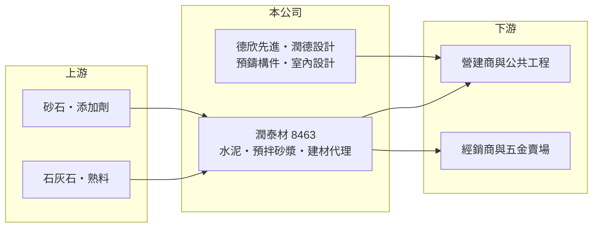

# 8463 潤泰材

> 上市｜[[產業索引-其他業|其他業]]｜上市（櫃）日期 2015/07/13

# 第一章：企業模式與商業藍圖

> [!info] 撰寫說明
> 精簡版，由 Claude 依公開資料整理，架構比照 [[2330台積電]]，資料截至 2026-10-07。來源：富果研究 2026 年 7 月法說會摘要。#待校對

潤泰材是潤泰集團旗下的建材公司，本業為水泥與砂漿，並透過轉投資延伸到預鑄構件與室內設計。

- **核心業務：** 生產水泥（含[[低碳水泥]]）、[[預拌砂漿]]，並代理建材；轉投資德欣先進（持股 35%）以[[預鑄工法]]生產預鑄構件、電桿、基樁與軌枕，潤德設計（持股 31.66%）從事室內設計與裝修。
- **營收結構：** 法說會未揭露事業別比重；公司表示綠色收入占合併營收超過 50%，預拌泥作砂漿年均成長超過 13%。
- **營運據點：** 工廠位於宜蘭冬山與屏東里港，透過 80 多家經銷商及特力屋、小北百貨等 120 多家五金賣場銷售。
- **長期方向：** 聚焦循環經濟（目標 2030 年減碳 11%，2025 年已達 7%）、新材料研發（輕質微珠、[[UHPC]]、風電砂漿）與通路擴展（室內木門代理已簽 150 多個建案）。

# 第二章：護城河深度與競爭優勢

潤泰材的優勢在於集團營建資源、零售通路與減碳產品，但水泥本業規模不及大廠。

- **競爭優勢：** 背靠潤泰集團營建體系，加上經銷與五金賣場通路，砂漿與建材產品容易觸及小型工程與 DIY 客群。
- **主要對手：** 水泥市場有 [[1101台泥]]、[[1102亞泥]] 等大廠，以及低價進口水泥。
- **觀察重點：** 毛利率改善能否延續、轉投資德欣先進與潤德設計的收益貢獻，以及 UHPC、風電砂漿等新產品的商業化進度。

# 第三章：財務體質與盈利規模

資料日期：2026-10-07，以下數字是撰寫當時的快照；最新月營收、毛利率、累計 EPS 由自動排程寫在本筆記的屬性欄位（月營收、毛利率、累計EPS 等）。#待校對

潤泰材 2026 年第一季營收持平，但獲利明顯改善。

- **營收規模：** 2026 年第一季營收 17.1 億元，與去年同期 17.0 億元持平；前五月累計營收約 29 億元。
- **獲利：** 第一季營業毛利 2.13 億元、年增 45%，[[毛利率]]約 12.5%（推算）；稅前淨利 1.36 億元，EPS 0.42 元，去年同期 0.15 元。
- **財務特色：** 獲利有一部分來自轉投資的權益法收益，公司未提供財務預測。

# 第四章：總體風險與地緣政治

潤泰材的風險主要來自營建景氣與水泥市場的價格競爭。

- **產業週期：** 水泥與砂漿需求跟隨房市與公共工程，台灣房市轉弱時銷量承壓。
- **營運風險：** 進口水泥價格競爭，以及燃料、電力成本上升壓縮毛利。
- **其他風險：** [[碳費]]與減碳法規使高碳排的水泥生產成本上升，低碳產品推廣速度是關鍵。

# 專有名詞解析

## 產業

- **[[低碳水泥]]**：以減少熟料比例、添加爐石或飛灰等替代材料生產的水泥，生產過程碳排放比傳統卜特蘭水泥低。
- **[[預拌砂漿]]**：在工廠依配比預先拌好的乾式砂漿，工地加水即可使用，品質比現場拌合穩定。
- **[[UHPC]]**：超高性能混凝土，強度與耐久性遠高於一般混凝土，可用於橋梁與薄型構件。
- **[[預鑄工法]]**：在工廠先製作樑、柱、版等構件，再運到工地組裝，可縮短工期並降低現場人力。
- **[[碳費]]**：台灣依氣候變遷因應法向大型排放源徵收的費用，以每噸二氧化碳當量計價。

# 核心供應鏈

- 上游：石灰石、熟料、砂石與添加劑供應商（推估）
- 下游／客戶：營建商、公共工程、經銷商與特力屋、小北百貨等五金賣場
- 同業：[[1101台泥]]、[[1102亞泥]]

## 最新新聞
<!-- news:start -->
<!-- news:end -->

## 相關連結
- [公開資訊觀測站](https://mopsov.twse.com.tw/mops/web/t05st03?step=1&firstin=1&co_id=8463)
- [Goodinfo](https://goodinfo.tw/tw/StockDetail.asp?STOCK_ID=8463)
- [Yahoo 股市](https://tw.stock.yahoo.com/quote/8463)
- [鉅亨網新聞](https://www.cnyes.com/twstock/8463/news)
