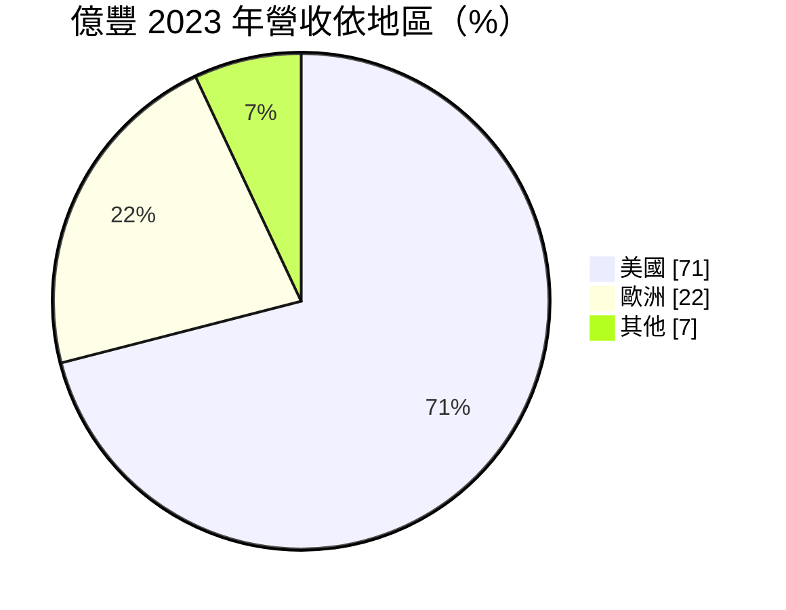
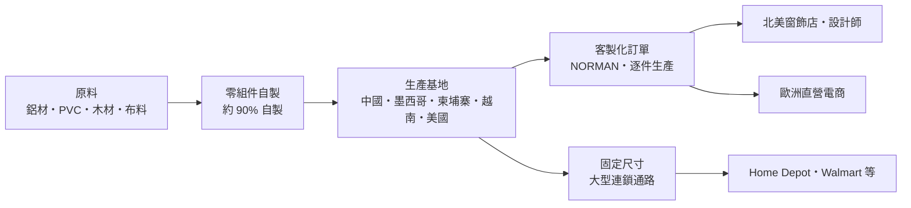
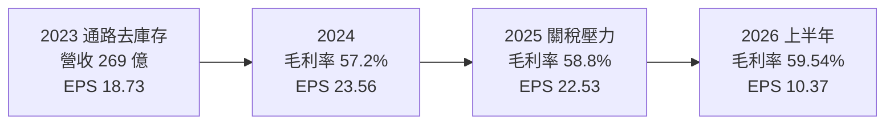
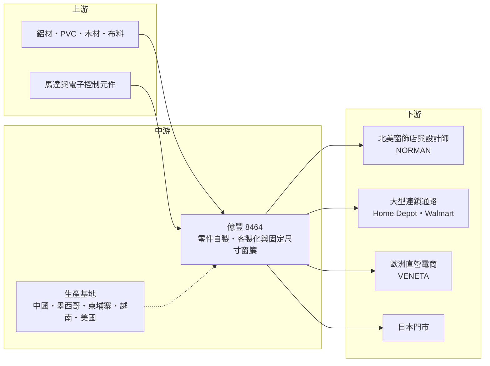

# 8464 億豐

> 上市｜[[產業索引-居家生活|居家生活]]｜上市（櫃）日期 2015/12/22

# 第一章：企業模式與商業藍圖

> [!info] 撰寫說明
> 本文由 Claude 依公開資料整理，架構比照 [[2330台積電]] 的四章研究，資料截至 2026-10-08。財務數字來源：Goodinfo 年度經營績效頁、富果研究 2026 年 3 月法說會整理、聯合新聞網 2026 年 2 月報導、CMoney 投資網誌整理、證交所開放資料（2026 年第二季綜合損益與資產負債、股利、基本資料）；產業描述為整理性內容，尚未逐條比對原始文件。#待校對

在評估單一個股的長期投資價值時，首要步驟是拆解企業的底層獲利邏輯。本章針對億豐綜合工業（股票代號：8464，以下簡稱億豐）的商業模式進行定性分析，說明一家台灣窗簾製造商，如何把一個看似傳統、低科技的產品，做成毛利率接近六成的全球性生意。

## 一、核心定位：以客製化窗簾為主的全球窗飾製造商

億豐集團創立於 1974 年，目前在證交所掛牌的億豐綜合工業成立於 2007 年，2015 年上市，董事長為粘耿豪。億豐的產品包括百葉窗、百葉門、捲簾、羅馬簾、蜂巢簾等窗飾，價格帶約 20 至 1,000 美元，主要市場在美國與歐洲。

億豐的核心不是「做窗簾」，而是「做客製化窗簾」。2025 年[[客製化窗簾]]占營收 72.9%，這類產品由消費者在窗飾店或設計師處量好窗戶尺寸、挑選材質顏色與控制方式後下單，億豐依訂單逐件生產，再在短時間內送到美國或歐洲。這種模式把一個大宗商品變成了「小量多樣、快速交貨」的服務，也是億豐高毛利的來源。另外約四分之一是固定尺寸窗簾，供應給大型連鎖家居通路，以標準規格大量生產。

## 二、終端應用與產品板塊

依 CMoney 整理的 2023 年資料，億豐的營收結構如下（2025 年客製化比重已升到 72.9%，地區比重未查得更新數字）：

* **客製化窗簾（NORMAN 品牌）：** 透過北美的業務中心與上千家窗飾零售店、設計師與通路商銷售，客戶對價格敏感度低、重視品質與交期。2025 年客製化營收年增 6.5%，是成長主力。
* **固定尺寸窗簾：** 供應 Home Depot、Walmart 等大型連鎖通路，2025 年營收年增 0.1%，成長平緩，主要角色是維持產能規模與通路關係。
* **歐洲與直營電商：** 歐洲以 VENETA 等品牌經營電商通路，2025 年歐洲營收以美元計年增 12.0%，主要由直營電商（[[D2C]]）帶動；同年美洲營收以美元計年減 1.2%，受消費降級與通路庫存調整影響。
* **日本與其他市場：** 公司計畫在日本增加門市，屬於早期布局。

## 三、資本轉化邏輯：垂直整合加全球多點生產

億豐的獲利邏輯可以拆成三個層次：

* **垂直整合：** 零組件約 90% 自製，從鋁條、葉片、軌道到控制機構都自己做。客製化窗簾的規格組合數量龐大，若零件仰賴外購，交期與品質都難以控制。自製讓億豐能壓低成本，也讓競爭者難以在交期上追趕。
* **生產基地分工：** 依聯合新聞網報導，中國廣東、山東與墨西哥廠主攻客製化，柬埔寨廠生產固定尺寸，美國達拉斯為輕組裝產線。墨西哥 Leon 二期廠區於 2025 年投產，越南老街一期廠預計 2026 年下半年投產，投產後集團整體產能預計增加 10% 至 15%；2026 年 2 月董事會再通過越南二期投資，上限 1.02 億美元（約新台幣 32 億元）。
* **通路投資：** 在美國擴建自有物流車隊與展間，在歐洲提高直營電商滲透率，讓億豐從單純的製造商，延伸到掌握終端客戶的品牌與通路商。

## 四、企業長期藍圖：產能多元化與通路深化

億豐的長期策略有四點：一是全球產能多元化，以墨西哥與越南分散中國生產比重，降低關稅與地緣政治風險，同時讓墨西哥廠更貼近美國市場、縮短交期；二是深化通路，美國以物流與展間服務窗飾店，歐洲擴大 D2C，日本增加門市；三是持續垂直整合與製程改善，降低對 PVC 等單一原料的依賴；四是以客製化窗簾作為成長主力。2022 年億豐已全面改為無拉繩產品，領先同業因應美國兒童安全新規，這也顯示公司習慣提前布局法規變化。

# 第二章：護城河深度與競爭優勢

在長期價值投資中，「護城河」指企業抵禦競爭、維持超額利潤的保護機制。本章分析億豐在全球窗飾市場的護城河，以及它能否擋住國際大廠與低價對手。

## 一、億豐護城河的核心組成要素

億豐的護城河屬於「寬護城河」中較少見的製造業案例，由四個要素組成：

* **1. 客製化的規模經濟：** 客製化窗簾每張訂單規格都不同，傳統做法是靠大量人工與零散工廠完成。億豐把客製化做成工業化流程，用自製零件、標準化模組與多點工廠，達成「小量多樣卻有規模」的效果。這種能力需要數十年的製程累積，競爭者很難在短期內複製。
* **2. 交期與服務網路：** 北美設有多個業務中心並與上千家窗飾店合作，自有物流車隊與展間讓窗飾店能快速拿到樣品與成品。窗飾店最在意的是準時交貨與少出錯，一旦習慣億豐的服務，就不容易更換供應商。
* **3. 成本優勢：** 億豐把主要產能放在中國、墨西哥、柬埔寨與越南，人工成本遠低於美國本土工廠，加上零件自製，讓它在提供高品質的同時保有價格競爭力。2016 至 2025 年毛利率由 48.5% 升到 58.8%，營業利益率維持在 21% 至 30%，說明它不只成本低，還能維持定價。
* **4. 法規與安全的領先：** 美國持續強化窗簾拉繩的兒童安全規範，億豐在 2022 年就全面轉為無拉繩產品，提前完成產品切換，讓規模較小的競爭者在法規轉換期承受更大壓力。

## 二、全球主要競爭對手格局

| 對手 | 定位 | 對億豐的威脅 |
|---|---|---|
| Hunter Douglas | 全球最大窗飾集團之一，高階品牌與通路完整 | 在高階客製化市場與億豐正面競爭，品牌力強 |
| Springs Window Fashions | 美國客製化窗飾大廠 | 搶北美窗飾店與通路訂單 |
| 中國窗簾廠 | 以低價固定尺寸產品為主 | 在大型通路的標準品競爭價格 |
| 電商直營品牌 | 線上客製化窗簾新創 | 繞過窗飾店，直接接觸消費者 |

CMoney 整理的資料提到 Hunter 與 Springs 的市占率分別約三成與一成，但市場定義與統計口徑未查得，數字僅供參考。

## 三、優勢轉化：哪些市場守得住、哪些守不住

* **守得住：** 北美與歐洲的客製化窗簾市場。這個市場重視交期、品質與服務，億豐的垂直整合與多點生產正好對應這些需求，2025 年在美洲營收下滑的情況下，客製化營收仍成長 6.5%。
* **守不住：** 固定尺寸窗簾在大型通路的價格。標準品容易被比價，通路商議價力強，這塊營收成長平緩，毛利也低於客製化產品。
* **觀察重點：** 第一，越南與墨西哥新產能投產後，中國以外產能的比重與成本效率；第二，美國房市與裝修需求的變化；第三，歐洲 D2C 與美國展間能否持續提高億豐對終端客戶的掌握度。

# 第三章：財務體質與盈利規模

資料日期：2026-10-08。數字取自 Goodinfo 年度經營績效、富果研究法說會整理與證交所開放資料，表格是撰寫當時的快照；最新月營收、毛利率、累計 EPS 由自動排程寫在本筆記的屬性欄位（月營收、毛利率、累計EPS 等）。#待校對

財務報表是檢驗護城河是否真實存在的最終標準。本章用十年來的三率、ROE 與資本報酬，檢視億豐的獲利品質。

## 一、獲利能力的基石：三率

| 年度 | 營收（新台幣） | [[毛利率]] | [[營業利益率]] | EPS（元） | [[ROE]] |
|---|---|---|---|---|---|
| 2016 | 189 億 | 48.5% | 24.7% | 12.59 | 32.9% |
| 2019 | 239 億 | 50.8% | 25.7% | 15.37 | 34.7% |
| 2020 | 244 億 | 55.8% | 28.5% | 16.36 | 33.6% |
| 2021 | 290 億 | 54.4% | 26.7% | 18.15 | 33.2% |
| 2022 | 290 億 | 54.9% | 25.4% | 21.07 | 30.6% |
| 2023 | 269 億 | 55.5% | 25.9% | 18.73 | 24.5% |
| 2024 | 295 億 | 57.2% | 28.3% | 23.56 | 27.1% |
| 2025 | 300 億 | 58.8% | 29.8% | 22.53 | 23.7% |
| 2026 上半年 | 152.33 億 | 59.54% | 27.66% | 10.37 | 不適用（半年） |

億豐的毛利率在十年間由 48.5% 提升到接近 60%，在製造業中非常罕見，代表客製化產品比重提高與垂直整合效益持續累積。營收則有循環：2023 年美國通路去庫存，營收從 290 億元降到 269 億元；2025 年受美國關稅與消費降級影響，營收僅成長 1.5%，歸屬母公司淨利年減 4.4%。2020 至 2025 年營收年複合成長率約 4.2%（推算），成長速度不快，但獲利品質很高。

2025 年營業利益成長 6.6%，淨利卻下滑，主要是業外與匯兌因素以及稅負；依證交所資料推算，2026 年上半年有效稅率約 28.8%，高於台灣 20% 的營所稅率，原因是海外子公司的稅負與盈餘匯回（推估）。

## 二、[[ROE]]：資本效率

億豐的 ROE 由 2016 至 2021 年的 30% 以上，降到 2023 至 2025 年的 24% 至 27%。這不是獲利能力變差，而是股東權益持續累積：每股淨值由 2016 年的 39.43 元升到 2025 年的 102.4 元，公司保留部分盈餘投資新產能，同時持有大量現金。2021 至 2025 年五年平均 ROE 約 27.8%（推算）。依證交所資料，2026 年第二季底總資產 394.26 億元、負債 100.50 億元，負債比約 25%，財務結構保守。

## 三、資本支出、自由現金流與股利

* **資本支出：** 年度總額未查得。已知重大投資包括越南一期（投資上限 1.24 億美元，2025 年第三季動工）、越南二期（上限 1.02 億美元，2026 年 2 月通過）與墨西哥二期，顯示億豐正處於產能擴張期。
* **[[自由現金流]]：** 逐年數字未查得。以營業利益約 89 億元的規模，扣除擴產支出與約 47 億元的現金股利後，帳上權益仍持續增加，代表自由現金流長期為正（推估）。
* **股利：** 2025 年度配發現金股利 16 元（證交所股利資料），以 EPS 22.53 元計算配發率約 71%；公司章程規定股利不少於當年度可分配盈餘的 50%。Goodinfo 統計歷年加權平均現金股利約 11.85 元，股利隨獲利穩定成長。

## 四、[[ROIC]] 與 [[WACC]]：價值創造利差

**ROIC 推算：** 2025 年營業利益 89.17 億元，以 20% 稅率計算稅後營業利益約 71.3 億元。2025 年底歸屬母公司權益以每股淨值 102.4 元乘以約 2.93 億股，約 300 億元，加上非控制權益約 5.6 億元；有息負債未查得，假設約 20 億元（推估），投入資本約 326 億元，ROIC 約 21.9%（推算）。若改用實際有效稅率約 29%，ROIC 約 19.5%（推算）。由於億豐持有大量現金，若扣除現金計算營運資本，ROIC 會更高。

**WACC 推算：** 假設台灣 10 年期公債殖利率 1.75%、市場風險溢酬 6%、β 取家居耐久財出口股常見值 0.8（假設），股東權益成本約 6.55%。負債成本假設 2.5%，稅後 2.0%，以權益 94%、負債 6% 計算，WACC 約 6.3%（推算）。

**結論：** 億豐的 ROIC 約 20%，比約 6% 的資金成本高出 13 至 15 個百分點，並且十年來大致維持這個水準，代表它是一家長期穩定創造經濟價值的製造業公司。利差的來源是客製化的規模經濟與垂直整合，而不是單一產品週期。未來要觀察越南、墨西哥新產能投產初期折舊增加時，ROIC 是否出現暫時下滑。

# 第四章：總體風險與地緣政治

任何企業都無法脫離宏觀環境獨立存在。本章分析億豐長期必須面對的地緣政治、產業週期、營運與法規風險。

## 一、地緣政治與關稅

億豐約七成營收來自美國，主要產能卻在中國、墨西哥與東南亞，這讓它直接暴露在美國關稅政策之下。2025 年美國對中國與東南亞商品加徵關稅，壓抑億豐的美洲營收與獲利；同年 11 月起北美關稅調降，2026 年壓力減輕。億豐以「中國加一」的多點生產回應這個風險：墨西哥廠受美墨加協定保護、貼近美國，越南廠則分散中國比重。但美國對墨西哥與越南的關稅政策同樣可能改變，地緣政治與關稅仍是公司自評最大的不確定性。

## 二、產業週期與市場結構

窗簾需求與美國房市高度相關：新屋銷售、成屋交易與居家裝修都會帶動窗飾購買。利率上升時，房市交易減少，窗飾需求跟著放緩；大型通路調整庫存時，固定尺寸產品訂單也會下滑，2023 年就是例子。不過客製化窗簾屬於中高價位、與裝修相關的需求，波動比一般消費品小，億豐的營收在過去十年只有少數年度下滑。

## 三、營運環境的隱性風險

* **匯率：** 營收以美元與歐元計價，成本則分散在人民幣、披索、越南盾等貨幣，新台幣升值會壓低以台幣計算的營收與獲利。
* **新廠投產：** 越南廠投產初期的良率、人員訓練與折舊，可能短期拉低毛利率。
* **原料價格：** 鋁材、PVC 與木材價格波動影響成本，公司正推動降低對單一原料的依賴。
* **勞動成本：** 墨西哥與東南亞的工資持續上漲，長期可能削弱成本優勢。

## 四、科技或法規演進

美國消費品安全委員會持續強化窗簾拉繩規範，億豐已完成無拉繩轉換，具有先行優勢。科技面上，電動窗簾與智慧家居整合是長期趨勢，窗簾從單純的遮光產品變成可連網、可排程的智慧裝置，億豐需要在馬達、控制系統與軟體上持續投資，否則可能被科技公司或國際大廠搶走高階市場。歐洲的環保法規，例如塑膠與化學品限制，也會影響原料選擇。

# 專有名詞解析

## 金融

- **[[有效稅率]]**：所得稅費用除以稅前淨利，受海外子公司稅負與盈餘匯回影響，可能高於法定稅率。
- **[[自由現金流]]**：營業活動現金流減去資本支出，代表企業可自由用於配息、還債或併購的現金。
- **[[ROIC]]**：投入資本報酬率，稅後營業利益除以股東權益加有息負債，衡量本業運用資本的效率。
- **[[WACC]]**：加權平均資金成本，股東與債權人要求報酬的加權平均，ROIC 高於它才代表創造價值。

## 產業

- **[[客製化窗簾]]**：依消費者實際窗戶尺寸、材質與控制方式逐件生產的窗簾，價格較高、交期與品質要求嚴格。
- **[[D2C]]**：直接面對消費者，品牌商繞過批發與零售通路，自行透過電商或直營店銷售。
- **[[垂直整合]]**：企業自行掌握上下游多個環節，例如自製零件並經營品牌通路，以降低成本並控制品質。
- **[[無拉繩窗簾]]**：以彈簧、電動或其他機構取代拉繩的窗簾，可避免兒童被繩索纏繞，是美國安全法規的趨勢。
- **[[中國加一]]**：在中國以外另設生產基地，以分散關稅與地緣政治風險的供應鏈策略。

# 核心供應鏈

## 1. 上游：原料與元件
- 鋁材、PVC、木材與布料：供應商名單未查得
- 電動窗簾馬達與控制元件：供應商名單未查得

## 2. 中游：億豐
- 生產基地：中國廣東與山東、墨西哥 Leon、柬埔寨、越南老街、美國達拉斯
- 國際競爭者：Hunter Douglas、Springs Window Fashions

## 3. 下游：通路與客戶
- 北美窗飾零售店、設計師與通路商（NORMAN 品牌）
- 大型連鎖家居與量販通路：Home Depot、Walmart 等
- 歐洲電商（VENETA 品牌）與日本門市

## 最新新聞
<!-- news:start -->
<!-- news:end -->

## 相關連結
- [公開資訊觀測站](https://mopsov.twse.com.tw/mops/web/t05st03?step=1&firstin=1&co_id=8464)
- [Goodinfo](https://goodinfo.tw/tw/StockDetail.asp?STOCK_ID=8464)
- [Yahoo 股市](https://tw.stock.yahoo.com/quote/8464)
- [鉅亨網新聞](https://www.cnyes.com/twstock/8464/news)
