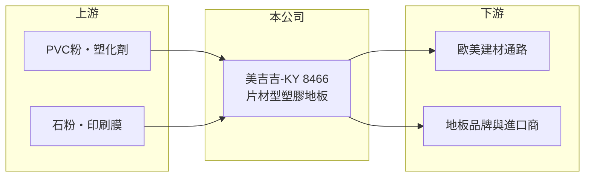

# 8466 美吉吉-KY

> 上市｜[[產業索引-其他業|其他業]]｜上市（櫃）日期 2016/11/01

# 第一章：企業模式與商業藍圖

> [!info] 撰寫說明
> 精簡版，由 Claude 依公開資料整理，架構比照 [[2330台積電]]，資料截至 2026-10-07。來源：winvest 營收快訊（2026 年 6 月、7 月）。公開資料有限。#待校對

美吉吉-KY 生產片材型塑膠地板，近年營收下滑並轉為虧損。

- **核心業務：** 生產與銷售片材型塑膠地板，常見產品為 [[LVT]] 與 [[SPC地板]]等（推估）。
- **營收結構：** 公開資料未揭露產品或地區比重；塑膠地板主要外銷歐美市場（推估）。
- **營運據點：** 屬 [[KY股]]，生產基地位於中國大陸（推估，待校對）。
- **長期方向：** 在需求疲弱與價格競爭下，重點在恢復獲利；具體策略公開資料未揭露。

# 第二章：護城河深度與競爭優勢

塑膠地板是製程成熟、廠商眾多的產業，美吉吉-KY 的差異化有限。

- **競爭優勢：** 以片材地板專業製造累積的生產經驗與既有外銷客戶（推估）。
- **主要對手：** 中國大陸與越南的塑膠地板廠商，產能分散，價格競爭激烈（推估）。
- **觀察重點：** 營收何時止跌、虧損能否收斂，以及美國對中國產地板的關稅與[[反傾銷]]措施變化。

# 第三章：財務體質與盈利規模

資料日期：2026-10-07，以下數字是撰寫當時的快照；最新月營收、毛利率、累計 EPS 由自動排程寫在本筆記的屬性欄位（月營收、毛利率、累計EPS 等）。#待校對

美吉吉-KY 營收連續衰退，並處於虧損狀態。

- **營收規模：** 2026 年 7 月營收 2.36 億元，年減 21.62%；1 至 7 月累計 15.28 億元，年減 24.36%。
- **獲利：** 2025 年 EPS -0.81 元；2026 年第一季 EPS -0.89 元，單季虧損已超過去年全年。
- **財務特色：** 資本額 7.98 億元，市值約 13.29 億元；毛利率資料未查得。

# 第四章：總體風險與地緣政治

美吉吉-KY 的主要風險是外銷需求與貿易政策。

- **產業週期：** 塑膠地板需求與歐美房市、裝修景氣連動，利率高檔時需求偏弱。
- **營運風險：** 營收下滑使固定成本分攤上升，虧損可能擴大。
- **其他風險：** 美國關稅與反傾銷調查、PVC 原料價格波動，以及人民幣與美元匯率變動。

# 專有名詞解析

## 金融

- **[[KY股]]**：在海外註冊、來台上市櫃的公司，代號名稱後加註 KY。

## 產業

- **[[LVT]]**：豪華乙烯基地磚，以 PVC 為主要材料、表面印刷仿木紋或石紋的塑膠地板。
- **[[SPC地板]]**：石塑複合地板，以石粉與 PVC 製成的硬芯地板，防水且尺寸穩定。
- **[[反傾銷]]**：進口國對低於正常價格銷售的進口商品加徵額外關稅的貿易救濟措施。

# 核心供應鏈

- 上游：PVC 粉、塑化劑、石粉與印刷膜供應商（推估）
- 下游／客戶：歐美建材通路、地板品牌與進口商（推估）
- 同業：中國大陸與越南塑膠地板廠商（推估）

## 最新新聞
<!-- news:start -->
<!-- news:end -->

## 相關連結
- [公開資訊觀測站](https://mopsov.twse.com.tw/mops/web/t05st03?step=1&firstin=1&co_id=8466)
- [Goodinfo](https://goodinfo.tw/tw/StockDetail.asp?STOCK_ID=8466)
- [Yahoo 股市](https://tw.stock.yahoo.com/quote/8466)
- [鉅亨網新聞](https://www.cnyes.com/twstock/8466/news)
