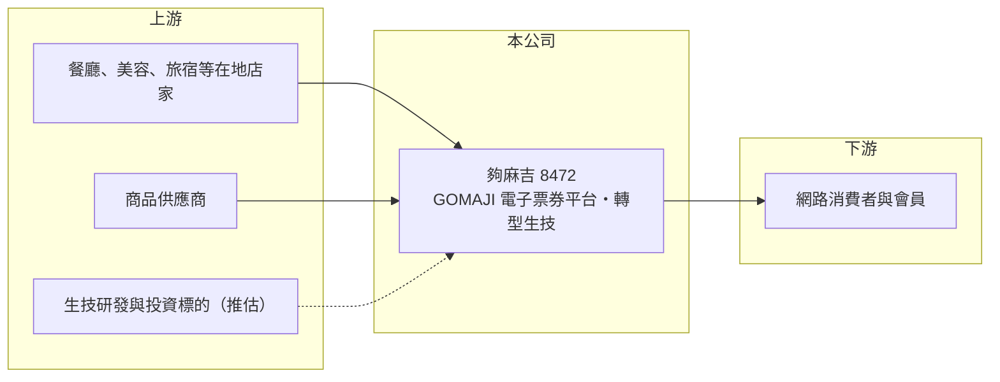

# 8472 夠麻吉

> 上櫃｜[[產業索引-數位雲端|數位雲端]]｜上市（櫃）日期 2016/01/11

# 第一章：企業模式與商業藍圖

> [!info] 撰寫說明
> 精簡版，由 Claude 依公開資料整理，架構比照 [[2330台積電]] 的四章研究，資料截至 2026-10-08。來源：櫃買中心開放資料（基本資料、2026 年第二季資產負債與綜合損益、每月營收、本益比殖利率）、富邦證券更名公告標題、CMoney 個股快訊標題。公開資料有限，多年度財務數據未查得，業務描述為整理性內容。#待校對

本章拆解夠麻吉（股票代號：8472）的商業模式。夠麻吉以 GOMAJI 品牌經營在地生活[[電子票券]]平台，讓消費者在網路上購買餐廳、美容、旅宿等優惠票券，再到店家使用。2026 年公司公告更名為「納維康生技股份有限公司」，櫃買中心資料的簡稱已改為「納維康」，代表公司正在跨入生技領域。

- **核心業務：** 公司 2010 年設立，2016 年上櫃，實收資本額約 1.77 億元，董事長為吳進昌。主要業務是電子票券服務平台：店家把餐券、住宿券、美容體驗等商品放上 GOMAJI 銷售，平台向店家收取銷售抽成，消費者則取得折扣。這是典型的[[雙邊平台]]，一邊是在地店家，一邊是追求優惠的消費者。
- **營收結構：** 公司未揭露各業務營收比重。2026 年上半年營收約 2.49 億元、[[毛利率]]約 34.6%（櫃買中心資料）；依 2026 年 8 月月營收公告的說明，當月營收增加主要來自商品銷貨增加，顯示除了票券抽成，公司也有自營商品銷售（推估）。
- **更名與轉型：** 公司公告名稱由「夠麻吉股份有限公司」變更為「納維康生技股份有限公司」，公告期間為 2026 年 6 月 29 日至 9 月 28 日（富邦證券公告標題）。2026 年第二季底非流動資產約 6.76 億元，占總資產約 68%，對一家平台公司而言比例偏高，可能與投資或併購生技相關事業有關（推估，待校對）。
- **營運據點：** 總部位於新北市新店區，以台灣市場為主。
- **長期方向：** 電子票券本業的成長取決於餐飲與旅遊消費，轉型生技則是全新領域。兩項業務的資源如何分配、生技事業的具體內容與獲利模式，目前公開資料都不足以判斷，是長期追蹤的重點。

# 第二章：護城河深度與競爭優勢

夠麻吉的護城河來自票券平台累積的店家與會員網路，但這種優勢在外送、訂位與大型電商平台夾擊下並不牢固。

- **競爭優勢：** 經營十多年的票券平台累積了大量合作店家與會員，店家熟悉平台的上架與核銷流程，消費者則習慣在平台上搜尋優惠，形成一定的[[網路效應]]。電子票券涉及預收款項與履約保障，平台的信用與金流管理經驗也是新進者需要時間建立的。
- **主要對手：** 在地生活優惠與票券方面，對手包括 Klook、KKday 等旅遊體驗平台，以及 inline、EZTABLE 等訂位平台；更廣義的競爭者是 [[8454富邦媒]]、蝦皮購物等電商販售的票券，以及各家信用卡與行動支付的優惠活動。在生技領域則尚無法判斷對手。
- **觀察重點：** 更名代表經營重心可能轉移。票券本業能否維持穩定的現金流，以及生技事業的具體產品、研發進度與資金需求，決定公司未來的樣貌。

# 第三章：財務體質與盈利規模

資料日期：2026-10-08，表格是撰寫當時的快照；最新月營收、毛利率、累計 EPS 由自動排程寫在本筆記的屬性欄位（月營收、毛利率、累計EPS 等）。#待校對

本章整理目前可取得的財務數據。本次未查得夠麻吉的多年度財務資料，表格只填入櫃買中心的最新半年度數字。

| 年度 | 營收（新台幣） | [[毛利率]] | [[營業利益率]] | EPS（元） | [[ROE]] |
|---|---|---|---|---|---|
| 2021 | 未查得 | 未查得 | 未查得 | 未查得 | 未查得 |
| 2022 | 未查得 | 未查得 | 未查得 | 未查得 | 未查得 |
| 2023 | 未查得 | 未查得 | 未查得 | 未查得 | 未查得 |
| 2024 | 未查得 | 未查得 | 未查得 | 未查得 | 未查得 |
| 2025 | 未查得 | 未查得 | 未查得 | 未查得 | 未查得 |
| 2026 上半年 | 2.49 億 | 34.6% | -4.4% | -0.66 | 不適用（半年） |

- **營收規模：** 2026 年上半年營收約 2.49 億元；依月營收資料，2026 年 1 至 8 月累計約 3.53 億元，較去年同期的 2.92 億元增加約 21%。
- **獲利：** 2026 年上半年營業虧損約 0.11 億元，業外收入約 0.08 億元，淨損約 0.12 億元，EPS -0.66 元（櫃買中心資料）。
- **財務特色：** 2026 年第二季底總資產約 9.94 億元、負債約 7.35 億元（流動負債約 4.99 億元、非流動負債約 2.36 億元）、股東權益約 2.59 億元，保留盈餘約 -0.12 億元。流動負債中應有相當部分是消費者已付款、尚未使用的票券款項與應付店家款項（推估），這類負債屬於平台營運的一部分，不是銀行借款。每股淨值約 14.59 元。

**[[ROIC]] 與 [[WACC]]：** 2026 年上半年本業虧損，ROIC 為負（推算）；多年度營業利益未查得，無法計算長期平均。WACC 假設公債 1.75%、市場風險溢酬 6%、β 取 1.0（假設），股東權益成本約 7.75%；非流動負債若部分為有息借款（推估），以負債成本 2.5%、稅後 2.0% 計，WACC 約 6% 至 7.75%（推算）。目前 ROIC 低於 WACC，且轉型生技需要持續投入資金，短期內難以創造超過資金成本的報酬。

# 第四章：總體風險與地緣政治

夠麻吉的風險同時來自票券本業的競爭與生技轉型的不確定性。

- **產業週期：** 電子票券的需求跟隨餐飲、旅遊與休閒消費景氣，景氣轉弱或疫情等事件發生時，店家與消費者都會減少使用。
- **營運風險：** 跨入生技是與原本業務完全不同的領域，研發週期長、資金需求大、成功率不確定；若生技投資未能如期產生收入，可能需要增資或認列資產減損。電子票券涉及預收款項，須依法提供履約保障，店家倒閉或糾紛也會帶來營運風險。
- **其他風險：** 生技業務涉及法規審查與臨床試驗等不確定因素（依實際業務而定）；消費者保護與電子票證相關法規的變動，也會影響票券平台的營運成本。

# 專有名詞解析

## 金融

- **[[ROIC]]**：投入資本報酬率，稅後營業利益除以股東權益加有息負債，衡量本業運用資本的效率。
- **[[WACC]]**：加權平均資金成本，股東與債權人要求報酬的加權平均，ROIC 高於它才代表創造價值。

## 產業

- **[[電子票券]]**：以電子方式發行、消費者先付款再到店兌換商品或服務的憑證，例如餐券與住宿券。
- **[[雙邊平台]]**：同時服務兩群使用者（例如乘客與司機）的平台，一邊使用者增加會吸引另一邊加入。
- **[[網路效應]]**：使用者越多、服務對每位使用者越有價值的現象，是平台型企業最主要的護城河。
- **[[履約保障]]**：預售票券或禮券的業者須透過銀行信託或保證等方式，確保消費者已付款項在業者倒閉時仍能取回。

# 核心供應鏈

- 上游：上架票券的餐廳、美容、旅宿與休閒店家；自營商品供應商；生技相關投資標的（推估）。
- 下游／客戶：購買票券與商品的網路消費者與會員。
- 同業：Klook、KKday、inline、EZTABLE；[[8454富邦媒]] 等電商平台的票券銷售。

## 最新新聞
<!-- news:start -->
<!-- news:end -->

## 相關連結
- [公開資訊觀測站](https://mopsov.twse.com.tw/mops/web/t05st03?step=1&firstin=1&co_id=8472)
- [Goodinfo](https://goodinfo.tw/tw/StockDetail.asp?STOCK_ID=8472)
- [Yahoo 股市](https://tw.stock.yahoo.com/quote/8472)
- [鉅亨網新聞](https://www.cnyes.com/twstock/8472/news)
