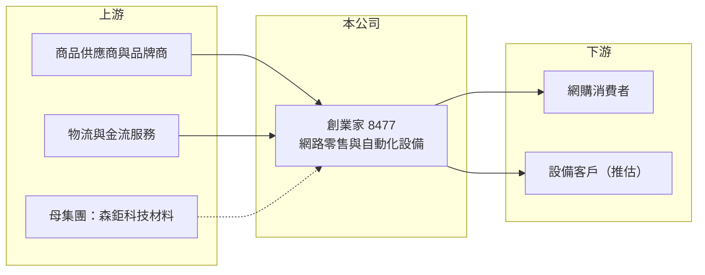

# 8477 創業家

> 上櫃｜[[產業索引-數位雲端|數位雲端]]｜上市（櫃）日期 2025/08/25

# 第一章：企業模式與商業藍圖

> [!info] 撰寫說明
> 精簡版，由 Claude 依公開資料整理，架構比照 [[2330台積電]] 的四章研究，資料截至 2026-10-08。來源：Goodinfo 年度經營績效頁、nStock 公司簡介、櫃買中心開放資料（基本資料、2026 年第二季資產負債與綜合損益、每月營收、本益比殖利率）；早期電商品牌描述為整理性內容。公開資料有限。#待校對

本章拆解創業家數位（股票代號：8477，以下簡稱創業家）的商業模式。創業家原名創業家兄弟，曾是台灣成長最快的垂直電商之一，營收在 2019 年達到約 51 億元，之後在電商大廠的價格與物流競爭下快速萎縮，2024 年經營權易主，目前處於轉型階段。

- **核心業務：** 公司 2012 年設立，2016 年上櫃，實收資本額約 8.42 億元。早年經營「生活市集」等電商平台（品牌名稱待校對），以精選商品、團購式行銷與低庫存模式起家。依公司介紹，目前業務為無店面網路零售業與自動化設備製造業。
- **經營權變化：** 2024 年 3 月，森啟股份有限公司以公開收購取得約 47.96% 股權，最終控制者為森鉅科技材料股份有限公司；2025 年 5 月股東會決議更名為「創業家數位」，同年 6 月完成變更（nStock）。新增的自動化設備業務與新經營者的產業背景有關（推估），但目前公開資料未說明其規模。
- **營收結構：** 公司未揭露各業務營收比重。[[毛利率]]長期只有 13% 至 20%，符合自行採購商品再銷售的 [[1P 自營]] 電商模式，營收以商品售價全額認列，毛利空間有限。
- **營運據點：** 總部位於台南仁德，以台灣市場為主。
- **長期方向：** 電商本業的營收已由 2019 年高峰縮小到 2025 年的約 4.15 億元，公司正在新股東主導下尋找新的業務方向。對長期投資人而言，關鍵在於新經營團隊會把公司定位為電商、設備製造或其他事業的平台，目前仍不明朗。

# 第二章：護城河深度與競爭優勢

創業家早年的優勢是選品與行銷效率，但在綜合型電商的規模競爭下，這個優勢已大幅減弱。

- **競爭優勢：** 垂直電商的優勢在於精選商品與快速推出爆品，配合社群與團購行銷，可以用較少的庫存與廣告費用創造銷售。創業家早年強調高毛利、低庫存、不加入短鏈物流競賽，在 2016 至 2019 年間營收由 31 億元成長到 51 億元。
- **主要對手：** [[8454富邦媒]]（momo 購物網）、[[8044網家]]（PChome）、蝦皮購物與酷澎（Coupang）等綜合型電商。這些平台以快速到貨、龐大品項與補貼搶占市場，讓中小型電商的流量成本大幅上升。
- **觀察重點：** 2021 年起本業連年虧損，營收持續下滑，代表原本的選品優勢無法抵抗大平台的規模效應。新經營團隊是否會縮小電商、轉型為其他業務，以及新業務能否帶來穩定獲利，是未來觀察的重點。

# 第三章：財務體質與盈利規模

資料日期：2026-10-08，表格是撰寫當時的快照；最新月營收、毛利率、累計 EPS 由自動排程寫在本筆記的屬性欄位（月營收、毛利率、累計EPS 等）。#待校對

本章用十年數據檢視創業家從高速成長到萎縮的過程。

| 年度 | 營收（新台幣） | [[毛利率]] | [[營業利益率]] | EPS（元） | [[ROE]] |
|---|---|---|---|---|---|
| 2016 | 31.3 億 | 16.4% | 1.61% | 2.92 | 16.1% |
| 2018 | 49.6 億 | 15.9% | 0.60% | 2.09 | 11.5% |
| 2019 | 50.9 億 | 18.3% | 0.76% | 1.53 | 8.82% |
| 2020 | 45.6 億 | 19.7% | 0.23% | 0.49 | 3.76% |
| 2021 | 36.7 億 | 17.5% | -1.64% | -1.06 | -6.27% |
| 2022 | 23.5 億 | 14.5% | -5.48% | -3.76 | -32.4% |
| 2023 | 13.1 億 | 16.3% | -8.63% | -3.53 | -43.3% |
| 2024 | 8.78 億 | 18.4% | -11.5% | -3.63 | -40.1% |
| 2025 | 4.15 億 | 12.7% | -22.7% | -0.92 | -15.8% |
| 2026 上半年 | 2.21 億 | 14.4% | -4.9% | 0.32 | 不適用（半年） |

- **營收規模：** 營收由 2019 年高峰約 50.9 億元，連續六年下滑到 2025 年的 4.15 億元，2021 至 2025 年年複合成長率約 -42%（推算）。依月營收資料，2026 年 1 至 8 月累計約 2.73 億元，仍低於去年同期的 3.12 億元。
- **獲利：** 即使在成長期，營業利益率也只有 0.2% 至 1.6%，顯示低毛利電商的獲利空間本來就很薄；2021 年起本業連年虧損，2021 至 2025 年平均 ROE 約 -27.6%（推算）。2026 年上半年營業虧損約 0.11 億元，但業外收入約 0.38 億元，使淨利約 0.21 億元（櫃買中心資料），本業仍未轉盈。
- **財務特色：** 2024 年第二季淨值低於股本二分之一，交易方式自 2024 年 8 月起變更，2025 年 4 月因淨值回升恢復普通交易（nStock）。2026 年第二季底總資產約 10.1 億元、負債約 2.85 億元、股東權益約 7.27 億元，保留盈餘約 -2.77 億元，新股東入主後的增資改善了財務結構（推估）。Goodinfo 統計歷年一般平均現金股利約 0.82 元，近年未配息。

**[[ROIC]] 與 [[WACC]]：** 2025 年營業利益約 -0.94 億元（4.15 億元 × -22.7%），2026 年上半年仍為營業虧損，ROIC 為負（推算）。即使在 2019 年高峰，營業利益約 0.39 億元、稅後約 0.31 億元，相對當時的資本，ROIC 也只有個位數（推估）。WACC 假設公債 1.75%、市場風險溢酬 6%、β 取 1.0（假設），負債以經營性負債為主，WACC 約 7.75%（推算）。ROIC 長期低於 WACC，代表低毛利電商模式即使在規模最大時也未能創造超額報酬，這是公司必須轉型的根本原因。

# 第四章：總體風險與地緣政治

創業家的風險集中在轉型的不確定性與電商市場的結構性競爭。

- **產業週期：** 台灣電商市場已進入成熟期，大平台以補貼與物流速度競爭，中小型電商的流量與廣告成本持續上升，這是結構性壓力而非短期景氣循環。
- **營運風險：** 本業營收持續下滑，新業務（如自動化設備）規模與獲利能力尚不明確。經營權由新股東掌握後，公司可能與母集團發生關係人交易，交易條件是否公允需要追蹤。
- **其他風險：** 淨利依賴業外收入，可持續性有限；若虧損持續，淨值可能再度接近股本二分之一的門檻。電商相關的消費者保護與個資法規趨嚴，也會增加合規成本。

# 專有名詞解析

## 金融

- **[[公開收購]]**：收購者公開向所有股東以固定價格收購股票，用來在短期內取得大量股權或經營權。
- **[[ROIC]]**：投入資本報酬率，稅後營業利益除以股東權益加有息負債，衡量本業運用資本的效率。
- **[[WACC]]**：加權平均資金成本，股東與債權人要求報酬的加權平均，ROIC 高於它才代表創造價值。

## 產業

- **[[1P 自營]]**：電商自行採購並持有庫存、以自己的名義銷售，營收以商品售價全額認列，毛利率較低但能掌控品質。
- **[[垂直電商]]**：專注特定品類或精選商品的電商，以選品與行銷取勝，規模通常小於綜合型電商平台。

# 核心供應鏈

- 上游：商品供應商與品牌商、物流配送與金流服務業者；最終控制者森鉅科技材料股份有限公司。
- 下游／客戶：網路購物消費者；自動化設備業務的企業客戶（推估，客戶未查得）。
- 同業：[[8454富邦媒]]、[[8044網家]]、蝦皮購物、酷澎。

## 最新新聞
<!-- news:start -->
<!-- news:end -->

## 相關連結
- [公開資訊觀測站](https://mopsov.twse.com.tw/mops/web/t05st03?step=1&firstin=1&co_id=8477)
- [Goodinfo](https://goodinfo.tw/tw/StockDetail.asp?STOCK_ID=8477)
- [Yahoo 股市](https://tw.stock.yahoo.com/quote/8477)
- [鉅亨網新聞](https://www.cnyes.com/twstock/8477/news)
