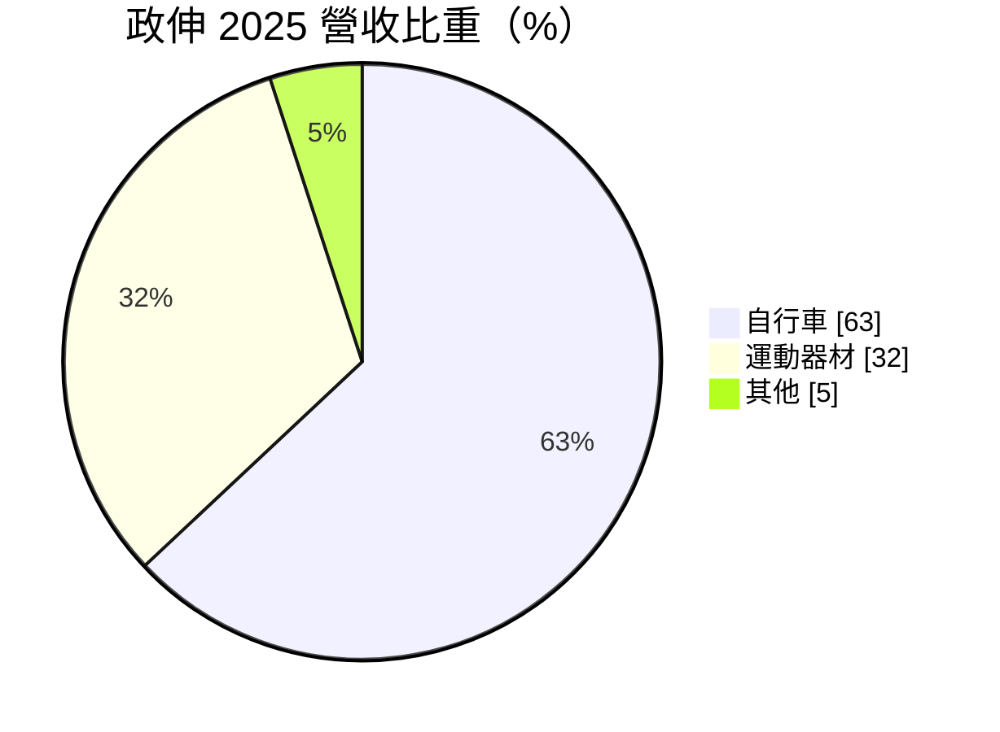
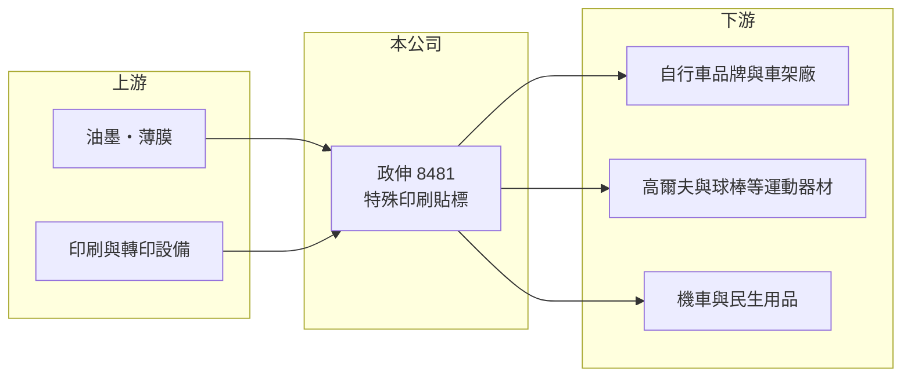

# 8481 政伸

> 上市｜[[產業索引-其他業|其他業]]｜上市（櫃）日期 2017/02/24

# 第一章：企業模式與商業藍圖

> [!info] 撰寫說明
> 精簡版，由 Claude 依公開資料整理，架構比照 [[2330台積電]]，資料截至 2026-10-07。來源：富果研究 2026 年 5 月法說會摘要、winvest 營收快訊。#待校對

政伸是自行車與運動器材的特殊印刷貼標供應商，以多樣化工藝與國際品牌客戶見長。

- **核心業務：** 提供[[貼標]]與特殊印刷，涵蓋 30 多種產品類別、900 多種製程組合，並協助客戶評估費用、工藝與使用條件。
- **營收結構：** 2025 年自行車 63%（全球貼標供應量第一），運動器材 32%（高爾夫球頭、棒球棒市場第一），其他 5%（高階機車、民生用品）。
- **營運據點：** 台灣總部，生產與服務據點包括中國福建、越南與荷蘭。
- **長期方向：** 2026 年營收成長目標 10%，以市場拓展、客戶開發、產品創新與製程優化為主軸，並推出可協助客戶減碳的新產品。

# 第二章：護城河深度與競爭優勢

政伸的護城河是高毛利的客製化工藝與長期合作的國際品牌客戶。

- **競爭優勢：** 近 47% 的毛利率反映客製化與工藝門檻；多國據點可就近服務品牌與代工廠。
- **主要客戶：** GIANT（[[9921巨大]]）、MERIDA（[[9914美利達]]）、SPECIALIZED、TREK、TaylorMade、CCM、膳魔師等。
- **主要對手：** 各地中小型印刷貼標廠與轉印廠，公開資料未列出具體對手。
- **觀察重點：** 自行車庫存調整後的回補力道、運動器材客戶拓展，以及荷蘭、越南據點貢獻。

# 第三章：財務體質與盈利規模

資料日期：2026-10-07，以下數字是撰寫當時的快照；最新月營收、毛利率、累計 EPS 由自動排程寫在本筆記的屬性欄位（月營收、毛利率、累計EPS 等）。#待校對

政伸維持高毛利，2026 年營收溫和成長。

- **營收規模：** 2025 年營收 11.8 億元；2026 年第一季 2.8 億元；8 月營收 1.12 億元，年增 5.55%。
- **獲利：** 2025 年 EPS 3.25 元、[[毛利率]] 47.33%；2026 年第一季 EPS 0.77 元、毛利率 47.0%。
- **財務特色：** 2025 年度配發現金股利 2.75 元，配發率約 85%（推算），屬高配息型小型股。

# 第四章：總體風險與地緣政治

政伸的風險主要來自自行車產業的庫存週期。

- **產業週期：** 自行車產業曾經歷疫情後的大幅[[庫存調整]]，品牌拉貨節奏會直接影響貼標訂單，存在[[長鞭效應]]。
- **營運風險：** 營收高度集中於自行車，客戶集中度偏高。
- **其他風險：** 地緣政治與通膨，公司以產品升級、市場分散與強化供應鏈韌性因應；匯率波動也會影響外銷獲利。

# 專有名詞解析

## 金融

- **[[長鞭效應]]**：終端需求的小幅變動，沿供應鏈往上游傳遞時被逐級放大，造成上游庫存與訂單劇烈波動。
- **[[毛利率]]**：毛利除以營收，反映產品或服務本身的獲利能力。

## 產業

- **[[貼標]]**：將圖案、品牌標誌以印刷或轉印方式貼附在產品表面的加工，兼具裝飾與辨識功能。
- **[[庫存調整]]**：下游品牌或通路降低庫存、減少拉貨的期間，上游供應商訂單會明顯下滑。

# 核心供應鏈

- 上游：油墨、薄膜與印刷設備供應商（推估）
- 下游／客戶：[[9921巨大]]、[[9914美利達]]、SPECIALIZED、TREK、TaylorMade、CCM、膳魔師
- 同業：各地印刷貼標與轉印廠（公開資料未列出具體公司）

## 最新新聞
<!-- news:start -->
<!-- news:end -->

## 相關連結
- [公開資訊觀測站](https://mopsov.twse.com.tw/mops/web/t05st03?step=1&firstin=1&co_id=8481)
- [Goodinfo](https://goodinfo.tw/tw/StockDetail.asp?STOCK_ID=8481)
- [Yahoo 股市](https://tw.stock.yahoo.com/quote/8481)
- [鉅亨網新聞](https://www.cnyes.com/twstock/8481/news)
