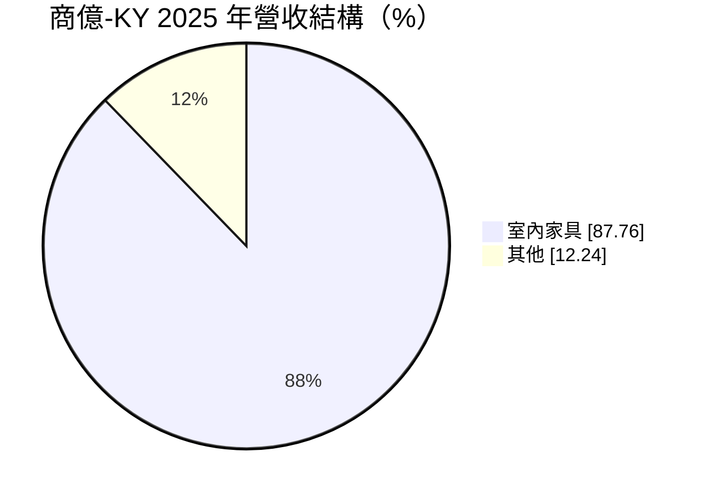
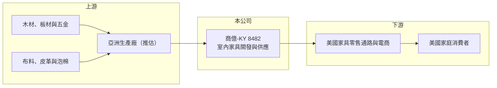

# 8482 商億-KY

> 上市｜[[產業索引-居家生活|居家生活]]｜上市（櫃）日期 2018/08/15

# 第一章：企業模式與商業藍圖

> [!info] 撰寫說明
> 精簡版，由 Claude 依公開資料整理，架構比照 [[2330台積電]]，資料截至 2026-10-08。來源：MoneyDJ 理財網財務比率年表（2021 至 2025 年）與個股基本資料（2025 年營收比重）、證交所公開資料彙整的 2026 年第二季財報與 2025 年度股利資料、經濟日報 2025 至 2026 年報導標題。公開資料有限，產品線、客戶與生產據點細節未逐條查證。#待校對

商億-KY 是以開曼控股公司來台上市的室內家具業者，2025 年室內家具占營收近九成，主要市場在美國，營運跟著美國房市與家具消費起伏。

- **核心業務：** 商億全球控股 2014 年在開曼群島設立，2018 年 8 月在台灣上市，屬於 [[KY股]]，英文名稱為 Shane Global。公司開發並供應室內家具給美國市場，媒體報導其營收受惠美國房市回溫，代表需求與新屋成交、搬家與裝修密切相關。
- **營收結構：** 依 MoneyDJ 資料，2025 年室內家具占 87.76%，其他占 12.24%。毛利率長期維持在 29% 至 36%，明顯高於一般家具代工廠，推估公司在產品設計、品牌或通路經營上有較高的附加價值（細節未查得）。

- **營運據點：** 台灣聯絡處位於台北市大安區，註冊地在開曼群島；生產與倉儲據點本次未查得，推估以亞洲生產、美國銷售為主。
- **長期方向：** 公司在 2021 至 2022 年疫情帶動的居家需求中達到獲利高峰，2023 年營收大減約 29% 後至今仍在調整。長期成長取決於美國房市的循環、產品線的擴充，以及在美國關稅政策下調整生產來源的能力。

# 第二章：護城河深度與競爭優勢

商億的優勢是較高的產品附加價值與美國市場經驗，但家具業的需求週期與競爭仍使護城河偏窄。

- **競爭優勢：** 毛利率約為一般家具代工廠的兩倍，說明公司不只是單純接單生產，而是在設計、選品或通路服務上取得溢價。長期經營美國市場也讓公司熟悉當地通路的規格、物流與售後要求。
- **主要對手：** 同業包括美國本地家具品牌、越南與中國的家具供應商，台股可對照 [[6807峰源-KY]]、[[8066來思達]]。美國家具零售通路與電商平台上選擇眾多，價格透明度高。
- **觀察重點：** 營業利益率由 2022 年的 17.1% 降到 2025 年的 8.7%，2026 年上半年回升到約 11.2%。長期要看營業利益率能否穩定在 10% 以上，以及營收能否擺脫 2023 年以來約 35 億元的水準。

# 第三章：財務體質與盈利規模

資料日期：2026-10-08，表格是撰寫當時的快照；最新月營收、毛利率、累計 EPS 由自動排程寫在本筆記的屬性欄位（月營收、毛利率、累計EPS 等）。#待校對

商億 2021 至 2022 年獲利處於高峰，2023 年後營收與獲利都明顯回落。

| 年度 | 營收（億元） | [[毛利率]] | [[營業利益率]] | EPS（元） | [[ROE]] |
|---|---|---|---|---|---|
| 2021 | 約 50.8（推算） | 34.87% | 16.83% | 7.97 | 27.14% |
| 2022 | 約 52.3（推算） | 36.33% | 17.09% | 7.77 | 23.91% |
| 2023 | 約 36.9（推算） | 35.48% | 10.73% | 2.87 | 8.25% |
| 2024 | 約 37.8（推算） | 34.41% | 11.85% | 4.36 | 13.23% |
| 2025 | 約 35.0（推算） | 32.06% | 8.71% | 2.30 | 6.90% |

註：2025 年營收以每股營業額 32.59 元乘以約 1 億 744 萬股推算，其他年度依 MoneyDJ 營收成長率回推。

- **長期指標：** 2021 至 2025 年營收年複合成長率約 -8.9%（推算），近 5 年平均 ROE 約 15.9%（推算），但近三年平均只有約 9.5%。2025 年度現金股利 1.96 元，約占當年 EPS 的 85%，公司把大部分盈餘發還股東。自由現金流資料本次未查得。
- **[[ROIC]] 與 [[WACC]]：** 2025 年稅後營業利益約 2.4 億元（營收約 35.0 億元 × 營業利益率 8.71% × 0.8），投入資本約 39.8 億元（2026 年第二季股東權益約 32.0 億元，加上以總負債約 15.8 億元的一半推估的有息負債約 7.9 億元），ROIC 約 6.1%（推算）；2022 年高峰時約 18%（推算，以目前投入資本計算）。WACC 約 6.6%（推算：無風險利率 1.75%、市場風險溢酬 6%、β 取家具同業常見值 1.0，股東權益成本 7.75%；稅前負債成本 2.5%、稅率 20%；權益比重約 80%）。高峰期 ROIC 遠高於 WACC，但 2025 年已略低於資金成本，代表公司能否持續創造價值取決於美國家具需求的回升。
- **財務特色：** 負債比率長期在 25% 至 33% 之間，財務結構保守，2025 年每股淨值 29.30 元。營收下滑時公司仍維持高配息，顯示經營層重視股東回饋，但長期也需要保留資金因應產地調整。

# 第四章：總體風險與地緣政治

商億的風險集中在美國房市與家具消費週期，以及美國的關稅政策。

- **產業週期：** 家具需求與美國新屋與成屋成交高度相關，房貸利率上升時成交量下滑，家具需求隨之減少。疫情期間居家需求提前透支，2023 年營收大減就是這個週期的反映。
- **營運風險：** 營收高度集中在美國市場與家具單一品類，缺乏其他市場分散。毛利率雖高，但營收下滑時固定費用使營業利益率快速縮小，呈現明顯的[[營運槓桿]]。
- **其他風險：** 美國對亞洲家具進口的關稅與[[反傾銷]]調查會直接影響成本與定價；海運運費波動影響交貨成本；營收以美元計價，新台幣升值會壓縮換算後的獲利；作為 KY 公司，海外營運的資訊透明度也需留意。

# 專有名詞解析

## 金融

- **[[KY股]]**：在開曼群島等境外註冊、來台上市櫃的公司，營運據點多在海外，資訊揭露與法規環境與本國公司不同。
- **[[營運槓桿]]**：固定成本占比高時，營收小幅變動會讓營業利益大幅變動的現象。
- **[[ROIC]]**：投入資本報酬率，稅後營業利益除以股東權益加有息負債，衡量本業運用資本的效率。
- **[[WACC]]**：加權平均資金成本，股東與債權人要求報酬率的加權平均，是 ROIC 要超越的門檻。

## 產業

- **[[反傾銷]]**：進口國對低於正常價格傾銷的進口商品加徵關稅的貿易救濟措施。

# 核心供應鏈

- 上游：木材、板材、五金、布料與皮革供應商及亞洲生產廠（供應商名稱未查得）。
- 下游／客戶：美國家具零售通路、電商平台與終端家庭（客戶名稱未查得）。
- 同業：[[6807峰源-KY]]、[[8066來思達]]，以及美國本地家具品牌與越南、中國家具供應商。

## 最新新聞
<!-- news:start -->
<!-- news:end -->

## 相關連結
- [公開資訊觀測站](https://mopsov.twse.com.tw/mops/web/t05st03?step=1&firstin=1&co_id=8482)
- [Goodinfo](https://goodinfo.tw/tw/StockDetail.asp?STOCK_ID=8482)
- [Yahoo 股市](https://tw.stock.yahoo.com/quote/8482)
- [鉅亨網新聞](https://www.cnyes.com/twstock/8482/news)
