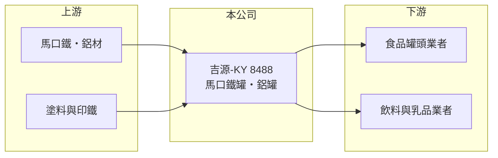

# 8488 吉源-KY

> 上市｜[[產業索引-其他業|其他業]]｜上市（櫃）日期 2016/12/13

# 第一章：企業模式與商業藍圖

> [!info] 撰寫說明
> 精簡版，由 Claude 依公開資料整理，架構比照 [[2330台積電]]，資料截至 2026-10-07。來源：winvest 營收快訊（2026 年 4 月至 8 月）。公開資料有限。#待校對

吉源-KY 製造馬口鐵罐與鋁罐等金屬包裝，2026 年營收大幅成長，獲利回到損益兩平附近。

- **核心業務：** 製造與銷售[[馬口鐵]]罐、鋁罐等金屬包裝材料，供食品、飲料等產業使用（推估）。
- **營收結構：** 公開資料未揭露產品比重。
- **營運據點：** 屬 [[KY股]]，生產基地位於中國大陸（推估，待校對）。
- **長期方向：** 2026 年營收明顯回升，重點在把營收成長轉為穩定獲利。

# 第二章：護城河深度與競爭優勢

金屬包裝是重資產、靠規模與客戶關係競爭的產業，吉源-KY 規模相對小。

- **競爭優勢：** 既有食品飲料客戶關係與製罐產線（推估）。
- **主要對手：** 中國大陸大型製罐廠如奧瑞金、寶鋼包裝等（推估）。
- **觀察重點：** 營收高成長能否帶動毛利改善，以及原物料價格轉嫁能力。

# 第三章：財務體質與盈利規模

資料日期：2026-10-07，以下數字是撰寫當時的快照；最新月營收、毛利率、累計 EPS 由自動排程寫在本筆記的屬性欄位（月營收、毛利率、累計EPS 等）。#待校對

吉源-KY 營收大增，但獲利仍薄。

- **營收規模：** 2026 年 8 月營收 3.86 億元，年增 24.98%；1 至 8 月累計 28.04 億元，年增 49.4%。
- **獲利：** 2025 年 EPS -2.05 元；2026 年第二季 EPS 0.21 元，上半年累計 0.02 元，第一季仍為虧損。
- **財務特色：** 資本額 7.35 億元，市值約 7.31 億元；[[毛利率]]資料未查得。

# 第四章：總體風險與地緣政治

吉源-KY 的風險集中在原物料成本與下游消費需求。

- **產業週期：** 罐頭與飲料需求屬民生消費，相對穩定，但受中國消費景氣影響。
- **營運風險：** 營收成長未完全反映在獲利，代表價格競爭或成本壓力仍大。
- **其他風險：** 馬口鐵、[[鋁錠]]價格波動，以及人民幣匯率與 KY 公司資訊揭露較少的治理風險。

# 專有名詞解析

## 金融

- **[[KY股]]**：在海外註冊、來台上市櫃的公司，代號名稱後加註 KY。
- **[[毛利率]]**：毛利除以營收，反映產品或服務本身的獲利能力。

## 產業

- **[[馬口鐵]]**：鍍錫薄鋼板，耐腐蝕且易於加工，常用於罐頭與奶粉罐。
- **[[鋁錠]]**：鋁的初級原料，價格隨國際金屬市場波動，影響鋁罐成本。

# 核心供應鏈

- 上游：馬口鐵、鋁材與塗料供應商（推估）
- 下游／客戶：食品罐頭、飲料與乳品業者（推估）
- 同業：奧瑞金、寶鋼包裝等中國製罐廠（推估）

## 最新新聞
<!-- news:start -->
<!-- news:end -->

## 相關連結
- [公開資訊觀測站](https://mopsov.twse.com.tw/mops/web/t05st03?step=1&firstin=1&co_id=8488)
- [Goodinfo](https://goodinfo.tw/tw/StockDetail.asp?STOCK_ID=8488)
- [Yahoo 股市](https://tw.stock.yahoo.com/quote/8488)
- [鉅亨網新聞](https://www.cnyes.com/twstock/8488/news)
