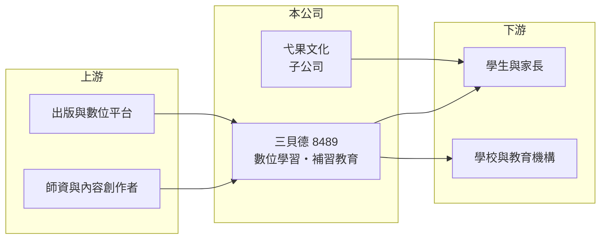

# 8489 三貝德

> 上櫃｜[[產業索引-其他業|其他業]]｜上市（櫃）日期 2017/04/27

# 第一章：企業模式與商業藍圖

> [!info] 撰寫說明
> 精簡版，由 Claude 依公開資料整理，架構比照 [[2330台積電]]，資料截至 2026-10-07。來源：winvest 營收快訊（2026 年 5 月至 8 月）。公開資料有限。#待校對

三貝德經營數位學習內容與補習教育，2025 年 10 月併入弋果文化後營收明顯放大。

- **核心業務：** 營收來自[[數位學習]]內容產品、補習教育收入及其他。
- **營收結構：** 公開資料未揭露細項比重；2026 年 8 月子公司營收約 4,954 萬元，約占當月營收三成。
- **營運據點：** 以台灣為主（推估）。
- **長期方向：** 透過取得弋果文化股權擴大內容與通路規模，走併購整合路線。

# 第二章：護城河深度與競爭優勢

三貝德的優勢在內容與補教的結合，但教育市場面臨少子化壓力。

- **競爭優勢：** 數位內容與實體補教並行，可交叉銷售；併購弋果文化後產品線更完整（推估）。
- **主要對手：** 其他補教集團、線上教育平台與出版商（推估）。
- **觀察重點：** 弋果文化併入後的整合綜效，以及營收成長能否穩定轉為獲利。

# 第三章：財務體質與盈利規模

資料日期：2026-10-07，以下數字是撰寫當時的快照；最新月營收、毛利率、累計 EPS 由自動排程寫在本筆記的屬性欄位（月營收、毛利率、累計EPS 等）。#待校對

三貝德 2026 年營收大增，並由虧轉盈。

- **營收規模：** 2026 年 8 月營收 1.68 億元，年增 32.56%；1 至 8 月累計 12.99 億元，年增 50.31%，主因併入弋果文化。
- **獲利：** 2025 年 EPS -0.76 元；2026 年第二季 EPS 0.51 元，上半年累計 0.89 元。
- **財務特色：** 補教業常有[[預收學費]]，帶來營運現金但屬合約負債；資本額 5.99 億元，市值約 13.04 億元。

# 第四章：總體風險與地緣政治

三貝德的風險來自人口結構與併購整合。

- **產業週期：** 補教需求有寒暑假季節性，學期與升學考試時程影響營收分布。
- **營運風險：** 併購後的[[商譽]]與整合成本，若綜效不如預期可能產生減損。
- **其他風險：** [[少子化]]使學生人數長期減少，教育法規與課綱變動也會影響內容需求。

# 專有名詞解析

## 應用

- **[[數位學習]]**：以線上課程、影音與互動軟體提供的教學內容與服務。

## 金融

- **[[預收學費]]**：學生先繳、課程尚未提供的學費，帳上列為負債，隨上課進度認列營收。
- **[[商譽]]**：併購價格高於被併公司可辨認淨資產的部分，需定期測試是否減損。

## 產業

- **[[少子化]]**：出生率下降使學齡人口減少，長期壓縮教育與兒童相關產業需求。

# 核心供應鏈

- 上游：師資、內容創作者、出版與數位平台（推估）
- 下游／客戶：學生與家長、學校與教育機構（推估）
- 同業：其他補教集團與線上教育業者（推估）

## 最新新聞
<!-- news:start -->
<!-- news:end -->

## 相關連結
- [公開資訊觀測站](https://mopsov.twse.com.tw/mops/web/t05st03?step=1&firstin=1&co_id=8489)
- [Goodinfo](https://goodinfo.tw/tw/StockDetail.asp?STOCK_ID=8489)
- [Yahoo 股市](https://tw.stock.yahoo.com/quote/8489)
- [鉅亨網新聞](https://www.cnyes.com/twstock/8489/news)
