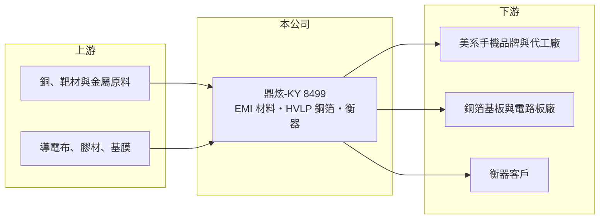

# 8499 鼎炫-KY

> 上市｜[[產業索引-其他電子業|其他電子業]]｜上市（櫃）日期 2017/11/24

# 第一章：企業模式與商業藍圖

> [!info] 撰寫說明
> 精簡版，由 Claude 依公開資料整理，架構比照 [[2330台積電]]，資料截至 2026-10-08。來源：優分析 鼎炫-KY HVLP 銅箔報導、CMoney 投資快訊、nStock 鼎炫-KY 公司概況、MoneyDJ 理財網財務比率年表（2021 至 2025 年）。營收絕對金額未查得。#待校對

鼎炫-KY 由衡器與電子材料兩大事業組成，電子材料以 EMI 電磁干擾防護方案起家，近年透過併購切入 AI 伺服器用的高階銅箔。

- **核心業務：** 鼎炫專注 [[EMI]] 與[[電磁相容]]的整體解決方案及電子材料的設計製造，另有衡器（秤重設備）事業。EMI 材料用來阻隔電子產品內部與外部的電磁干擾，手機、筆電等產品都需要，屬於單價不高但不可缺少的功能性材料。
- **營收結構：** 產品別比重本次未查得。依優分析報導，材料事業中美系手機品牌客戶約占材料營收 60% 至 70%，客戶集中度很高。
- **營運據點：** 公司為 KY 控股公司，在中國與泰國布局五座產線，掛牌約 8 年。泰國產線有助於配合客戶的中國以外供應鏈需求。
- **長期方向：** 公司以真空磁控濺鍍結合電鍍製程，開發 [[HVLP]]5+ 等級的超低粗糙度銅箔，表面粗糙度 Rz 低於 2 微米，瞄準 AI 伺服器高頻高速電路板。依報導，產品已進入十餘家國際銅箔基板與電路板大廠的工程驗證，並規劃 2026 年放量；公司也以併購兩家材料廠擴大版圖，經營層習慣用併購推動成長。

# 第二章：護城河深度與競爭優勢

鼎炫的護城河來自材料製程技術與大客戶認證，毛利率長期在四成以上可以作為證明。

- **競爭優勢：** EMI 材料需要依每款產品的結構客製設計，打入美系手機品牌供應鏈後，可以隨新機種持續出貨，客戶轉換意願低。濺鍍製程做銅箔與傳統電解銅箔路線不同，若能在高階規格量產，技術差異可以形成新的壁壘。
- **主要對手：** EMI 材料方面有日本與美國的功能性材料大廠，以及中國的導電布與吸波材廠；高階銅箔方面，對手是三井金屬、古河電工等日系銅箔大廠，以及台灣的 [[8358金居]] 等銅箔廠。
- **觀察重點：** 長期要看 HVLP 銅箔能否通過驗證並取得穩定訂單，讓營收結構不再過度依賴單一手機品牌；併購整合後的毛利率是否維持在四成以上，也是檢驗併購品質的指標。

# 第三章：財務體質與盈利規模

資料日期：2026-10-08，表格是撰寫當時的快照；最新月營收、毛利率、累計 EPS 由自動排程寫在本筆記的屬性欄位（月營收、毛利率、累計EPS 等）。#待校對

鼎炫本業毛利率與營業利益率都很高，但股東權益規模大，使 ROE 自 2022 年起明顯降低。

| 年度 | 營收年增率 | [[毛利率]] | [[營業利益率]] | EPS（元） | [[ROE]] |
|---|---|---|---|---|---|
| 2021 | 12.65% | 52.10% | 38.28% | 14.14 | 23.31% |
| 2022 | -13.17% | 45.99% | 32.75% | 15.75 | 12.89% |
| 2023 | -19.95% | 41.59% | 21.67% | 8.97 | 5.40% |
| 2024 | 10.27% | 43.45% | 22.98% | 11.14 | 5.46% |
| 2025 | 42.88% | 44.17% | 23.18% | 10.13 | 5.63% |

註：營收絕對金額未查得，以 MoneyDJ 營收成長率代替。

- **長期指標：** 近 5 年平均 ROE 約 10.5%（推算）。每股淨值由 2021 年的 64.61 元跳升到 2022 年的 143.56 元、2025 年 199.27 元，原因未查得（可能與增資或股本結構有關，待校對），這是 ROE 下降的主因。近五年平均現金股利約 6.01 元，2024 年度配發 8.06 元，配息穩定且偏高。
- **[[ROIC]] 與 [[WACC]]：** 以每股數字推算，2025 年每股營業額 70.75 元 × 營業利益率 23.18% × 0.8 ≈ 每股稅後營業利益 13.1 元，除以每股淨值 199.27 元，ROIC 約 6.6%（推算；負債比率 24.57%，有息負債較少，暫不計入）。WACC 推估約 7.5%（推算：無風險利率 1.75%、市場風險溢酬 6%、β 取電子材料成長股常見值 1.1，股東權益成本 8.35%；稅前負債成本 2.5%、稅率 20%；權益比重約 86%）。本業的利潤率很高，但相對於帳上龐大的權益，ROIC 略低於 WACC；若權益中有大量現金或非營業資產，實際營業資本報酬會更高，需查年報確認。
- **財務特色：** 2025 年負債比率由 7.44% 升到 24.57%，可能與併購融資有關（推估）。

# 第四章：總體風險與地緣政治

鼎炫的風險在於客戶集中與新產品驗證。

- **產業週期：** EMI 材料跟著手機與消費電子出貨量起伏，2022 至 2023 年營收連續兩年衰退，反映消費電子的庫存調整。高階銅箔則跟著 AI 伺服器資本支出循環。
- **營運風險：** 美系手機品牌占材料營收六到七成，一旦該客戶改變設計或轉單，影響很大。HVLP 銅箔驗證期長，量產良率與成本能否達標仍有不確定性；併購整合也可能帶來商譽減損風險。
- **其他風險：** 產線集中在中國與泰國，美中貿易政策與關稅會影響出貨；銅價波動影響銅箔成本；KY 股的跨國治理與資訊揭露需要投資人留意。

# 專有名詞解析

## 半導體

- **[[濺鍍]]**：在真空中以離子撞擊靶材、讓金屬原子沉積到基材表面形成薄膜的製程。

## 金融

- **[[ROIC]]**：投入資本報酬率，稅後營業利益除以股東權益加有息負債，衡量本業運用資本的效率。
- **[[WACC]]**：加權平均資金成本，股東與債權人要求報酬率的加權平均，是 ROIC 要超越的門檻。

## 產業

- **[[EMI]]**：電磁干擾，電子產品運作時產生或受到的電磁雜訊，需要以屏蔽與吸波材料抑制。
- **[[電磁相容]]**：電子產品在電磁環境中正常運作、且不干擾其他設備的能力，產品上市前須通過檢測。
- **[[HVLP]]**：極低輪廓銅箔，表面粗糙度很低，可降低高頻訊號損失，是 AI 伺服器電路板的關鍵材料。

# 核心供應鏈

- 上游：銅、[[濺鍍]]靶材與金屬原料，導電布、膠材與基膜供應商
- 下游／客戶：美系手機品牌與其組裝代工廠（如 [[2317鴻海]]），國際銅箔基板與電路板大廠（驗證中，如 [[2383台光電]]、[[6274台燿]]，未確認為哪幾家），衡器客戶
- 同業：日美功能性材料大廠、中國 EMI 材料廠，三井金屬、古河電工等銅箔廠，[[8358金居]]

## 最新新聞
<!-- news:start -->
<!-- news:end -->

## 相關連結
- [公開資訊觀測站](https://mopsov.twse.com.tw/mops/web/t05st03?step=1&firstin=1&co_id=8499)
- [Goodinfo](https://goodinfo.tw/tw/StockDetail.asp?STOCK_ID=8499)
- [Yahoo 股市](https://tw.stock.yahoo.com/quote/8499)
- [鉅亨網新聞](https://www.cnyes.com/twstock/8499/news)
