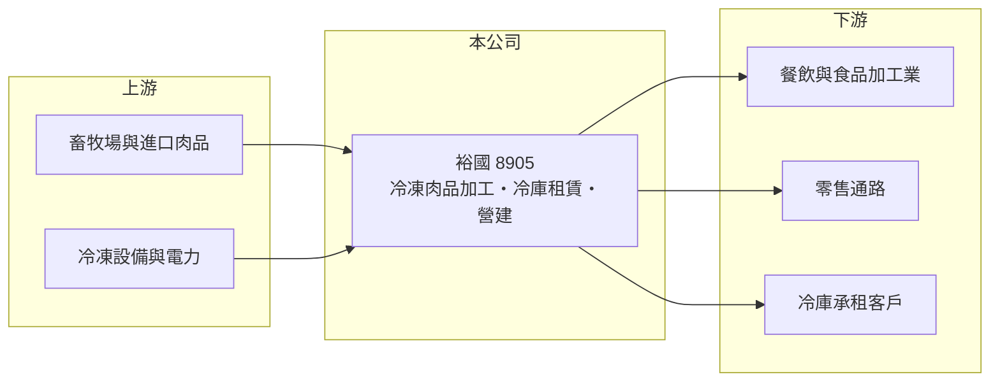

# 8905 裕國

> 上櫃｜[[產業索引-其他業|其他業]]｜上市（櫃）日期 1996/01/31

# 第一章：企業模式與商業藍圖

> [!info] 撰寫說明
> 精簡版，由 Claude 依公開資料整理，架構比照 [[2330台積電]]，資料截至 2026-10-07。來源：winvest 營收快訊（2026 年 5 月、8 月）。公開資料有限。#待校對

裕國冷凍冷藏以冷凍肉品加工為本業，另有冷凍倉儲租賃與營建業務。

- **核心業務：** 冷凍肉品加工與銷售、冷凍冷藏庫租賃，以及營建相關業務。
- **營收結構：** 公開資料未揭露三項業務比重，以肉品加工銷售為主（推估）。
- **營運據點：** 以台灣為主，成立於 1990 年。
- **長期方向：** 結合[[冷鏈物流]]倉儲與營建業務，活化土地與冷庫資產（推估）。

# 第二章：護城河深度與競爭優勢

裕國的優勢在冷凍冷藏設施與肉品加工的垂直結合。

- **競爭優勢：** 自有冷凍冷藏庫可同時支援本業與出租，冷庫建置需要土地與設備投資，具一定進入門檻。
- **主要對手：** 肉品加工業者如 [[1215卜蜂]]，以及其他冷鏈倉儲業者（推估）。
- **觀察重點：** 冷庫租賃的使用率與租金、營建案的完工入帳時點。

# 第三章：財務體質與盈利規模

資料日期：2026-10-07，以下數字是撰寫當時的快照；最新月營收、毛利率、累計 EPS 由自動排程寫在本筆記的屬性欄位（月營收、毛利率、累計EPS 等）。#待校對

裕國 2026 年營收與獲利同步成長。

- **營收規模：** 2026 年 8 月營收 2.05 億元，年增 11.61%；1 至 8 月累計 15.08 億元，年增 13.89%。
- **獲利：** 2025 年 EPS 0.61 元；2026 年第二季 EPS 0.44 元，上半年累計 0.59 元，已接近去年全年。
- **財務特色：** 營建業務採[[完工認列]]，個別季度獲利可能因建案交屋而跳升；資本額 11.94 億元，市值約 41.62 億元。

# 第四章：總體風險與地緣政治

裕國的風險來自肉品價格與營建入帳的波動。

- **產業週期：** 肉品屬[[大宗物資]]，價格受國際豬肉、雞肉行情與進口量影響。
- **營運風險：** 營建收入一次性認列，使獲利年度間波動大；冷庫電費成本隨電價上升。
- **其他風險：** 動物疫病（如非洲豬瘟）、進口肉品關稅與食品安全法規變動。

# 專有名詞解析

## 金融

- **[[完工認列]]**：建案完工交屋時一次認列營收與獲利，使營建業績呈現跳躍式波動。

## 產業

- **[[冷鏈物流]]**：從生產、倉儲到配送全程維持低溫的物流體系，用於肉品、水產與冷凍食品。
- **[[大宗物資]]**：黃豆、玉米、肉品等標準化、大量交易的原物料，價格受國際行情影響。

# 核心供應鏈

- 上游：畜牧場、進口肉品貿易商與冷凍設備供應商（推估）
- 下游／客戶：餐飲業、食品加工業、零售通路與冷庫承租客戶（推估）
- 同業：[[1215卜蜂]]等肉品業者、冷鏈倉儲業者（推估）

## 最新新聞
<!-- news:start -->
<!-- news:end -->

## 相關連結
- [公開資訊觀測站](https://mopsov.twse.com.tw/mops/web/t05st03?step=1&firstin=1&co_id=8905)
- [Goodinfo](https://goodinfo.tw/tw/StockDetail.asp?STOCK_ID=8905)
- [Yahoo 股市](https://tw.stock.yahoo.com/quote/8905)
- [鉅亨網新聞](https://www.cnyes.com/twstock/8905/news)
