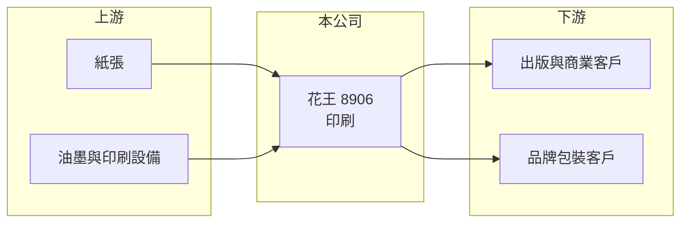

# 8906 花王

> 上櫃｜[[產業索引-其他業|其他業]]｜上市（櫃）日期 1996/04/23

# 第一章：企業模式與商業藍圖

> [!info] 撰寫說明
> 精簡版，由 Claude 依公開資料整理，架構比照 [[2330台積電]]，資料截至 2026-10-07。來源：winvest 營收快訊（2026 年 4 月至 8 月）。公開資料有限。#待校對

花王企業是成立於 1968 年的台灣印刷公司，與日本日用品集團花王無關，規模小且近年虧損。

- **核心業務：** 從事印刷業務，產品為各類商業與出版印刷品（推估）。
- **營收結構：** 公開資料未揭露產品比重。
- **營運據點：** 以台灣為主。
- **長期方向：** 公開資料未揭露具體策略；印刷需求長期受[[數位化]]影響，轉型方向待觀察。

# 第二章：護城河深度與競爭優勢

花王所處的傳統印刷業進入門檻低，競爭激烈。

- **競爭優勢：** 經營超過半世紀，累積客戶關係與印刷經驗（推估）。
- **主要對手：** [[8921沈氏]]等上市櫃印刷同業，以及眾多中小型印刷廠。
- **觀察重點：** 虧損能否收斂、是否有[[資產活化]]或業務轉型計畫。

# 第三章：財務體質與盈利規模

資料日期：2026-10-07，以下數字是撰寫當時的快照；最新月營收、毛利率、累計 EPS 由自動排程寫在本筆記的屬性欄位（月營收、毛利率、累計EPS 等）。#待校對

花王營收規模小，持續虧損。

- **營收規模：** 2026 年 8 月營收 1,730.5 萬元，年減 3.35%；1 至 8 月累計 1.34 億元，年減 1.1%。
- **獲利：** 2025 年 EPS -0.78 元；2026 年第二季 EPS -0.19 元，上半年累計 -0.47 元，虧損較去年同期縮小。
- **財務特色：** 資本額 4.40 億元，市值約 12.18 億元，市值明顯高於營收規模，可能反映市場對資產價值的評價（推估）。

# 第四章：總體風險與地緣政治

花王的風險在於產業萎縮與規模不足。

- **產業週期：** 紙本印刷需求隨數位化長期下滑。
- **營運風險：** 營收規模小，印刷設備的固定成本難以攤提，[[產能利用率]]偏低時虧損擴大。
- **其他風險：** 紙張與油墨等原物料價格波動、人力成本上升。

# 專有名詞解析

## 金融

- **[[產能利用率]]**：實際產量占可生產產能的比例，偏低時固定成本分攤會拉低毛利。

## 產業

- **[[資產活化]]**：將閒置土地、廠房出租、合建或出售，以提高資產報酬。
- **[[數位化]]**：紙本內容轉向電子形式，使傳統印刷需求長期下滑。

# 核心供應鏈

- 上游：紙張、油墨與印刷設備供應商（推估）
- 下游／客戶：出版、商業印刷與包裝客戶（推估）
- 同業：[[8921沈氏]]與中小型印刷廠

## 最新新聞
<!-- news:start -->
<!-- news:end -->

## 相關連結
- [公開資訊觀測站](https://mopsov.twse.com.tw/mops/web/t05st03?step=1&firstin=1&co_id=8906)
- [Goodinfo](https://goodinfo.tw/tw/StockDetail.asp?STOCK_ID=8906)
- [Yahoo 股市](https://tw.stock.yahoo.com/quote/8906)
- [鉅亨網新聞](https://www.cnyes.com/twstock/8906/news)
