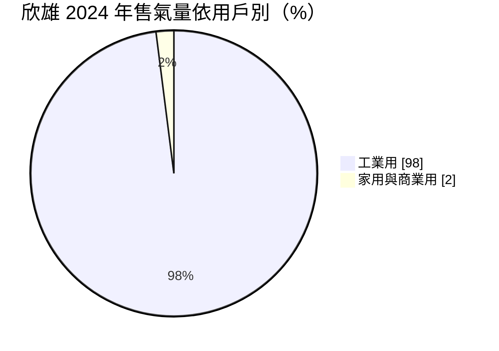
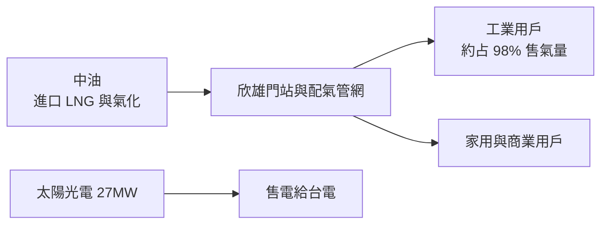
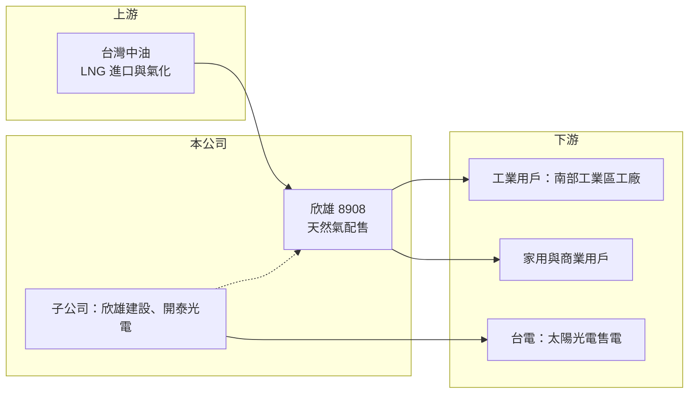

# 8908 欣雄

> 上櫃｜[[產業索引-油電燃氣業|油電燃氣業]]｜上市（櫃）日期 1997/02/14

# 第一章：企業模式與商業藍圖

> [!info] 撰寫說明
> 本文由 Claude 依公開資料整理，架構比照 [[2330台積電]] 的四章研究，資料截至 2026-10-08。財務數字來源：Goodinfo 年度經營績效頁、工商時報 2025 年 12 月報導、櫃買中心開放資料（基本資料、2026 年第二季資產負債與綜合損益、每月營收、本益比殖利率）；供氣區域等部分描述依記憶整理，已標註待校對；產業描述為整理性內容，尚未逐條比對原始文件。#待校對

在評估單一個股的長期投資價值時，首要步驟是拆解企業的底層獲利邏輯。本章說明欣雄天然氣（股票代號：8908，以下簡稱欣雄）這家以工業用戶為主的天然氣公司，如何以「轉售價差」賺取穩定的利潤。

## 一、核心定位：以工業用氣為主的天然氣公用事業

欣雄成立於 1986 年，1997 年在櫃買中心掛牌，實收資本額約 31.5 億元，董事長為朱文煌。公司是台灣的[[公用天然氣事業]]之一，向[[中油]]購入天然氣，再透過自有的地下管線網路，配送給特許經營區域內的用戶。依工商時報 2025 年 12 月報導，欣雄被稱為「國內工業天然氣霸主」，工業用天然氣約占總售氣量的 98%，2024 年總售氣量約 6.18 億度。欣雄的經營區域位於高雄地區（具體行政區待校對）。

這一點讓欣雄與 [[9908大台北]]、[[9918欣天然]] 等以家庭用戶為主的都會瓦斯公司明顯不同。家用瓦斯的用戶數多、每戶用量小，收入穩定但成長緩慢；欣雄則服務少數用量很大的工廠，收入規模大，但會隨著工業景氣與工廠開工率變動。

## 二、業務板塊：天然氣為主，延伸太陽光電與建設

* **工業用天然氣：** 約占售氣量 98%，用戶以南部工業區的製造業為主。天然氣是工廠鍋爐、加熱爐與製程用的燃料，工廠一旦接上管線，通常會長期使用。
* **家用與商業用天然氣：** 約占 2%，比重很低。
* **太陽光電：** 欣雄自行投資約 20MW，子公司開泰約 7MW，合計 27MW，每月平均售電收入約 1,000 萬元（工商時報，2025 年）。
* **建設：** 百分之百子公司欣雄建設推出首個透天建案「敦品三期」，總銷約 7 億元、30 戶，預計 2025 年第四季完工交屋。

## 三、資本轉化邏輯：管線網路與轉售價差

天然氣公司的獲利來自「向中油的進價」與「賣給用戶的售價」之間的價差，而不是氣價本身的高低。依報導，工業用天然氣進價每度從 2024 年 6 月的 8.88 元一路調到 2025 年 9 月的 15.39 元，累計上漲 6.51 元；欣雄的售價隨之調整，2025 年營收因此突破百億元，但這主要是價格轉嫁，售氣量與 2024 年大致持平。換句話說，營收數字的大幅波動並不代表獲利同步大增，真正決定利潤的是售氣量與每度價差。

管線網路是欣雄最重要的資產。地下管線一旦埋設完成，可以使用數十年，維護成本相對固定；新用戶接管時，用戶通常需要負擔部分外線費用，降低公司的投資風險。

## 四、企業長期藍圖

欣雄的長期課題是「本業成熟後如何延伸」。天然氣本業受到特許區域的限制，售氣量成長主要取決於區內工廠的擴產與「燃煤、燃油改燃氣」的政策推動。公司近年把多餘資金投入太陽光電與房地產開發，但依報導目前收益占比仍低。長期來看，台灣的減碳政策對天然氣是一把雙面刃：短期內「以氣代煤」對天然氣需求有利，長期則可能面臨工業電氣化與氫能的替代。

# 第二章：護城河深度與競爭優勢

本章分析欣雄作為特許經營公用事業的競爭優勢，以及以工業用戶為主帶來的集中風險。

## 一、護城河的核心組成要素

* **特許經營區域：** 公用天然氣事業依法在特定區域內經營，其他業者不能在同一區域內另建管線競爭。這是法律給予的區域獨占，是天然氣公司最根本的護城河。
* **管線網路的沉沒成本：** 地下管線需要長時間、大筆資金與道路挖掘許可，替代者幾乎不可能重建一套平行網路。
* **用戶轉換成本：** 工廠改用天然氣後，鍋爐與燃燒設備都已配合天然氣設計，改回燃油或液化石油氣的成本與環保限制都高。

## 二、主要競爭對手與替代能源

| 對手／替代者 | 定位 | 對欣雄的影響 |
|---|---|---|
| 中油直供 | 大型用戶可能直接向中油購氣 | 可能分走大用量客戶（待校對） |
| 液化石油氣、燃料油 | 工業燃料替代品 | 環保法規限制下逐漸被天然氣取代，對欣雄有利 |
| 電力（電熱、熱泵） | 工業電氣化 | 長期可能取代部分加熱用途 |
| 其他瓦斯公司（[[8917欣泰]]、[[9908大台北]] 等） | 不同特許區域 | 不直接競爭，屬同業比較對象 |

## 三、優勢轉化：守得住、守不住與觀察重點

* **守得住：** 區域內的管線與用戶基礎，特許制度提供長期保護。
* **守不住：** 工業用戶的用氣量。工廠減產、外移或電氣化時，欣雄無法以其他用戶補足。
* **觀察重點：** 第一，區內工業用戶的用氣量變化；第二，政府對天然氣價格與配氣價差的規範；第三，太陽光電與建設等多角化事業能否穩定貢獻獲利。

# 第三章：財務體質與盈利規模

資料日期：2026-10-08。數字取自 Goodinfo 年度經營績效頁、工商時報報導與櫃買中心開放資料，表格是撰寫當時的快照；最新月營收、毛利率、累計 EPS 由自動排程寫在本筆記的屬性欄位（月營收、毛利率、累計EPS 等）。#待校對

財務報表是檢驗護城河是否真實存在的最終標準。本章用多年度的三率、ROE 與資本報酬，檢視欣雄作為公用事業的獲利穩定度。

## 一、獲利能力的基石：三率

| 年度 | 營收（新台幣） | [[毛利率]] | [[營業利益率]] | EPS（元） | [[ROE]] |
|---|---|---|---|---|---|
| 2019 | 82.7 億 | 7.97% | 6.11% | 2.23 | 17.1% |
| 2020 | 63.3 億 | 9.63% | 7.36% | 1.93 | 14.8% |
| 2021 | 64.9 億 | 11.8% | 9.38% | 2.16 | 16.5% |
| 2022 | 72.2 億 | 11.5% | 9.19% | 2.06 | 15.8% |
| 2023 | 69.6 億 | 12.4% | 9.53% | 1.83 | 13.8% |
| 2024 | 81.6 億 | 11.5% | 9.10% | 1.87 | 13.9% |
| 2025 | 104 億 | 10.5% | 8.19% | 2.16 | 15.3% |
| 2026 上半年 | 52.6 億 | 10.4%（推算） | 7.98%（推算） | 1.03 | 未查得 |

註：2026 上半年毛利率與營業利益率依櫃買中心綜合損益資料（營收 52.6 億元、毛利 5.47 億元、營業利益 4.20 億元）推算。

* **營收波動來自氣價轉嫁：** 2019 至 2025 年營收在 63 億元到 104 億元之間大幅擺動，主要反映中油進價的變動，而不是售氣量。2024 年售氣量 6.18 億度，2025 年預估持平，但營收卻增加約 22 億元。
* **毛利率被氣價稀釋：** 每度價差相對固定時，氣價越高，毛利率反而越低。2025 年毛利率從 2023 年的 12.4% 降到 10.5%，就是這個效果。分析欣雄時，毛利金額與 EPS 比毛利率更有意義。
* **EPS 高度穩定：** 2019 至 2025 年 EPS 都在 1.83 元到 2.23 元之間，充分反映公用事業的獲利穩定性。營收年複合成長率 2021 至 2025 年約 12.5%（推算），但這主要是價格因素。

## 二、[[ROE]]：資本效率

2021 至 2025 年平均 ROE 約 15.1%（推算），對公用事業而言相當高。原因是欣雄的用戶以大用量工廠為主，單位管線的售氣量大，資產周轉率高。2026 年第二季底權益約 41.4 億元、負債約 78.6 億元（櫃買中心開放資料），負債比約 65%；天然氣公司的負債中通常包含用戶保證金與預收工程款，建設子公司也可能有建案融資（推估），實際有息負債比例未查得。

## 三、資本支出、自由現金流與股利

天然氣管網進入成熟期後，資本支出以維護與汰換為主，本業自由現金流應長期為正（推估）。欣雄的股利政策偏重股票股利，Goodinfo 統計長期一般平均現金股利約 0.34 元、股票股利約 0.68 元，因此股本持續膨脹，EPS 雖然穩定，但每股獲利沒有成長。櫃買中心本益比資料顯示最近一年每股股利約 1.80 元。

## 四、[[ROIC]] 與 [[WACC]]：價值創造利差

**ROIC 推算：** 2025 年營業利益約 8.52 億元（營收 104 億元 × 營業利益率 8.19%），扣除 20% 稅率後約 6.8 億元。2026 年第二季底權益約 41.4 億元，假設有息負債約 30 億元（負債總計約 78.6 億元的四成左右，推估），投入資本約 71 億元，ROIC 約 9.5%（推算）。

**WACC 推算：** 假設台灣 10 年期公債殖利率 1.75%、市場風險溢酬 6%、β 取公用事業常見值 0.5，股東權益成本約 4.75%。負債成本假設 2.5%，稅後約 2.0%；以帳面價值計權益約占 58%、負債約占 42%，WACC 約 3.6%（推算）。

**結論：** 欣雄 ROIC 約 9.5%，明顯高於約 3.6% 的資金成本，利差約 6 個百分點，是長期穩定創造價值的公用事業。這個利差的來源是特許區域與高用量工業用戶；只要售氣量不明顯萎縮、價差不被政策壓縮，利差可以長期維持。

# 第四章：總體風險與地緣政治

任何企業都無法脫離宏觀環境獨立存在。本章分析欣雄長期必須面對的能源政策、產業結構與營運風險。

## 一、能源政策

* **以氣代煤的機會：** 台灣減碳政策推動工業鍋爐從燃煤、燃油改用天然氣，是近十年天然氣需求成長的主要動力。
* **長期淨零的挑戰：** 台灣 2050 淨零路徑下，天然氣本身也是化石燃料。工業電氣化、氫能與碳費制度長期可能減少天然氣需求，這是天然氣公司十年以上尺度的最大不確定性。
* **價格管制：** 公用天然氣的售價與配氣價差受經濟部規範，政策若壓縮價差，獲利會直接受影響。

## 二、產業結構

* **工業用戶集中：** 98% 的售氣量來自工業用戶，區內大型工廠減產、關廠或外移，會直接影響售氣量。這比以家用為主的瓦斯公司有更高的景氣敏感度。
* **進價大幅波動：** 中油進價由國際 LNG 價格與政策決定，2024 至 2025 年累計上漲超過六成。售價調整若有時間落差，短期可能壓縮毛利。

## 三、營運環境的隱性風險

* **管線安全：** 天然氣管線洩漏或爆炸的事故風險，可能帶來重大賠償與監管壓力。高雄曾在 2014 年發生石化管線氣爆，地方政府對地下管線的管理要求嚴格。
* **多角化風險：** 房地產開發與本業性質完全不同，景氣循環明顯，若擴大投入可能增加獲利波動。
* **股本膨脹：** 長期以股票股利為主，股本增加會稀釋每股獲利。

## 四、科技演進

氫能與天然氣混燒、碳捕捉等技術可能改變工業燃料的長期結構。天然氣管網在未來是否能轉為輸送氫氣或[[生質甲烷]]，是公用天然氣事業的長期轉型方向，目前仍在研究階段。

# 專有名詞解析

## 金融

- **[[ROIC]]**：投入資本報酬率，稅後營業利益除以股東權益與有息負債的合計，衡量本業對所有資金提供者的報酬。
- **[[WACC]]**：加權平均資金成本，依股東權益與負債的比重加權計算的資金成本，ROIC 高於它才代表創造價值。

## 產業

- **[[公用天然氣事業]]**：依法取得特定區域經營權，透過管線供應天然氣給家庭、商業與工業用戶的公司。
- **[[中油]]**：台灣中油公司，國營石油公司，是台灣唯一的天然氣進口與批發供應商。
- **[[特許經營區域]]**：政府核定的獨家經營範圍，區內不允許其他業者另建管線競爭。
- **[[生質甲烷]]**：由廚餘、畜牧廢棄物等有機物發酵產生的甲烷，可注入天然氣管網替代部分化石天然氣。

# 核心供應鏈

## 1. 上游：氣源
- 台灣中油：天然氣唯一批發來源

## 2. 中游：欣雄本身與同業
- 子公司：欣雄建設（房地產）、開泰（太陽光電）
- 天然氣同業：[[9908大台北]]、[[9918欣天然]]、[[8917欣泰]]

## 3. 下游：用戶
- 工業用戶：區內製造業工廠（約占售氣量 98%）
- 家庭與商業用戶
- 台電：太陽光電售電對象

## 最新新聞
<!-- news:start -->
<!-- news:end -->

## 相關連結
- [公開資訊觀測站](https://mopsov.twse.com.tw/mops/web/t05st03?step=1&firstin=1&co_id=8908)
- [Goodinfo](https://goodinfo.tw/tw/StockDetail.asp?STOCK_ID=8908)
- [Yahoo 股市](https://tw.stock.yahoo.com/quote/8908)
- [鉅亨網新聞](https://www.cnyes.com/twstock/8908/news)
