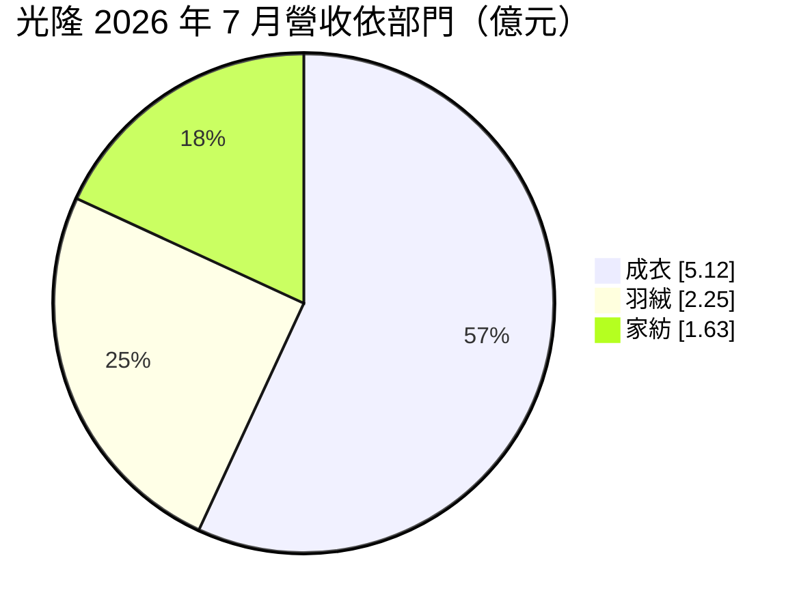
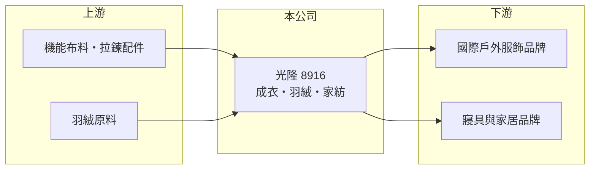

# 8916 光隆

> 上櫃｜[[產業索引-其他業|其他業]]｜上市（櫃）日期 1999/04/20

# 第一章：企業模式與商業藍圖

> [!info] 撰寫說明
> 精簡版，由 Claude 依公開資料整理，架構比照 [[2330台積電]]，資料截至 2026-10-07。來源：優分析 2026 年上半年獲利報導、旺得富 2025 年 11 月營收報導、winvest 營收快訊。#待校對

光隆是戶外機能服代工廠，事業分為成衣、羽絨與家紡三大部門，另有建案與資產處分等業外貢獻。

- **核心業務：** 以[[OEM]]模式為國際品牌代工戶外[[機能服]]，並生產羽絨原料與製品及家居紡織品。
- **營收結構：** 2026 年 7 月成衣 5.12 億元、羽絨 2.25 億元、家紡 1.63 億元；成衣年減 18.1%，羽絨與家紡年增六成以上。
- **營運據點：** 多國生產布局，並處分日本東京近藤大樓資產；2025 年 11 月曾有建案入帳約 3.6 億元。
- **長期方向：** 透過產品組合調整與提升家紡產能利用率改善獲利。

# 第二章：護城河深度與競爭優勢

光隆的優勢在於機能服、羽絨與家紡的垂直整合，但代工毛利偏薄。

- **競爭優勢：** 從[[羽絨]]原料到成品的整合能力，可同時供應成衣與寢具客戶。
- **主要對手：** 台灣成衣代工廠如 [[1477聚陽]]、[[1476儒鴻]]，以及東南亞、中國的羽絨與家紡廠（推估）。
- **觀察重點：** 成衣部門高基期後的回升、羽絨原料價格，以及家紡產能利用率。

# 第三章：財務體質與盈利規模

資料日期：2026-10-07，以下數字是撰寫當時的快照；最新月營收、毛利率、累計 EPS 由自動排程寫在本筆記的屬性欄位（月營收、毛利率、累計EPS 等）。#待校對

光隆 2026 年第二季獲利回升，下半年營收走揚。

- **營收規模：** 2026 年 7 月營收 9.03 億元；8 月營收 8.43 億元，年增 42.44%。
- **獲利：** 第二季稅後純益 1.81 億元、EPS 1.21 元；上半年稅後純益 2.08 億元、EPS 1.39 元。第二季[[毛利率]] 14.4%。
- **財務特色：** 建案入帳與海外資產處分屬[[一次性收益]]，評估本業時應排除。

# 第四章：總體風險與地緣政治

光隆的風險來自品牌客戶訂單與原料成本。

- **產業週期：** 戶外服飾與羽絨需求有季節性，下半年為旺季；品牌庫存調整會影響代工訂單。
- **營運風險：** 羽絨原料成本上升與家紡產能利用率偏低，壓縮毛利率。
- **其他風險：** 美國關稅政策影響出口成本，以及匯率波動。

# 專有名詞解析

## 金融

- **[[一次性收益]]**：建案入帳、資產處分等不會重複發生的收益，評估本業時常會排除。

## 產業

- **[[機能服]]**：具防水、透氣、保暖或排汗等功能的服飾，常用於戶外與運動。
- **[[羽絨]]**：鴨、鵝的絨毛，是羽絨外套與寢具的保暖填充材料，價格受禽類供給影響。
- **[[OEM]]**：依品牌客戶設計與規格代工生產，不掛自有品牌。

# 核心供應鏈

- 上游：機能布料、拉鍊配件與羽絨原料供應商（推估）
- 下游／客戶：國際戶外服飾品牌、寢具與家居品牌（推估）
- 同業：[[1477聚陽]]、[[1476儒鴻]]（推估）

## 最新新聞
<!-- news:start -->
<!-- news:end -->

## 相關連結
- [公開資訊觀測站](https://mopsov.twse.com.tw/mops/web/t05st03?step=1&firstin=1&co_id=8916)
- [Goodinfo](https://goodinfo.tw/tw/StockDetail.asp?STOCK_ID=8916)
- [Yahoo 股市](https://tw.stock.yahoo.com/quote/8916)
- [鉅亨網新聞](https://www.cnyes.com/twstock/8916/news)
