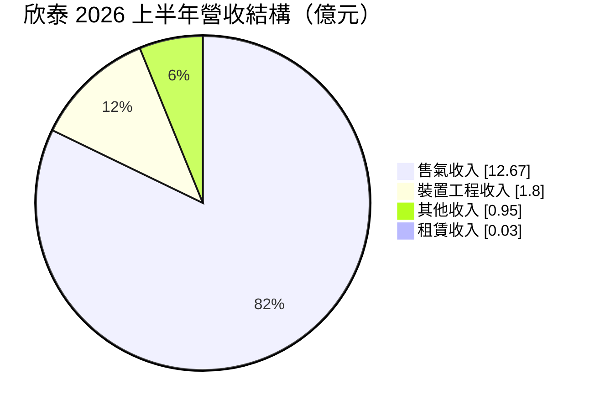
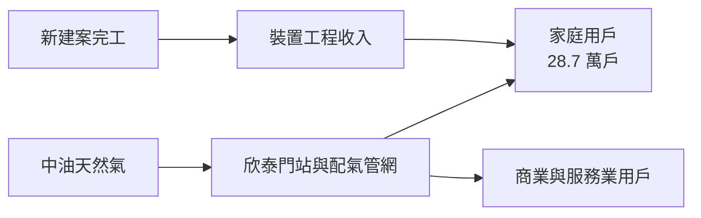
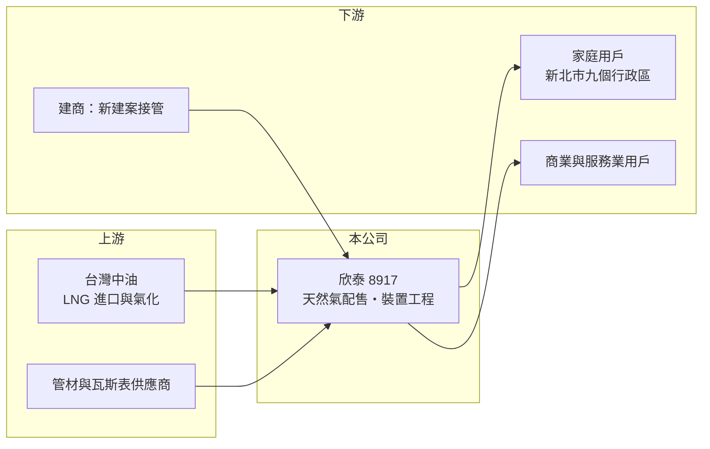

# 8917 欣泰

> 上櫃｜[[產業索引-油電燃氣業|油電燃氣業]]｜上市（櫃）日期 1999/05/06

# 第一章：企業模式與商業藍圖

> [!info] 撰寫說明
> 本文由 Claude 依公開資料整理，架構比照 [[2330台積電]] 的四章研究，資料截至 2026-10-08。財務數字來源：Goodinfo 年度經營績效頁、富果研究 2026 年 9 月法說會整理（AI 摘要）、櫃買中心開放資料（基本資料、2026 年第二季資產負債與綜合損益、每月營收、本益比殖利率）；產業描述為整理性內容，尚未逐條比對原始文件。#待校對

在評估單一個股的長期投資價值時，首要步驟是拆解企業的底層獲利邏輯。本章說明欣泰石油氣（股票代號：8917，以下簡稱欣泰）這家新北市的瓦斯公司，如何靠一套地下管網與二十多萬戶用戶，形成一門穩定的「收費站」生意。

## 一、核心定位：新北市西半部的天然氣公用事業

欣泰成立於 1986 年，1999 年在櫃買中心掛牌，實收資本額約 16.3 億元，董事長為莊鴻文。公司名稱雖然有「石油氣」，但今天的主業是[[公用天然氣事業]]：向[[中油]]購入天然氣，透過自有管線配送給家庭、商業與服務業用戶。

依富果研究整理的 2026 年 9 月法說會資料，欣泰的[[特許經營區域]]包括新北市八里、林口、五股、蘆洲、泰山、樹林、鶯歌、土城、三峽等九個行政區，以及桃園市龜山區迴龍里。這一帶是新北市近二十年人口成長最快的區域之一，林口新市鎮、三峽北大特區、土城與樹林的重劃區都在範圍內。截至 2026 年 6 月底，欣泰共有 286,770 戶供氣用戶，區域普及率 58.77%。

## 二、業務板塊：售氣為主，裝置工程為輔

2026 年上半年營收 15.45 億元，依法說會資料拆分如下：

* **售氣收入：** 約占 82%，來自家庭、商業與服務業的天然氣用量。公司預估 2026 年售氣量約 1.72 億度。
* **[[裝置工程收入]]：** 約占 12%，新建案或新用戶接管時，向用戶收取的管線安裝費用。這部分收入與區內新屋完工量直接相關。
* **其他：** 燃氣器具製造與銷售、不動產租賃等。

## 三、資本轉化邏輯：普及率與新建案帶動的穩定成長

天然氣公司的成長公式很簡單：用戶數 × 每戶用量 × 每度價差。欣泰的區域普及率約 59%，代表仍有四成住戶尚未使用天然氣，加上新北市西半部持續有重劃區與新建案完工，用戶數可以穩定增加。每一個新用戶先帶來一次性的裝置工程收入，之後再帶來數十年的售氣收入，這是公用天然氣事業最重要的商業邏輯。

欣泰自 2016 年起推動[[微電腦瓦斯表]]，截至 2026 年 6 月已安裝 233,094 具，裝設率約 81%。微電腦瓦斯表能偵測異常用氣並自動遮斷，提升安全性，也為遠端抄表與數據管理打下基礎。

## 四、企業長期藍圖

欣泰的長期策略重點在供氣安全、財務穩健與減碳。公司表示目前沒有借款負債，2023 年發布中英文永續報告書，2024 年導入 [[TCFD]] 氣候風險揭露，2025 年進行溫室氣體盤查，並購買再生能源憑證。這些都說明欣泰的經營風格偏向保守、穩定，追求的是長期可預期的現金流，而不是快速擴張。

# 第二章：護城河深度與競爭優勢

本章分析欣泰作為區域特許經營公用事業的競爭優勢，以及長期成長的天花板。

## 一、護城河的核心組成要素

* **法定區域獨占：** 公用天然氣事業依法在核定區域內獨家經營，其他業者不能在同區域內鋪設平行管線，這是最根本的護城河。
* **管網的沉沒成本：** 欣泰在九個行政區埋設的地下管線，是數十年累積的投資，任何替代者都幾乎不可能重建。
* **用戶轉換成本：** 住戶一旦接上天然氣，熱水器、瓦斯爐都已配合天然氣設計，改用桶裝瓦斯或電力需要更換設備，轉換意願低。
* **人口成長區位：** 林口、三峽、土城等地區仍有新建案持續完工，讓欣泰比位於成熟市區的瓦斯公司有更多成長空間。

## 二、主要競爭對手與替代能源

| 對手／替代者 | 定位 | 對欣泰的影響 |
|---|---|---|
| 桶裝液化石油氣 | 未接管住戶的替代燃料 | 普及率提升的對象，長期被天然氣取代 |
| 電力（電熱水器、熱泵、電磁爐） | 家庭電氣化 | 新建案「全電化」趨勢可能降低接管率 |
| 其他瓦斯公司（[[9908大台北]]、[[9918欣天然]]、[[8908欣雄]] 等） | 不同特許區域 | 不直接競爭，屬同業比較對象 |

## 三、優勢轉化：守得住、守不住與觀察重點

* **守得住：** 既有用戶的售氣收入。家庭烹飪與熱水需求穩定，管網與特許制度提供長期保護。
* **守不住：** 每戶用量的長期成長。家庭人口縮小、外食增加、熱泵與電磁爐普及，每戶用氣量可能逐步下降。
* **觀察重點：** 第一，用戶數與普及率的年度成長；第二，新建案採用天然氣或全電化的比例；第三，售氣價差是否受政策壓縮。

# 第三章：財務體質與盈利規模

資料日期：2026-10-08。數字取自 Goodinfo 年度經營績效頁、富果研究法說會整理與櫃買中心開放資料，表格是撰寫當時的快照；最新月營收、毛利率、累計 EPS 由自動排程寫在本筆記的屬性欄位（月營收、毛利率、累計EPS 等）。#待校對

財務報表是檢驗護城河是否真實存在的最終標準。本章用多年度的三率、ROE 與資本報酬，檢視欣泰的獲利穩定度。

## 一、獲利能力的基石：三率

| 年度 | 營收（新台幣） | [[毛利率]] | [[營業利益率]] | EPS（元） | [[ROE]] |
|---|---|---|---|---|---|
| 2019 | 24.5 億 | 22.1% | 17.5% | 2.99 | 18.2% |
| 2020 | 23.1 億 | 23.2% | 17.5% | 2.41 | 14.9% |
| 2021 | 23.0 億 | 22.2% | 17.0% | 2.21 | 13.9% |
| 2022 | 25.4 億 | 22.3% | 17.2% | 2.26 | 14.5% |
| 2023 | 25.8 億 | 22.1% | 17.1% | 2.38 | 14.5% |
| 2024 | 27.7 億 | 20.0% | 15.1% | 2.36 | 14.1% |
| 2025 | 31.0 億 | 18.0% | 13.6% | 2.23 | 13.3% |
| 2026 上半年 | 15.45 億 | 19.1%（推算） | 15.1%（推算） | 1.44 | 未查得 |

註：2026 上半年毛利率與營業利益率依櫃買中心綜合損益資料（營收 15.45 億元、毛利 2.95 億元、營業利益 2.34 億元）推算。

* **獲利穩定：** 2020 至 2025 年 EPS 都在 2.2 元到 2.4 元之間，營業利益率長期在 13% 至 18%，展現公用事業的穩定性。
* **毛利率被氣價稀釋：** 2024 至 2025 年中油調漲天然氣價格，欣泰營收增加，但每度價差未同比例擴大，毛利率從 22% 降到 18%。毛利金額大致持平。
* **營收成長：** 2021 至 2025 年營收從 23.0 億元增加到 31.0 億元，年複合成長率約 7.7%（推算），其中包含用戶數成長與氣價轉嫁兩個因素。

## 二、[[ROE]]：資本效率

2021 至 2025 年平均 ROE 約 14.1%（推算），在無借款的情況下仍有這個水準，代表本業資本效率良好。2026 年第二季底權益約 26.3 億元、負債約 35.2 億元（櫃買中心開放資料），負債比約 57%；由於公司表示沒有借款，負債主要應是用戶保證金、預收工程款與應付帳款等營運負債（推估）。

## 三、資本支出、自由現金流與股利

欣泰的資本支出以管線汰換、新區域管網延伸與瓦斯表更新為主，屬於持續性但可預期的投資，本業自由現金流長期為正（推估）。股利方面，公司 2023、2024、2025 年每年都配發至少 2 元現金股利，以 EPS 約 2.2 至 2.4 元計算，配發率約 85% 至 90%（推算）。Goodinfo 統計歷年一般平均現金股利約 1.36 元，近年有提高的趨勢。

## 四、[[ROIC]] 與 [[WACC]]：價值創造利差

**ROIC 推算：** 2025 年營業利益約 4.22 億元（營收 31.0 億元 × 營業利益率 13.6%），扣除 20% 稅率後約 3.37 億元。公司無借款，投入資本以 2026 年第二季底權益約 26.3 億元計算，ROIC 約 12.8%（推算）。

**WACC 推算：** 假設台灣 10 年期公債殖利率 1.75%、市場風險溢酬 6%、β 取公用事業常見值 0.5，股東權益成本約 4.75%。公司無有息負債，WACC 約等於股東權益成本 4.75%（推算）。

**結論：** 欣泰 ROIC 約 13%，遠高於約 4.75% 的資金成本，利差約 8 個百分點，是長期穩定創造價值的公用事業。這個利差的來源是特許區域、成熟管網與用戶增長，在政策未大幅壓縮價差的前提下，可以長期維持。

# 第四章：總體風險與地緣政治

任何企業都無法脫離宏觀環境獨立存在。本章分析欣泰長期必須面對的能源政策、市場結構與營運風險。

## 一、能源政策

* **價格管制：** 公用天然氣的售價與配氣價差受經濟部規範，政策若凍漲或壓縮價差，會直接影響獲利。
* **淨零與電氣化：** 台灣 2050 淨零路徑下，建築部門的電氣化是長期方向。若新建案普遍改採熱泵熱水器與電磁爐，天然氣的新用戶接管率與每戶用量都會受影響，這是十年以上尺度的主要風險。

## 二、市場結構

* **人口結構：** 台灣人口已進入負成長，欣泰區域內的新建案與遷入人口是成長動力，但長期終究會遇到人口天花板。
* **每戶用量下降：** 小家庭化、外食增加，以及節能熱水設備普及，讓每戶用氣量呈現長期下降的壓力。

## 三、營運環境的隱性風險

* **管線安全：** 瓦斯外洩與爆炸事故可能帶來人命傷亡與重大賠償，管線老化汰換是持續性的成本。
* **天災：** 地震可能損壞地下管線，公司需要維持緊急應變能力。
* **進價與售價的時間差：** 中油調價後，售價調整若有時間落差，短期會壓縮毛利。

## 四、科技演進

微電腦瓦斯表與智慧抄表提高安全性與營運效率。長期來看，天然氣管網能否混入氫氣或[[生質甲烷]]，是公用天然氣事業面對淨零時代的轉型方向，目前仍在研究階段。

# 專有名詞解析

## 金融

- **[[TCFD]]**：氣候相關財務揭露建議，要求企業揭露氣候變遷對營運與財務的風險與機會。
- **[[ROIC]]**：投入資本報酬率，稅後營業利益除以股東權益與有息負債的合計，衡量本業對所有資金提供者的報酬。
- **[[WACC]]**：加權平均資金成本，依股東權益與負債的比重加權計算的資金成本，ROIC 高於它才代表創造價值。

## 產業

- **[[公用天然氣事業]]**：依法取得特定區域經營權，透過管線供應天然氣給家庭、商業與工業用戶的公司。
- **[[中油]]**：台灣中油公司，國營石油公司，是台灣唯一的天然氣進口與批發供應商。
- **[[特許經營區域]]**：政府核定的獨家經營範圍，區內不允許其他業者另建管線競爭。
- **[[裝置工程收入]]**：新用戶接通天然氣時，瓦斯公司向用戶收取的管線安裝費用。
- **[[微電腦瓦斯表]]**：具異常偵測與自動遮斷功能的智慧瓦斯表，可提高用氣安全並支援遠端抄表。
- **[[生質甲烷]]**：由廚餘、畜牧廢棄物等有機物發酵產生的甲烷，可注入天然氣管網替代部分化石天然氣。

# 核心供應鏈

## 1. 上游：氣源與器材
- 台灣中油：天然氣唯一批發來源
- 管材、微電腦瓦斯表與燃氣器材供應商

## 2. 中游：欣泰本身與同業
- 天然氣同業：[[9908大台北]]、[[9918欣天然]]、[[8908欣雄]]

## 3. 下游：用戶
- 新北市八里、林口、五股、蘆洲、泰山、樹林、鶯歌、土城、三峽與桃園龜山迴龍里的家庭、商業與服務業用戶
- 建商：新建案管線裝置工程

## 最新新聞
<!-- news:start -->
<!-- news:end -->

## 相關連結
- [公開資訊觀測站](https://mopsov.twse.com.tw/mops/web/t05st03?step=1&firstin=1&co_id=8917)
- [Goodinfo](https://goodinfo.tw/tw/StockDetail.asp?STOCK_ID=8917)
- [Yahoo 股市](https://tw.stock.yahoo.com/quote/8917)
- [鉅亨網新聞](https://www.cnyes.com/twstock/8917/news)
