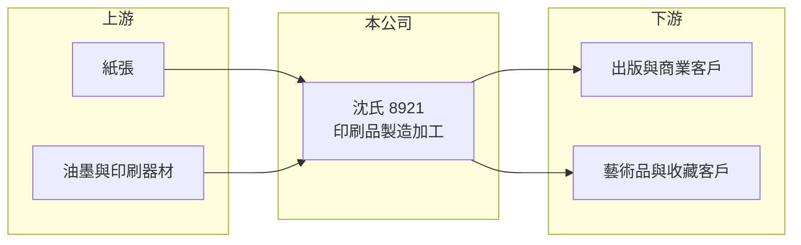

# 8921 沈氏

> 上櫃｜[[產業索引-其他業|其他業]]｜上市（櫃）日期 2000/03/21

# 第一章：企業模式與商業藍圖

> [!info] 撰寫說明
> 精簡版，由 Claude 依公開資料整理，架構比照 [[2330台積電]]，資料截至 2026-10-07。來源：winvest 營收快訊（2026 年 4 月至 8 月）。公開資料有限。#待校對

沈氏是成立於 1977 年的印刷公司，以印刷品製造加工為主，兼營藝術品與印刷器材買賣。

- **核心業務：** 各種印刷品的製造、加工與買賣，以及藝術品與印刷器材買賣。
- **營收結構：** 公開資料未揭露產品比重，以印刷品為主（推估）。
- **營運據點：** 以台灣為主（推估）。
- **長期方向：** 公開資料未揭露具體策略；營收維持小幅成長。

# 第二章：護城河深度與競爭優勢

沈氏在傳統印刷業中規模不大，差異化主要來自印刷品質與客戶關係。

- **競爭優勢：** 經營近 50 年，具精緻印刷與藝術印刷經驗（推估）。
- **主要對手：** [[8906花王]]等上市櫃印刷同業，以及眾多中小型印刷廠。
- **觀察重點：** 營收成長能否轉為獲利，以及成本控管成效。

# 第三章：財務體質與盈利規模

資料日期：2026-10-07，以下數字是撰寫當時的快照；最新月營收、毛利率、累計 EPS 由自動排程寫在本筆記的屬性欄位（月營收、毛利率、累計EPS 等）。#待校對

沈氏營收溫和成長，但仍處於虧損。

- **營收規模：** 2026 年 8 月營收 5,495.6 萬元，年增 10.08%；1 至 8 月累計 4.20 億元，年增 6.96%。
- **獲利：** 2025 年 EPS -0.11 元；2026 年第二季 EPS -0.38 元，上半年累計 -0.64 元，虧損較去年擴大。
- **財務特色：** 資本額 4.66 億元，市值約 7.08 億元；[[毛利率]]資料未查得。

# 第四章：總體風險與地緣政治

沈氏的風險在於印刷需求萎縮與成本壓力。

- **產業週期：** 紙本印刷需求隨[[數位化]]長期下滑。
- **營運風險：** 營收成長但虧損擴大，顯示成本壓力或產品組合不利，需留意[[產能利用率]]。
- **其他風險：** 紙張與油墨價格波動、人力成本上升。

# 專有名詞解析

## 金融

- **[[產能利用率]]**：實際產量占可生產產能的比例，偏低時固定成本分攤會拉低毛利。
- **[[毛利率]]**：毛利除以營收，反映產品或服務本身的獲利能力。

## 產業

- **[[數位化]]**：紙本內容轉向電子形式，使傳統印刷需求長期下滑。

# 核心供應鏈

- 上游：紙張、油墨與印刷器材供應商（推估）
- 下游／客戶：出版、商業印刷與藝術品客戶（推估）
- 同業：[[8906花王]]與中小型印刷廠

## 最新新聞
<!-- news:start -->
<!-- news:end -->

## 相關連結
- [公開資訊觀測站](https://mopsov.twse.com.tw/mops/web/t05st03?step=1&firstin=1&co_id=8921)
- [Goodinfo](https://goodinfo.tw/tw/StockDetail.asp?STOCK_ID=8921)
- [Yahoo 股市](https://tw.stock.yahoo.com/quote/8921)
- [鉅亨網新聞](https://www.cnyes.com/twstock/8921/news)
