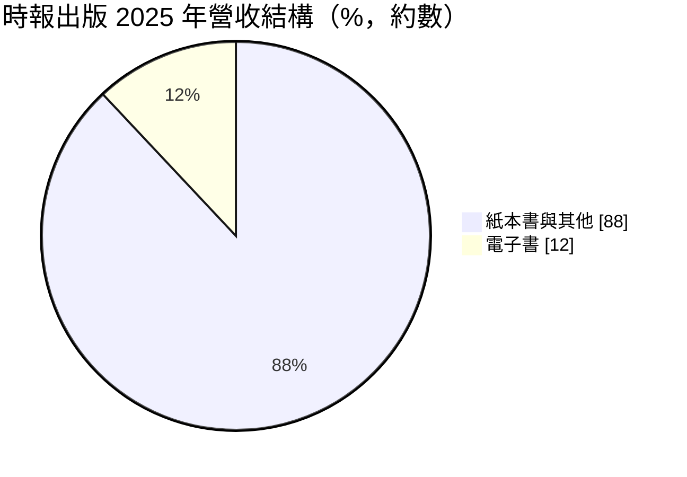
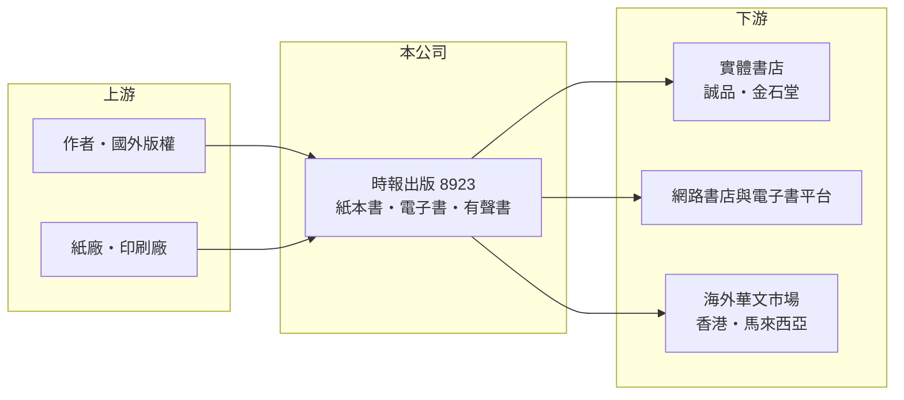

# 8923 時報

> 上櫃｜[[產業索引-文化創意業|文化創意業]]｜上市（櫃）日期 1999/12/27

# 第一章：企業模式與商業藍圖

> [!info] 撰寫說明
> 精簡版，由 Claude 依公開資料整理，架構比照 [[2330台積電]] 的四章研究，資料截至 2026-10-08。來源：櫃買中心開放資料（基本資料、2026 年上半年資產負債與損益、本益比與股利）、Goodinfo 年度經營績效、富果研究 2025 年 11 月法說會整理。#待校對

時報文化出版（股票代號：8923，以下簡稱時報出版）成立於 1985 年、1999 年上櫃，是台灣少數掛牌的綜合型出版社，董事長兼總經理為趙政岷。出版業的商業模式是「選書、編輯、印製、發行」：出版社向作者或國外出版社取得版權，負擔編輯與印刷成本，再透過書店與網路通路銷售，暢銷書的比例決定一年的獲利。

- **核心業務：** 實體書出版是營收基石，類型涵蓋文學、商業、心理勵志、身心靈與名人著作，2025 年的暢銷書包括林俊傑《超越音符》、陳文茜《如此歲月如此幸福》與證嚴法師系列。另經營[[電子書]]、[[有聲書]]（累計約 170 種，尚未獲利）、文創商品與體驗活動（小小書店店員、寫作營等）。
- **營收結構：** 依 2025 年法說會，電子書占 2025 年營收約 12%，其餘以紙本書為主；版權與各類別的細分比重未揭露。

- **營運據點：** 總部在台北萬華，銷售以台灣為主，並持續耕耘香港與馬來西亞等華文市場。通路包括金石堂、誠品等實體書店與各大網路書店，網路銷售比重隨實體書店萎縮而被動提高。
- **長期方向：** 公司採「大小眼」策略，把行銷資源集中在重點書籍；同時強化電子書、有聲書與 IP 經營，開發 B2C 直售模式，並推出替作者或機構客製出版的「接單生產」服務。董事長坦言在現有基礎上要達到年營收 5 億元「有點難」。

# 第二章：護城河深度與競爭優勢

出版業的護城河來自品牌信譽、作者關係與龐大的書目庫存，但整體市場正在萎縮。

- **競爭優勢：** 第一是四十年的出版品牌，能吸引知名作者與名人出書，2025 年林俊傑、陳文茜等作品就是例子。第二是長銷書目（backlist），經典書可以多年持續再版，提供穩定的現金流。第三是成本控制，營收十多年來維持在 4 億元上下，公司仍能每年獲利。
- **主要對手：** 城邦集團、遠流、天下文化、聯經等大型出版集團，以及大量中小型獨立出版社。在數位內容上，也要和串流影音、短影音與社群媒體競爭讀者的時間。
- **守得住與守不住：** 守得住的是名人與暢銷作者的合作、身心靈等需求穩定的類型；守不住的是實體書店通路，金石堂、誠品等書店萎縮，網路通路的折扣競爭也壓縮毛利。
- **觀察重點：** 數位出版（電子書、有聲書）占比能否持續提高並轉為獲利，以及 IP 經營與客製出版能否成為新的收入來源。

# 第三章：財務體質與盈利規模

資料日期：2026-10-08，表格是撰寫當時的快照；最新月營收、毛利率、累計 EPS 由自動排程寫在本筆記的屬性欄位（月營收、毛利率、累計EPS 等）。#待校對

時報出版的財報非常穩定，營收、毛利率與 EPS 十年來幾乎沒有大幅波動。

| 年度 | 營收（新台幣） | [[毛利率]] | [[營業利益率]] | EPS（元） | [[ROE]] |
|---|---|---|---|---|---|
| 2021 | 4.41 億 | 44.7% | 7.48% | 1.00 | 6.86% |
| 2022 | 4.69 億 | 44.3% | 5.68% | 1.13 | 7.68% |
| 2023 | 4.27 億 | 42.4% | 3.17% | 0.88 | 5.96% |
| 2024 | 4.36 億 | 44.5% | 4.19% | 0.93 | 6.28% |
| 2025 | 4.47 億 | 44.5% | 3.79% | 0.96 | 6.40% |

- **營收規模：** 2020 至 2025 年營收年複合成長率約 0.4%（推算）；法說會提到 2013 年以來營業額從約 3.3 億元增加到約 4.3 億元，在出版市場衰退中仍小幅成長。2026 年上半年營收 2.36 億元、毛利率約 40%、EPS 0.38 元。實收資本額約 3.04 億元（櫃買中心資料）。
- **獲利：** 毛利率穩定在 42% 至 49%，但營業利益率只有 3% 至 7%，代表編輯、行銷與通路費用吃掉大部分毛利；EPS 中有相當部分來自業外收益。2021 至 2025 年平均 ROE 約 6.6%（推算）。
- **股利：** 最近一年度現金股利 0.9 元（櫃買中心本益比資料），Goodinfo 統計的長期一般平均現金股利約 0.94 元，配息率接近 100%，是穩定的配息型公司。

**[[ROIC]] 與 [[WACC]]：** 以 2025 年計，營業利益約 0.17 億元（4.47 億 × 3.79%），稅後約 0.14 億元。2026 年上半年股東權益約 4.43 億元、總負債約 4.77 億元（其中流動負債 4.28 億元，推估多為應付帳款與退書相關負債），假設有息負債約 1 億元（推估），投入資本約 5.4 億元，ROIC 約 2.5%（推算）。WACC 以 CAPM 推估：無風險利率 1.75%、市場風險溢酬 6%、β 取內容產業低波動值 0.6，股東權益成本約 5.4%；負債成本假設 2.5%、稅後 2.0%，權益占資本約 82%，WACC 約 4.8%（推算）。本業 ROIC 低於 WACC，股東報酬主要來自穩定配息與業外收益；出版業的營業槓桿很低，若沒有更多暢銷書，本業報酬很難提高。

# 第四章：總體風險與地緣政治

時報出版的風險主要是出版市場的結構性衰退。

- **產業週期：** 出版業沒有明顯的景氣循環，但長期面對閱讀人口減少與注意力轉移。2025 年台灣出版市場的出版量與銷售額都下滑，實體書店經營越來越困難。
- **營運風險：** 獲利依賴少數暢銷書，例如《超越音符》的銷售主要仰賴中國大陸粉絲，台灣粉絲貢獻不到五分之一，這類作品難以複製。退書與庫存跌價也是出版社的常見風險。
- **其他風險：** 紙價與印刷成本上升會壓縮毛利；網路通路的折扣戰削弱定價能力；AI 生成內容可能改變寫作與出版的生態，既是威脅也是機會。

# 專有名詞解析

## 金融

- **[[ROIC]]**：投入資本報酬率，稅後營業利益除以股東權益加有息負債，衡量本業運用資本的效率。
- **[[WACC]]**：加權平均資金成本，股東與債權人要求報酬的加權平均，ROIC 高於它才代表創造價值。

## 產業

- **[[電子書]]**：以數位檔案形式銷售的書籍，免印刷與庫存成本，但通路平台會抽取分潤。
- **[[有聲書]]**：由真人或合成語音朗讀的書籍內容，在通勤與運動等場景收聽，是出版業的新通路。
- **[[長銷書目]]**：出版多年後仍持續再版銷售的書籍，是出版社穩定現金流的來源。

# 核心供應鏈

- 上游：作者與國外出版社版權；紙廠如 [[1907永豐餘]]、[[1909榮成]]（產業參考）與印刷廠。
- 下游／客戶：誠品、金石堂等實體書店；網路書店與電子書、有聲書平台；香港與馬來西亞通路。
- 同業：城邦、遠流、天下文化、聯經等出版集團。

## 最新新聞
<!-- news:start -->
<!-- news:end -->

## 相關連結
- [公開資訊觀測站](https://mopsov.twse.com.tw/mops/web/t05st03?step=1&firstin=1&co_id=8923)
- [Goodinfo](https://goodinfo.tw/tw/StockDetail.asp?STOCK_ID=8923)
- [Yahoo 股市](https://tw.stock.yahoo.com/quote/8923)
- [鉅亨網新聞](https://www.cnyes.com/twstock/8923/news)
