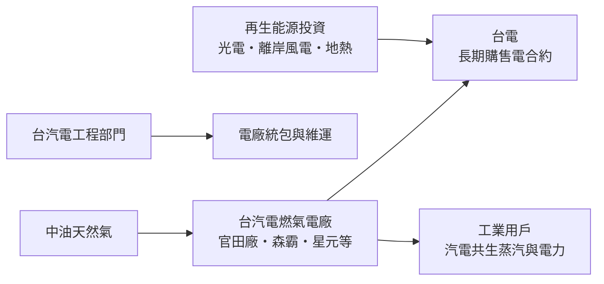
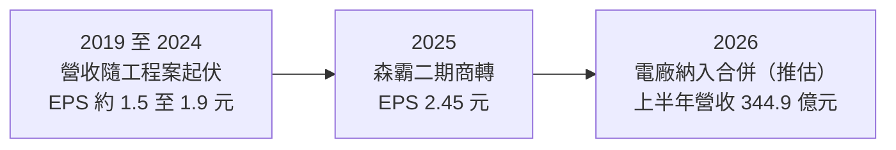
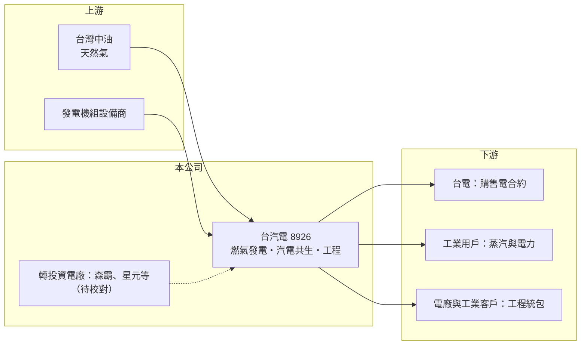

# 8926 台汽電

> 上市｜[[產業索引-油電燃氣業|油電燃氣業]]｜上市（櫃）日期 2003/08/25

# 第一章：企業模式與商業藍圖

> [!info] 撰寫說明
> 本文由 Claude 依公開資料整理，架構比照 [[2330台積電]] 的四章研究，資料截至 2026-10-08。財務數字來源：Goodinfo 年度經營績效頁、富果研究法說會整理（AI 摘要，期間標示有誤，僅作參考）、經濟日報 2026 年報導標題、證交所開放資料（基本資料、2026 年第二季資產負債與綜合損益、股利、每月營收）。2026 年營收大幅跳升的原因與各轉投資電廠的容量、持股未從本次來源查證，相關描述依記憶整理並標註待校對。#待校對

在評估單一個股的長期投資價值時，首要步驟是拆解企業的底層獲利邏輯。本章說明台灣汽電共生（股票代號：8926，以下簡稱台汽電）如何從一家汽電共生公司，演變成台灣最大的民營燃氣發電投資集團之一。

## 一、核心定位：台電轉投資的民營發電與能源工程集團

台汽電成立於 1992 年，2003 年上市，實收資本額約 83.0 億元，董事長為王振勇。公司由台電與民間企業共同投資設立，台電至今仍是主要股東之一（持股比例待校對），因此常被媒體稱為「台電小金雞」。

台汽電的業務分成兩大塊。第一是發電：自營[[汽電共生]]廠（例如官田廠），同時轉投資多座[[民營電廠]]（IPP），以燃氣發電為主，電力依長期[[購售電合約]]賣給台電。第二是工程：替其他電廠與工業用戶提供發電設備的統包、建廠與維運服務。依富果研究整理，台汽電收購過三座民營電廠（報導寫作 Hsin-Tung、Sen-Pa、Hsin-Yuan，推估對應新桃、森霸、星元電力，待校對），森霸二期已於 2025 年商轉。公司也投資太陽光電、離岸風電與地熱等再生能源。

## 二、業務板塊：發電、工程與轉投資

* **燃氣電廠與汽電共生：** 這是台汽電的核心。燃氣電廠以天然氣發電，依合約售電給台電，燃料成本多可依公式轉嫁，電廠賺的是穩定的「容量費」與「能量費」報酬（合約細節待校對）。
* **能源工程：** 承攬電廠建廠、設備更新與維運。工程收入依完工進度認列，金額起伏很大；2024 年營收從 52.8 億元跳到 91.3 億元，主要就是工程收入大增，2025 年工程收入減少，營收降到 76.1 億元。
* **再生能源：** 投資太陽光電、離岸風電與地熱，並探索生質能與氫能，規模相對燃氣發電仍小。

2026 年起營收結構出現巨大變化：2026 年 1 至 8 月累計營收約 476.7 億元，是 2025 年同期約 51.5 億元的 9 倍以上（證交所開放資料），2026 年第二季底的非控制權益也達約 107.6 億元。這個量級的跳升不可能來自本業自然成長，推估是取得轉投資燃氣電廠的控制權、把電廠營收納入合併報表所致（待校對）。若屬實，台汽電從 2026 年起已由「以權益法認列電廠獲利的投資公司」轉為「直接合併多座電廠的發電集團」，財報的營收、資產與負債規模都大幅放大。

## 三、資本轉化邏輯：長期合約下的電廠現金流

民營燃氣電廠是典型的「重資產、長合約、低波動」生意。電廠興建需要數百億元的資金，通常以[[專案融資]]支應，建成後依二十年以上的購售電合約售電給台電，燃料成本大部分可以轉嫁，因此獲利主要取決於機組的可用率與合約條件，而不是電價或氣價的漲跌。這讓台汽電在 2022 年天然氣價格飆漲時，仍能維持穩定獲利。

## 四、企業長期藍圖

台汽電的長期方向有三個。第一是擴大燃氣發電：台灣的能源政策以「增氣、減煤、非核」為主軸，燃氣發電占比持續提高，民營燃氣電廠是重要的供電來源。第二是再生能源：在太陽光電、離岸風電與地熱布局，承接淨零轉型的需求。第三是工程與海外：以累積的電廠建廠與維運經驗，承攬工程案並擴大海外投資。公司採取穩定的股利政策，近年配息率超過七成。

# 第二章：護城河深度與競爭優勢

本章分析台汽電在台灣電力市場的競爭位置，以及長期合約帶來的保護與限制。

## 一、護城河的核心組成要素

* **長期購售電合約：** 民營電廠與台電的合約通常長達 20 至 25 年，在合約期間內收入穩定可預期，這是電廠最主要的保護。
* **電廠執照與土地：** 燃氣電廠需要環評、用地、天然氣管線與電網併聯，取得極不容易。既有電廠的執照與區位本身就是稀缺資產。
* **台電背景：** 台電是主要股東，讓台汽電在電力市場的資訊、合作與信用條件上具有優勢。
* **工程與維運經驗：** 長期經營汽電共生與燃氣電廠，累積建廠、維運的工程能力，能自行承攬並對外接案。

## 二、主要競爭對手格局

| 對手 | 定位 | 與台汽電的比較 |
|---|---|---|
| [[8931大汽電]] | 桃園汽電共生廠 | 規模小，以單一廠為主 |
| [[1101台泥]]、[[1102亞泥]] 的電力事業 | 水泥廠附屬電廠與儲能 | 在民營發電與儲能領域部分重疊 |
| 長生、麥寮汽電等其他民營電廠 | 民營 IPP | 同屬台電購電對象 |

## 三、優勢轉化：守得住、守不住與觀察重點

* **守得住：** 合約期內的電廠收益。合約保護與燃料轉嫁機制，使電廠獲利不易受景氣影響。
* **守不住：** 合約到期後的條件。購售電合約到期後，延役或重簽的價格可能較差，這是民營電廠長期最大的不確定性。
* **觀察重點：** 第一，2026 年合併電廠後的獲利結構與財務透明度；第二，新電廠與再生能源的開發進度；第三，台灣電業自由化與電力交易平台對民營電廠收入的影響。

# 第三章：財務體質與盈利規模

資料日期：2026-10-08。數字取自 Goodinfo 年度經營績效頁、富果研究法說會整理與證交所開放資料，表格是撰寫當時的快照；最新月營收、毛利率、累計 EPS 由自動排程寫在本筆記的屬性欄位（月營收、毛利率、累計EPS 等）。#待校對

財務報表是檢驗護城河是否真實存在的最終標準。本章用多年度的三率、ROE 與資本報酬，檢視台汽電的獲利結構。

## 一、獲利能力的基石：三率

| 年度 | 營收（新台幣） | [[毛利率]] | [[營業利益率]] | EPS（元） | [[ROE]] |
|---|---|---|---|---|---|
| 2019 | 71.9 億 | 7.56% | 4.22% | 1.86 | 9.15% |
| 2020 | 93.1 億 | 8.07% | 5.04% | 1.81 | 8.81% |
| 2021 | 64.1 億 | 12.6% | 6.87% | 1.52 | 7.49% |
| 2022 | 46.7 億 | 13.7% | 5.05% | 1.54 | 7.70% |
| 2023 | 52.8 億 | 10.1% | -0.04% | 1.82 | 9.06% |
| 2024 | 91.3 億 | 8.90% | 4.77% | 1.85 | 8.70% |
| 2025 | 76.1 億 | 14.7% | 7.83% | 2.45 | 11.5% |
| 2026 上半年 | 344.9 億 | 9.79% | 8.18% | 3.27 | 未查得 |

* **2025 年以前，獲利主要來自業外：** 台汽電過去的營業利益率只有 0% 至 8%，2023 年甚至小幅虧損，但 EPS 一直維持在 1.5 元以上。原因是轉投資電廠的獲利以[[權益法]]列在業外，本業營收主要反映工程與自營汽電廠。分析 2025 年以前的台汽電，應該把它視為「電廠投資控股公司」。
* **營收不具長期趨勢意義：** 2019 至 2025 年營收在 46.7 億元到 93.1 億元之間起伏，主要由工程案的認列進度決定，計算年複合成長率意義不大。
* **2026 年的結構轉變：** 上半年營收 344.9 億元、營業利益約 28.2 億元、稅後淨利約 31.8 億元，其中歸屬母公司約 24.6 億元，EPS 3.27 元已超過 2025 年全年（證交所開放資料）。合併後營收被燃料成本放大，毛利率反而降到約 10%，這和天然氣公司「營收含轉嫁成本」的道理相同。

## 二、[[ROE]]：資本效率

2021 至 2025 年平均 ROE 約 8.9%（推算），2025 年回升到 11.5%。電廠生意屬於低風險、低報酬的資本密集業務，ROE 長期在 8% 至 12% 之間是合理的範圍。2026 年第二季底資產總計約 811 億元、負債約 505 億元、權益約 306 億元（其中歸屬母公司約 199 億元），負債比約 62%（證交所開放資料），反映電廠專案融資納入合併後財務槓桿明顯提高。

## 三、資本支出、自由現金流與股利

電廠營運期的資本支出以大修與設備更新為主，成熟電廠的自由現金流通常穩定為正；新電廠開發與再生能源投資期間，則需要大量資本支出（具體金額未查得）。股利方面，2025 年度配發現金股利 2.41 元，以 EPS 2.45 元計算配發率約 98%（推算），Goodinfo 統計歷年一般平均現金股利約 1.08 元，近年配息明顯提高。

## 四、[[ROIC]] 與 [[WACC]]：價值創造利差

**ROIC 推算：** 以 2026 年上半年營業利益約 28.2 億元年化為約 56.4 億元，扣除 20% 稅率後約 45.1 億元。2026 年第二季底權益約 306 億元，負債約 505 億元，假設其中約七成為有息負債（電廠專案融資，推估約 353 億元），投入資本約 659 億元，ROIC 約 6.8%（推算）。合併前以 2025 年營業利益約 6.0 億元計算的本業 ROIC 意義有限，因為主要獲利來自權益法收益。

**WACC 推算：** 假設台灣 10 年期公債殖利率 1.75%、市場風險溢酬 6%、β 取電力公用事業常見值 0.6，股東權益成本約 5.35%。負債成本假設 2.5%，稅後約 2.0%；以帳面價值計權益約占 46%、負債約占 54%，WACC 約 3.5%（推算）。

**結論：** 以 2026 年合併後的數字推算，台汽電 ROIC 約 6.8%，高於約 3.5% 的資金成本，利差約 3 個百分點，屬於「低利差、但穩定」的價值創造模式。電廠以高槓桿與長期合約換取穩定報酬，只要機組可用率維持、合約條件不變，這個利差可以延續到合約期滿。

# 第四章：總體風險與地緣政治

任何企業都無法脫離宏觀環境獨立存在。本章分析台汽電長期必須面對的能源政策、合約、營運與科技風險。

## 一、能源政策

* **燃氣發電的角色：** 台灣能源政策以燃氣發電為主要基載與中載電源，短中期對台汽電有利。但淨零路徑下，燃氣電廠長期需要面對碳費、碳捕捉或混氫的要求。
* **電業自由化：** 電力交易平台與綠電直供的開放，可能改變台電向民營電廠購電的模式，影響未來新合約的條件。
* **核能政策變化：** 若台灣能源政策調整、核電延役或重啟，可能降低對新燃氣電廠的需求（待校對）。

## 二、合約與產業結構

* **購售電合約到期：** 民營電廠的獲利高度依賴合約，合約到期後的延役條件是長期最大的不確定因素。
* **單一買方：** 台灣電力市場以台電為主要購電者，台汽電的議價能力有限，台電的財務狀況與政策也會影響合約執行。
* **工程收入波動：** 工程案依進度認列，接案多寡會讓營收與獲利出現年度起伏。

## 三、營運環境的隱性風險

* **機組故障與大修：** 電廠機組故障或延長大修，會減少售電收入並可能面臨罰款。
* **燃料供應：** 天然氣供應依賴中油進口的 LNG，供氣中斷或接收站問題可能影響發電。
* **高槓桿：** 合併電廠後負債比提高，利率上升會增加利息負擔。
* **財報複雜度提高：** 合併多座電廠與大量非控制權益，投資人需要區分歸屬母公司的獲利與合併數字。

## 四、科技演進

燃氣電廠的長期課題是減碳：混氫燃燒、碳捕捉與儲能配套，都可能成為延長電廠壽命的條件。台汽電在地熱、離岸風電與太陽光電的布局，是為了在燃氣電廠逐步退場前建立新的發電資產。這個轉型能否在十至二十年內完成，決定台汽電長期的價值。

# 專有名詞解析

## 金融

- **[[專案融資]]**：以單一專案未來現金流作為還款來源的融資方式，常用於電廠、離岸風電等大型基礎建設。
- **[[權益法]]**：持股約兩成至五成的轉投資，依持股比例認列被投資公司損益的會計方法，收益列在業外。
- **[[ROIC]]**：投入資本報酬率，稅後營業利益除以股東權益與有息負債的合計，衡量本業對所有資金提供者的報酬。
- **[[WACC]]**：加權平均資金成本，依股東權益與負債的比重加權計算的資金成本，ROIC 高於它才代表創造價值。

## 產業

- **[[汽電共生]]**：同時產生電力與蒸汽的發電方式，蒸汽供工廠製程使用，整體能源效率比單純發電高。
- **[[民營電廠]]**：由民間投資興建、依長期合約把電賣給台電的發電廠，英文簡稱 IPP。
- **[[購售電合約]]**：發電業者與購電者簽訂的長期契約，約定售電價格、容量與期限，是電廠收入的基礎。

# 核心供應鏈

## 1. 上游：燃料與設備
- 台灣中油：天然氣
- 燃氣渦輪機與發電設備製造商

## 2. 中游：台汽電本身與同業
- 轉投資與合併電廠：森霸電力、星元電力、新桃電力等（名稱與持股待校對）
- 民營發電同業：[[8931大汽電]]

## 3. 下游：購電者與客戶
- 台電：主要購電者與大股東
- 汽電共生廠周邊的工業用戶
- 委託建廠與維運的電廠與工業客戶

## 最新新聞
<!-- news:start（自動產生，請勿手動編輯此範圍） -->
- 2026-10-08 📰 媒體 17:24｜營收速報 - 台汽電(8926)9月營收59.44億元年增率高達1114.07％｜[鉅亨網](https://news.cnyes.com/news/id/6625051)
- 2026-10-06 🏛️ 重訊 17:23｜代子公司苗栗風力股份有限公司公告取得資產｜[觀測站](https://mops.twse.com.tw/mops/#/web/t05st01)

完整紀錄：[[8926台汽電 新聞]]
<!-- news:end -->

## 相關連結
- [公開資訊觀測站](https://mopsov.twse.com.tw/mops/web/t05st03?step=1&firstin=1&co_id=8926)
- [Goodinfo](https://goodinfo.tw/tw/StockDetail.asp?STOCK_ID=8926)
- [Yahoo 股市](https://tw.stock.yahoo.com/quote/8926)
- [鉅亨網新聞](https://www.cnyes.com/twstock/8926/news)
