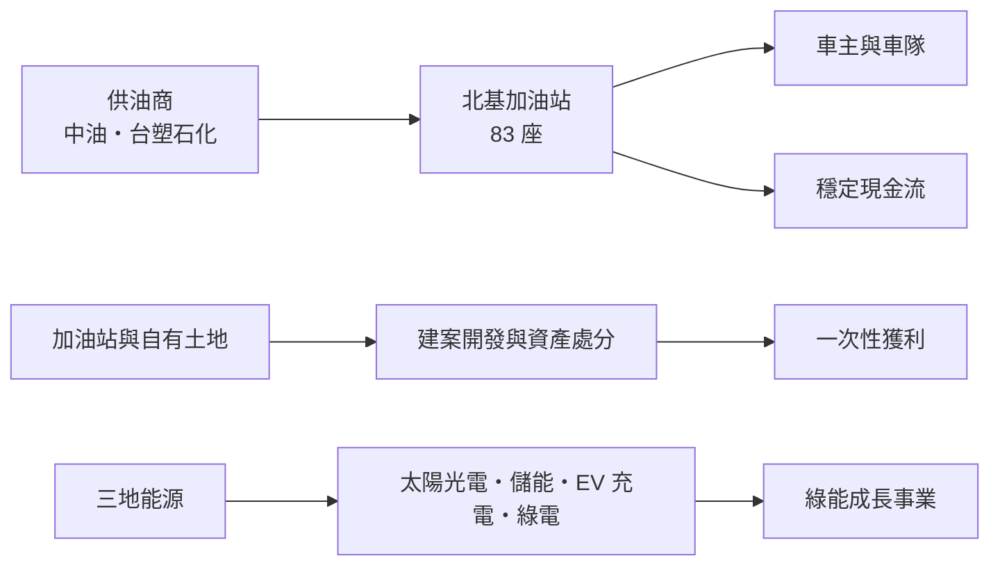
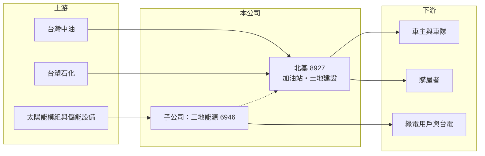

# 8927 北基

> 上櫃｜[[產業索引-油電燃氣業|油電燃氣業]]｜上市（櫃）日期 2000/11/02

# 第一章：企業模式與商業藍圖

> [!info] 撰寫說明
> 本文由 Claude 依公開資料整理，架構比照 [[2330台積電]] 的四章研究，資料截至 2026-10-08。財務數字來源：Goodinfo 年度經營績效頁、優分析 2026 年 9 月營收分析、經濟日報 2026 年報導標題、櫃買中心開放資料（基本資料、2026 年第二季資產負債與綜合損益、每月營收、本益比殖利率）；產業描述為整理性內容，尚未逐條比對原始文件。#待校對

在評估單一個股的長期投資價值時，首要步驟是拆解企業的底層獲利邏輯。本章說明北基國際（股票代號：8927，以下簡稱北基）如何以加油站為現金流基礎，再把土地資產與綠能子公司疊加成一個多角化的能源集團。

## 一、核心定位：民營加油站通路，兼營土地開發與綠能

北基成立於 1988 年，2000 年在櫃買中心掛牌，實收資本額約 41.9 億元，董事長為鍾育霖。公司的核心是加油站營運，截至 2026 年 8 月底全台共有 83 座加油站（優分析）。和 [[2616山隆]] 一樣，北基是向供油商進油、以自己的站點零售給車主的民營通路，獲利來自批發與零售之間的價差，以及每站的加油量。

北基和一般加油站業者最大的不同，在於它把加油站當作「土地資產」來經營。加油站多位於交通要道，土地本身就有開發價值。北基以「穩固本業、活化資產、多元布局」為策略，一方面擴大加油站覆蓋率，一方面把部分土地透過建案開發或處分實現價值，另外再透過子公司三地能源（6946）發展太陽光電、[[儲能]]、電動車充電與綠電銷售。

## 二、業務板塊

北基未在本次查得的資料中揭露完整的營收比重，依優分析與公開報導整理如下：

* **油品事業：** 83 座加油站，是集團穩定的現金流來源。2026 年平均每站單月營收較前一年成長約 6%，公司持續新設站點、擴大市占。
* **土地建設：** 透過建案開發與資產處分活化土地，收入依交屋或處分時點一次認列，造成營收與獲利的年度大幅波動。2026 年營收創新高的原因之一就是建案入帳。
* **綠能（三地能源）：** 子公司三地能源業務涵蓋太陽光電、儲能、電動車充電與綠電銷售，已另行掛牌。北基對三地能源的持股使其納入合併，2026 年第二季底非控制權益約 31 億元（櫃買中心開放資料，推估主要來自三地能源）。

## 三、資本轉化邏輯：加油站現金流＋土地價值＋綠能成長

這三個事業的性質完全不同。加油站提供穩定但成長有限的現金流；土地建設提供大而不規律的一次性獲利；綠能則是需要大量資本支出、回收期長的成長事業。北基的商業邏輯是用加油站與土地的現金與資產，支撐綠能的長期投資。

## 四、企業長期藍圖

北基的長期方向包括：擴大加油站覆蓋率並提升單站效率、強化會員服務、評估導入電動車充電與自助加油、推動土地資產活化，以及整合三地能源的綠能業務。面對電動車取代燃油車的長期趨勢，北基把加油站轉型為「綜合能源站」，同時把土地價值提前實現，是比單純經營加油站更積極的策略。

# 第二章：護城河深度與競爭優勢

本章分析北基在加油站市場的競爭位置，以及土地與綠能布局能否形成長期優勢。

## 一、競爭優勢的組成要素

* **站點與土地：** 加油站位於交通要道，新設站點受土地取得與法規限制，既有站點具有稀缺性。北基擁有部分自有土地，除了經營加油站，還能做開發或處分。
* **擴張能力：** 北基近年持續新設站點、擴大市占，與多數民營業者的收縮形成對比。
* **綠能子公司：** 三地能源讓北基在太陽光電、儲能與充電領域取得布局，為燃油需求下滑預作準備。

整體而言，加油站本業的護城河偏弱，產品同質、價格由供油商與政策決定；北基的差異化主要來自土地資產與綠能布局。

## 二、主要競爭對手格局

| 對手 | 定位 | 與北基的比較 |
|---|---|---|
| 中油直營與加盟站 | 全台最大加油站網絡 | 規模與品牌遠大於北基 |
| [[6505台塑化]] 加油站 | 第二大供油商的直營與加盟站 | 掌握油源 |
| [[2616山隆]]、全國加油站等民營業者 | 民營通路 | 直接競爭，山隆近年虧損收縮 |
| 太陽光電與儲能業者（森崴能源 等） | 綠能開發 | 三地能源的競爭對象 |

## 三、優勢轉化：守得住、守不住與觀察重點

* **守得住：** 位置良好的站點與自有土地的價值。
* **守不住：** 加油站的長期需求。電動車普及後，燃油銷量終將下滑。
* **觀察重點：** 第一，單站營收與加油量的趨勢；第二，土地開發的節奏與金額，以及扣除一次性收益後的本業獲利；第三，三地能源的獲利能力與資本需求。

# 第三章：財務體質與盈利規模

資料日期：2026-10-08。數字取自 Goodinfo 年度經營績效頁、優分析與櫃買中心開放資料，表格是撰寫當時的快照；最新月營收、毛利率、累計 EPS 由自動排程寫在本筆記的屬性欄位（月營收、毛利率、累計EPS 等）。#待校對

財務報表是檢驗護城河是否真實存在的最終標準。本章用多年度的三率、ROE 與資本報酬，檢視北基的獲利品質。

## 一、獲利能力的基石：三率

| 年度 | 營收（新台幣） | [[毛利率]] | [[營業利益率]] | EPS（元） | [[ROE]] |
|---|---|---|---|---|---|
| 2019 | 51.5 億 | 13.5% | 1.89% | 0.28 | 2.18% |
| 2020 | 44.1 億 | 17.1% | 2.50% | 0.63 | 5.01% |
| 2021 | 55.3 億 | 14.9% | 1.50% | 0.76 | 6.35% |
| 2022 | 67.5 億 | 12.4% | -0.59% | 0.48 | 3.37% |
| 2023 | 77.0 億 | 16.0% | 3.36% | 0.35 | 1.93% |
| 2024 | 125 億 | 22.5% | 12.5% | 1.29 | 8.05% |
| 2025 | 107 億 | 18.5% | 6.57% | 0.35 | 0.85% |
| 2026 上半年 | 76.4 億 | 15.9%（推算） | 6.7%（推算） | 0.62 | 未查得 |

註：Goodinfo 2025 年 ROE 0.85% 與 EPS 0.35 元、每股淨值約 13 元推算的約 2.6% 不一致，可能是歸屬母公司與合併口徑的差異，待校對。2026 上半年比率依櫃買中心綜合損益資料（營收 76.4 億元、毛利 12.2 億元、營業利益 5.14 億元）推算。

* **本業利潤率很薄：** 2019 至 2023 年營業利益率在 -0.6% 到 3.4% 之間，這是加油站通路的典型水準。2024 年營業利益率跳升到 12.5%，主要來自土地建設與綠能事業的貢獻（推估），屬於非經常性的高點。
* **營收擴張：** 2021 至 2025 年營收從 55.3 億元增加到 107 億元，年複合成長率約 17.9%（推算），成長來自新設站點、建案認列與綠能子公司的合併。2026 年 1 至 8 月累計營收約 94.0 億元，年增約 42.6%（櫃買中心開放資料）。
* **獲利集中在少數年份：** EPS 長期在 0.3 元到 1.3 元之間，2024 年最高，其他年份偏低，獲利穩定度遠不如營收的成長。

## 二、[[ROE]]：資本效率

2021 至 2025 年平均 ROE 約 4.1%（推算），資本效率偏低。2026 年第二季底資產總計約 331.6 億元、負債約 244.7 億元、權益約 86.9 億元（其中歸屬母公司約 55.9 億元），負債比約 74%（櫃買中心開放資料）。高負債比反映建案融資、綠能電廠的專案融資，以及加油站租約的租賃負債。

## 三、資本支出、自由現金流與股利

新設加油站、建案開發與綠能電廠都需要大量資金，北基近年的自由現金流很可能為負（推估，具體金額未查得）。股利方面，依經濟日報標題，2025 年 EPS 0.35 元、配息 0.3 元，配息率約 86%；Goodinfo 統計長期一般平均現金股利約 0.23 元、股票股利約 0.31 元，配息水準偏低。

## 四、[[ROIC]] 與 [[WACC]]：價值創造利差

**ROIC 推算：** 2025 年營業利益約 7.03 億元（營收 107 億元 × 營業利益率 6.57%），扣除 20% 稅率後約 5.6 億元。2026 年第二季底權益約 86.9 億元，負債約 244.7 億元，假設其中約六成為有息負債（推估約 147 億元），投入資本約 234 億元，ROIC 約 2.4%（推算）。即使以 2024 年較高的營業利益約 15.6 億元計算，ROIC 也只有約 5%（推算，資本基礎以近期數字代替）。

**WACC 推算：** 假設台灣 10 年期公債殖利率 1.75%、市場風險溢酬 6%、β 取通路與營建業常見值 0.8，股東權益成本約 6.55%。負債成本假設 2.5%，稅後約 2.0%；以帳面價值計權益約占 37%、負債約占 63%，WACC 約 3.7%（推算）。

**結論：** 北基 ROIC 約 2% 至 5%，大多數年份低於或接近約 3.7% 的資金成本，代表目前的擴張尚未轉化為穩定的價值創造。北基的價值更多藏在土地資產與綠能子公司的帳面之外，能否透過資產活化實現、並讓綠能事業產生穩定報酬，是長期評價的關鍵。

# 第四章：總體風險與地緣政治

任何企業都無法脫離宏觀環境獨立存在。本章分析北基長期必須面對的能源轉型、房地產、財務與營運風險。

## 一、能源轉型

* **燃油需求長期下滑：** 台灣規劃 2040 年新售機車與小客車全面電動化，加油站的核心生意將逐步萎縮。北基持續新設站點，長期需要評估站點的回收年限。
* **綠能政策：** 三地能源的太陽光電、儲能與綠電銷售受政府躉購費率、電力交易平台規則與用地政策影響，政策變動會影響投資報酬。

## 二、房地產與景氣循環

* **建案收入不穩定：** 土地建設依交屋時點認列，營收與獲利年度波動大，也受台灣房市與央行信用管制影響。
* **資產處分的一次性：** 土地處分利益無法重複，扣除後的本業獲利才是長期價值的基礎。

## 三、財務與營運風險

* **高負債：** 負債比約 74%，利率上升會增加利息負擔，景氣反轉時的財務彈性較低。
* **油價與價差：** 零售價差受供油商與政策影響，民營業者議價能力有限。
* **財報複雜度：** 合併上市子公司與大量非控制權益，投資人需區分歸屬母公司的獲利。

## 四、科技演進

電動車充電、自助加油與會員數位服務是加油站轉型的方向。若北基能把站點轉為兼具充電、儲能與便利服務的綜合能源站，站點價值可以延續；反之，燃油需求下滑將使站點逐步失去經濟價值。

# 專有名詞解析

## 金融

- **[[租賃負債]]**：依會計準則把長期租約的未來租金折現列為負債，加油站等租用場地的業者金額較大。
- **[[ROIC]]**：投入資本報酬率，稅後營業利益除以股東權益與有息負債的合計，衡量本業對所有資金提供者的報酬。
- **[[WACC]]**：加權平均資金成本，依股東權益與負債的比重加權計算的資金成本，ROIC 高於它才代表創造價值。

## 產業

- **[[儲能]]**：以電池等設備儲存電力，在用電尖峰或電網需要時釋放，可參與電力交易市場賺取收入。
- **[[全自助加油]]**：由車主自行加油與付款的加油站經營模式，可降低人力成本。
- **[[資產活化]]**：把閒置或低度利用的土地、建物透過開發、出租或出售，轉為收益或現金。

# 核心供應鏈

## 1. 上游：油源與綠能設備
- 供油商：台灣中油、[[6505台塑化]]
- 太陽能模組、逆變器與儲能電池供應商

## 2. 中游：北基本身與同業
- 綠能子公司：三地能源（6946）
- 民營加油站同業：[[2616山隆]]、全國加油站

## 3. 下游：客戶
- 一般車主與企業車隊
- 建案購屋者
- 綠電用戶與台電

## 最新新聞
<!-- news:start -->
<!-- news:end -->

## 相關連結
- [公開資訊觀測站](https://mopsov.twse.com.tw/mops/web/t05st03?step=1&firstin=1&co_id=8927)
- [Goodinfo](https://goodinfo.tw/tw/StockDetail.asp?STOCK_ID=8927)
- [Yahoo 股市](https://tw.stock.yahoo.com/quote/8927)
- [鉅亨網新聞](https://www.cnyes.com/twstock/8927/news)
